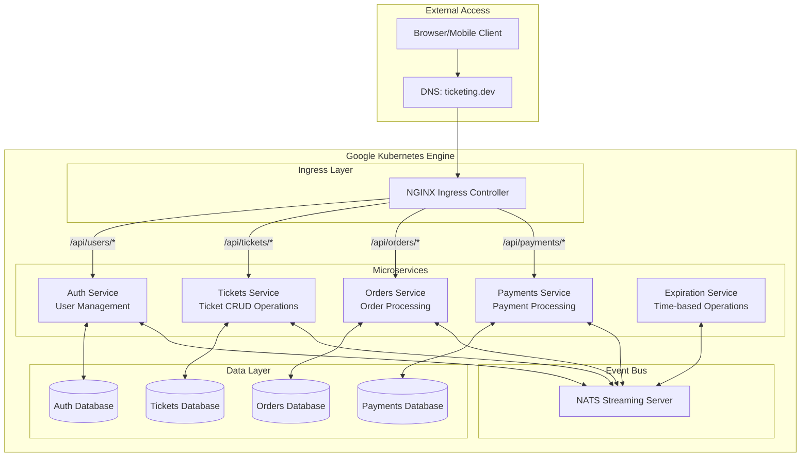

# Ticketing Application - Cloud Environment for Development

A microservices-based ticketing platform built with Node.js, TypeScript, and Kubernetes, now configured for cloud-based development with Google Cloud Platform.

## What's Changed from Version 4

This version evolves the Ticketing Application from "Architecture of Multi-Service Apps" by migrating the development environment to Google Cloud Platform. The major changes include:

### 1. Cloud-Based Build Process

- **Previous Version**: Used local Docker builds with Skaffold

  ```yaml
  build:
    local:
      push: false
  ```

- **Current Version**: Uses Google Cloud Build with a specific GCP project

  ```yaml
  build:
    googleCloudBuild:
      projectId: ticketing-dev-451418
  ```

### 2. Container Registry Migration

- **Previous Version**: Used Docker Hub for image storage

  ```yaml
  image: rallycoding/auth
  ```

- **Current Version**: Uses Google Container Registry (GCR)

  ```yaml
  image: us.gcr.io/ticketing-dev-451418/auth
  ```

### 3. Deployment Configuration Updates

Kubernetes deployment manifests have been updated to use the GCR-hosted images instead of Docker Hub images.

## Benefits of Cloud-Based Development

Moving to a cloud-based development environment offers several advantages:

1. **Consistent Development Environment**: All team members work with the same build infrastructure, reducing "works on my machine" issues.

2. **Improved Build Performance**: Google Cloud Build can offer faster build times compared to local builds, especially for larger applications.

3. **Simplified Collaboration**: Easier sharing of development environments and configurations across team members.

4. **Closer to Production**: Development environment more closely mirrors potential production deployment, reducing deployment surprises.

5. **Scalable Infrastructure**: Cloud-based development can scale with your team and project needs.

## Application Overview

The Ticketing application is designed to allow users to list tickets for events (concerts, sports) for sale and for other users to purchase these tickets. This application demonstrates modern microservices architecture principles, combining event-driven design with Kubernetes orchestration.

### Core Functionality

- Users can list tickets for events (concerts, sports) for sale
- Other users can purchase these tickets
- When a user attempts to purchase a ticket, it is "locked" for 15 minutes
- During this 15-minute window, no other user can purchase the ticket
- After 15 minutes without payment, the ticket "unlocks" and becomes available
- Ticket prices can be edited by the owner (if not currently locked)

## Microservices Architecture

The application is built as a collection of independent microservices, each responsible for a specific domain of functionality. The services communicate with each other through events, enabling loose coupling and high resilience.

### Kubernetes Cluster Architecture



## Setup and Running the Application

### Prerequisites

1. **Google Cloud Platform Account**
2. **Google Cloud SDK** installed and configured
3. **Docker Desktop** with Kubernetes enabled, or a separate Kubernetes cluster
4. **kubectl** command-line tool installed and configured
5. **Skaffold** for development workflow automation
6. **Ingress-NGINX Controller** installed in your cluster

### Google Cloud Setup

1. **Create a GCP Project**

```bash
gcloud projects create ticketing-dev-451418 --name="Ticketing Dev"
```

2. **Enable Required APIs**

```bash
gcloud services enable container.googleapis.com
gcloud services enable cloudbuild.googleapis.com
```

3. **Configure Docker for GCR Access**

```bash
gcloud auth configure-docker
```

### Environment Setup

1. **Clone the repository**

```bash
git clone <repository-url>
cd ticketing
```

2. **Configure local hosts file**

Add this entry to your hosts file (`/etc/hosts` on macOS/Linux, `C:\Windows\System32\drivers\etc\hosts` on Windows):

```
127.0.0.1 ticketing.dev
```

3. **Install NGINX Ingress Controller** (if not already installed)

```bash
kubectl apply -f https://raw.githubusercontent.com/kubernetes/ingress-nginx/controller-v1.8.2/deploy/static/provider/cloud/deploy.yaml
```

### Running the Application

Start the development environment using Skaffold:

```bash
skaffold dev
```

This will:

1. Trigger Google Cloud Build to build the Docker images
2. Push the images to Google Container Registry
3. Deploy all Kubernetes resources
4. Stream logs from all pods
5. Watch for file changes and automatically update services

Once everything is running, you can access the application at:

- <https://ticketing.dev/>

> **Note**: You may need to accept the self-signed certificate warning in your browser.

## Development Workflow

### Adding a New Feature

1. Determine which service(s) need to be modified
2. Make code changes in the appropriate service directory
3. Skaffold will automatically trigger Google Cloud Build to rebuild and redeploy the affected services
4. Test your changes via the API or client application

### Creating a New Service

1. Create a new directory for the service
2. Add Dockerfile and required package configurations
3. Implement the service code
4. Create Kubernetes deployment and service files in `infra/k8s/`
5. Add the service to the Skaffold configuration in `skaffold.yaml`:

```yaml
- image: us.gcr.io/ticketing-dev-451418/new-service
  context: new-service
  docker:
    dockerfile: Dockerfile
  sync:
    manual:
      - src: 'src/**/*.ts'
        dest: .
```

## Troubleshooting

### Common Issues

1. **GCP Authentication Issues**
   - Run `gcloud auth login` and `gcloud auth configure-docker` to refresh credentials

2. **Cloud Build Failures**
   - Check the Cloud Build logs in Google Cloud Console
   - Verify your GCP project has billing enabled

3. **Connection refused to ticketing.dev**
   - Ensure your hosts file is correctly configured
   - Verify the NGINX Ingress controller is running

4. **Services not starting**
   - Check pod logs: `kubectl get pods` then `kubectl logs <pod-name>`
   - Ensure Kubernetes contexts are correctly set

5. **Changes not reflecting**
   - Verify Skaffold is watching the correct files
   - Check for any build errors in the Skaffold logs
