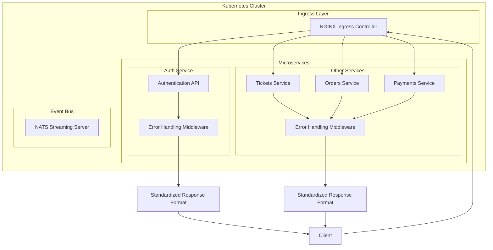

# Ticketing Application - Response Normalization Strategies

A microservices-based ticketing platform built with Node.js, TypeScript, and Kubernetes, focused on standardized error handling and response normalization.

## What's Changed from Version 5 (Cloud Environment for Development)

Version 6 shifts focus from cloud infrastructure to application architecture, particularly implementing consistent error handling and response normalization across all services.

### Infrastructure Changes

- **Local Development**: Returned to local Docker builds from Google Cloud Build

  ```yaml
  # Previous (Version 5)
  build:
    googleCloudBuild:
      projectId: ticketing-dev-451418
      
  # Current (Version 6)
  build:
    local:
      push: false
  ```

- **Container Registry**: Switched from Google Container Registry back to DockerHub

  ```yaml
  # Previous (Version 5)
  image: us.gcr.io/ticketing-dev-451418/auth
  
  # Current (Version 6)
  image: rallycoding/auth
  ```

### Application Architecture Improvements

- **Standardized Error Handling**: Implemented a consistent approach to error responses
- **Error Response Normalization**: Ensured all API errors follow the same structure
- **Request Validation**: Added express-validator for input validation
- **Async Error Handling**: Integrated express-async-errors for cleaner route handlers

### New Dependencies

- **express-async-errors**: For catching errors in async route handlers without try/catch blocks
- **express-validator**: For standardized request validation and error reporting

## Response Normalization Architecture

### Core Components

1. **CustomError Base Class**

```typescript
export abstract class CustomError extends Error {
  abstract statusCode: number;

  constructor(message: string) {
    super(message);
    Object.setPrototypeOf(this, CustomError.prototype);
  }

  abstract serializeErrors(): { message: string; field?: string }[];
}
```

2. **Specific Error Implementations**

```typescript
// Request Validation Error Example
export class RequestValidationError extends CustomError {
  statusCode = 400;

  constructor(public errors: ValidationError[]) {
    super('Invalid request parameters');
    Object.setPrototypeOf(this, RequestValidationError.prototype);
  }

  serializeErrors() {
    return this.errors.map((err) => {
      if (err.type === 'field') {
        return { message: err.msg, field: err.path };
      }
      return { message: err.msg };
    });
  }
}
```

3. **Centralized Error Handling Middleware**

```typescript
export const errorHandler = (
  err: Error,
  req: Request,
  res: Response,
  next: NextFunction
) => {
  if (err instanceof CustomError) {
    return res.status(err.statusCode).send({ errors: err.serializeErrors() });
  }

  res.status(400).send({
    errors: [{ message: "Something went wrong" }],
  });
};
```

### Error Handling Flow

```mermaid
graph TD
    A[Client Request] --> B[Express Route Handler]
    B --> C{Error Thrown?}
    C -->|Yes| D[express-async-errors catches]
    C -->|No| E[Normal Response]
    D --> F{Custom Error?}
    F -->|Yes| G[Use statusCode from Error]
    F -->|No| H[Use 400 Status Code]
    G --> I[Serialize Error with serializeErrors()]
    H --> J[Generic Error Response]
    I --> K[Format: { errors: [{ message, field? }] }]
    J --> K
    K --> L[Send Response to Client]
```

## Benefits of Response Normalization

### 1. Consistent Client Experience

- All error responses follow the same structure, making client-side handling simpler
- HTTP status codes consistently map to error types
- Form validation errors include field names for better UX

### 2. Improved Developer Experience

- Error handling is declarative rather than imperative
- New error types can be added without changing middleware
- Cleaner route handlers with express-async-errors

### 3. Microservices Communication Benefits

- Services can expect consistent error formats from other services
- Reduces special-case handling for different error types
- Better error tracking across service boundaries

### 4. Maintainability and Extensibility

- Open/Closed Principle: System is open for extension but closed for modification
- New error types can be added without changing existing code
- Error handling logic is centralized in one place

## Standard Error Response Format

All API errors return a response with this structure:

```json
{
  "errors": [
    {
      "message": "Error message here",
      "field": "Optional field name for validation errors"
    }
  ]
}
```

### Common Error Types and Status Codes

| Error Type | Status Code | Usage |
|------------|-------------|-------|
| RequestValidationError | 400 | Form validation failures |
| DatabaseConnectionError | 500 | Database connectivity issues |
| NotFoundError | 404 | Resource not found |
| Generic Error | 400 | Uncategorized errors |

## Setup and Running the Application

### Prerequisites

1. **Docker Desktop** with Kubernetes enabled, or a separate Kubernetes cluster
2. **kubectl** command-line tool installed and configured
3. **Skaffold** for development workflow automation
4. **Ingress-NGINX Controller** installed in your cluster

### Environment Setup

1. **Clone the repository**

```bash
git clone <repository-url>
cd ticketing
```

2. **Configure local hosts file**

Add this entry to your hosts file (`/etc/hosts` on macOS/Linux, `C:\Windows\System32\drivers\etc\hosts` on Windows):

```
127.0.0.1 ticketing.dev
```

3. **Install NGINX Ingress Controller** (if not already installed)

```bash
kubectl apply -f https://raw.githubusercontent.com/kubernetes/ingress-nginx/controller-v1.8.2/deploy/static/provider/cloud/deploy.yaml
```

### Running the Application

Start the development environment using Skaffold:

```bash
skaffold dev
```

This will:

1. Build all Docker images locally
2. Deploy all Kubernetes resources
3. Stream logs from all pods
4. Watch for file changes and automatically update services

Once everything is running, you can access the application at:

- <https://ticketing.dev/>

> **Note**: You may need to accept the self-signed certificate warning in your browser.

## Example Usage

### Error Response Examples

#### Validation Error

Request:

```
POST /api/users/signup
{
  "email": "notanemail",
  "password": "pw"
}
```

Response (400 Bad Request):

```json
{
  "errors": [
    {
      "message": "Email must be valid",
      "field": "email"
    },
    {
      "message": "Password must be between 4 and 20 characters",
      "field": "password"
    }
  ]
}
```

#### Not Found Error

Request:

```
GET /api/nonexistent
```

Response (404 Not Found):

```json
{
  "errors": [
    {
      "message": "Not Found"
    }
  ]
}
```

## Application Architecture

The application follows a microservices architecture with standardized communication patterns:



## Future Extensions

The response normalization strategy established in this version provides a foundation for future improvements:

1. **Shared Error Library**: Extract common error types to a shared package for use across services
2. **Internationalization**: Add support for localized error messages
3. **Error Logging**: Integrate centralized error logging with the error handling system
4. **Error Codes**: Add unique error codes for better tracking and documentation

## Troubleshooting

### Common Issues

1. **Connection refused to ticketing.dev**
   - Ensure your hosts file is correctly configured
   - Verify the NGINX Ingress controller is running

2. **Services not starting**
   - Check pod logs: `kubectl get pods` then `kubectl logs <pod-name>`
   - Ensure Kubernetes contexts are correctly set

3. **Changes not reflecting**
   - Verify Skaffold is watching the correct files
   - Check for any build errors in the Skaffold logs
