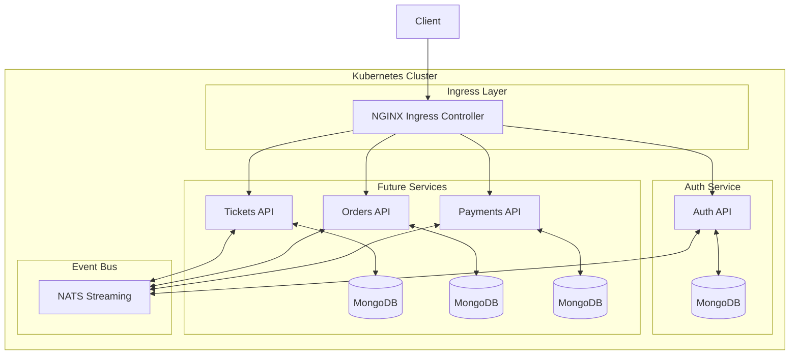

# Ticketing Application - Database Management and Modeling

A microservices-based ticketing platform built with Node.js, TypeScript, and Kubernetes, now enhanced with database persistence and sophisticated data modeling.

## What's Changed from Version 6 (Response Normalization Strategies)

Version 7 builds upon the error handling and response normalization patterns established in version 6, adding database persistence and proper data modeling with MongoDB and Mongoose.

### Database Integration

- **MongoDB Support**: Added MongoDB database for persistent data storage

  ```json
  "dependencies": {
    "mongoose": "^8.6.3",
    // Previous dependencies...
  }
  ```

- **MongoDB Kubernetes Deployment**: Added dedicated MongoDB deployments and services for each microservice

  ```yaml
  # New in auth-mongo-depl.yaml
  apiVersion: apps/v1
  kind: Deployment
  metadata:
    name: auth-mongo-depl
  spec:
    # MongoDB deployment configuration...
  ---
  apiVersion: v1
  kind: Service
  metadata:
    name: auth-mongo-srv
  # MongoDB service configuration...
  ```

- **Database Connection**: Integrated MongoDB connection at application startup

  ```typescript
  // New database connection in index.ts
  const start = async () => {
    try {
      await mongoose.connect('mongodb://auth-mongo-srv:27017/auth');
      console.log('Connected to MongoDb');
    } catch (err) {
      console.error(err);
    }
    // ...
  };
  ```

### Data Modeling Architecture

- **Mongoose Schema and Model**: Added proper schema definition for User model
- **TypeScript Interface Strategy**: Implemented interface separation for better type safety
- **Model Factory Pattern**: Used static factory methods for type-safe document creation
- **Middleware Integration**: Added pre-save hooks for automatic password hashing

```typescript
// New User model with TypeScript interfaces
interface UserAttrs {
  email: string;
  password: string;
}

interface UserModel extends mongoose.Model<UserDoc> {
  build(attrs: UserAttrs): UserDoc;
}

interface UserDoc extends mongoose.Document {
  email: string;
  password: string;
}

const userSchema = new mongoose.Schema({
  email: {
    type: String,
    required: true
  },
  password: {
    type: String,
    required: true
  }
});

// Pre-save middleware for password hashing
userSchema.pre('save', async function(done) {
  if (this.isModified('password')) {
    const hashed = await Password.toHash(this.get('password'));
    this.set('password', hashed);
  }
  done();
});

// Static factory method
userSchema.statics.build = (attrs: UserAttrs) => {
  return new User(attrs);
};
```

### Security Implementation

- **Password Hashing Service**: Added secure password management with Node.js crypto
- **Salt Generation**: Implemented per-password salting for enhanced security
- **Separation of Concerns**: Moved cryptographic operations to dedicated service

```typescript
// New Password service for secure hashing
export class Password {
  static async toHash(password: string) {
    const salt = randomBytes(8).toString('hex');
    const buf = (await scryptAsync(password, salt, 64)) as Buffer;
    return `${buf.toString('hex')}.${salt}`;
  }

  static async compare(storedPassword: string, suppliedPassword: string) {
    const [hashedPassword, salt] = storedPassword.split('.');
    const buf = (await scryptAsync(suppliedPassword, salt, 64)) as Buffer;
    return buf.toString('hex') === hashedPassword;
  }
}
```

### Route Handler Evolution

- **Real Database Operations**: Moved from mock implementations to actual MongoDB operations
- **Business Logic Validation**: Added email uniqueness checking
- **Response Status Codes**: Implemented appropriate status codes for resource creation

```typescript
// Old signup route (Version 6)
router.post(
  "/api/users/signup",
  [/*validators*/],
  async (req: Request, res: Response) => {
    const errors = validationResult(req);
    if (!errors.isEmpty()) {
      throw new RequestValidationError(errors.array());
    }
    
    console.log("Creating a user...");
    throw new DatabaseConnectionError();

    res.send({});
  }
);

// New signup route (Version 7)
router.post(
  '/api/users/signup',
  [/*validators*/],
  async (req: Request, res: Response) => {
    const errors = validationResult(req);
    if (!errors.isEmpty()) {
      throw new RequestValidationError(errors.array());
    }

    const { email, password } = req.body;
    const existingUser = await User.findOne({ email });
    if (existingUser) {
      throw new BadRequestError('Email in use');
    }

    const user = User.build({ email, password });
    await user.save();

    res.status(201).send(user);
  }
);
```

## Architecture Overview

The application follows a microservices architecture with database-per-service isolation:



### Data Modeling Patterns

1. **Interface Separation**
   - `UserAttrs`: Properties required to build a user
   - `UserModel`: Static methods available on the User model
   - `UserDoc`: Properties a User document has after creation

2. **Factory Method Pattern**
   - Static `build` method ensures type safety when creating User documents
   - Encapsulates document creation logic
   - Allows future enhancement to document creation process

3. **Middleware Hooks**
   - `pre('save')` hook runs before document is saved
   - Automatically hashes passwords when modified
   - Separates persistence concerns from route handlers

4. **Database Per Service**
   - Each microservice has its own MongoDB deployment
   - Complete data isolation between services
   - Independent schema evolution
   - No cross-service database queries

## Setup and Running the Application

### Prerequisites

1. **Docker Desktop** with Kubernetes enabled, or a separate Kubernetes cluster
2. **kubectl** command-line tool installed and configured
3. **Skaffold** for development workflow automation
4. **Ingress-NGINX Controller** installed in your cluster

### Environment Setup

1. **Clone the repository**

```bash
git clone <repository-url>
cd ticketing
```

2. **Configure local hosts file**

Add this entry to your hosts file (`/etc/hosts` on macOS/Linux, `C:\Windows\System32\drivers\etc\hosts` on Windows):

```
127.0.0.1 ticketing.dev
```

3. **Install NGINX Ingress Controller** (if not already installed)

```bash
kubectl apply -f https://raw.githubusercontent.com/kubernetes/ingress-nginx/controller-v1.8.2/deploy/static/provider/cloud/deploy.yaml
```

### Running the Application

Start the development environment using Skaffold:

```bash
skaffold dev
```

This will:

1. Build all Docker images locally
2. Deploy all Kubernetes resources (including MongoDB)
3. Stream logs from all pods
4. Watch for file changes and automatically update services

Once everything is running, you can access the application at:

- <https://ticketing.dev/>

> **Note**: You may need to accept the self-signed certificate warning in your browser.

### Verifying Database Connection

To check if the MongoDB instance is properly connected:

1. Check application logs for "Connected to MongoDb" message:

```bash
kubectl logs -l app=auth --tail=100
```

2. Verify MongoDB pod is running:

```bash
kubectl get pods -l app=auth-mongo
```

3. Create a test user via the API:

```bash
curl -X POST https://ticketing.dev/api/users/signup \
  -H "Content-Type: application/json" \
  -d '{"email":"test@example.com","password":"password"}'
```

## Database Design Considerations

### Schema Design

1. **Minimal Schema Definition**
   - Limited to essential fields (email, password)
   - No timestamps or version tracking (could be added later)
   - No MongoDB-specific options set
   - No indexes explicitly defined (relying on MongoDB defaults)

2. **TypeScript Type Safety**
   - TypeScript interfaces ensure compile-time validation
   - Clear type definitions for all database operations
   - Generic type parameters for Mongoose model creation
   - Type guards for document operations

### Security Considerations

1. **Password Handling**
   - Industry-standard scrypt algorithm for password hashing
   - Unique salt for each password
   - Centralized password handling logic
   - No plain text passwords stored

2. **Database Security**
   - MongoDB instances isolated within Kubernetes cluster
   - No external access to MongoDB services (ClusterIP only)
   - Separation of databases between services
   - Currently no authentication for MongoDB (should be added for production)

## Current Limitations and Future Improvements

1. **Database Persistence**
   - Currently no persistent volumes configured (data lost on pod restart)
   - Should add StatefulSets and PersistentVolumes for production

2. **Authentication**
   - User signup implemented, signin route still a placeholder
   - Need to implement JWT or session-based authentication
   - No current authorization mechanisms

3. **MongoDB Security**
   - No authentication configured for MongoDB
   - No encryption at rest
   - No MongoDB replica sets for redundancy

4. **User Model Enhancements**
   - Additional user properties (name, role, etc.)
   - Email verification process
   - Password complexity requirements

5. **Schema Validation**
   - Additional Mongoose schema validation rules
   - JSON Schema validation for MongoDB
   - Optimistic concurrency control

## Troubleshooting

### Common Issues

1. **MongoDB Connection Failures**
   - Check MongoDB pod status: `kubectl get pods -l app=auth-mongo`
   - Verify service discovery: `kubectl exec -it <auth-pod-name> -- nslookup auth-mongo-srv`
   - Check connection string in code matches service name and port

2. **Database Operations Errors**
   - Examine logs for Mongoose errors: `kubectl logs -l app=auth`
   - Verify schema matches expected document structure
   - Check for unique constraint violations

3. **TypeScript Compilation Errors**
   - Ensure interface definitions match Mongoose model
   - Check generic type parameters
   - Verify type safety in model operations
