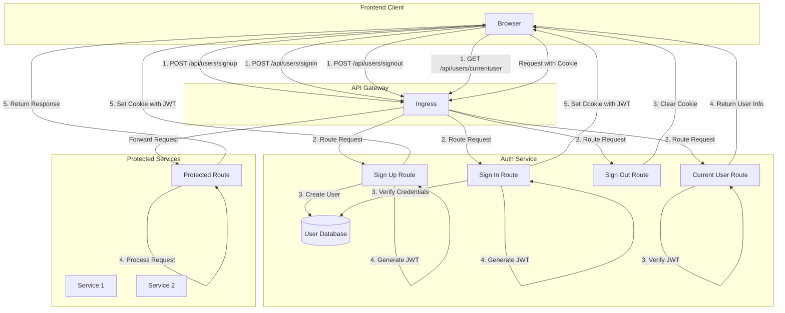

# Ticketing Application - Authentication Strategies and Options

A microservices-based ticketing platform built with Node.js, TypeScript, and Kubernetes, now featuring a complete JWT-based authentication system.

## What's Changed from Version 7 (Database Management and Modeling)

Version 8 builds upon the database management foundation established in version 7, adding a comprehensive authentication system with JWT, cookie-based sessions, and middleware-based authorization controls.

### Authentication Dependencies

- **JWT and Cookie Session**: Added support for JSON Web Tokens and cookie-based session management

  ```json
  "dependencies": {
    "cookie-session": "^2.1.0",
    "jsonwebtoken": "^9.0.2",
    "@types/cookie-session": "^2.0.49",
    "@types/jsonwebtoken": "^9.0.7",
    // Previous dependencies...
  }
  ```

- **Express Configuration**: Updated Express settings for secure cookie handling

  ```typescript
  app.set('trust proxy', true); // Trust ingress proxy
  app.use(
    cookieSession({
      signed: false,
      secure: true,
    })
  );
  ```

### Authentication Middleware Architecture

- **Current User Middleware**: Extracts and verifies user from JWT

  ```typescript
  // Extract user from JWT
  export const currentUser = (req: Request, res: Response, next: NextFunction) => {
    if (!req.session?.jwt) {
      return next();
    }

    try {
      const payload = jwt.verify(
        req.session.jwt,
        process.env.JWT_KEY!
      ) as UserPayload;
      req.currentUser = payload;
    } catch (err) {}

    next();
  };
  ```

- **Require Auth Middleware**: Protects routes requiring authentication

  ```typescript
  // Check if user is authenticated
  export const requireAuth = (req: Request, res: Response, next: NextFunction) => {
    if (!req.currentUser) {
      throw new NotAuthorizedError();
    }
    next();
  };
  ```

- **Validate Request Middleware**: Centralizes input validation logic

  ```typescript
  // Validate request input
  export const validateRequest = (req: Request, res: Response, next: NextFunction) => {
    const errors = validationResult(req);
    if (!errors.isEmpty()) {
      throw new RequestValidationError(errors.array());
    }
    next();
  };
  ```

### Authentication Error Handling

- **Not Authorized Error**: New error type for authentication failures

  ```typescript
  export class NotAuthorizedError extends CustomError {
    statusCode = 401;

    constructor() {
      super('Not Authorized');
      Object.setPrototypeOf(this, NotAuthorizedError.prototype);
    }

    serializeErrors() {
      return [{ message: 'Not authorized' }];
    }
  }
  ```

### Infrastructure Security Enhancements

- **Kubernetes Secret for JWT Key**: Added secure key management

  ```yaml
  # In auth-depl.yaml
  env:
    - name: JWT_KEY
      valueFrom:
        secretKeyRef:
          name: jwt-secret
          key: JWT_KEY
  ```

- **Environment Variable Validation**: Fail-fast approach for missing configuration

  ```typescript
  const start = async () => {
    if (!process.env.JWT_KEY) {
      throw new Error('JWT_KEY must be defined');
    }
    // ...
  }
  ```

## Authentication Architecture

The application implements a stateless, JWT-based authentication system designed for microservices:



### JWT Flow

1. **Token Generation**: At signup/signin, generates JWT containing user ID and email
2. **Token Storage**: Stores JWT in cookie via cookie-session middleware
3. **Token Verification**: Extracts and verifies JWT on authenticated requests
4. **User Extraction**: Attaches user payload to request object for route handlers

### Type-Safe Authentication

The application uses TypeScript to ensure type safety throughout the authentication process:

```typescript
// Define JWT payload structure
interface UserPayload {
  id: string;
  email: string;
}

// Extend Express Request interface
declare global {
  namespace Express {
    interface Request {
      currentUser?: UserPayload;
    }
  }
}
```

## Authentication Routes

### Sign Up

```typescript
router.post(
  '/api/users/signup',
  [
    // Input validation with express-validator
    body('email').isEmail().withMessage('Email must be valid'),
    body('password')
      .trim()
      .isLength({ min: 4, max: 20 })
      .withMessage('Password must be between 4 and 20 characters')
  ],
  validateRequest,
  async (req: Request, res: Response) => {
    const { email, password } = req.body;

    // Check if user exists
    const existingUser = await User.findOne({ email });
    if (existingUser) {
      throw new BadRequestError('Email in use');
    }

    // Create user
    const user = User.build({ email, password });
    await user.save();

    // Generate JWT
    const userJwt = jwt.sign(
      {
        id: user.id,
        email: user.email
      },
      process.env.JWT_KEY!
    );

    // Store it on session object
    req.session = {
      jwt: userJwt
    };

    res.status(201).send(user);
  }
);
```

### Sign In

```typescript
router.post(
  '/api/users/signin',
  [
    body('email').isEmail().withMessage('Email must be valid'),
    body('password')
      .trim()
      .notEmpty()
      .withMessage('You must supply a password')
  ],
  validateRequest,
  async (req: Request, res: Response) => {
    const { email, password } = req.body;

    // Find user
    const existingUser = await User.findOne({ email });
    if (!existingUser) {
      throw new BadRequestError('Invalid credentials');
    }

    // Compare password
    const passwordsMatch = await Password.compare(
      existingUser.password,
      password
    );
    if (!passwordsMatch) {
      throw new BadRequestError('Invalid Credentials');
    }

    // Generate JWT
    const userJwt = jwt.sign(
      {
        id: existingUser.id,
        email: existingUser.email
      },
      process.env.JWT_KEY!
    );

    // Store in session
    req.session = {
      jwt: userJwt
    };

    res.status(200).send(existingUser);
  }
);
```

### Sign Out

```typescript
router.post('/api/users/signout', (req, res) => {
  req.session = null;
  res.send({});
});
```

### Current User

```typescript
router.get('/api/users/currentuser', currentUser, (req, res) => {
  res.send({ currentUser: req.currentUser || null });
});
```

## Security Considerations

### Current Security Measures

1. **JWT in Cookies**: Stores authentication token in cookies instead of localStorage
2. **Secure Cookies**: Cookie marked as secure (HTTPS only)
3. **Strong Password Hashing**: Uses scrypt with salt for password security
4. **Kubernetes Secrets**: JWT secret stored in Kubernetes secrets, not hardcoded
5. **Minimal JWT Payload**: Only essential user data in token
6. **Type-Safe Implementation**: TypeScript ensures consistency in auth handling

### Security Limitations and Future Improvements

1. **Token Expiration**: Currently no expiration set on JWTs
2. **Refresh Tokens**: No refresh token mechanism implemented
3. **CSRF Protection**: No explicit CSRF protection
4. **Token Blacklisting**: No mechanism to invalidate tokens before expiration
5. **Error Handling**: JWT verification errors are silently ignored

## Setup and Running the Application

### Prerequisites

1. **Docker Desktop** with Kubernetes enabled
2. **kubectl** command-line tool
3. **Skaffold** for development workflow
4. **Ingress-NGINX Controller** installed in your cluster

### Kubernetes Secret Setup

Create the JWT key secret before starting the application:

```bash
kubectl create secret generic jwt-secret --from-literal=JWT_KEY=your_jwt_secret_key
```

### Environment Setup

1. **Clone the repository**

```bash
git clone <repository-url>
cd ticketing
```

2. **Configure local hosts file**

Add this entry to your hosts file:

```
127.0.0.1 ticketing.dev
```

3. **Install NGINX Ingress Controller** (if not already installed)

```bash
kubectl apply -f https://raw.githubusercontent.com/kubernetes/ingress-nginx/controller-v1.8.2/deploy/static/provider/cloud/deploy.yaml
```

### Running the Application

Start the development environment using Skaffold:

```bash
skaffold dev
```

Once everything is running, you can access the application at:

- <https://ticketing.dev/>

> **Note**: You may need to accept the self-signed certificate warning in your browser.

## API Documentation

### Authentication Endpoints

| Method | Endpoint | Description | Request Body | Response |
|--------|----------|-------------|--------------|----------|
| POST | `/api/users/signup` | Register new user | `{ "email": "user@example.com", "password": "password" }` | User object with cookie |
| POST | `/api/users/signin` | Sign in existing user | `{ "email": "user@example.com", "password": "password" }` | User object with cookie |
| POST | `/api/users/signout` | Sign out current user | None | Empty object |
| GET | `/api/users/currentuser` | Get current user | None | `{ "currentUser": {...} or null }` |

### Error Responses

#### Validation Error (400 Bad Request)

```json
{
  "errors": [
    {
      "message": "Email must be valid",
      "field": "email"
    }
  ]
}
```

#### Not Authorized Error (401 Unauthorized)

```json
{
  "errors": [
    {
      "message": "Not authorized"
    }
  ]
}
```

#### Bad Request Error (400 Bad Request)

```json
{
  "errors": [
    {
      "message": "Email in use"
    }
  ]
}
```

## Authentication in a Microservices Architecture

The authentication implementation follows these microservices design principles:

1. **Decentralized Verification**: Each service can independently verify JWTs
2. **Stateless Authentication**: No central session store needed
3. **Standard Cookie Format**: All services understand the same cookie format
4. **Consistent Error Handling**: Standard error responses across services
5. **Type-Safe Implementation**: TypeScript ensures consistency in auth handling
6. **Single Sign-On**: One login works across all services

### Future Service Integration

For new services requiring authentication:

1. Import the common middleware
2. Apply the currentUser middleware to extract user information
3. Apply the requireAuth middleware to protect routes
4. Access the authenticated user via req.currentUser

## Troubleshooting

### Common Issues

1. **JWT Secret Missing**
   - Ensure you've created the Kubernetes secret
   - Check for "JWT_KEY must be defined" error in logs

2. **Authentication Failures**
   - Verify cookie is being set (check browser dev tools)
   - Check HTTPS/secure cookie settings
   - Ensure JWT_KEY is consistent

3. **HTTPS Certificate Issues**
   - Accept self-signed certificate in development
   - Ensure proper ingress configuration

4. **Cross-Origin Issues**
   - Check browser console for CORS errors
   - Verify cookie settings and domains

## Future Improvements

1. **Enhanced Authentication**
   - Add token expiration
   - Implement refresh tokens
   - Add remember me functionality

2. **Advanced Security**
   - Add CSRF protection
   - Implement rate limiting
   - Enable httpOnly cookie flag

3. **User Management**
   - Password reset functionality
   - Email verification
   - Role-based access control

4. **Infrastructure**
   - Session persistence across pod restarts
   - Distributed token validation
   - Authentication metrics and monitoring
