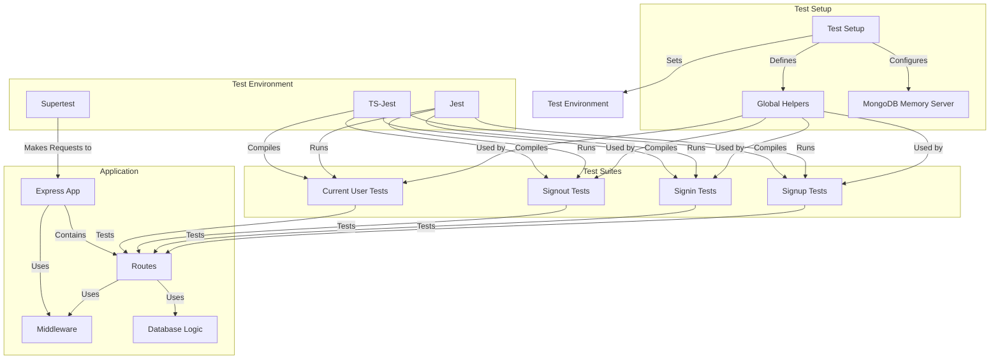

# Ticketing Application - Testing Isolated Microservices

A microservices-based ticketing platform built with Node.js, TypeScript, and Kubernetes, now featuring comprehensive testing capabilities for isolated microservice development.

## What's Changed from Version 8 (Authentication Strategies and Options)

Version 9 builds upon the authentication system established in version 8, adding a robust testing framework designed specifically for a microservices architecture.

### Testing Framework Integration

- **Testing Dependencies**: Added comprehensive testing tools

  ```json
  "devDependencies": {
    "@types/jest": "^29.5.13",
    "@types/supertest": "^6.0.2",
    "jest": "^29.7.0",
    "mongodb-memory-server": "^10.0.0",
    "supertest": "^7.0.0",
    "ts-jest": "^29.2.5"
  }
  ```

- **Jest Configuration**: Set up TypeScript-compatible testing environment

  ```json
  "jest": {
    "preset": "ts-jest",
    "testEnvironment": "node",
    "setupFilesAfterEnv": [
      "./src/test/setup.ts"
    ]
  }
  ```

- **Test Scripts**: Added npm test command

  ```json
  "scripts": {
    "start": "ts-node-dev --poll src/index.ts",
    "test": "jest --watchAll --no-cache"
  }
  ```

### Application Architecture Changes

- **App/Server Separation**: Split app configuration from server startup

  ```typescript
  // app.ts - Application definition
  const app = express();
  app.set('trust proxy', true);
  app.use(json());
  app.use(cookieSession({...}));
  // Middleware and routes
  export { app };
  
  // index.ts - Server startup
  import { app } from './app';
  const start = async () => {
    // Connect to database
    app.listen(3000, () => {...});
  };
  start();
  ```

- **Environment-Aware Configuration**: Modified cookie settings for testing

  ```typescript
  app.use(
    cookieSession({
      signed: false,
      secure: process.env.NODE_ENV !== 'test'
    })
  );
  ```

- **Test Setup Infrastructure**: Added dedicated test configuration

  ```typescript
  // In setup.ts
  beforeAll(async () => {
    process.env.JWT_KEY = "asdfasdf";
    // MongoDB Memory Server setup
  });
  ```

## Testing Architecture

The application implements a comprehensive testing architecture tailored for microservices:



### In-Memory Database Approach

Instead of connecting to an external MongoDB instance, tests use MongoDB Memory Server:

```typescript
// In setup.ts
let mongo: any;
beforeAll(async () => {
  process.env.JWT_KEY = "asdfasdf";
  process.env.NODE_TLS_REJECT_UNAUTHORIZED = "0";

  const mongo = await MongoMemoryServer.create();
  const mongoUri = mongo.getUri();

  await mongoose.connect(mongoUri, {});
});

// Clean up data between tests
beforeEach(async () => {
  if (mongoose.connection.db) {
    const collections = await mongoose.connection.db.collections();

    for (let collection of collections) {
      await collection.deleteMany({});
    }
  }
});

// Clean up after tests
afterAll(async () => {
  if (mongo) {
    await mongo.stop();
  }
  await mongoose.connection.close();
});
```

### Test Lifecycle Hooks

- **beforeAll**: Set up environment, create MongoDB memory server, connect to database
- **beforeEach**: Clear all collections to ensure test isolation
- **afterAll**: Stop MongoDB memory server, close database connections

### Global Authentication Helper

The setup includes a global helper for authentication in tests:

```typescript
// Type definition for TypeScript
declare global {
  var signin: () => Promise<string[]>;
}

// Helper implementation
global.signin = async () => {
  const email = "test@test.com";
  const password = "password";

  const response = await request(app)
    .post("/api/users/signup")
    .send({
      email,
      password,
    })
    .expect(201);

  const cookie = response.get("Set-Cookie");

  if (!cookie) {
    throw new Error("Failed to get cookie from response");
  }
  return cookie;
};
```

## Testing Framework and Tools

### Jest Configuration

Jest is configured for TypeScript support with the following features:

- **ts-jest preset**: Enables TypeScript compilation during tests
- **node testEnvironment**: Runs tests in Node.js environment
- **setupFilesAfterEnv**: Custom setup file run before each test file
- **watchAll mode**: Automatically reruns tests on file changes
- **no-cache flag**: Prevents caching issues with TypeScript

### Supertest for API Testing

Supertest provides a high-level abstraction for HTTP testing:

```typescript
// Example of Supertest request
const response = await request(app)
  .post('/api/users/signup')
  .send({
    email: 'test@test.com',
    password: 'password'
  })
  .expect(201);
```

Features used:

- Fluent API for request configuration
- HTTP methods (get, post, put, delete)
- Header setting (including cookies)
- Response body access
- Status code assertions

### MongoDB Memory Server

Provides an in-memory MongoDB instance for tests:

- No external database dependency
- Runs in-process for faster tests
- Isolated database per test run
- No test data persistence between runs
- No port conflicts with other services

### TypeScript Integration

Tests are fully integrated with TypeScript:

- Type-safe test cases
- Type definitions for global helpers
- Type compatibility with application code
- Type checking during test compilation

## Test Organization and Structure

### Test File Organization

Tests are organized alongside the code they test:

```
src/
├── routes/
│   ├── current-user.ts
│   ├── signin.ts
│   ├── signout.ts
│   ├── signup.ts
│   └── __test__/
│       ├── current-user.test.ts
│       ├── signin.test.ts
│       ├── signout.test.ts
│       └── signup.test.ts
├── test/
│   └── setup.ts
```

- Route-specific tests in `__test__` directory
- Test files named after the route files they test
- Centralized test setup in dedicated directory

### Test Case Design

Tests follow these design principles:

1. **Single Responsibility**: Each test case tests one specific behavior
2. **Independence**: Tests don't depend on other tests' state
3. **Clarity**: Clear descriptions of what each test is checking
4. **Comprehensiveness**: Cover success paths, error cases, and edge cases
5. **Isolation**: No reliance on external services or state

### Example Test Suites

- **Signup Tests**: Tests registration process, validation, duplicates
- **Signin Tests**: Tests authentication, invalid credentials
- **Signout Tests**: Tests session termination
- **Current User Tests**: Tests user state retrieval

### Edge Case Testing

Tests cover various edge cases:

- Invalid email formats
- Password too short
- Missing required fields
- Duplicate email registration
- Non-existent user signin
- Incorrect password
- Unauthenticated requests

## Microservices Testing Considerations

### Service Isolation

Each microservice is tested in complete isolation:

- No communication with other services during tests
- In-memory database specific to each service
- Independent authentication logic
- No shared state between services

### Database Independence

The database approach ensures independent testing:

- MongoDB Memory Server provides isolated database instance
- Each test suite starts with a clean database
- No persistence between test runs
- No external database configuration required

### Authentication in Tests

Authentication is handled within each service:

```typescript
// Example of authenticated request in test
const cookie = await global.signin();

const response = await request(app)
  .get('/api/users/currentuser')
  .set('Cookie', cookie)
  .send()
  .expect(200);
```

- Global signin helper creates authentication state
- Cookie-based authentication simplifies testing
- No need to mock authentication services

### Environment Configuration

Environment-specific behavior enables easier testing:

```typescript
// Disable secure cookie requirement in tests
app.use(
  cookieSession({
    signed: false,
    secure: process.env.NODE_ENV !== 'test'
  })
);
```

- Test environment has appropriate settings
- No HTTPS requirement in test environment
- Environment variables control application behavior

## Setting Up and Running Tests

### Prerequisites

1. **Node.js and npm** installed
2. Project dependencies installed: `npm install`

### Running Tests

Execute the test command to run all tests:

```bash
npm test
```

This command:

- Starts Jest in watch mode
- Automatically runs tests when files change
- Shows test results in the terminal

### Test Execution Options

Additional options for running tests:

```bash
# Run tests once without watch mode
npm test -- --watchAll=false

# Run tests for specific files
npm test -- --testPathPattern=signup

# Run with coverage report
npm test -- --coverage
```

### Test Troubleshooting

Common issues and solutions:

1. **MongoDB Memory Server Issues**
   - Ensure MongoDB Memory Server can download and run
   - Check for sufficient disk space and permissions

2. **Authentication Test Failures**
   - Verify JWT_KEY is set in test environment
   - Check cookie handling in test environment

3. **TypeScript Compilation Issues**
   - Run with --no-cache flag to avoid stale builds
   - Check TS configuration compatibility with Jest

## Test Examples and Patterns

### Authentication Testing

Testing the authentication flow:

```typescript
it('responds with details about the current user', async () => {
  const cookie = await global.signin();

  const response = await request(app)
    .get('/api/users/currentuser')
    .set('Cookie', cookie)
    .send()
    .expect(200);

  expect(response.body.currentUser.email).toEqual('test@test.com');
});
```

### Validation Testing

Testing input validation:

```typescript
it('returns a 400 with an invalid email', async () => {
  return request(app)
    .post('/api/users/signup')
    .send({
      email: 'alskdflaskjfd',
      password: 'password'
    })
    .expect(400);
});

it('returns a 400 with an invalid password', async () => {
  return request(app)
    .post('/api/users/signup')
    .send({
      email: 'test@test.com',
      password: 'p'
    })
    .expect(400);
});
```

### Error Case Testing

Testing error scenarios:

```typescript
it('disallows duplicate emails', async () => {
  await request(app)
    .post('/api/users/signup')
    .send({
      email: 'test@test.com',
      password: 'password'
    })
    .expect(201);

  await request(app)
    .post('/api/users/signup')
    .send({
      email: 'test@test.com',
      password: 'password'
    })
    .expect(400);
});
```

### Cookie Testing

Testing cookie management:

```typescript
it('clears the cookie after signing out', async () => {
  await request(app)
    .post("/api/users/signup")
    .send({
      email: "test@test.com",
      password: "password",
    })
    .expect(201);

  const response = await request(app)
    .post("/api/users/signout")
    .send({})
    .expect(200);

  const cookie = response.get("Set-Cookie");
  expect(cookie[0]).toEqual(
    "session=; path=/; expires=Thu, 01 Jan 1970 00:00:00 GMT; httponly"
  );
});
```

## Future Testing Enhancements

### Expanding Test Coverage

Potential areas for expanding test coverage:

1. **Unit Tests**: Add tests for individual functions and utilities
2. **Integration Tests**: Test interactions between services
3. **Performance Tests**: Add benchmarks for critical paths
4. **Security Tests**: Focused tests for security vulnerabilities
5. **Load Tests**: Verify behavior under high load

### CI/CD Integration

Tests are ready for CI/CD pipeline integration:

- Compatible with common CI systems (GitHub Actions, Jenkins, etc.)
- Single command execution for automated testing
- Clear pass/fail results for build decisions
- Fast execution for rapid feedback

### Cross-Service Testing

Future enhancements for testing service interactions:

1. **Service Mocking**: Mock adjacent services for integration tests
2. **API Contracts**: Test API contract compliance
3. **Event Testing**: Verify event publishing and subscription
4. **End-to-End Testing**: Full system tests across services

### Monitoring and Metrics

Testing can be extended to include:

1. **Code Coverage Reporting**: Add Jest coverage reports
2. **Test Performance Metrics**: Track test execution times
3. **Test Health Dashboards**: Monitor test reliability
4. **Flaky Test Detection**: Identify inconsistent tests

## Troubleshooting

### Common Issues

1. **Tests Failing Intermittently**
   - Check for shared state between tests
   - Verify database cleanup is working
   - Look for race conditions in async code

2. **Slow Test Execution**
   - MongoDB Memory Server startup can be slow
   - Consider optimizing heavy setup operations
   - Run tests in parallel when possible

3. **Authentication Issues in Tests**
   - Verify cookie handling is correct
   - Check JWT_KEY environment variable
   - Ensure auth flow matches production code

4. **TypeScript Errors in Tests**
   - Update @types packages to match library versions
   - Check tsconfig.json compatibility
   - Use proper type definitions for test functions
