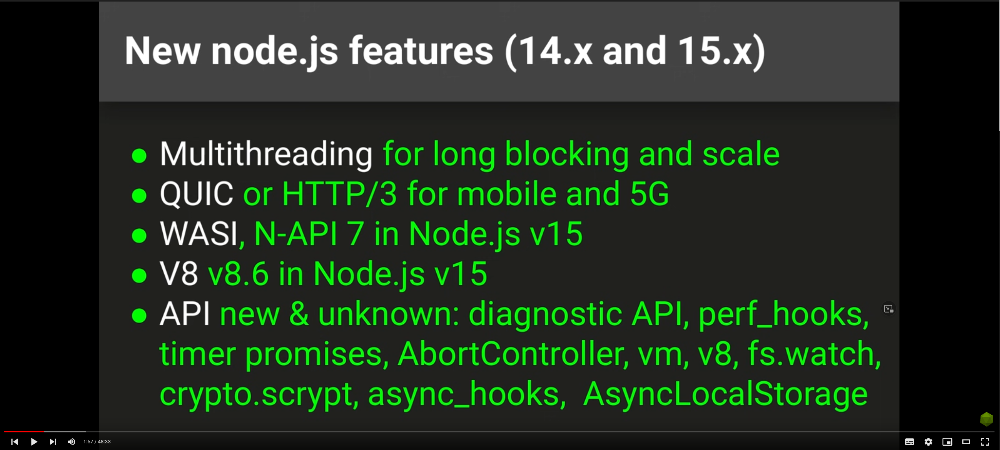
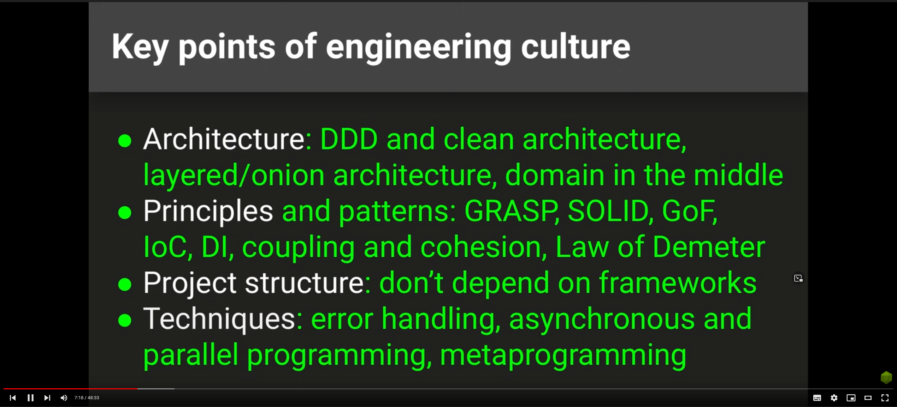
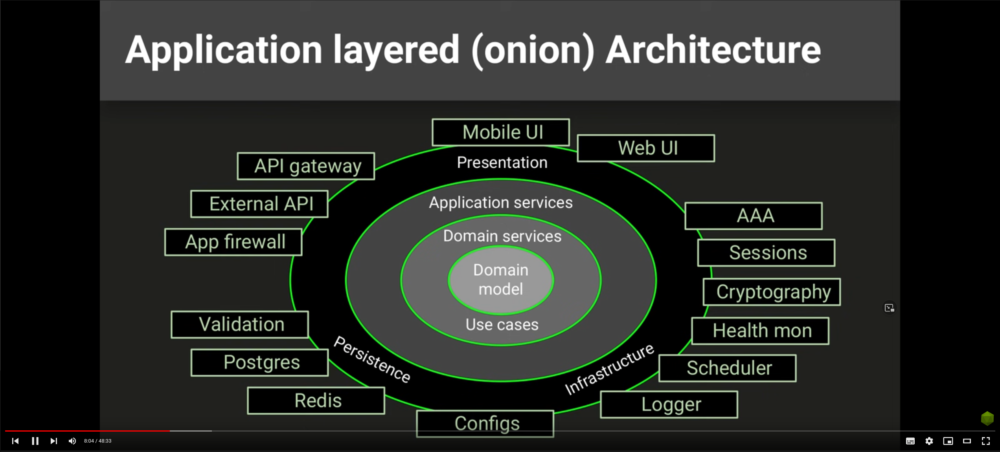

Вызовы для Ноды в 2021 и дальше

Основные моменты архитектуры ПО

Надо четко отделять бизнес логику от всего остального и не смешивать слои абстракции.

Новые фишки в ноде 14 и 15.

Предлагаемый новый подход к разработке ПО.

