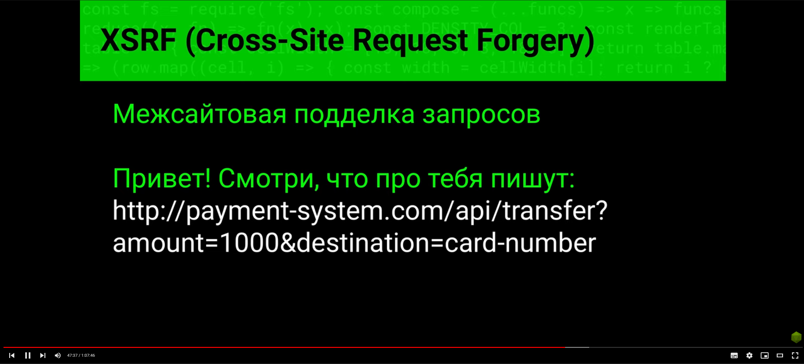

## SQL Injection

Глобальное состояние как в примере выше является ошибкой в проектировании, 
так как если юзеров несколько они начинают менять глобальную переменную и это приводит 
к data race.

Два приведенных ниже примерна так же не являются хорошим решением этой проблемы.

Создание конекшина на обработчиках. Это плохой пример кода. 
Все конекшины, ли пулы конекшинов должны выноситься в инициализацию процесса.

Например как здесь, но тут некорректная обработка ошибок так как при неудаче мы не освобождаем
конекшн, из-за чего пул конекшинов постепенно будет уменьшаться с каждым неудачным выполнением.

Не следует писать апи так, чтобы у него в урле приходили все параметры.

Если предыдущий пример про параметры – то этот про, то что нам в урл пропихивают 
кусочек скрипта.

Статься про защиту от всяких атак, но это защита на стороне клиента, 
на сервере надо писать свою защиту.

