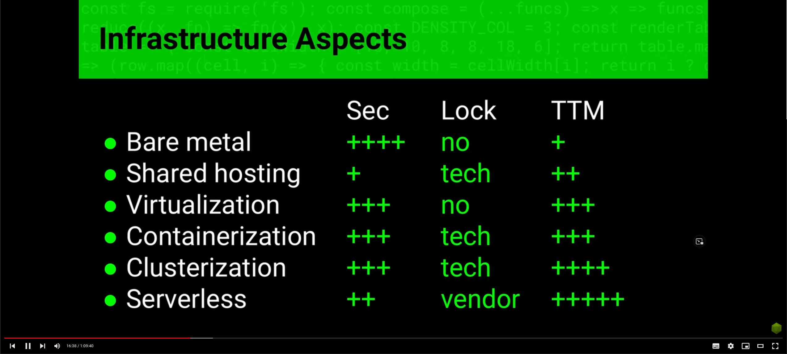
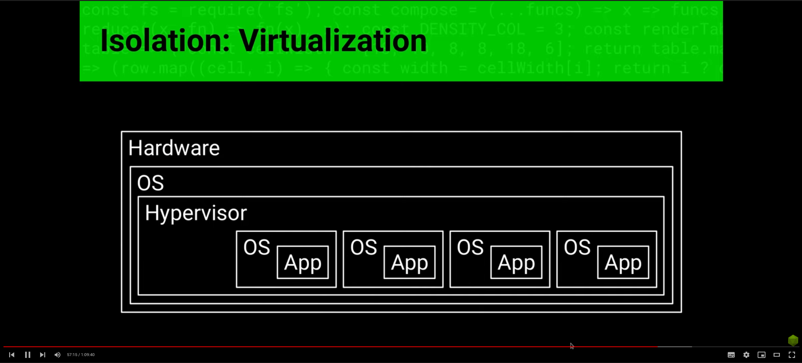

Отличие Serverless от Инфраструктуры как решения.
IaaS - Infrastructure as a Service.
FaaS - Function as a Service.

Отсутствие состояния означает что между запросами мы не должны ничего разворачивать в памяти. 
Мы не можем там ничего кешировать, привязывать пользователей к процессу, так как облако полностью 
управляет процессами. Если нам нужно состояние, то нам его должен предоставлять какой-то сторонний
сервис. Фактически мы пишем чистую бизнес-логику на функциях, а всем остальным мы не управляем.

Зеленое - это то чем мы не управляем.

Этапы развития инфраструктуры.

Sec - security.
Lock - блокировки, имеется в виду, что мы можем использовать любой стек технологий и любые ОС. 
TTM - time to market. 

Типо преимущества.
Дешево при малой нагрузке, но становясь высоко нагруженным такие решения становятся очень дорогими.

За что мы платим 

Что отдается на автоматизацию 

Минусы

Говнокод на мидлварах

Говнокод на серверлесс

Как надо

Типы серверных архитектур

Как этого достигнуть

Изоляция

Изоляция на виртуалках при помощи кучи виртуальных машин

В контейнеризации все получше тут одна ОС

Микроизоляция - самая лучшая

Все способы изоляции
