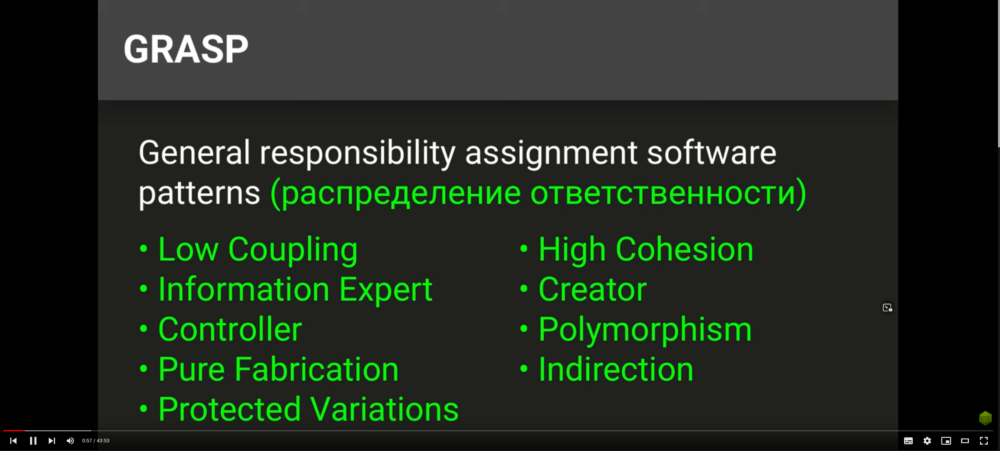
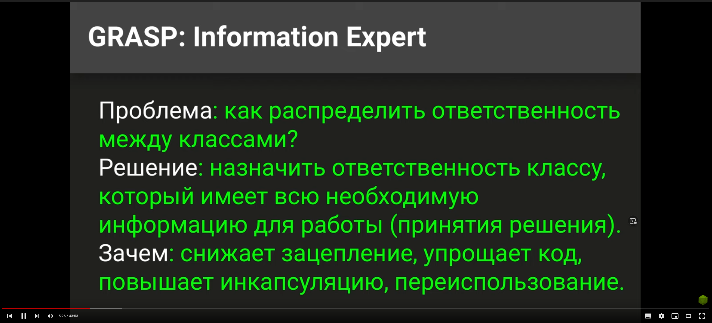
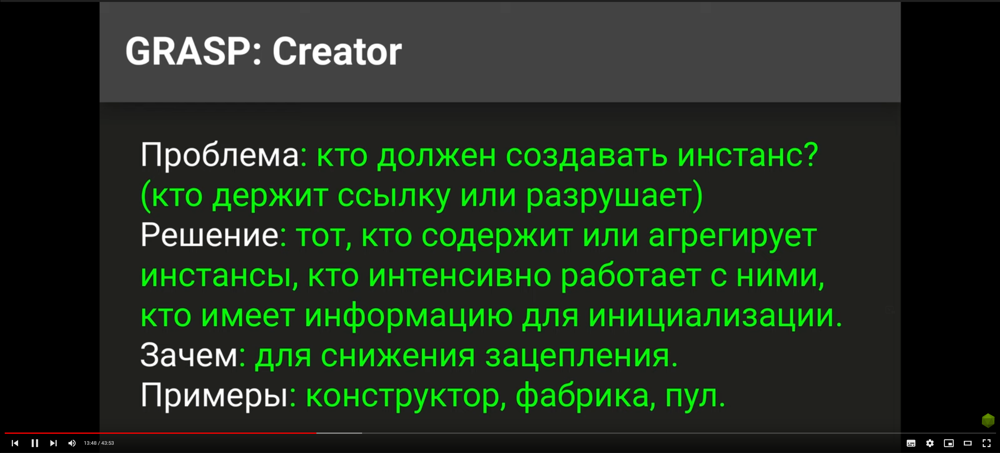
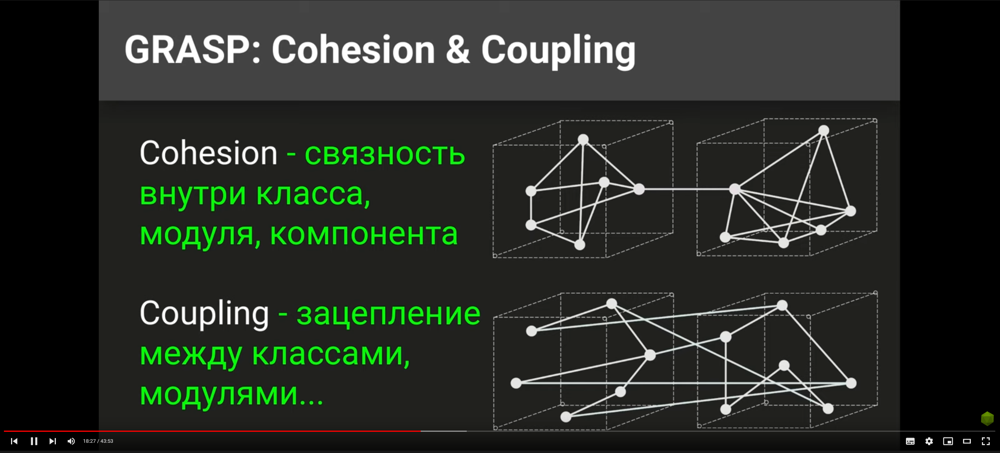
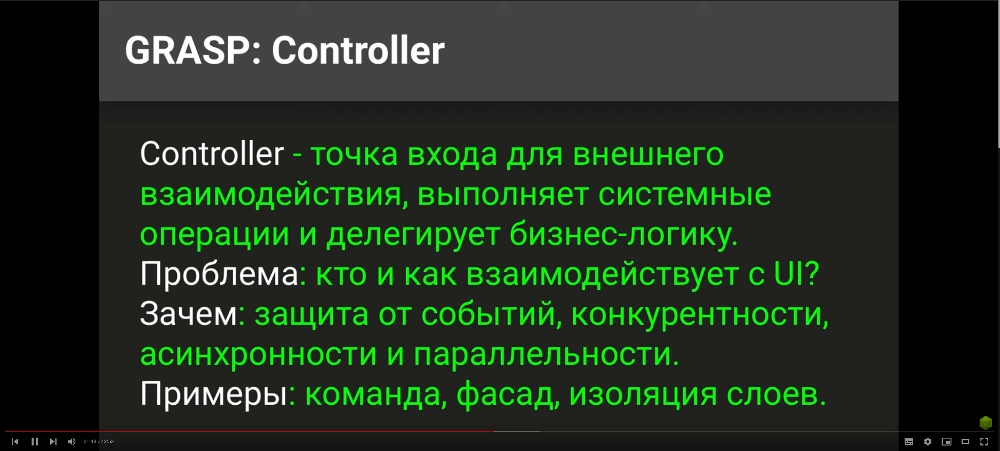
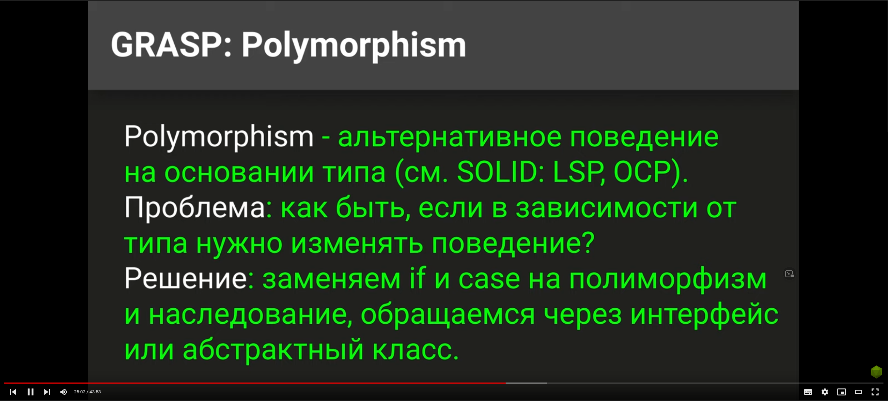
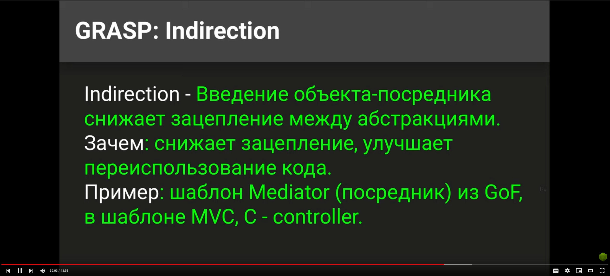
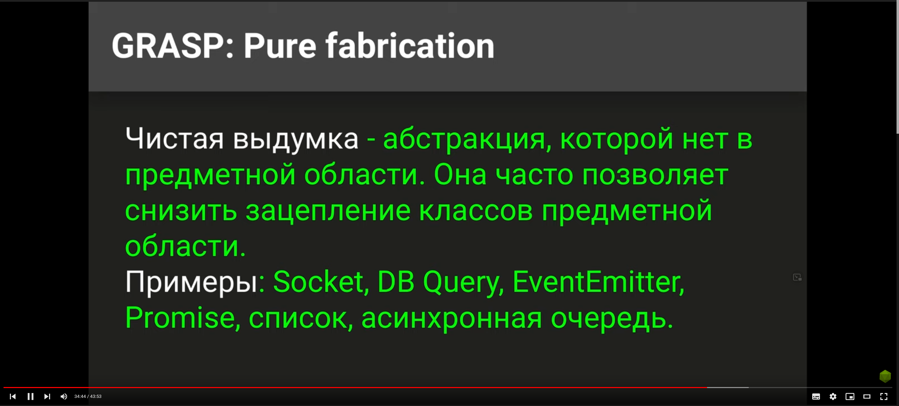
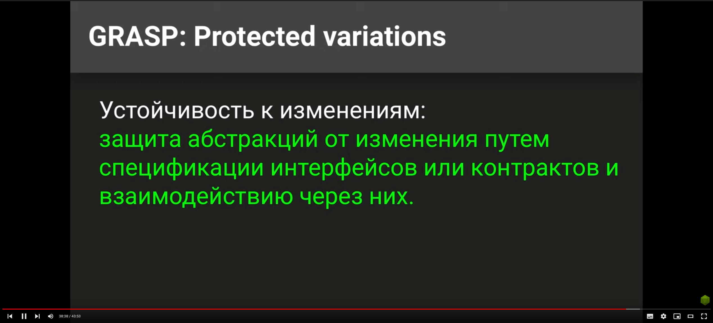

GRASP - general responsibility assignment software pattern, принципы распределения ответственности.

Information Expert.
Например есть класс, у него есть защищенные поля и внешний интерфейс с которым работает система. 
И не надо лезть и патчить, или миксинить эти поля и сам класс. А нужно с таким классом работать через 
внешний интерфейс и не лезть классу в душу. 

Creator.
Если один класс содержит инстансы другого, то он может и инстансиировать класс. Мы приходим тут к таким принипам как 
агрекация и композиция, тогда тот кто занимается агрегацией и должен создавать инстансы класса.

Coupling и Cohesion.
Надо стараться сделать так, чтобы внутри себя компоненты были сцеплены сильно, 
а вот сцепление между модулями должно быть слабым.
Например для наружного взаимодействия можно объявить фасад, и через него компоненты
общаются, либо экспортируют какой-то интерфейс.

Controller.
Необходим, чтобы изолировать всякую приходящую информацию от внутренностей программы. 
Например различный ввод — вывод, доступы к БД, и т.д. Тогда как бизнес логика от этого 
старается быть максимально независимой. На себя контроллер должен брать всякие системные вещи, 
как можно больше многопоточности, и т.д. 

Polymorphism.
Плохо когда у нас появляются различные if блоки, которые зависят не от логики, а от типов, или классов
которые мы получаем на вход. Тогда надо сделать абстрактную сущность, от которой мы наследуемся, и у наследников
будет несколько методов с которыми мы работаем, и вызывая методы у интерфейса мы будем получать разный результат,
который будет зависить от конкретного инстанса, реализующего интерфейс класс.

Indirection - посредник.
Например в шаблоне MVC посредником между Model и View будет Controller.
Или например два компонента шлют события и подписываются на них через шаблон Observer который занимается пересылкой 
событий.

Pure fabrication - чистая выдумка.

Protected variations - устойчивость к изменениям.
Она достигается путем использования всех предыдущих принципов. Мы занимаемся контрактным программированием, а не 
пускаем внутрь прикладного программиста который начнет что-то менять внутри компонентов. Вместо этого мы предоставляем
ему некое АПИ, с которым он работает, и контракты работы с ним, например как NodeJS, где мы не программируем на C++ на 
котором написана Нода, а программируем на некотором АПИ предоставленном нам.
