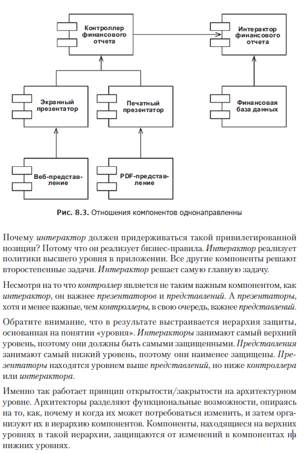
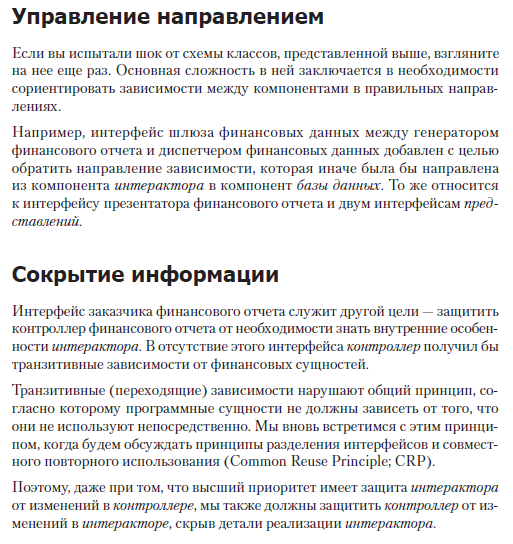

# Open Close Principle

Программные сущности должны быть открыты для расширения, но закрыты для изменения.
Потому что рабочий код уже оттестирован и надо стараться лишний раз его не менять. 
А по возможности наследоваться от него, добавляя новый функционал таким образом.

Eсли компонент A требуется защитить от изменений в компоненте B, компонент B 
должен зависеть от компонента A. Нам нужно защитить контроллер от изменений в 
презентаторах. Нам нужно защитить презентаторы от изменений в представлениях. 
Нам нужно защитить интерактор от изменений в... во всех остальных компонентах. 
Интерактор находится в позиции, лучше соответствующей принципу открытости/закрытости.
Изменения в базе данных, или в контроллере, или в презентаторах, или в 
представлениях не должны влиять на интерактор.

Принцип открытости/закрытости — одна из движущих сил в архитектуре систем. 
Его цель — сделать систему легко расширяемой и обезопасить ее от влияния изменений. 
Эта цель достигается делением системы на компоненты и упорядочением их зависимостей 
в иерархию, защищающую компоненты уровнем выше от изменений в компонентах уровнем ниже.
