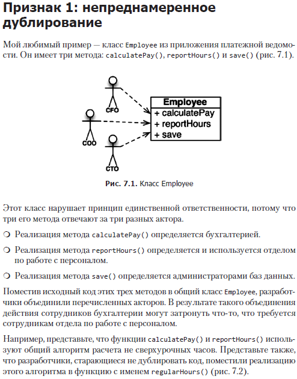
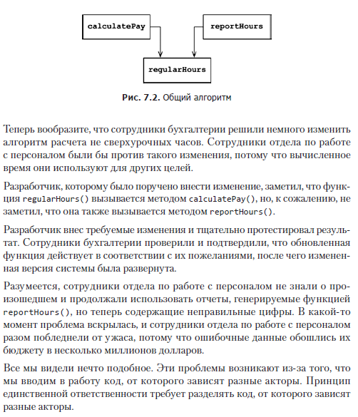

# Single Responsibility Principle

Принцип единственной ответственности гласит что один класс,
или функция должен решать одну задачу.

Традиционно принцип единственной ответственности описывался так: Модуль должен иметь 
одну и только одну причину для изменения.

Программное обеспечение изменяется для удовлетворения нужд пользователей и
заинтересованных лиц. Пользователи и заинтересованные лица как раз и есть та
самая «причина для изменения», о которой говорит принцип. Фактически принцип
можно перефразировать так: Модуль должен отвечать за одного и только за
одного пользователя или заинтересованное лицо, или актор.

Соответственно, окончательная версия принципа единственной ответственности
выглядит так: Модуль должен отвечать за одного и только за одного актора.

Принцип единственной ответственности (Single Responsibility Principle; SRP) касается
функций и классов, но он проявляется в разных формах на еще двух более высоких
уровнях. На уровне компонентов он превращается в принцип согласованного изменения 
(Common Closure Principle; CCP), а на архитектурном уровне — в принцип оси изменения
(Axis of Change), отвечающий за создание архитектурных границ.
