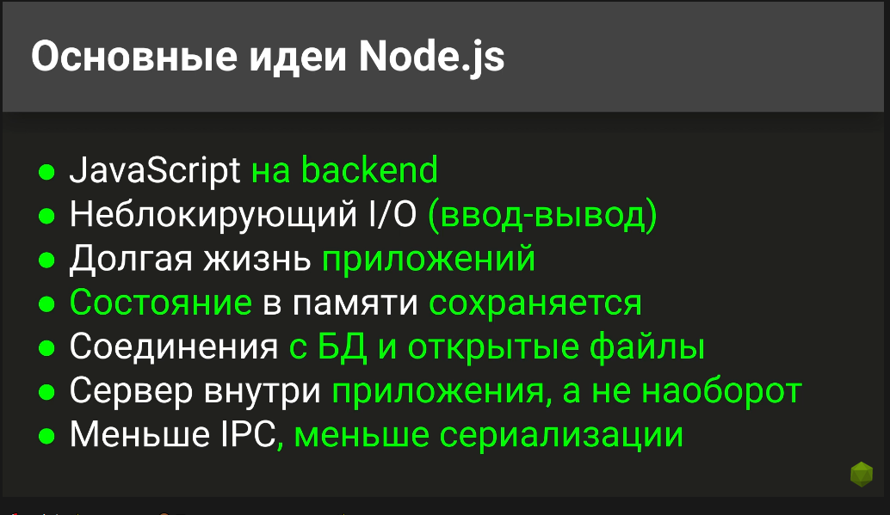
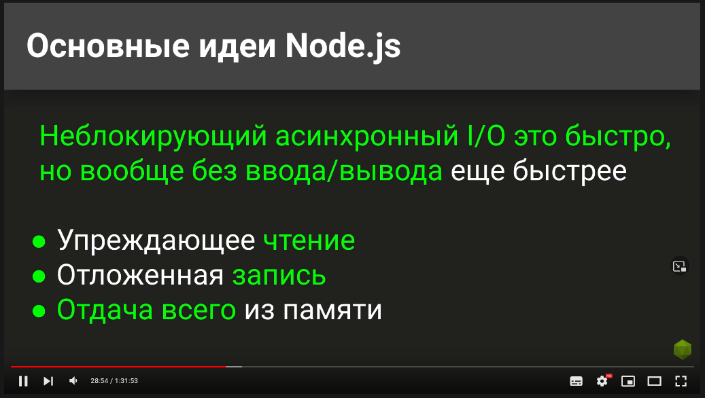
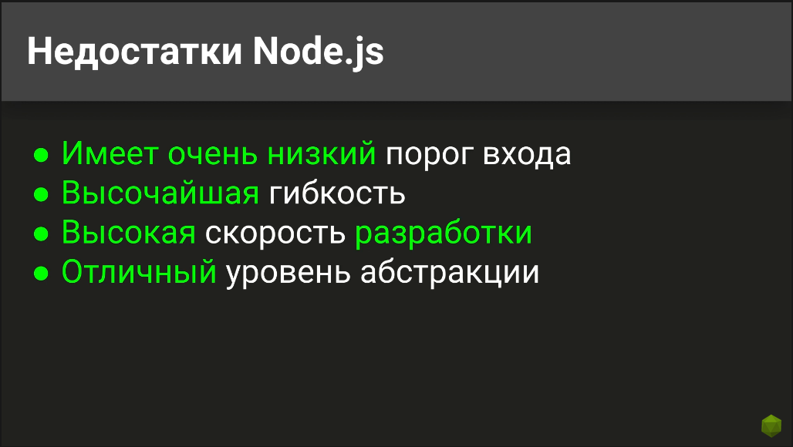
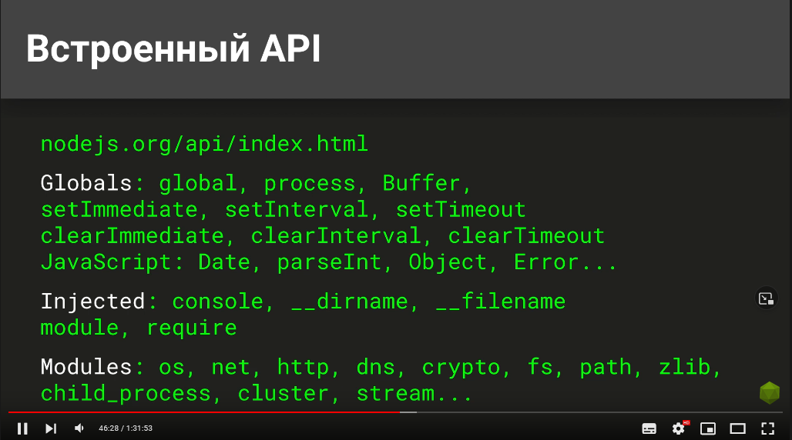
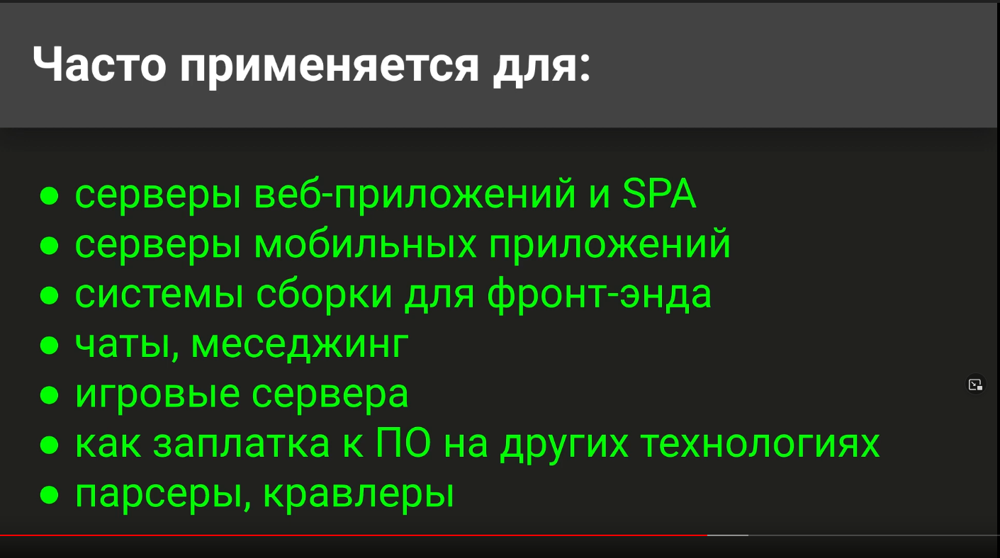
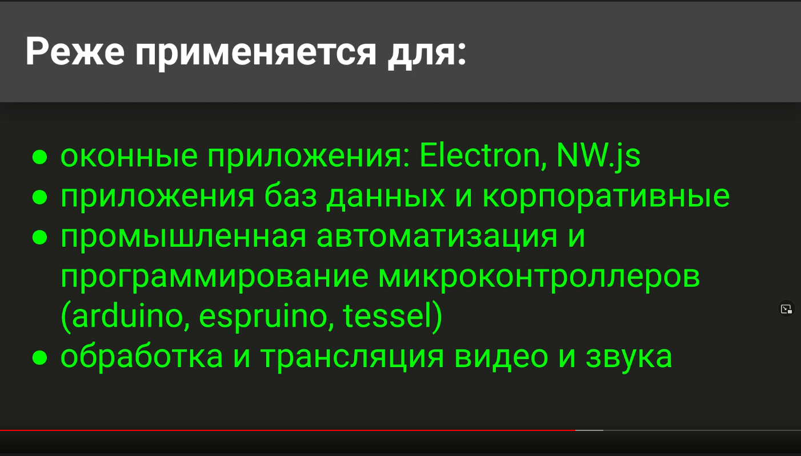
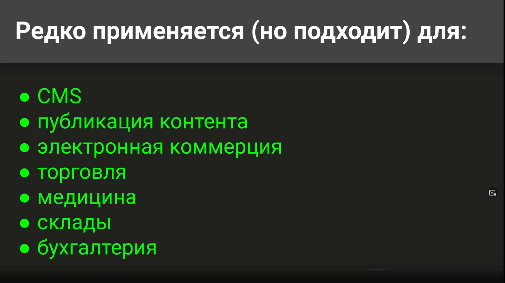
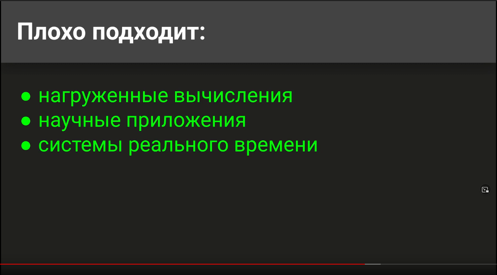
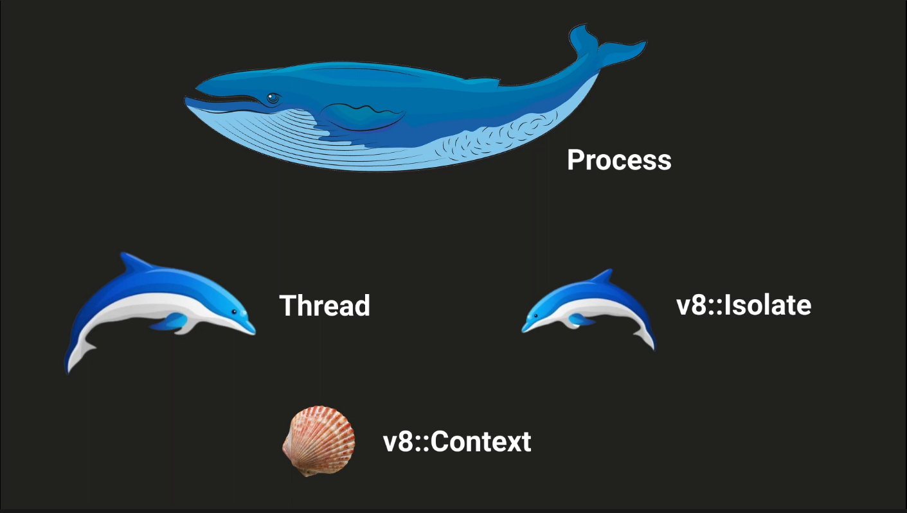
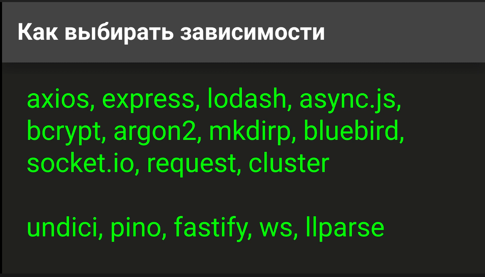

В Ноде основная идея что мы можем сделать примерно такое количество процессов и тредов сколько 
у нас ядер в процессоре, это лучше всего измерять и определять на месте.

Ввод вывод часто содержит много операций ожидания, например ждем пока прочитается файл, или еще что-то
в это время мы можем давать задания другим модулям, исполнять какой-то код. Таким образом зазоры на ожидание
используются для выполнения других задач, уплотняясь и по максимуму используя свой процесс.

Нодовские процессы живут в памяти достаточно долго, их не нужно постоянно поднимать с диска. Могут долго 
сохраняться соединения с базой. Таким образом можно создать некий пул соединений и использовать его. Таким
образом у нас переиспользуются соединения с базой.

Но есть и побочные эффекты уплотнения всего в один поток исполнения, то что раньше было в разных процессах.
У нас все от разных пользователей попало в один инстанс ноды. Таким образом если он упадет то это затронет сразу 
кучу пользователей, поэтому безопасность выходит на первое место.

Сервер запускается внутри приложения, с точки зрения это не очень. Хотелось бы иметь сервер приложений который 
будет управлять и масштабировать приложения.

Меньше ввода вывода это еще круче чем неблокирующий ввод вывод, мы можем использовать кэши и прочее чтобы 
использовать упреждающее чтение и отдавать все из памяти.

Встроенный АПИ 

Для изоляции контекстов можно использовать 

Проблемы

Не нужно использовать то что сверху, все это либо плохо написано, либо есть в ноде, а то что снизу хорошо

