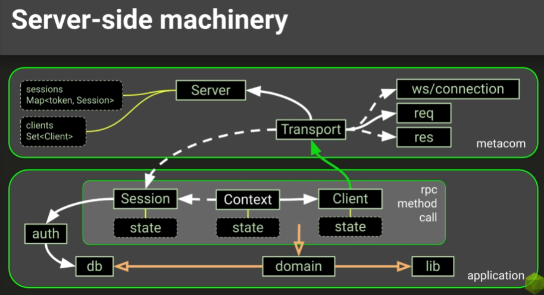

Сам код в папке NodeJS-Pure-main

 
Здесь Транспорт реализует паттерн стратегия, так как отвечает за выбор стратеги
транспорта. 

Клиент в приложении реализует паттерн фасад и за собой скрывает всю машинерию.

Map для роутинга в файле loader const container = new Map();

Более полный список паттернов

Наши требования к сессии и контекстам

