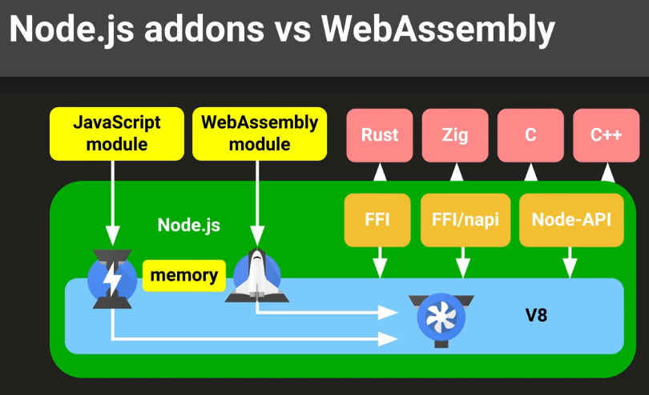
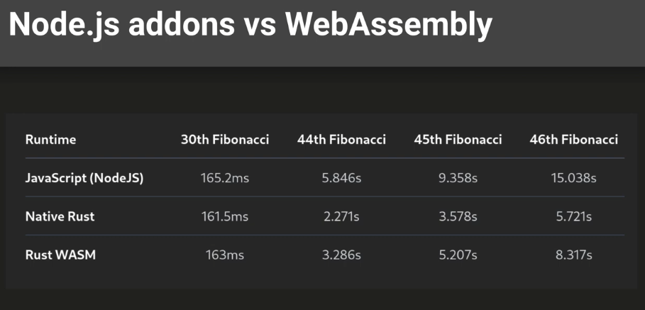

# Node-API (N-API)

- [C++ addon example](./C++)
- [Rust addon example](./Rust)

## Структура вэб ассембли

- Вэб ассембли модули имеют собственную память, но можно создать некоторую
расшареную область памяти между кодом и модулем.

