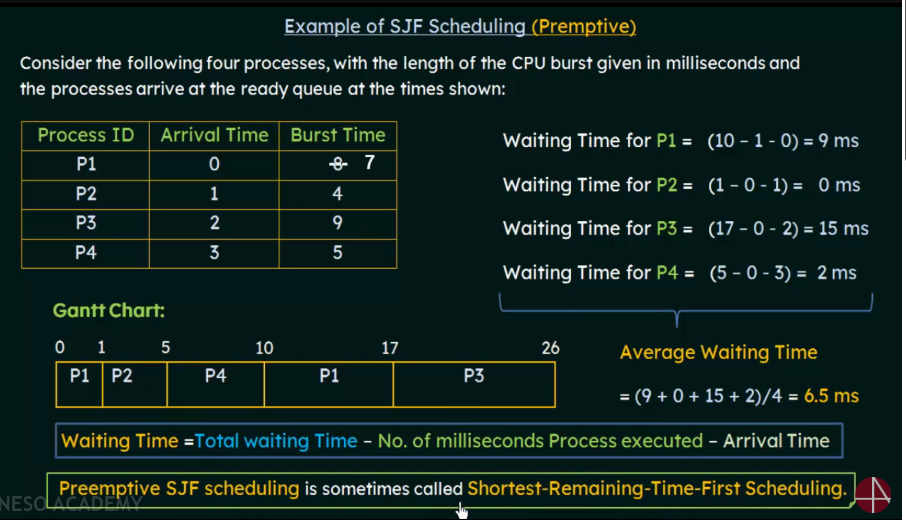
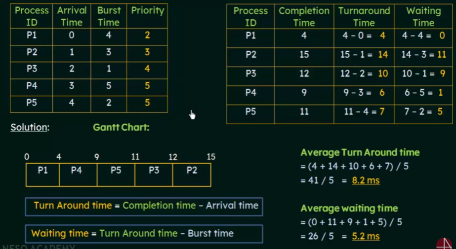

# CPU Scheduling

## CPU and I/O Burst Cycles

## Preemptive and Non-Preemptive Scheduling

## Scheduling Criteria

## Scheduling Algorithms

### First-Come, First-Served

Solved problems

-- 2

### Shortest - Job - First Scheduling

* "No. of milliseconds Process executed" - means 
Number of milliseconds Process executed before it starts executing
  

Solved Problems

-- 2

### Priority Scheduling

Solved problems

-- 2

### Round-Robin Scheduling

-- (Turnaround Time & Waiting Time)

