# Process Synchronization

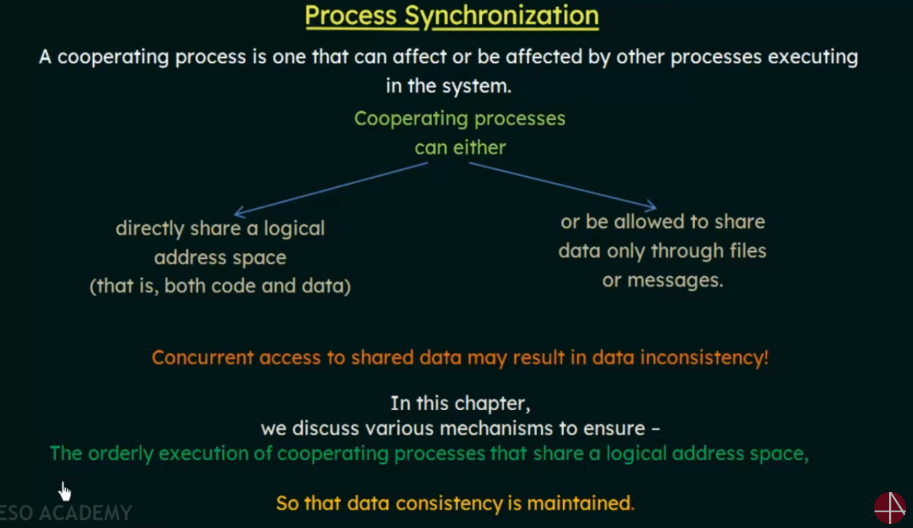

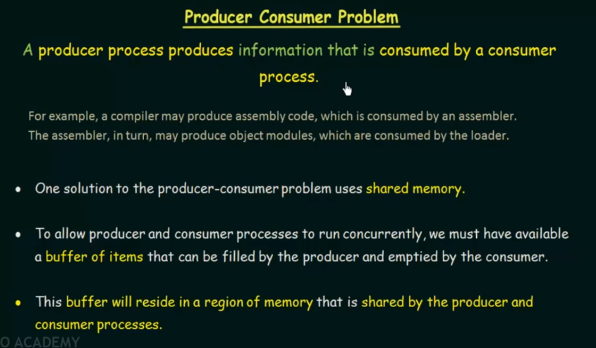
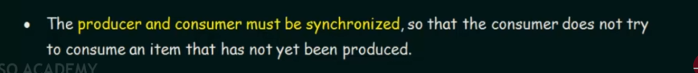

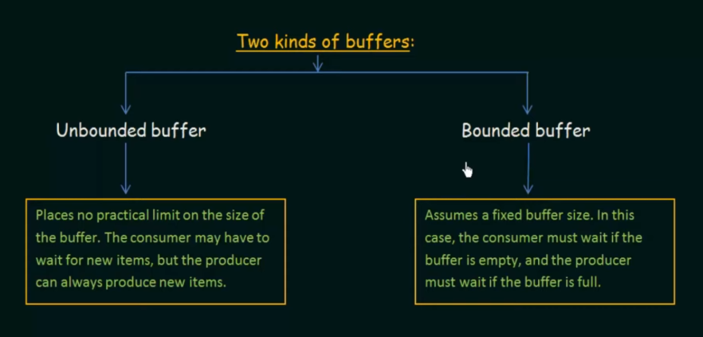

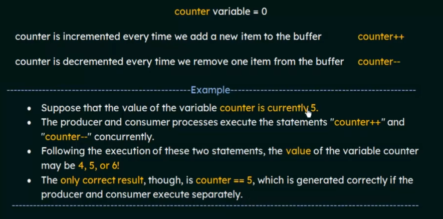

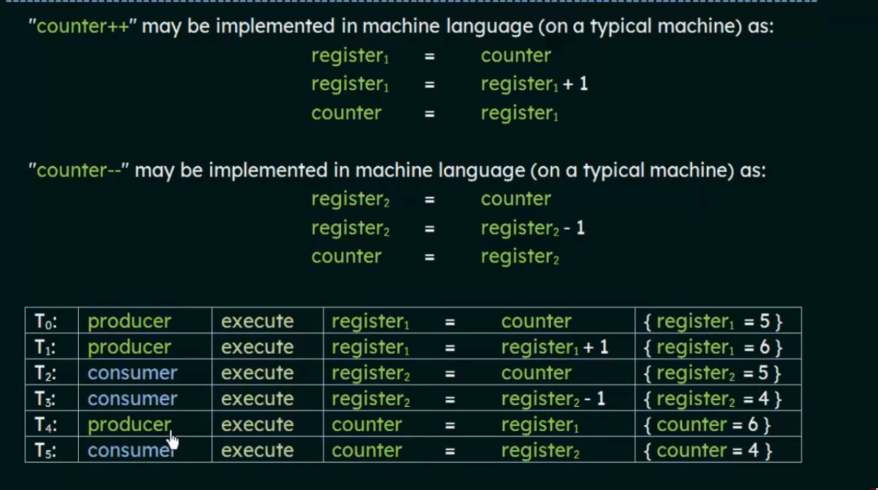

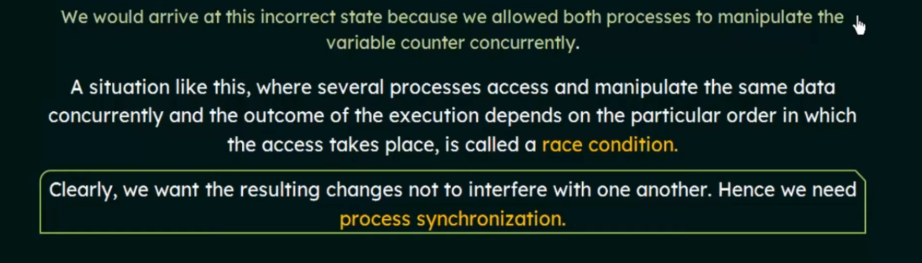

## Critical Section Problem

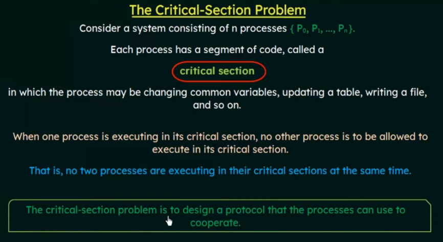

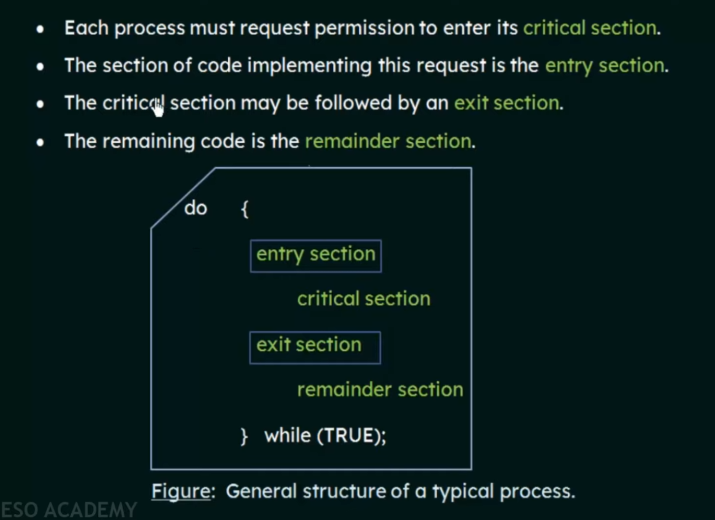

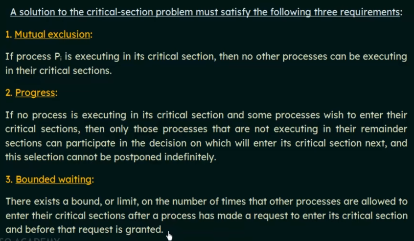

## Test and Set Lock

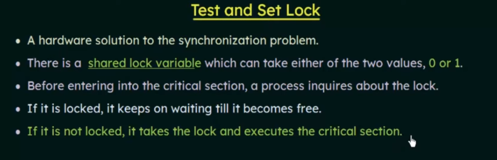

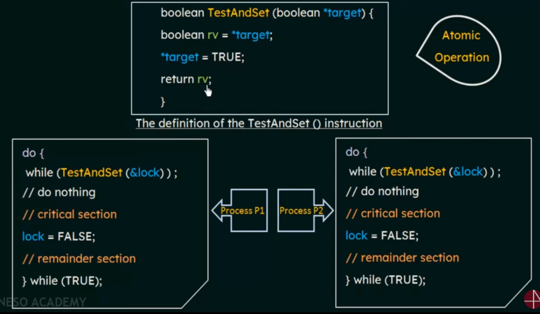

## Semaphores

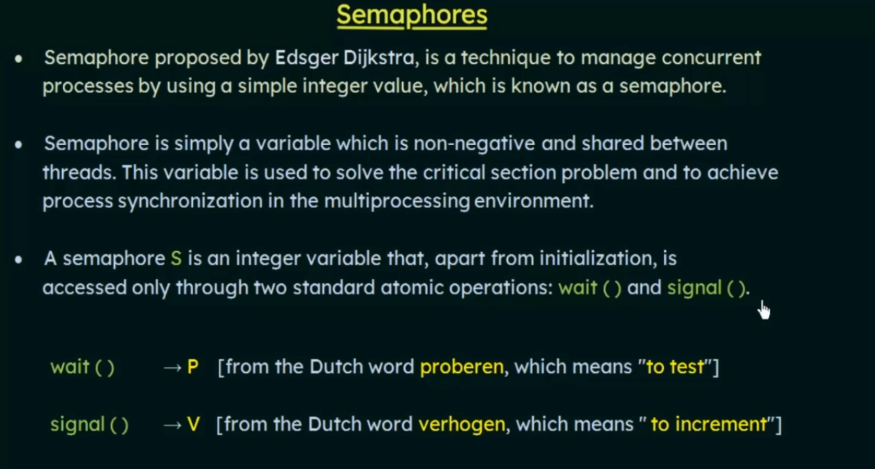

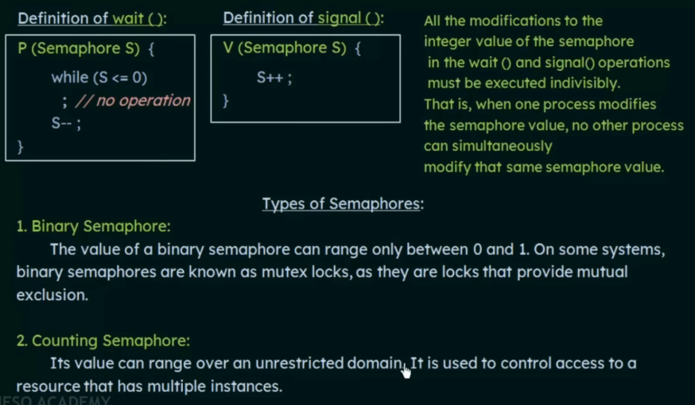

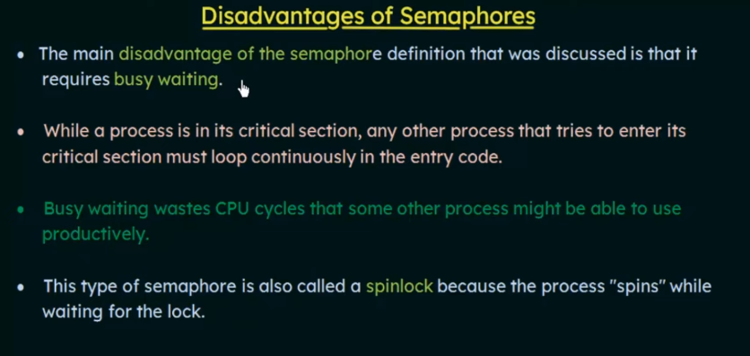

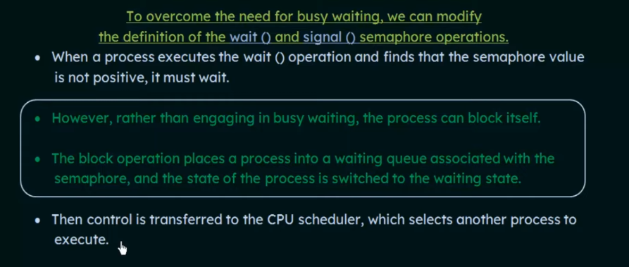

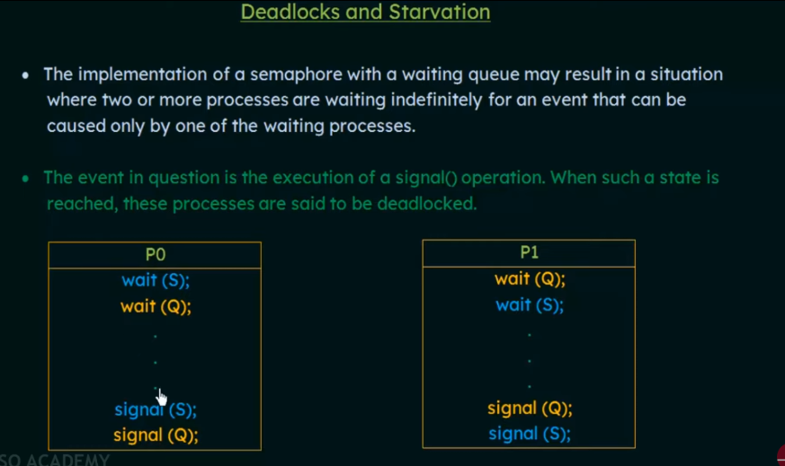

## Classic Problems of Synchronization

### Bounded-Buffer Problem

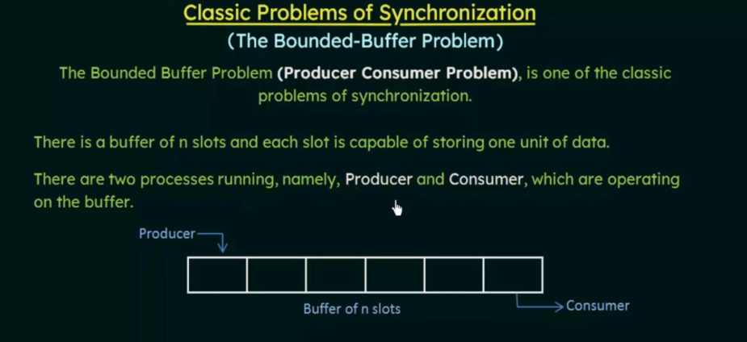

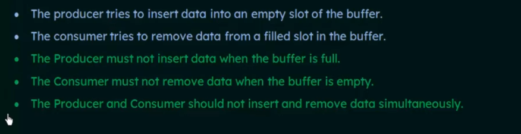

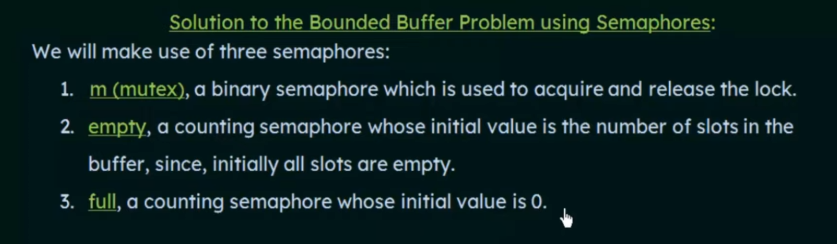

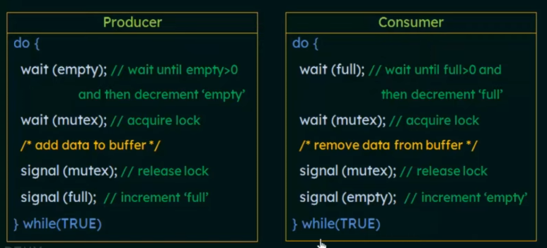

### The Readers Writers Problem

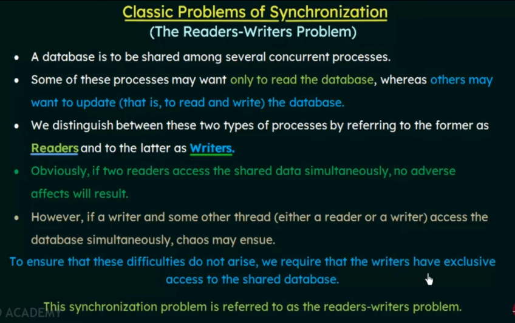

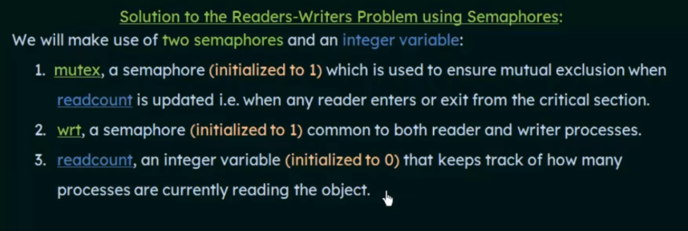

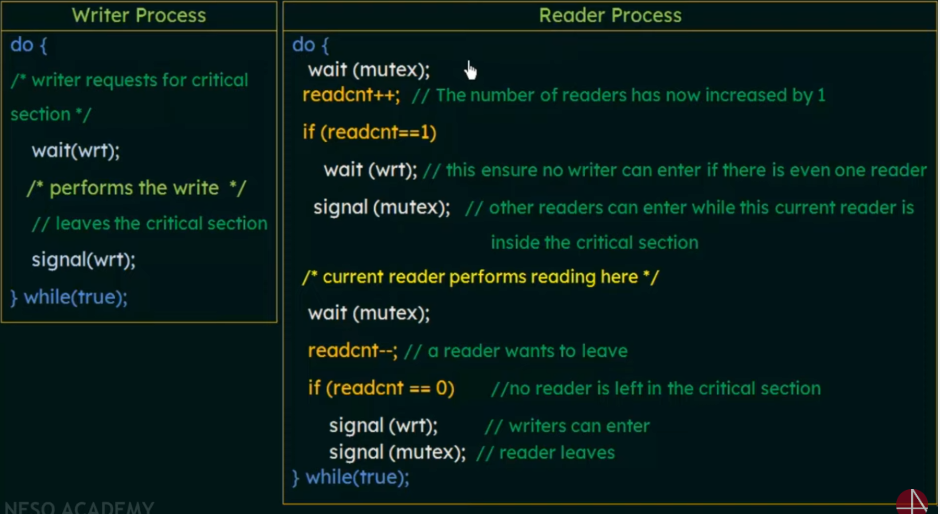

### Dining Philosophers Problem

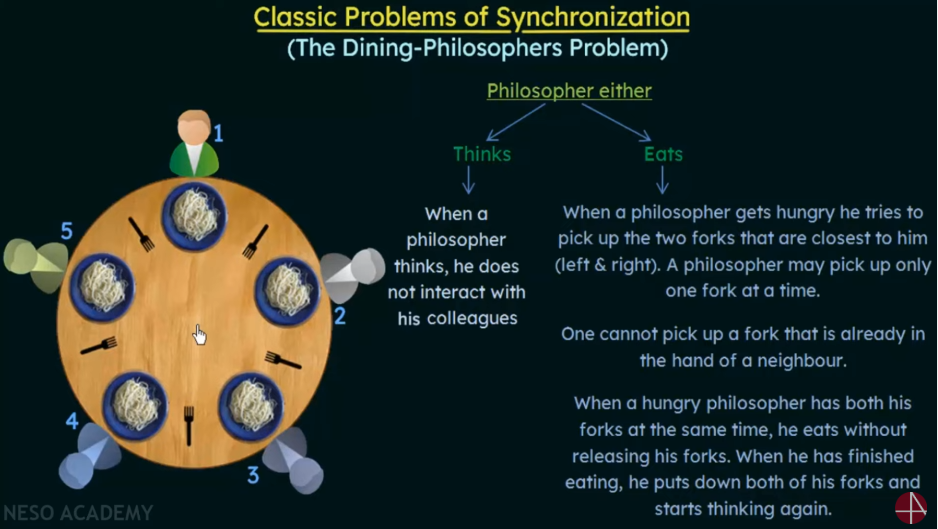

