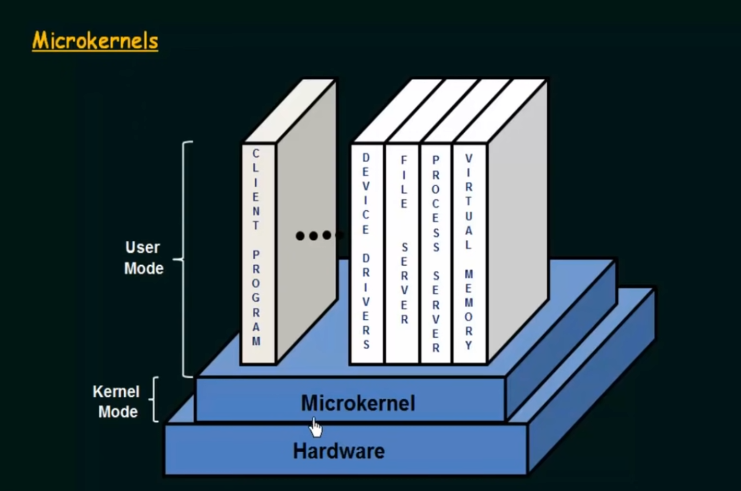
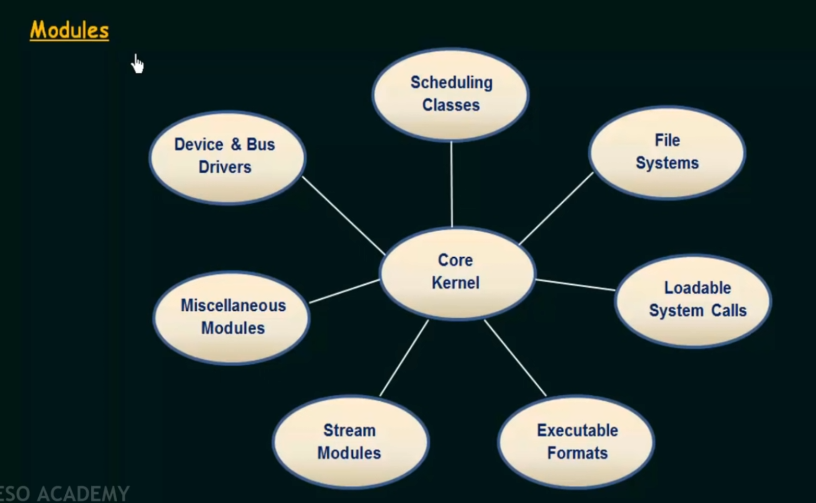
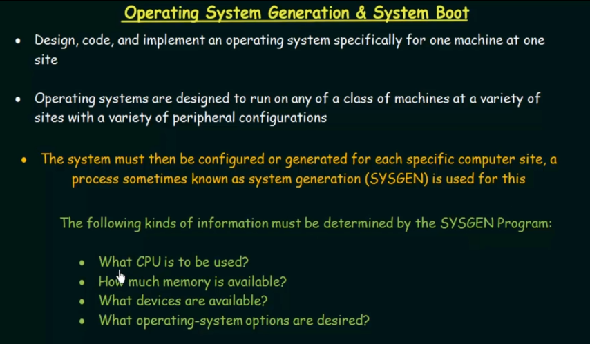
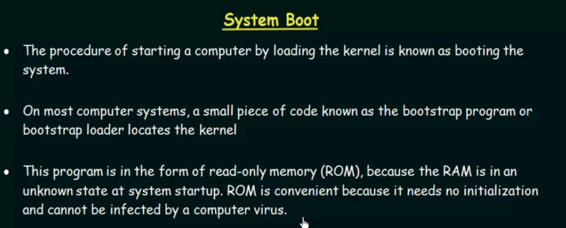
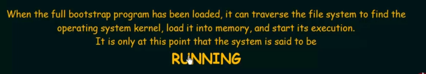

# OS Architecture

Multitasking

Time Sharing

## OS Services

## OS Structure Concepts

(https://www.youtube.com/watch?v=XXPBl20J22w&list=PLBlnK6fEyqRiVhbXDGLXDk_OQAeuVcp2O&index=13&ab_channel=NesoAcademy)

## OS Generation & System Boot

(https://www.youtube.com/watch?v=wD0PrF3fGSY&list=PLBlnK6fEyqRiVhbXDGLXDk_OQAeuVcp2O&index=15&ab_channel=NesoAcademy)

