# Process Management (Processes and Threads)

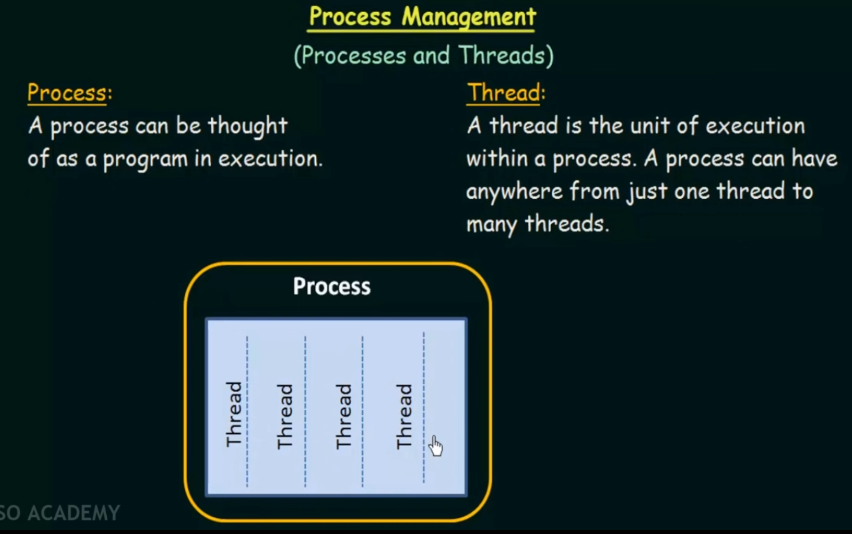

## Process State

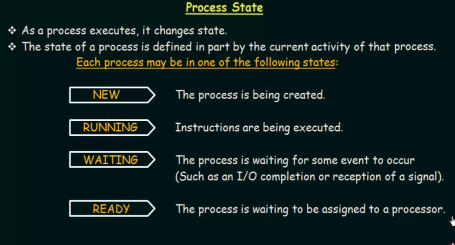

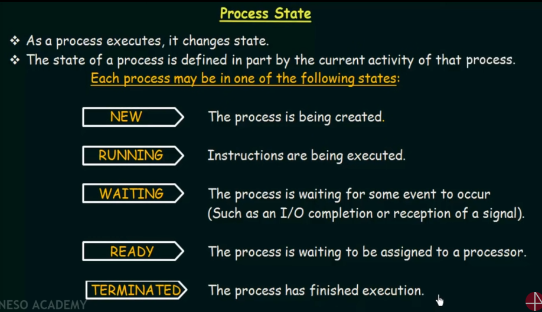

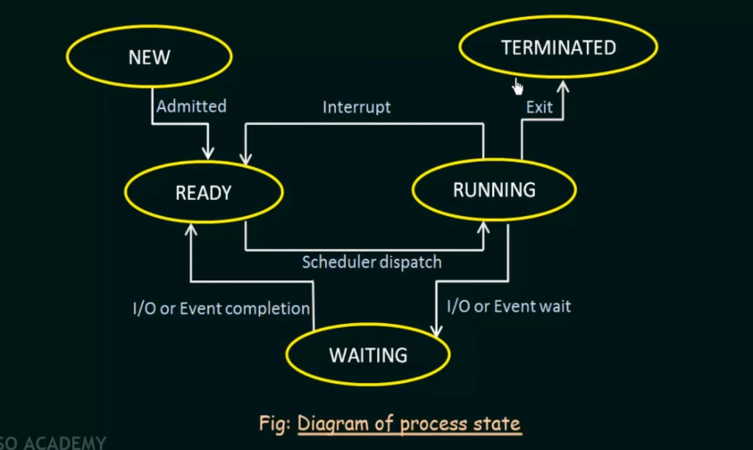

New -> Ready -> Running -> Waiting and Interrupt -> Ready -> Terminating

## Process Control Block

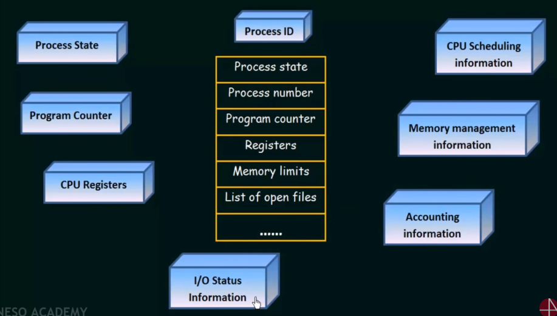

## Process Scheduling

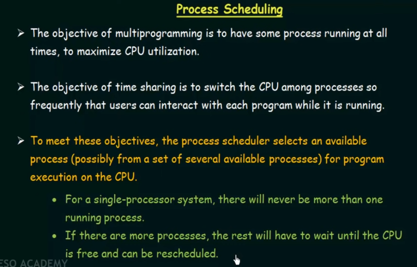

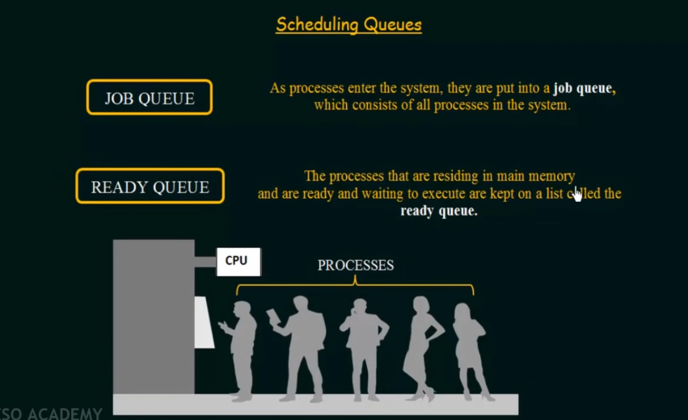

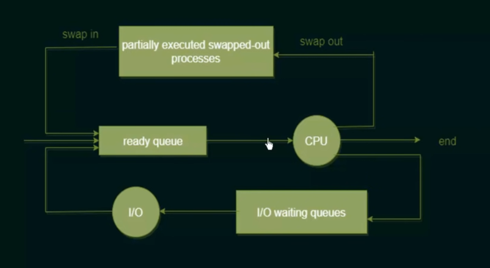

Partially executed processes are the processes which was interrupted because
of more important process occurs.

## Context Switch

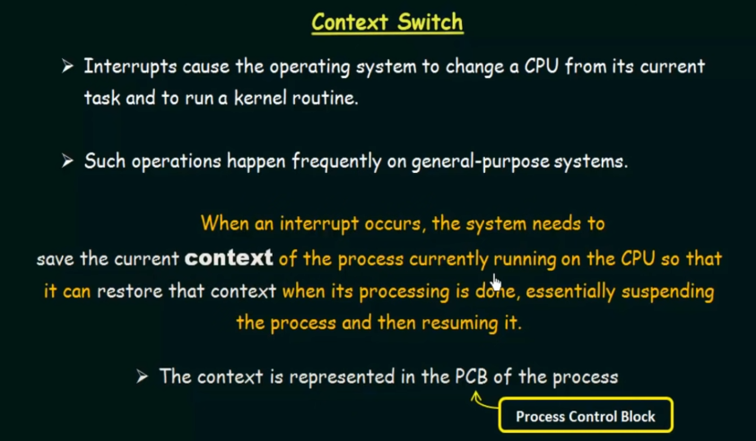

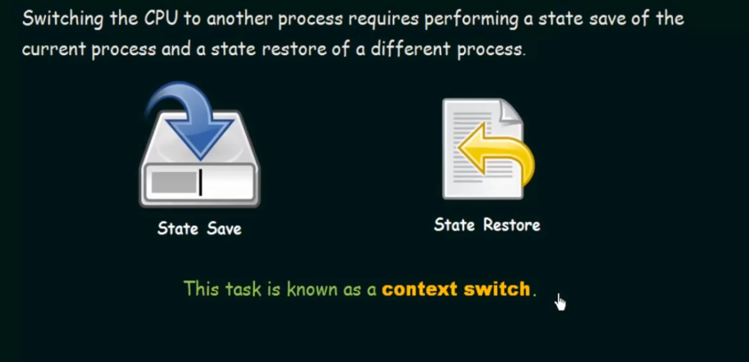

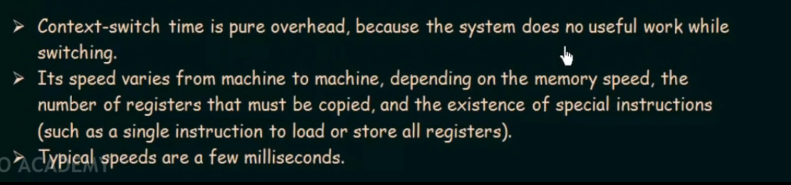

