# Variables

## Числа

Можно логически делить число при помощи разделителя

## Строки

## Операторы

## Ссылки 

Ссылка берется при помощи оператора /

Получение типа ссылки 

Разыменование ссылки

    Первый способ, берем ссылку и при помощи -> указываем что хотим получить.
    например здесь это индекс элемента из массива

    Второй способ при помощи ${} и обращение к элементам ссылки

    Оператор @{} рзыменовывает ссылку в списковом контексте.

## Массивы

Срез позволяет получить сразу какой-то диапазон значений

Методы массивов

Итерация через массив

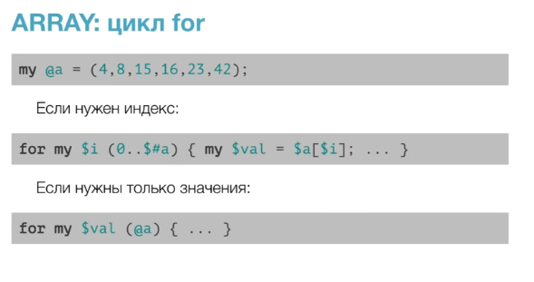

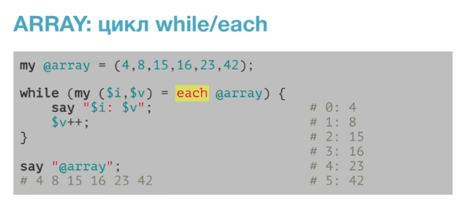

## HASH

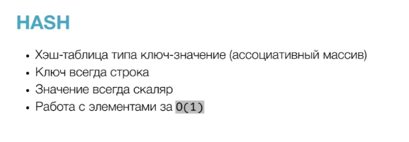

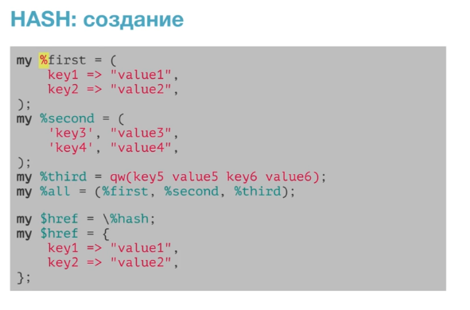

Надо учитывать что если мы создаем хеш при помощи оператора % то тогда создастся
именно хеш и значения перечисляются через круглые скобки, а вот если будем использовать
$ то это уже ссылка в которую мы положим анонимных хэш значения которого будут
перечисляться в фигурных скобках

### Жирная запятая

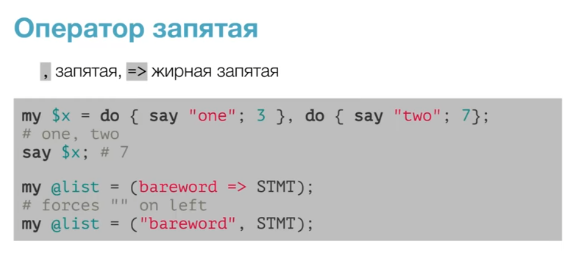

Создание хэша из массива

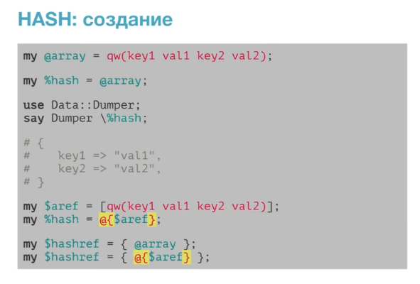

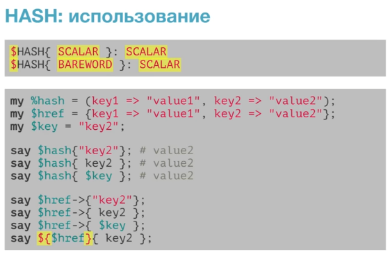

Операторы keys и values вернут ключи и значения всегда в одном порядке, хотя сам 
хэш не гарантирует хранение элементов и менно в этом порядке
 
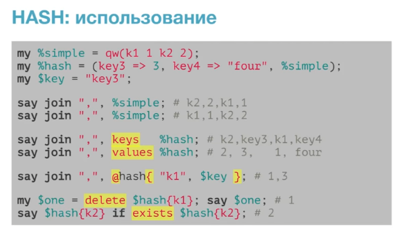

Итерация

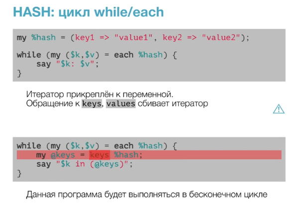

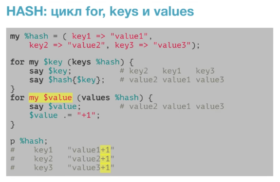

### Ошибки инициализации

Здесь они заключаются в том что используя на массиве, или хэше оператор контекста
(@, %) мы используем квадратные, или фигурные скобки которые конструируют ссылку на 
массив, или хэш и получается что в массиве вместо кучи элементов будет всего один, это 
ссылка на массив, и с хэшем то же самое.

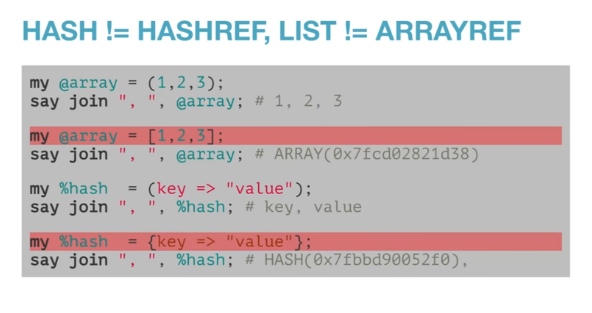

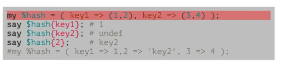

