# Variables

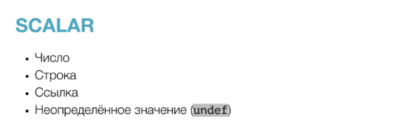

## Числа

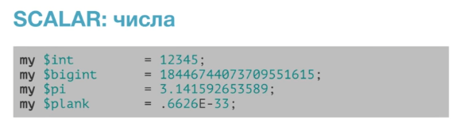

Можно логически делить число при помощи разделителя

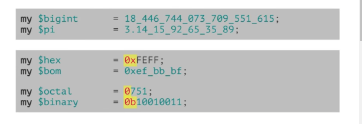

## Строки

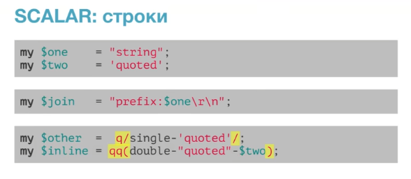

## Операторы

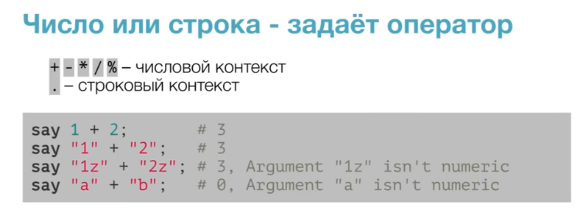

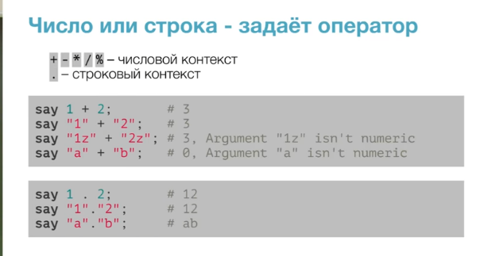

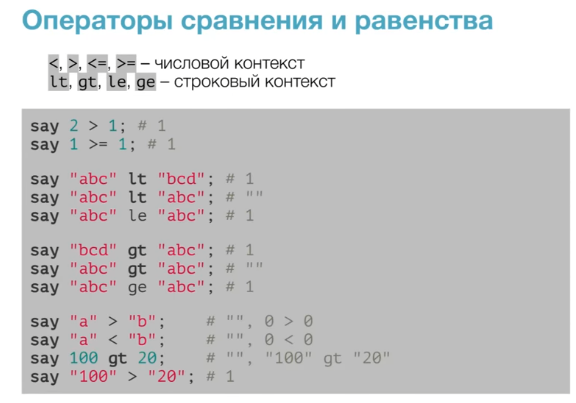

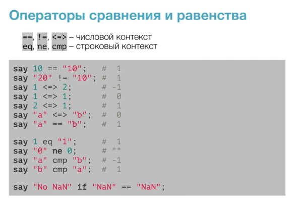

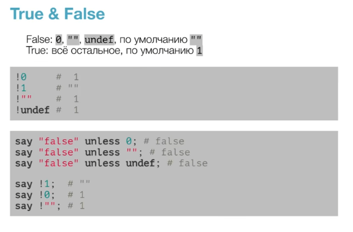

## Ссылки 

Ссылка берется при помощи оператора /

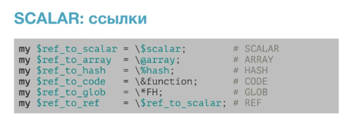

Получение типа ссылки 

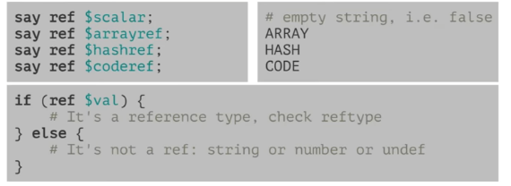

Разыменование ссылки

    Первый способ, берем ссылку и при помощи -> указываем что хотим получить.
    например здесь это индекс элемента из массива

    Второй способ при помощи ${} и обращение к элементам ссылки

    Оператор @{} рзыменовывает ссылку в списковом контексте.

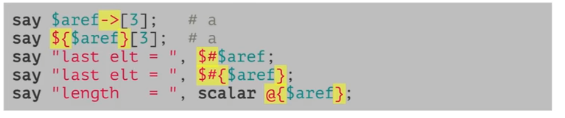

## Массивы

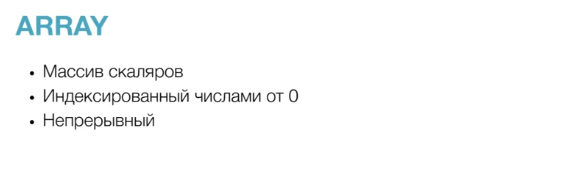

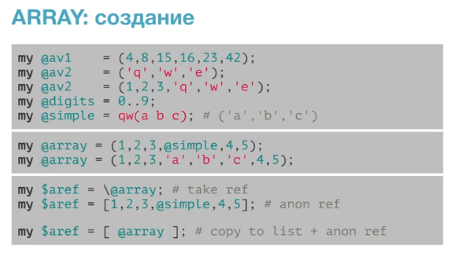

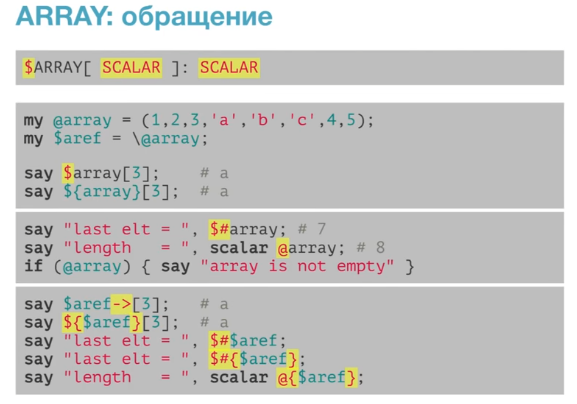

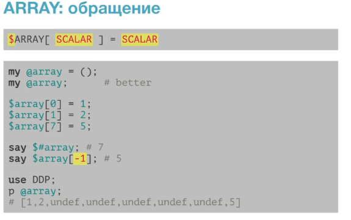

Срез позволяет получить сразу какой-то диапазон значений

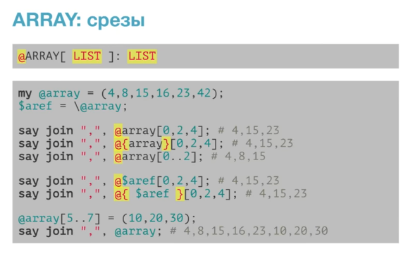

Методы массивов

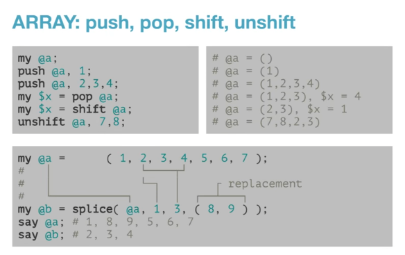

