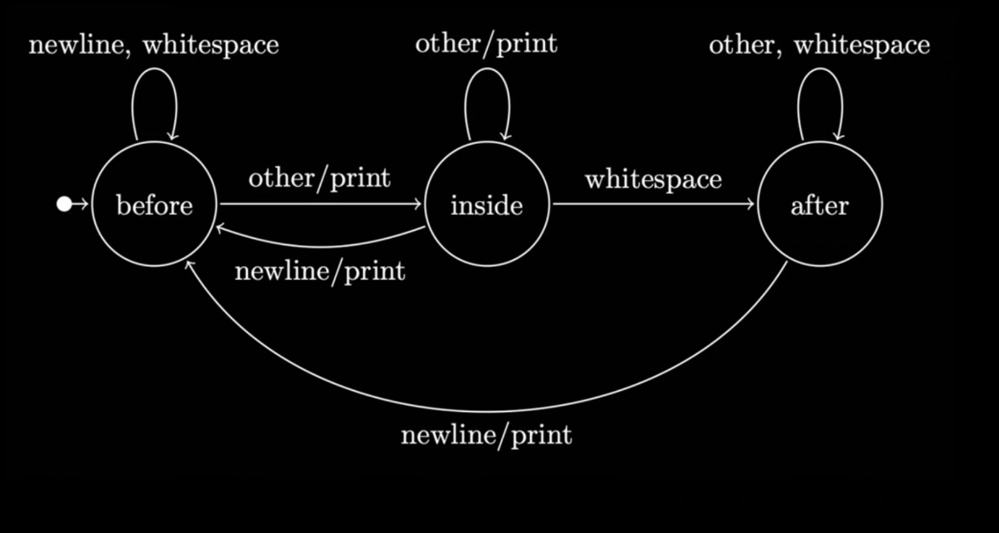
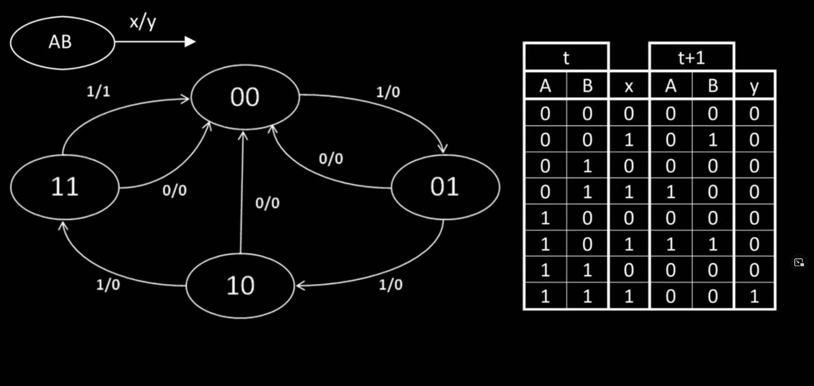
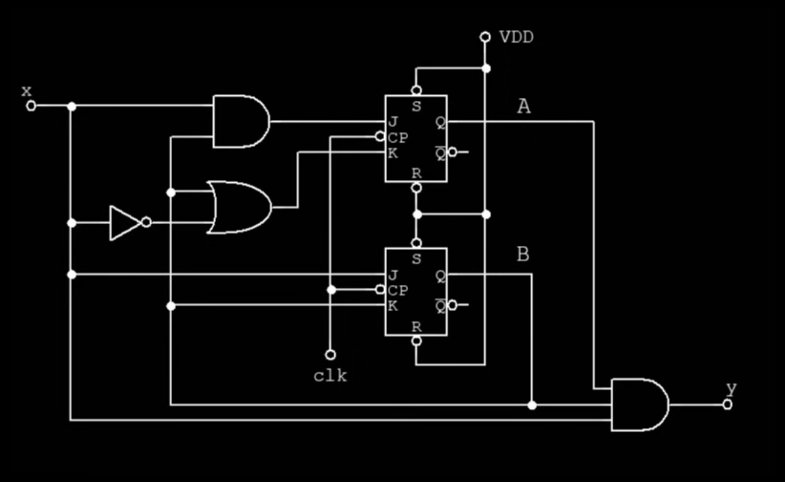
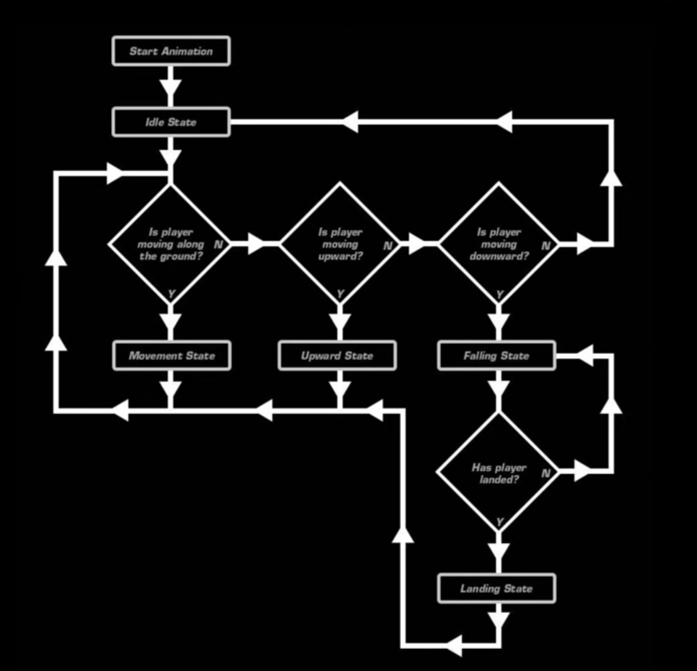
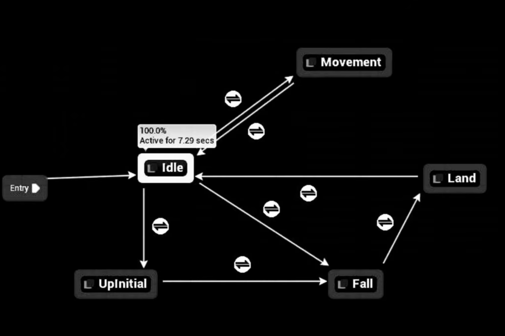
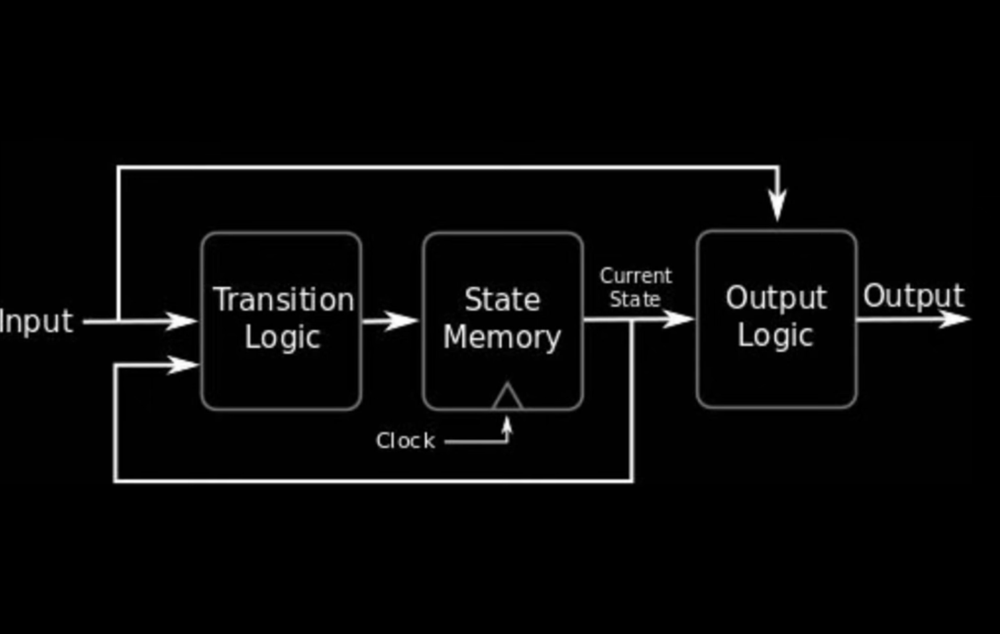

# Automata
Automata-based programming

Пример автомата
Это граф где над дугами мы пишем входящий или сходящий сигнал, или и то и то через слэш,
у нас есть входной алфавит, или набор входных символов, они приходят в систему и приводят к
переключению ее состояния. Следующее состояние зависит от входящего в каждый момент символа
и предыдущего состояния.

Пример автомата в виде таблицы.
t - текущее состояние, t+1 - следующее состояние.
X - входящий сигнал, Y - исходящий.

Автоматы могут быть преобразованы в схему для схемотехники
Предыдущему автомату соответствует вот такая схема.

Или можно изобразить автомат в виде схемы вот такой.

Тот же самый автомат в виде графа состояний, что куда понятнее.

Изобразим движок управляющий этим автоматов в стиле теории управления.
Наш автомат подставляется в State Memory. А Transition и Output Logic
сначала надо запрограммировать.

