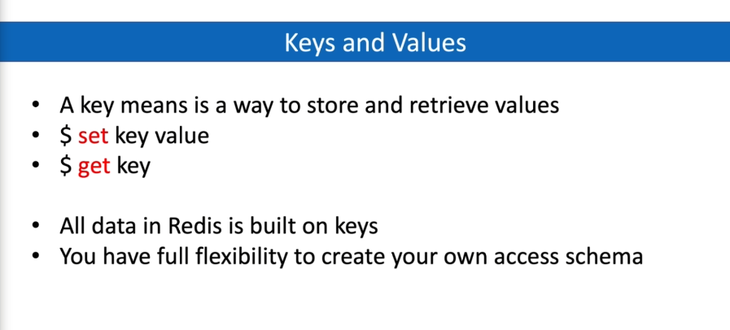

# Redis Data Management

## Keys and Values

e.g. 

    set testKey "testValue"
    get test Key

Delete key

    del testKey

Delete key async

    unlink key

With multiple keys

    del testKey1 testKey2 testKey3

Existing of a key
    
    exists testKey

    1 - true, 0 - false

Renaming key

    renamenx key_name new_name

Get type of key value

    type key_name

## Keys with expiration

Default expiration unit is seconds.

    ex - seconds

    set testKeyE "testValue" ex 120

    px - milliseconds

    set testKeyE "testValue" px 10000

Check the time to expiration

    ttl testKeyE

    -2 means that key is already expired.

Remove expiration from Key

    persist testKeyE

## How Redis handle Key Expirations

    Normal keys are created withor any exporations
        - set course redis
        - They key `course` will live forever

    For expired keys, Key expiration information is stored in Unix timestamp
    
    Keys are expired in two ways
        - Passive way - a key is passively expired simpl when some client 
          tries to access it.

        - Active way - Redis does 10 times per second:
            - Test 20 random keys from the set of keys with and associated expire.
            - Delete all the keys found expired.
            - If more than 25% of keys were expired, start again from step 1.

## Key Spaces 

In redis is similar to database namespaces schemas.

    This allows you to have same key name in multiple key spaces.

You can manage keys per each key spaces

To change key space write

    select key_space_index
        
Get all keys in keyspace

    keys *

Delete all keys from namespace

    flushdb

Key space index start with 0

We can not link keys with one space to another

## Keys naming convention

Create complex key name Object:id:additional_info

e.g.

    user:100 Aldoran

    user:101 Blayne_Mono

    user:10:friends University group

Max key size - 512 MB

Redis keys are binary safe - you can use any binary sequence as a key.

Empty string is also a valid key - not recommended

## Keys patterns matching

    * - matches everything with unlimited length
    
    ? - matches everything with but only length = 1 
    
    [ae] - matches length = 1, and only "a" or "e"

    [^e] - mathces length = 1, except "e"

    [a-b] - length = 1, from a to b

e.g.

    keys user:*

    keys user:[0-10000]:*

    keys user:[^100]

## Saving information on server

For saving info on server when shutdown

    shutdown save

or do not save 

    shutdown nosave
