# System Design интервью для Backend-разработчика: полный пайплайн

**Сквозной пример: высоконагруженный дашборд для отдела маркетинга «MarketingPulse»** — с обновлением данных по рекламе в реальном времени и асинхронным формированием отчётов.

> Это методичка-компаньон к главам 1–8 курса. Главы 1–2 дают базу (требования, монолит → микросервисы, масштабирование, API), глава 3 — продвинутый бэкенд (хвосты задержек, законы масштабирования, шардирование, распределённые транзакции, кеш), глава 5 — зоны ответственности бэкендера, глава 8 — структуру ответа. Здесь всё это собрано в **единый пошаговый сценарий**, который можно прогонять на реальной секции System Design — от первого уточняющего вопроса до low level design и каверзных вопросов в конце.

---

## Как устроен документ

Документ повторяет структуру ответа из главы 8 — **5 этапов интервью** — и наращивает на них продвинутый бэкенд-материал. Идём строго от общего к частному.

| #  | Раздел                                                                                  | Этап интервью    | Что на выходе                                                                    |
| -- | --------------------------------------------------------------------------------------------- | ---------------------------- | ------------------------------------------------------------------------------------------- |
| 0  | Введение: что оценивают и тайминг                                 | —                           | Модель поведения на секции, бюджет ~60 минут              |
| 1  | Этап 1. Сбор требований                                                     | Требования         | Функциональные + нефункциональные требования, scope |
| 2  | Этап 2. Расчёты нагрузки (Capacity Planning)                               | Расчёты               | RPS, объём данных, прикидка железа и стоимости           |
| 3  | Этап 3. Домены, модель данных и API                                    | Домены и API          | Список сервисов, ER-модель, контракты API и событий    |
| 4  | Этап 4. High Level Design                                                                 | High Level Design            | Архитектура целиком, data flow                                            |
| 5  | Этап 5A. LLD: real-time обновление данных по рекламе             | Low Level Design             | Kafka → стрим → ClickHouse → real-time push                                         |
| 6  | Этап 5B. LLD: формирование отчётов                                     | Low Level Design             | Async-генерация, очередь, воркеры, S3                                |
| 7  | Этап 5C. Кеширование, шардирование, консистентность | Low Level Design             | Многоуровневый кеш, партиционирование, eventual/strong    |
| 8  | Качества под нагрузкой                                                    | Вопросы в конце | Задержки, законы масштабирования, resilience, LB               |
| 9  | Observability, безопасность, trade-offs                                           | Вопросы в конце | Метрики, мульти-тенантность, размены и SLO/SLA              |
| 10 | Шпаргалка, ошибки и банк вопросов                                 | —                           | Чек-лист, частые ошибки, готовые ответы                     |

---

## Сквозной пример: «MarketingPulse»

**MarketingPulse** — мульти-тенантный B2B SaaS: высоконагруженный дашборд для отделов маркетинга и рекламных агентств. Агрегирует данные по рекламным кампаниям из внешних площадок (Google Ads, Meta Ads, Yandex Direct, VK Ads, TikTok Ads) и собственного трекинга (пиксель/постбэки: показы, клики, конверсии). Показывает метрики в реальном времени и формирует тяжёлые отчёты.

**Три ключевые оси задачи** (держим в фокусе весь разбор):

1. ⚡ **Высокая нагрузка** — firehose рекламных событий (средний поток 40k/с, пик 120k/с).
2. 📊 **Формирование отчётов** — тяжёлые отчёты со срезами, асинхронно.
3. 🔴 **Real-time** — обновление метрик по рекламе со свежестью ≤ 10 секунд.

### Канонические числа (единый источник правды на весь разбор)

| Параметр                                                   | Значение                                                                                                           |
| ------------------------------------------------------------------ | -------------------------------------------------------------------------------------------------------------------------- |
| Пользователи                                           | DAU 50 000, MAU 200 000; рост ×4 за 18 мес.                                                                      |
| Тенанты (организации)                            | ~5 000                                                                                                                     |
| Пиковая конкурентность real-time сессий | ~10 000 одновременных WS/SSE                                                                                  |
| Поток событий (ingestion)                              | средний 40 000/с, пик 120 000/с (×3), событие ~0.5 КБ                                                |
| Read-нагрузка дашборда                             | средняя ~150 QPS, пик ~800 QPS                                                                                   |
| Свежесть real-time метрик                            | end-to-end ≤ 10 c, цель p95 ≤ 5 c                                                                                    |
| Латентность API дашборда                        | p95 ≤ 200 мс, p99 ≤ 500 мс                                                                                           |
| Отчёты                                                       | большой отчёт асинхронно, цель ≤ 1–2 мин                                                    |
| Доступность                                             | дашборд SLA 99.9%, ingestion 99.95%                                                                                 |
| Консистентность                                     | аналитика — eventual; бюджеты/квоты — strong                                                        |
| Retention                                                          | детальные события 90 дней (ClickHouse), агрегаты 13–25 мес, сырьё в S3 — 2 года |
| События/сутки                                          | 40 000 × 86 400 ≈**3.46 млрд/сутки**                                                                      |
| Сырой объём/сутки                                   | ≈**1.73 ТБ/сутки** (3.46 млрд × 0.5 КБ)                                                               |
| Горячие 90 дней                                         | ~155 ТБ сырых → **~16–20 ТБ** в ClickHouse (сжатие 8–10×)                                             |

### Канонический стек

**Kafka** (firehose, replay) → **Go-консьюмеры** (стрим-агрегация) → **ClickHouse** (OLAP: детальные события + роллапы через Materialized Views) и **S3/MinIO** (сырьё, готовые отчёты). **PostgreSQL** (OLTP: тенанты, пользователи, метаданные кампаний, бюджеты, job'ы отчётов) + read-реплики. **Redis** (кеш предагрегатов, сессии, rate-limit, pub/sub для real-time fan-out). Доставка клиенту — **WebSocket** (основной) / **SSE** (упрощённый). Edge — внешний L7 LB (Nginx/Envoy) + CDN + API Gateway. Наблюдаемость — **Prometheus/Grafana, OpenTelemetry/Jaeger, Sentry, ELK**. Оркестрация — **Kubernetes + HPA**. Стиль данных — **Kappa** (единый стрим) + backfill из S3 (элемент Lambda).

> 💡 Стек выбран осознанно и под знакомые технологии — это защита от классической ошибки «назвал модное, но не смог объяснить». На интервью бери то, что реально можешь обосновать и сравнить с альтернативами.

---

## Введение. Как пользоваться пайплайном и что оценивают на SD-интервью

Эта методичка — практический пайплайн прохождения секции System Design для backend-разработчика уровня middle+/senior. Не теория ради теории, а пошаговый алгоритм: что говорить, что рисовать и как обосновывать на каждом этапе интервью. Чтобы не разговаривать абстракциями, мы ведём один сквозной пример — высоконагруженный дашборд маркетинга **MarketingPulse**. Через него мы пройдём весь путь: от сбора требований до low-level design.

Раздел вводный. Его задача — настроить тебя на правильный лад: объяснить, зачем backend-разработчику этот навык, что именно высматривает интервьюер, как вести себя в течение часа и как устроена остальная методичка. Конкретные расчёты, схемы данных и диаграммы компонентов — в следующих разделах.

> 🎯 Что сказать интервьюеру: «На System Design нет единственно верного ответа. Я буду рассуждать вслух, фиксировать на доске решения и trade-offs, и периодически сверяться с тобой — так мы вместе придём к системе, которая решает именно поставленную задачу». Эта фраза сразу задаёт правильный формат: диалог, а не монолог.

---

### Зачем backend-разработчику System Design

Системный дизайн для backend-инженера — это не абстракция из статей, а практический навык, от которого напрямую зависят масштабируемость, надёжность и безопасность продукта. Если фронтенд отвечает за интерфейс, а мобильная разработка — за работу на устройстве, то backend формирует фундамент: обработку данных, бизнес-логику, интеграции и инфраструктуру под нагрузкой.

Цена ошибки здесь долгосрочная и дорогая:

- неудачная схема БД может тормозить систему годами — из-за одного решения на старте;
- неэффективный API становится узким местом для всех пользователей сразу;
- недооценённая нагрузка или отсутствие ограниченного режима работы при сбое (как в известном падении Slack) превращается в часы downtime и прямые потери денег.

Именно поэтому в MAANG и в большинстве бигтеха секция System Design вынесена отдельным этапом наряду с кодингом и поведенческим интервью. И чем выше грейд, тем больше доля вопросов на проектирование.

#### Четыре зоны ответственности backend-разработчика

На интервью держи в голове, что тебя оценивают именно в этих четырёх зонах. Это твоя «карта компетенций» — к ней привязаны и вопросы интервьюера, и наша методичка.

| Зона                                                   | За что отвечаешь                                                                                                                                                                         | Проверочный вопрос себе                                                                                | Где в MarketingPulse                                                                                                                                                              |
| ---------------------------------------------------------- | ------------------------------------------------------------------------------------------------------------------------------------------------------------------------------------------------------ | --------------------------------------------------------------------------------------------------------------------------- | ------------------------------------------------------------------------------------------------------------------------------------------------------------------------------------- |
| **Данные и хранилища**               | Где и как хранятся данные, схемы БД, выбор SQL/NoSQL/OLAP, индексы, шардинг, партиционирование, миграции, retention            | «Что будет, если база внезапно упадёт?»                                                     | OLTP в PostgreSQL (tenants, users, ad_accounts, campaigns), OLAP в ClickHouse (события, роллапы), S3 для сырых событий и отчётов               |
| **API и интеграции**                      | Как сервисы общаются снаружи и между собой; REST/GraphQL/gRPC; версионирование; обработка ошибок сторонних сервисов | «Что будет, если внешний сервис ответит с задержкой или таймаутом?» | Ingestion API для потока событий; интеграции с площадками (OAuth, pull агрегатов); API дашборда; WebSocket/SSE для real-time |
| **Бизнес-логика**                        | Превращение требований в код, валидация, идемпотентность, крайние случаи (дубликаты, частичные сбои)               | «Что будет, если клиент пришлёт один и тот же запрос дважды?»              | Подсчёт метрик (CTR, CPC, CPM, CR, ROAS), правила алертов, мульти-тенантная изоляция                                                |
| **Инфраструктура и нагрузка** | Проектирование под нагрузку, кэширование, мониторинг, CI/CD, отказоустойчивость, масштабирование                        | «Как система переживёт пик ×3 без падения?»                                              | Kafka-firehose, HPA в Kubernetes, Redis cluster, backpressure при пиках до 120 000 событий/с                                                                       |

> ⚠️ Частая ошибка: уходить только в свою привычную зону (например, рассказать про идеальную схему БД и забыть про нагрузку и наблюдаемость). Senior должен покрыть все четыре зоны хотя бы верхнеуровнево, а вглубь идти по запросу интервьюера.

---

### Что именно оценивает интервьюер

Главное на этой секции — не «красивая картинка», а то, **как ты приходишь к решению**. Интервьюер смотрит на пять вещей.

1. **Системное мышление.** Видишь ли ты общую картину и взаимодействие компонентов? Думаешь ли про сбои и крайние случаи, а не только про happy path?
2. **Моделирование данных.** Умеешь ли проектировать схемы под конкретные запросы и рост нагрузки, выбирать подходящий тип хранилища (реляционка, колоночная OLAP, key-value, объектное), объяснять шардинг и партиционирование?
3. **Масштабируемость.** Знаешь ли типичные узкие места (CPU/memory/IO/network-bound), умеешь ли проектировать горизонтально масштабируемые stateless-решения, понимаешь ли разницу между средней и пиковой нагрузкой?
4. **Практичность.** Можешь ли обосновать выбор технологий, учесть эксплуатационные риски и стоимость, и при этом **не строить космолёт**?
5. **Умение проговаривать trade-offs.** Понимаешь ли, что у любого решения есть цена, и можешь ли вслух сравнить альтернативы (быстрее на запрос против больше запросов одновременно; strong против eventual consistency; монолит против микросервисов)?

> 🎯 Что сказать интервьюеру: интервьюеру важно увидеть, что ты не просто знаешь инструменты, а умеешь рассуждать и объяснять решения. Поэтому каждое архитектурное решение проговаривай по шаблону: «вариант A против варианта B → выбираю A, потому что … → плачу за это тем-то».

---

### Пять главных принципов поведения на секции

Это пять правил, которые отделяют сильное выступление от слабого. Они работают сквозь все этапы.

#### 1. Веди диалог и задавай уточняющие вопросы

На этой секции вопросы задаёшь **ты**. Особенно в начале: объём данных, требования к консистентности, SLA, пиковая нагрузка, ограничения по бюджету и срокам. Это показывает, что ты смотришь на задачу комплексно и не бежишь кодить, не поняв, что и для кого делаешь. Сверяйся с интервьюером на ключевых развилках — это не слабость, а признак зрелости.

#### 2. Иди от общего к частному

Сначала верхнеуровневая картина (HLD), потом детали компонентов (LLD). Сохраняй общую картину в голове и не проваливайся в реализацию отдельной таблицы, пока не нарисована вся система. Самый простой и безопасный способ начать рисовать архитектуру — **от пользователя**.

#### 3. Всегда проговаривай trade-offs

Не давай решение как факт — давай его как выбор. «Можно Kafka, можно RabbitMQ; беру Kafka, потому что нужен firehose с партиционированием, replay и ретеншеном под 40–120 тыс. событий/с — за это плачу более сложной эксплуатацией». Trade-off, проговорённый вслух, ценится выше, чем «правильный» ответ без объяснения.

> ⚖️ Trade-off: фундаментальный компромисс почти любой системы — оптимизировать под минимальную задержку **одного** запроса или под обработку **огромного количества** запросов одновременно. В MarketingPulse мы сознательно жертвуем мгновенной строгой консистентностью аналитики (она eventual, расхождение в секунды допустимо) ради пропускной способности ingestion — но бюджеты и квоты держим strong.

#### 4. Не строй космолёт и держись scope

Предлагай **минимально достаточное** решение под требования. Не нужно 30 компонентов, 10 микросервисов и 5 баз, если задача решается проще. Явно отмечай, когда усложнение НЕ нужно. И держи границы: выписывай домены, которые входят в задачу, и вычёркивай те, что не входят. В MarketingPulse мы сразу отрезаем из scope биддинг/закупку рекламы, ML-атрибуцию конверсий, биллинг самих площадок и антифрод — упоминаем их как отдельные системы, но не проектируем.

> ⚠️ Частая ошибка: «строительство космолёта» — попытка рассказать всё, что знаешь, расширить систему за границы задачи и за час спроектировать сервис, который перевернёт мир. У бизнеса нет триллионов на инфраструктуру: он хочет, чтобы система работала и приносила деньги. Порядок стоимости MarketingPulse — единицы–десятки тысяч $/мес, и это нормально держать в уме.

#### 5. Помни про продуктовые метрики

От senior ожидают мышления в терминах бизнеса, а не только своего куска кода. DAU/MAU нужны не «для галочки» — из них считается RPS и масштаб. Продуктовые метрики продукта (для MarketingPulse это impressions, clicks, spend, CTR, CPC, CPM, conversions, CR, **ROAS**) определяют, что вообще должна показывать система и какие агрегаты считать. Разработчик, который понимает, как технические решения влияют на DAU, retention и ROAS, ценится намного выше.

> ⚠️ Частая ошибка: «требования ради требований». Спросить «сколько пользователей через N лет» и оставить число мёртвым грузом в графе требований. Каждое запрошенное число должно дальше **работать** в расчётах — иначе вопрос был лишним.

---

### Тайминг: как уложиться в ~60 минут

Секция почти всегда ограничена примерно часом. Без структуры время утекает на болтовню в начале, и ты не успеваешь дорисовать систему. Держи в голове грубый бюджет времени по пяти этапам — это не жёсткий регламент, а ориентир, чтобы не залипнуть.

| #  | Этап                                                                                         | Время | Что на выходе                                                                                                                     | Главный риск                                                            |
| -- | ------------------------------------------------------------------------------------------------ | ---------- | -------------------------------------------------------------------------------------------------------------------------------------------- | ---------------------------------------------------------------------------------- |
| 1  | **Требования** (функциональные + нефункциональные) | ~10 мин | Зафиксированный scope, числа: DAU/MAU, пик, объёмы, SLA, консистентность                         | Уйти в детали реализации; не спросить про пик |
| 2  | **Расчёты** (back-of-the-envelope)                                                  | ~7 мин  | RPS/QPS, объёмы хранения, пиковый трафик записи, порядок инфраструктуры                | Гнаться за точностью вместо порядка величин  |
| 3  | **Домены и API**                                                                    | ~10 мин | Список сущностей и связей, что вне scope, контракты API по доменам                             | Описать всё; не вычеркнуть ненужное                  |
| 4  | **High Level Design**                                                                      | ~15 мин | Цельная верхнеуровневая схема «от пользователя», подписанные стрелки            | Провалиться в детали одного компонента           |
| 5  | **Low Level Design**                                                                       | ~13 мин | Детали ключевых компонентов: схемы таблиц, индексы, шардинг, обработка пиков | Молча рисовать без проговаривания trade-offs         |
| — | **Вопросы интервьюера**                                                  | ~5 мин  | Ответы про отказоустойчивость, масштабируемость, безопасность                         | —                                                                                 |

> 🎯 Что сказать интервьюеру: в начале честно проговори план — «Предлагаю двигаться так: требования, прикидочные расчёты, домены и API, верхнеуровневая схема, потом детализация. Если хочешь сместить акцент — скажи». Это сразу демонстрирует структуру и даёт интервьюеру направить фокус на интересную ему зону.

К пятому этапу, если ты честно прошёл предыдущие, вопросы про стабильность и масштабируемость уже не должны смущать: всё нужное уже на доске.

---

### Сквозной пример: MarketingPulse и три оси задачи

**MarketingPulse** — мульти-тенантный B2B SaaS: высоконагруженный дашборд для отделов маркетинга и рекламных агентств. Он агрегирует данные по рекламным кампаниям из внешних площадок (Google Ads, Meta Ads, Yandex Direct, VK Ads, TikTok Ads) и из собственного трекинга (пиксель/постбэки: показы, клики, конверсии). Показывает метрики в реальном времени и формирует тяжёлые отчёты.

Чтобы не утонуть в функционале, мы всё время держим в фокусе **три ключевые оси задачи** — именно вокруг них строится вся архитектура:

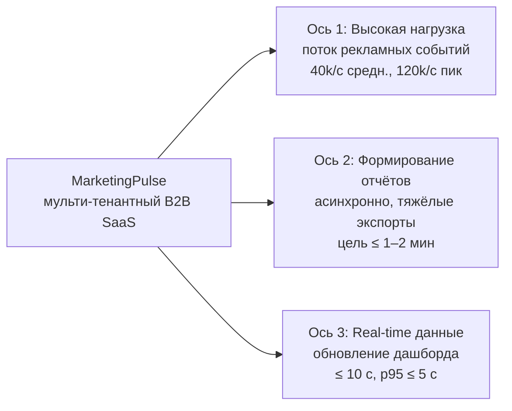

Ключевые канон-числа, на которые мы будем опираться во всех разделах (подробный разбор и расчёты — в разделах про требования и оценку нагрузки):

- **Пользователи:** DAU 50 000 маркетологов, MAU 200 000; прогноз роста ×4 за 18 месяцев. Tenants (организаций) — ~5 000.
- **Real-time сессии:** пиковая конкурентность ~10 000 одновременных WebSocket/SSE-сессий.
- **Ingestion событий:** средний поток 40 000 событий/с, пик 120 000 событий/с (peak factor ×3), размер события ~0.5 КБ.
- **Read-нагрузка дашборда:** средняя ~150 QPS, пик ~800 QPS (помимо real-time push).
- **Свежесть метрик:** end-to-end ≤ 10 c, цель p95 ≤ 5 c.
- **Латентность API дашборда:** p95 ≤ 200 мс, p99 ≤ 500 мс (по предагрегатам/кешу).
- **Доступность:** чтение дашборда SLA 99.9%, ingestion 99.95%.
- **Консистентность:** аналитика — eventual; бюджеты/квоты/биллинг — strong.
- **Профиль нагрузки:** запись доминирует (write-heavy ingestion), чтение — тяжёлое аналитическое.

Профиль продукта диктует выбор стека (обоснование — в соответствующих разделах): **Kafka** как firehose для потока событий, **ClickHouse** как OLAP-хранилище для быстрых агрегатов, **PostgreSQL** для OLTP-метаданных и strong-данных, **Redis cluster** для предагрегатов/сессий/rate-limit и pub/sub-фанаута, **S3/MinIO** для сырых событий и готовых отчётов. Real-time доставка клиенту — **WebSocket** (основной) или **SSE** (упрощённый односторонний). Высоконагруженный ingestion/stream пишем на **Go**, прикладные API/отчёты — на **Python/FastAPI**.

> 🎯 Что сказать интервьюеру: «Это write-heavy система: поток событий доминирует над чтением. Поэтому центральное решение — стрим Kafka → ClickHouse (стиль, близкий к Kappa), с возможностью backfill из S3 для пересчёта истории. Дашборд читает не сырые события, а предагрегаты — отсюда жёсткая латентность p95 ≤ 200 мс».

---

### Мини-навигация по методичке

Методичка повторяет логику самого интервью: каждый раздел соответствует этапу пайплайна или ключевой инженерной теме. Вот за что отвечает каждый из разделов 1–10.

| #  | Раздел                                                                               | За что отвечает                                                                                                                                                                                                  |
| -- | ------------------------------------------------------------------------------------------ | ----------------------------------------------------------------------------------------------------------------------------------------------------------------------------------------------------------------------------- |
| 1  | **Сбор требований**                                                    | Функциональные и нефункциональные требования MarketingPulse; какие вопросы задавать интервьюеру и зачем; фиксация scope и out of scope |
| 2  | **Оценка нагрузки и расчёты**                                  | Back-of-the-envelope: RPS/QPS, события/сутки, объёмы хранения, пиковый трафик записи, закон Литтла, порядок инфраструктуры                       |
| 3  | **Домены и API**                                                              | Сущности и связи; контракты ingestion API, API дашборда, отчётов и интеграций; выбор REST/WebSocket/SSE                                                                 |
| 4  | **High Level Design**                                                                | Цельная верхнеуровневая архитектура: edge → ingestion → Kafka → stream → ClickHouse/Postgres/Redis → real-time доставка                                                         |
| 5  | **Поток событий и обработка (write-path)**                     | Ingestion на Go, Kafka (партиционирование, replay), консьюмеры, Materialized Views и роллапы в ClickHouse, идемпотентность, backpressure                                 |
| 6  | **Хранение данных**                                                    | Раскладка по хранилищам: OLTP/OLAP/кеш/объектное; retention (90 дней горячих, агрегаты 13–25 мес, S3 2 года); шардинг и репликация              |
| 7  | **Real-time дашборд (read-path)**                                             | Предагрегаты в Redis, API дашборда под p95 ≤ 200 мс, real-time доставка через WebSocket/SSE и fan-out через Redis pub/sub                                                       |
| 8  | **Асинхронные отчёты**                                              | Очередь задач, пул воркеров, статус job в Postgres, результат в S3 + signed URL, отчёты по расписанию, цель ≤ 1–2 мин                                      |
| 9  | **Масштабирование, надёжность, наблюдаемость** | HPA в Kubernetes, балансировка L4/L7, graceful degradation, circuit breaker, bulkhead; Prometheus/Grafana, OpenTelemetry/Jaeger, Sentry, ELK                                                                     |
| 10 | **Безопасность, мульти-тенантность и итог**        | OAuth-интеграции, роли owner/admin/editor/viewer, изоляция тенантов, rate-limit; финальный прогон системы и ответы на вопросы интервьюера      |

> Разделы можно читать подряд или выборочно под слабые места. Если тема пересекается с соседним разделом — мы не дублируем её, а ссылаемся словами «подробнее в разделе про …».

---

### Карта интервью: пять этапов и их результаты

Итоговая «карта» секции. Держи её перед глазами: она показывает поток этапов и что должно быть **на выходе** каждого. Если очередной этап не дал своего результата — на нём нельзя двигаться дальше.

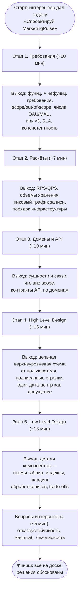

> 🎯 Что сказать интервьюеру: проговаривай переход между этапами вслух — «Требования зафиксировали, перехожу к прикидочным расчётам». Это держит и тебя, и интервьюера в общей системе координат и не даёт незаметно соскользнуть в реализацию раньше времени.

С этой картой и пятью принципами поведения переходим к первому этапу — **сбору требований** для MarketingPulse.

---

## Этап 1. Сбор требований

Системный дизайн начинается не с архитектуры и не с выбора технологий, а со сбора требований. На этом этапе **вопросы задаёт кандидат**, а не интервьюер. Формулировка «Спроектируй высоконагруженный дашборд для маркетинга» — это намеренно расплывчатый запрос. Интервьюер проверяет в первую очередь не то, знаешь ли ты Kafka и ClickHouse, а умеешь ли ты *превратить «хотелку» бизнеса в формализованные требования* и понимаешь ли, как разные ответы меняют архитектуру.

Цель этапа — получить три вещи:

1. **Функциональные требования (ФТ)** — что система делает.
2. **Нефункциональные требования (НФТ)** — как система это делает (масштаб, латентность, доступность, консистентность, retention).
3. **Границы (scope / out-of-scope)** — что мы проектируем, а что сознательно отрезаем.

> 🎯 Что сказать интервьюеру: «Прежде чем рисовать боксы, я задам несколько уточняющих вопросов, чтобы зафиксировать функциональные и нефункциональные требования и границы задачи. От ответов напрямую зависит архитектура — например, нужен ли нам отдельный стрим-контур или хватит ночного батча.»

> ⚠️ Частая ошибка: сразу начать рисовать Kafka и микросервисы, не уточнив масштаб и свежесть данных. Это сигнал middle-минус: кандидат «строит космолёт» вслепую. Senior сначала фиксирует требования, потом подбирает минимально достаточное решение под них.

### Логика этапа

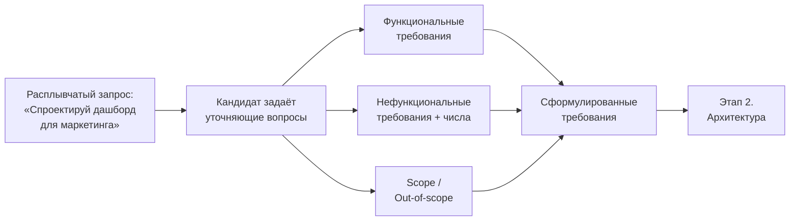

### Уточняющие вопросы: «зачем» и «как влияет на архитектуру»

Хороший вопрос — это не любопытство, а инструмент: каждый ответ должен *двигать* какое-то архитектурное решение. Ниже — блок вопросов под MarketingPulse. Колонка «как влияет» показывает развилку, которую этот ответ закрывает.

| #  | Вопрос интервьюеру                                                                                                                                                               | Зачем спрашиваем                                                                 | Как влияет на архитектуру                                                                                                                                                                                                                                                                                                                                |
| -- | ------------------------------------------------------------------------------------------------------------------------------------------------------------------------------------------------- | ----------------------------------------------------------------------------------------------- | ------------------------------------------------------------------------------------------------------------------------------------------------------------------------------------------------------------------------------------------------------------------------------------------------------------------------------------------------------------------------------ |
| 1  | «Какой масштаб? Сколько активных пользователей и организаций, какой прогноз роста?»                                        | Понять класс системы и заложить запас                           | DAU 50k / MAU 200k, ~5000 тенантов, рост ×4 за 18 мес → горизонтально масштабируемый stateless-слой, мульти-тенантная изоляция с самого начала, не монолит-on-one-box                                                                                                           |
| 2  | «Метрики нужны в реальном времени или достаточно периодического обновления? Какая допустимая свежесть?» | Главная развилка: стрим vs батч                                         | Свежесть ≤ 10 c (p95 ≤ 5 c) → нужен потоковый контур (Kafka → консьюмеры → ClickHouse), а не ночной cron. Если бы сказали «к утру» — хватило бы батча                                                                                                                                   |
| 3  | «Какой поток событий: средний и пиковый? Размер одного события?»                                                                             | Capacity planning ingestion                                                                     | 40k ev/s avg, 120k ev/s peak (×3), ~0.5 КБ → ≈60 МБ/с в пике; обычная OLTP-БД не примет такой write, нужен буфер-стрим (Kafka) и колоночная OLAP (ClickHouse)                                                                                                                                                     |
| 4  | «Какая read-нагрузка на аналитику помимо real-time push?»                                                                                                         | Отделить тяжёлое чтение от записи                                  | ~150 QPS avg, ~800 QPS peak; по закону Литтла при p95=200 мс это ≈160 запросов «в полёте» → нужен предагрегат + кеш (Redis), read-реплики                                                                                                                                                                   |
| 5  | «Какие отчёты нужны: лёгкие на лету или тяжёлые за период? Допустимое время формирования?»                             | Понять, нужен ли асинхронный контур                               | Большой отчёт за период ≤ 1–2 мин асинхронно → очередь + пул воркеров + результат в S3 + signed URL. Маленькие — синхронно из предагрегатов                                                                                                                                  |
| 6  | «Сколько одновременных real-time сессий на дашборде?»                                                                                                       | Спроектировать fan-out                                                            | ~10 000 одновременных WebSocket/SSE-сессий → выделенный Realtime-Gateway (4–8 нод) + fan-out через Redis pub/sub                                                                                                                                                                                                                        |
| 7  | «Сколько хранить данные? Детальные события, агрегаты, сырьё?»                                                                                  | Retention и стоимость хранения                                                | Горячие события 90 дней в ClickHouse, агрегаты 13–25 мес, сырьё в S3 2 года → tiered storage, TTL-политики, холодный backfill из S3                                                                                                                                                                                |
| 8  | «Какие SLA по доступности? Что критичнее — чтение дашборда или приём событий?»                                                      | Приоритизация надёжности                                                 | Дашборд 99.9%, ingestion 99.95% → ingestion не должен терять события даже при сбое аналитики; разрыв через буфер Kafka                                                                                                                                                                                        |
| 9  | «Где нужна строгая консистентность, а где допустим eventual?»                                                                                         | Выбор моделей хранения                                                      | Аналитика — eventual (расхождение в секунды ок); бюджеты/квоты/биллинг — strong → PostgreSQL (ACID) для денег, ClickHouse (eventual) для метрик                                                                                                                                                           |
| 10 | «Какие ограничения по бюджету и команде? Есть ли экспертиза по конкретному стеку?»                                           | Реалистичность и защита от «незнакомой технологии» | Порядок стоимости — единицы–десятки тысяч $/мес. Берём знакомый команде стек (Go для ingestion, Python/FastAPI для прикладного) и обосновываем — это сознательная защита от ошибки «взял технологию, которую не знаю» |

> ⚖️ Trade-off: чем больше вопросов задашь — тем точнее решение, но интервью ограничено по времени. Не уходи в бесконечное уточнение. Достаточно закрыть три ключевые оси задачи (нагрузка, отчёты, real-time) и зафиксировать числа. Остальное проговаривай как допущения: «Предположу, что мульти-тенантность по логике, а не по железу на тенанта — если не так, поправьте».

#### Как разные ответы меняют решение: главная развилка «real-time vs батч»

Это калька на пример из главы 4 про «отчёт к утру vs отчёт в реальном времени». Там одно НФТ про актуальность данных полностью меняло технологический стек. Покажем то же самое на MarketingPulse — и объясним, почему у нас не «или-или», а **гибрид**.

| Критерий                         | Вариант А: «Сводка к утру» 🌅                                                                           | Вариант Б: «Метрики в реальном времени» ⚡                                                                |
| ---------------------------------------- | ---------------------------------------------------------------------------------------------------------------------------- | ------------------------------------------------------------------------------------------------------------------------------------------ |
| НФТ по свежести             | Данные могут отставать на сутки                                                                   | Данные отстают ≤ 10 c (цель p95 ≤ 5 c)                                                                                  |
| Подход                             | Пакетная обработка: ночной job собирает агрегаты                                      | Потоковая обработка: событие считается сразу при поступлении                          |
| Принцип работы              | Ночью скрипт собирает события за день, считает агрегаты, кладёт в БД | Событие → Kafka → консьюмер → инсерт в ClickHouse → роллап в Materialized View → push в дашборд |
| Ключевые технологии    | PostgreSQL/MySQL + SQL-скрипт + планировщик (cron)                                                          | Kafka + стрим-консьюмеры (Go) + ClickHouse + Redis + WebSocket/SSE                                                          |
| Сложность и стоимость | Низкая, силами обычных разработчиков                                                         | Высокая: нужен стрим-контур, OLAP, fan-out, отдельная инфраструктура                         |
| Подходит для                  | Стратегического анализа истории                                                                 | Онлайн-мониторинга расхода и реакции на падение CTR                                               |

**Почему у MarketingPulse именно гибрид, а не один из вариантов?**

Потому что в продукте сосуществуют две принципиально разные потребности, и насильно сводить их к одному подходу — ошибка:

1. **Real-time метрики дашборда** (impressions, clicks, spend, CTR, CPC, CPM, conversions, CR, ROAS) — маркетолог следит за расходом бюджета и должен увидеть аномалию за секунды, а не утром. Это требует **потокового контура** (Вариант Б). Тянуть это батчем нельзя: будет поздно реагировать на перерасход.
2. **Тяжёлые отчёты за период** (CSV/XLSX/PDF, отчёты по расписанию) — это сканы по миллиардам строк за месяцы, экспорт, форматирование. Делать их синхронно «на лету» бессмысленно и опасно: один тяжёлый отчёт может положить интерактивный дашборд. Это требует **асинхронного контура** (по духу — Вариант А, но по запросу): очередь + воркеры + результат в S3, статус job в Postgres, цель ≤ 1–2 мин.

> 🎯 Что сказать интервьюеру: «Это не "или real-time, или батч". Это две оси нагрузки в одном продукте. Real-time метрики идут через стрим (Kafka → ClickHouse → push), тяжёлые отчёты — через асинхронную очередь и пул воркеров с выгрузкой в S3. Я сознательно разделяю эти контуры, чтобы тяжёлый отчёт не убивал интерактивный дашборд.»

> ⚖️ Trade-off: гибрид дороже и сложнее, чем чистый батч, но дешевле и проще, чем пытаться отдавать тяжёлые отчёты тем же путём, что и real-time метрики. Это и есть «минимально достаточное» решение под три оси задачи: высокая нагрузка на запись, асинхронные отчёты, real-time обновление.

### Функциональные требования MarketingPulse

Применяем **декомпозицию по бизнес-возможностям** (Decomposition by Business Capability из главы 4): разбиваем продукт на ключевые возможности, каждая из которых станет зоной ответственности сервиса/компонента на этапе архитектуры.

**Продукт:** MarketingPulse — мульти-тенантный B2B SaaS, высоконагруженный дашборд для отделов маркетинга и рекламных агентств. Агрегирует данные по рекламным кампаниям из внешних площадок (Google Ads, Meta Ads, Yandex Direct, VK Ads, TikTok Ads) и собственного трекинга (пиксель/постбэки: показы, клики, конверсии). Показывает метрики в реальном времени и формирует тяжёлые отчёты.

| # | Бизнес-возможность                                         | Декомпозиция (что входит)                                                                                                                                                                                                                                  |
| - | --------------------------------------------------------------------------- | ------------------------------------------------------------------------------------------------------------------------------------------------------------------------------------------------------------------------------------------------------------------------------- |
| 1 | **Интеграции с рекламными площадками** | Подключение рекламных аккаунтов через OAuth; периодический pull агрегатов расхода/показов из API площадок (Google/Meta/Yandex/VK/TikTok); нормализация в единую модель |
| 2 | **Приём real-time потока событий (ingestion)**      | Ingestion API для собственного трекинга: impression / click / conversion через пиксель и постбэки; приём при потоке 40k–120k ev/s                                                                                    |
| 3 | **Real-time дашборд**                                          | Отображение метрик: impressions, clicks, spend, CTR, CPC, CPM, conversions, CR, ROAS; обновление ≤ ~5–10 c                                                                                                                                         |
| 4 | **Срезы и фильтры**                                      | Разрезы по: кампания, площадка/канал, гео, устройство, период                                                                                                                                                                  |
| 5 | **Формирование и экспорт отчётов**         | Отчёты CSV/XLSX/PDF; отчёты по расписанию; асинхронное формирование тяжёлых отчётов                                                                                                                                |
| 6 | **Алерты по правилам**                                | Правила: расход > бюджет, падение CTR; срабатывание и оповещение                                                                                                                                                               |
| 7 | **Роли и мульти-тенантность**                   | Роли owner/admin, editor (маркетолог), viewer; изоляция данных между тенантами                                                                                                                                                        |

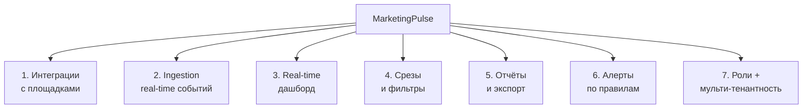

> 🎯 Что сказать интервьюеру: «Я не просто перечисляю фичи — я делаю декомпозицию по бизнес-возможностям. Это сразу подсказывает будущие границы сервисов: ingestion-контур, стрим-обработка, прикладные API дашборда, контур отчётов, контур интеграций. Каждая возможность дальше ляжет на свой компонент архитектурной карты.»

### Нефункциональные требования MarketingPulse

Берём структуру NFR-таблицы из главы 4 (производительность, throughput, масштабируемость, доступность, надёжность, устойчивость, отказоустойчивость, консистентность, безопасность, приватность, логируемость/аудит, наблюдаемость, retention) и заполняем **конкретными числами MarketingPulse**. Это и есть фундамент, ошибка в котором «стоит в 100 раз дороже» правки на поздних стадиях.

| Требование                                             | Вопрос, который задать                                | Требование MarketingPulse (готово в ТЗ)                                              | Метрика / число                                                                                                     | Влияние на архитектуру                                                                                                          |
| ---------------------------------------------------------------- | ------------------------------------------------------------------------ | ------------------------------------------------------------------------------------------------------- | ------------------------------------------------------------------------------------------------------------------------------- | --------------------------------------------------------------------------------------------------------------------------------------------------- |
| **Производительность**                   | Сколько ждать ответа API дашборда?             | API дашборда отдаёт предагрегаты/кеш быстро                          | p95 ≤ 200 мс, p99 ≤ 500 мс                                                                                                | Предагрегированные метрики, кеш Redis, индексы/Materialized Views в ClickHouse                                  |
| **Throughput (ingestion)**                                 | Сколько событий/с в пике?                            | Принимать поток рекламных событий                                         | 40k ev/s avg, 120k ev/s peak (×3), ~0.5 КБ/событие → ≈60 МБ/с в пике                                        | Kafka как буфер-firehose, партиционирование, стрим-консьюмеры на Go, batched-инсерты в ClickHouse |
| **Throughput (чтение)**                              | Какая read-нагрузка на аналитику?                | Аналитические запросы дашборда                                              | ~150 QPS avg, ~800 QPS peak; ≈160 запросов «в полёте» (закон Литтла)                               | Read-реплики Postgres, кеш Redis, OLAP-сканы в ClickHouse, HPA на app-нодах                                                  |
| **Масштабируемость**                       | Какой рост за период?                                   | Горизонтально масштабироваться под рост                             | ×4 за 18 месяцев; ~5000 тенантов; пик 10k одновременных real-time сессий                | Stateless app/ingestion-ноды за HPA, шардирование ClickHouse, Kafka-партиции, Realtime-Gateway 4–8 нод                |
| **Доступность (Availability)**                  | Какой % uptime? Что критичнее?                          | Дашборд (чтение) и ingestion высокодоступны                                 | Дашборд SLA 99.9% (≈8.8 ч/год); ingestion 99.95%                                                                    | Резервные инстансы/реплики, health-checks, multi-AZ; ingestion развязан от аналитики через Kafka    |
| **Надёжность (Reliability)**                     | Какие потери недопустимы?                          | События не теряются; бюджеты/квоты — без потерь                  | Durable writes в Kafka (репликация), at-least-once + идемпотентность по event_id                    | Репликация Kafka (3–6 брокеров), дедуп по event_id, ACID в PostgreSQL для денег                                  |
| **Устойчивость (Resilience)**                  | Что при сбое внешних площадок/нагрузке? | При недоступности площадки/перегрузке — graceful degradation         | Дашборд показывает последние известные метрики; pull-интеграции — с retry | Backpressure на ingestion, retry/circuit breaker на pull из площадок, деградация вместо отказа                  |
| **Отказоустойчивость (Fault tolerance)** | Сколько узлов можно потерять?                   | Потеря узла не роняет систему                                                  | Реплики ClickHouse (2 шарда × 2 реплики), Redis cluster 3–6 нод, Postgres primary + 2 реплики    | Кворумы/реплики, failover primary→replica, k8s переразмещает поды                                                   |
| **Консистентность**                         | Где strong, где eventual?                                          | Аналитика — eventual; бюджеты/квоты/биллинг — strong                      | Аналитика: расхождение в секунды приемлемо. Деньги: строгая                   | ClickHouse (eventual, секунды) для метрик; PostgreSQL (ACID) для бюджетов/квот/биллинга                      |
| **Безопасность**                               | Чувствительные данные? Доступ?                 | OAuth-токены площадок защищены; RBAC; TLS                                         | Шифрование токенов at rest; TLS на всех соединениях; роли owner/admin/editor/viewer       | API Gateway (auth, rate-limit), RBAC, KMS для секретов, мульти-тенантная изоляция запросов                |
| **Приватность / соответствие**      | Регуляторные требования?                           | Изоляция данных тенантов; хранение/удаление по политике | Жёсткая мульти-тенантная изоляция (tenant_id во всех слоях)                            | tenant_id как обязательный ключ в Kafka/ClickHouse/Postgres; проверка на уровне Gateway                         |
| **Логируемость / аудит**                  | Что логировать?                                             | Аудит критичных действий (изменение бюджетов, ролей)        | Логи изменений бюджетов/прав; централизованный сбор                                | ELK-стек, контроль доступа к логам, аудит-лог в Postgres                                                          |
| **Наблюдаемость**                             | Какие метрики/трейсы?                                  | Метрики, трейсы, ошибки по всему пути события                      | latency, error rate, lag консьюмеров, end-to-end свежесть; trace_id на 100% запросов               | Prometheus + Grafana, OpenTelemetry + Jaeger (trace_id), Sentry                                                                                     |
| **Retention / Durability**                                 | Что и сколько хранить?                                 | Tiered storage горячее/тёплое/холодное                                             | Детальные события 90 дней (ClickHouse), агрегаты 13–25 мес, сырьё в S3 2 года         | TTL-политики в ClickHouse, роллапы в Materialized Views, холодное хранилище S3 + backfill                         |

**Производные расчёты (ровно эти значения, использовать дальше при capacity planning):**

- События/сутки: 40 000 × 86 400 ≈ **3.46 млрд/сутки**.
- Сырой объём/сутки: 3.46e9 × 0.5 КБ ≈ **1.73 ТБ/сутки** сырых.
- За 90 дней горячих ≈ **155 ТБ** сырых; в ClickHouse со сжатием ~8–10× → **~16–20 ТБ** на диске.
- Пиковый поток записи: 120 000 × 0.5 КБ ≈ **60 МБ/с** (≈ 0.5 Гбит/с) — комфортно для Kafka.
- Закон Литтла: при p95=200 мс и 800 QPS конкурентность ≈ 800 × 0.2 = **160 запросов «в полёте»**.

> ⚖️ Trade-off: главный сознательный компромисс зафиксирован в строке «Консистентность». Мы отдаём аналитику в eventual consistency (метрика может отстать на секунды) — это позволяет масштабировать запись через Kafka + ClickHouse без распределённых транзакций. Но бюджеты, квоты и биллинг держим в strong consistency в PostgreSQL: здесь расхождение недопустимо, потому что речь о деньгах и лимитах. Смешивать эти модели в одном хранилище — ошибка.

> ⚠️ Частая ошибка: указать НФТ словами «система должна быть быстрой и надёжной» без чисел. Это пустая формулировка. Архитектуру двигают именно цифры: 120k ev/s, p95 ≤ 200 мс, свежесть ≤ 10 c, 99.95% ingestion. Всегда привязывай НФТ к измеримой метрике.

### Scope и Out-of-scope

Явная фиксация границ — отдельный навык. Она показывает, что кандидат управляет объёмом задачи, а не пытается спроектировать всё сразу.

**В scope (проектируем):**

1. Подключение рекламных аккаунтов и интеграции с площадками (OAuth, периодический pull агрегатов из API).
2. Приём real-time потока событий (impression/click/conversion) через ingestion API.
3. Real-time дашборд: метрики impressions, clicks, spend, CTR, CPC, CPM, conversions, CR, ROAS; обновление ≤ ~5–10 c.
4. Срезы/фильтры: кампания, площадка/канал, гео, устройство, период.
5. Формирование и экспорт отчётов (CSV/XLSX/PDF), отчёты по расписанию.
6. Алерты по правилам (расход > бюджет, падение CTR).
7. Роли (owner/admin, editor, viewer) и мульти-тенантная изоляция.

**Out-of-scope (сознательно отрезаем, упоминаем как отдельные системы):**

| Что отрезаем                        | Почему вне задачи                                                                                                                                                  |
| ---------------------------------------------- | --------------------------------------------------------------------------------------------------------------------------------------------------------------------------------- |
| Биддинг / закупка рекламы | Отдельная система управления ставками; мы только**читаем** агрегаты расхода                                  |
| ML-атрибуция конверсий       | Отдельный data-science контур; мы считаем метрики по фактам событий, без моделей атрибуции                       |
| Биллинг самих площадок     | Платежи площадкам — вне периметра; мы агрегируем их данные о расходе, но не платим за рекламу         |
| Антифрод                               | Отдельная система фильтрации фрода по показам/кликам; на интервью упоминаем как соседний сервис |

> 🎯 Что сказать интервьюеру: «Я сознательно отрезаю биддинг, ML-атрибуцию, биллинг площадок и антифрод. Это самостоятельные системы — их можно упомянуть как соседей на системном контексте, но втягивать в эту задачу нельзя, иначе мы "построим космолёт" и не успеем спроектировать ядро. Если хотите, добавлю любую из них в scope — но это изменит оценку сложности и инфраструктуры.»

> ⚠️ Частая ошибка: молча включить в проект антифрод или ML-атрибуцию и закопаться в них. Граница должна быть проговорена явно — это управление ожиданиями интервьюера.

### Итог: сформулированные требования

> 🎯 Что сказать интервьюеру (готовая краткая формулировка, с которой идём на Этап 2 «Архитектура»):
>
> «Проектируем **MarketingPulse** — мульти-тенантный B2B SaaS-дашборд для маркетинга. Это **гибрид** двух контуров: real-time метрики и тяжёлые асинхронные отчёты.
>
> **Функционально:** интеграции с площадками (OAuth + pull), ingestion real-time событий, real-time дашборд (impressions, clicks, spend, CTR, CPC, CPM, conversions, CR, ROAS) со свежестью ≤ 10 c, срезы по кампании/площадке/гео/устройству/периоду, асинхронные отчёты CSV/XLSX/PDF, алерты по правилам, роли и мульти-тенантность.
>
> **Нагрузка:** ingestion 40k ev/s в среднем, 120k ev/s в пике (~60 МБ/с), ~3.46 млрд событий/сутки; read-аналитика ~150 QPS avg, ~800 QPS peak; ~10k одновременных real-time сессий; DAU 50k, ~5000 тенантов, рост ×4 за 18 месяцев.
>
> **Латентность:** API дашборда p95 ≤ 200 мс, p99 ≤ 500 мс; свежесть real-time p95 ≤ 5 c. **Отчёты:** тяжёлые ≤ 1–2 мин асинхронно.
>
> **Доступность:** дашборд 99.9%, ingestion 99.95%. **Консистентность:** аналитика — eventual, бюджеты/квоты/биллинг — strong. **Retention:** горячие события 90 дней в ClickHouse, агрегаты 13–25 мес, сырьё в S3 2 года.
>
> **Вне scope:** биддинг, ML-атрибуция, биллинг площадок, антифрод.
>
> Профиль нагрузки — write-heavy ingestion + тяжёлое аналитическое чтение. Из этого на следующем этапе вырастают три контура: потоковый (Kafka → ClickHouse → push), асинхронный отчётный (очередь → воркеры → S3) и интеграционный (OAuth + pull из площадок). Детальную архитектурную карту разберём в разделе про проектирование архитектуры.»

С зафиксированными требованиями и числами можно переходить к Этапу 2 — выбору стратегии (эволюция/революция/гибрид) и построению архитектурной карты.

---

## Этап 2. Расчёты нагрузки (Capacity Planning)

После того как на этапе требований мы зафиксировали функциональные/нефункциональные требования и канон-числа MarketingPulse (подробнее в разделе про сбор требований), наступает этап, который кандидаты чаще всего сливают: расчёты. Не потому что он сложный, а потому что его боятся и пропускают. А зря — именно здесь интервьюер видит, умеешь ли ты переводить «много событий» в конкретный порядок величин и архитектурные решения.

🎯 Что сказать интервьюеру: «Сейчас я прикину порядок нагрузки: RPS, объём данных, трафик и грубую конфигурацию железа. Числа будут приблизительными — мне важен порядок, чтобы понять, это система на 10 нод или на 10 000, и какие компоненты станут узким местом.»

### 2.0. Зачем вообще считать (цель этапа)

Цель расчётов (ровно как в главе 8) — не получить точное число, а:

1. **Понять размер системы.** Нужно ли нам 10 серверов или 10 000? От этого зависит вообще всё: и стек, и бюджет, и сложность.
2. **Выявить критичные компоненты.** Расчёты сами подсветят узкие места: «трафик огромный → нужен агрессивный кеш и роллапы», «объём данных большой → шардинг ClickHouse сразу, а не потом».
3. **Обосновать архитектурные решения.** Когда ты выбираешь Kafka, ClickHouse и отдельный write-path, ты должен уметь сказать не «потому что модно», а «потому что 120k событий/с и 1.73 ТБ/сутки в Postgres физически не влезут».

Приблизительность не просто допустима — она ожидаема. 30 дней в месяце вместо 30.44, 86 400 секунд в сутках, округление до порядка. Важен порядок величин и ход мысли, а не третий знак после запятой.

⚠️ Частая ошибка: «требования ради требований» — спросить DAU/MAU, записать и забыть. Числа из этапа требований должны прямо сейчас превратиться в RPS, терабайты и количество нод. Если они «остались в графе требований» — этап провален.

### 2.1. Шаг 1. RPS ingestion и события в сутки

Главная ось задачи №1 — высокая нагрузка, поток рекламных событий (impression/click/conversion). Считаем write-path.

| Параметр                            | Значение          |
| ------------------------------------------- | ------------------------- |
| Средний поток                   | 40 000 событий/с  |
| Пиковый поток (peak factor ×3) | 120 000 событий/с |
| Размер события                 | ~0.5 КБ                 |

**События в сутки** (берём средний поток, 86 400 секунд в сутках):

```text
40 000 событий/с × 86 400 с ≈ 3.46 млрд событий/сутки
```

🎯 Что сказать интервьюеру: «Средний ingestion — 40k RPS, пик ×3 = 120k RPS. Это уже не та нагрузка, которую принимает обычный REST-API в Postgres напрямую. 3.46 млрд событий в сутки — здесь нужен стрим-буфер (Kafka) и колоночное хранилище (ClickHouse), а не классический OLTP.»

⚖️ Trade-off: проектируем под пик (120k), а не под среднее (40k). Если заложиться под среднее — система ляжет на первом же всплеске трафика рекламной кампании. Закладываем peak factor ×3 в headroom Kafka и пула ingestion-нод.

### 2.2. Шаг 2. Объём данных: горячие, агрегаты, холодные

#### Сырой объём в сутки

```text
3.46e9 событий × 0.5 КБ ≈ 1.73 ТБ/сутки сырых данных
```

Уже на этом числе понятно: писать это в PostgreSQL построчно — самоубийство. 1.73 ТБ в сутки — это профиль OLAP, а не OLTP.

#### Горячие данные за 90 дней (retention детальных событий в ClickHouse)

```text
1.73 ТБ/сутки × 90 дней ≈ 155 ТБ сырых
```

ClickHouse — колоночная БД, агрегаты по однотипным рекламным событиям жмутся отлично, реальное сжатие ~8–10×:

```text
155 ТБ / (8…10) ≈ 16…20 ТБ на диске
```

🎯 Что сказать интервьюеру: «155 ТБ сырых за 90 дней — звучит страшно, но колоночное сжатие ClickHouse даёт 8–10×, на диске остаётся ~16–20 ТБ. Это уже комфортно размазывается по 2 шардам × 2 репликам на NVMe.»

#### Агрегаты (роллапы)

Детальные события мы не гоняем на каждый запрос дашборда — поверх них в ClickHouse через Materialized Views крутятся минутные/часовые/дневные роллапы (impressions, clicks, spend, conversions по срезам: кампания, площадка, гео, устройство). Агрегаты на порядки меньше сырых событий и хранятся дольше — 13–25 месяцев. Именно из них дашборд отдаёт метрики за p95 ≤ 200 мс.

#### Холодное хранилище S3 за 2 года

Сырые события дублируются в S3/MinIO (холодное хранение, 2 года) — это дёшево и даёт возможность backfill/пересчёта истории (элемент Lambda поверх Kappa):

```text
1.73 ТБ/сутки × 730 дней ≈ 1.26 ПБ сырых в S3 (со сжатием/паркетом — кратно меньше)
```

⚖️ Trade-off: трёхуровневое хранение (горячее ClickHouse 90 дней → тёплые агрегаты 13–25 мес → холодный S3 2 года) вместо «всё в одной базе». Платим сложностью пайплайна и backfill-логикой, выигрываем кратно по стоимости диска: не держим петабайты на дорогом NVMe.

⚠️ Частая ошибка: попытаться хранить все 3.46 млрд событий/сутки вечно на горячем хранилище. Retention — это не опция, а основа capacity-плана.

### 2.3. Шаг 3. Read-нагрузка дашборда (QPS) и роль real-time push

Главная ось №3 — обновление данных в реальном времени. Read-нагрузка дашборда (аналитические запросы помимо real-time push):

| Параметр                | Значение                 |
| ------------------------------- | -------------------------------- |
| Средний read QPS         | ~150 QPS                         |
| Пиковый read QPS         | ~800 QPS                         |
| Цель латентности | p95 ≤ 200 мс, p99 ≤ 500 мс |

Обрати внимание: 150–800 QPS чтения — это на 2–3 порядка меньше, чем 40–120k RPS записи. **Профиль write-heavy ingestion + тяжёлое аналитическое чтение.** Это ключевой вывод: write-path и read-path надо разносить, у них разные требования и разное железо.

#### Почему real-time push (WS/SSE) радикально снижает REST-нагрузку

Наивный дашборд опрашивал бы метрики поллингом: 10 000 одновременных сессий × опрос раз в 5 с = **2 000 REST-запросов/с** только на обновление цифр. Это больше пикового аналитического QPS и бьёт по API на каждом тике.

Вместо поллинга используем push:

- метрики предагрегируются стримом и кладутся в Redis;
- обновление публикуется через Redis pub/sub (или Kafka) и раздаётся клиентам fan-out’ом через Realtime-Gateway по WebSocket (основной вариант) или SSE (упрощённый односторонний сервер→клиент);
- клиент держит одно соединение и получает дельты, а не дёргает REST каждые 5 секунд.

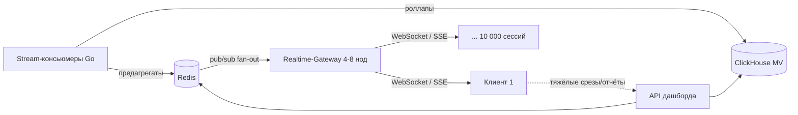

🎯 Что сказать интервьюеру: «Real-time push снимает с REST-слоя ~2000 RPS поллинга и превращает их в одно WS-соединение на сессию. REST остаётся только для тяжёлых аналитических срезов и запуска отчётов — это и есть наши 150–800 QPS, и под них хватает кеша из Redis.»

⚠️ Частая ошибка: real-time дашборд на REST-поллинге. При 10k сессий это утопит и API, и ClickHouse, хотя само число «800 QPS» выглядит безобидно.

### 2.4. Шаг 4. Закон Литтла и конкурентность «в полёте»

Используем закон Литтла, чтобы оценить, сколько запросов одновременно «висит» внутри read-path:

```text
конкурентность = пропускная способность × задержка
конкурентность = 800 QPS × 0.2 с (p95=200 мс) = 160 запросов «в полёте»
```

То есть на пике в системе одновременно обрабатывается ~160 аналитических запросов. Это скромное число — пул из нескольких app-нод спокойно держит такую конкурентность, если каждый запрос уложен в p95 ≤ 200 мс (за счёт кеша и роллапов).

#### Мини-пример с очередью: что будет, если деградирует p95

Закон Литтла работает в обе стороны и отлично объясняет хвосты задержек. Допустим, ClickHouse «придышал» и p95 уехал с 200 мс до 1 с при тех же 800 QPS:

```text
конкурентность = 800 × 1.0 = 800 запросов «в полёте»
```

Конкурентность подскочила с 160 до 800 — в 5 раз. Пул соединений и воркеров переполняется, перед тяжёлым ресурсом растёт очередь, появляется head-of-line blocking, и p99 улетает в секунды. Поэтому мы не гонимся за 100% утилизацией: держим **headroom CPU 60–70%** на чувствительных к задержке нодах (API, Realtime-Gateway), оставляя запас на хвосты и пики.

⚖️ Trade-off: можно было бы экономить и грузить app-ноды на 90% CPU. Но по теории очередей это резко раздувает хвост задержек — мы сознательно «переплачиваем за недоиспользованное железо», покупая предсказуемый p99. Для batch-воркеров отчётов, наоборот, 80–90% CPU нормально — там важно, чтобы джоба закончилась, а не хвост.

### 2.5. Шаг 5. Сетевой трафик записи

Считаем пиковый сетевой поток на write-path (это вход в Kafka):

```text
120 000 событий/с × 0.5 КБ ≈ 60 МБ/с ≈ 0.5 Гбит/с
```

🎯 Что сказать интервьюеру: «Пиковый поток записи — ~60 МБ/с, это около 0.5 Гбит/с. Для Kafka это комфортно: один брокер на 10GbE прокачивает такое с большим запасом, узким местом станет не сеть, а партиционирование и диски под ретеншн.»

Это и есть тот самый sanity-check из главы 3: прикинуть RPS и трафик, понять, куда упирается система (здесь — не в сеть). 0.5 Гбит/с с учётом репликации Kafka (×2–3) и пары направлений всё равно остаётся в пределах единиц Гбит/с — обычная датацентровая сеть.

### 2.6. Шаг 6. Прикидка нод

Переводим числа в грубую конфигурацию. Это не точный прайс-лист, а порядок: сколько и каких нод нужно. Везде на чувствительных к задержке компонентах закладываем headroom CPU 60–70%.

| Компонент                    | Конфигурация (порядок)                                     | Обоснование из чисел                                                                                                                                                                                                                               |
| ------------------------------------- | ----------------------------------------------------------------------------- | -------------------------------------------------------------------------------------------------------------------------------------------------------------------------------------------------------------------------------------------------------------------- |
| **Kafka**                       | 3–6 брокеров                                                         | 60 МБ/с пик + репликация ×2–3 + ретеншн/replay. Партиционирование под 120k RPS, headroom на пики и backfill.                                                                                                     |
| **ClickHouse**                  | 2 шарда × 2 реплики = 4–8 нод, 16–32 vCPU / 128 ГБ / NVMe | 16–20 ТБ горячих на диске + тяжёлые агрегаты. Шардинг сразу — данные не влезут на одну ноду, реплики для отказоустойчивости и read-масштабирования. |
| **PostgreSQL**                  | primary + 2 read-реплики                                               | OLTP-метаданные (tenants, users, ad_accounts, campaigns, report_jobs, бюджеты). Объём небольшой, реплики снимают чтение метаданных/статусов отчётов.                                     |
| **Redis**                       | cluster 3–6 нод                                                           | Предагрегаты дашборда, сессии, rate-limit, pub/sub fan-out на 10k сессий. Держит p95 ≤ 200 мс на чтении.                                                                                                          |
| **App / ingestion-ноды**    | пул за HPA                                                               | Ingestion (Go) под 120k RPS с автоскейлом; app-API (Python/FastAPI) под ~160 запросов «в полёте» (закон Литтла), CPU 60–70%.                                                                                          |
| **Realtime-Gateway**            | 4–8 нод                                                                   | 10 000 одновременных WS/SSE сессий. Несколько тысяч соединений на ноду, запас на пик и failover.                                                                                                         |
| **Stream-консьюмеры** | пул (Go) за HPA                                                          | Чтение из Kafka → батч/async-инсерты в ClickHouse + поддержка Materialized Views (роллапы). Скейлятся по лагу партиций Kafka.                                                                            |
| **S3 / MinIO**                  | объектное хранилище                                         | Сырые события (холод, 2 года) + готовые отчёты. Не считаем «в нодах» — это managed/масштабируемый сервис.                                                                                 |

#### Как считать ноды app-слоя (логика из главы 3)

1. Берём цель по p95 (200 мс) и пиковый QPS (800).
2. Замеряем (нагрузочным тестом), сколько QPS держит одна нода при нужном p95 — допустим, ~100 QPS/нода.
3. Масштабируем с запасом: 800 / 100 = 8 нод, не грузим выше 60–70% CPU → закладываем ~10–12 нод за HPA.

⚠️ Частая ошибка: «строительство космолёта» — мультирегион с синхронными кворумами, Flink, отдельный antifraud-кластер на этапе capacity. Под наши числа этого не нужно. Flink/Kafka Streams упоминаем как trade-off (если понадобится сложная stateful-обработка окон), но основной выбор — простые Go-консьюмеры + Materialized Views. Antifraud, ML-атрибуция, биддинг — out of scope, отдельные системы.

### 2.7. Шаг 7. Порядок стоимости

Не точный счёт, а sanity-check, что система влезает в здравый бюджет:

- ClickHouse-кластер (4–8 нод, NVMe, 128 ГБ): основная статья расходов — единицы–десятки тысяч $/мес.
- Kafka 3–6 брокеров + Postgres primary+2 реплики + Redis cluster: ещё единицы тысяч $/мес.
- App/ingestion/realtime-пулы за HPA + Realtime-Gateway: несколько тысяч $/мес, эластично по нагрузке.
- S3/MinIO холодное хранение: относительно дёшево даже на петабайтах.

**Итого порядок: единицы–десятки тысяч $ /мес.** Это реалистичный бюджет для B2B SaaS на ~5 000 тенантов и 50k DAU — не «триллионы на инфраструктуру», система окупаема.

🎯 Что сказать интервьюеру: «По порядку — десятки тысяч долларов в месяц, основной кост — ClickHouse-кластер под горячие данные и аналитику. Это адекватно для продукта с такими DAU и тенантами, бизнес такое потянет.»

### 2.8. Итоговая таблица: метрика → значение → следствие для архитектуры

| Метрика                                   | Значение                                | Следствие для архитектуры                                                                                |
| ------------------------------------------------ | ----------------------------------------------- | ------------------------------------------------------------------------------------------------------------------------------- |
| RPS ingestion (пик)                           | 120 000 событий/с                       | Kafka как firehose-буфер; отдельный write-path на Go; нельзя писать в Postgres напрямую |
| События/сутки                        | ~3.46 млрд                                  | Колоночное OLAP-хранилище (ClickHouse), а не OLTP                                                         |
| Сырой объём/сутки                 | ~1.73 ТБ                                      | Трёхуровневое хранение + ретеншн как часть дизайна                                   |
| Горячие за 90 дней                  | 155 ТБ → 16–20 ТБ (сжатие 8–10×)  | Шардинг ClickHouse сразу (2×2), NVMe                                                                               |
| Холод S3 / 2 года                       | ~1.26 ПБ сырых                           | Дешёвое объектное хранилище + backfill (элемент Lambda)                                         |
| Read QPS дашборда (пик)               | ~800 QPS                                        | Кеш Redis + роллапы; разнос read- и write-path                                                                 |
| Real-time сессии                           | ~10 000                                         | Push (WS/SSE) + Redis pub/sub fan-out, не поллинг; Realtime-Gateway 4–8 нод                                        |
| Свежесть метрик                    | ≤ 10 с, p95 ≤ 5 с                           | Стрим Kappa (Kafka→ClickHouse), предагрегаты в Redis                                                         |
| Латентность API                       | p95 ≤ 200 мс                                 | Предагрегаты/кеш; конкурентность ≈160 (закон Литтла)                                   |
| Конкурентность «в полёте» | 160                                             | Скромный пул app-нод; headroom CPU 60–70%                                                                        |
| Сетевой трафик записи         | ~60 МБ/с (0.5 Гбит/с)                   | Сеть — не узкое место; узкое место — диски/партиции                                    |
| Стоимость                               | единицы–десятки тыс. $/мес | Реалистично, без «космолёта»                                                                           |

### 2.9. Вывод: какие компоненты критичны

Расчёты прямо подсветили четыре критичных архитектурных решения, которые нельзя откладывать «на потом»:

1. **Агрессивная агрегация / роллапы.** 3.46 млрд событий/сутки нельзя считать на лету под p95 ≤ 200 мс. Materialized Views в ClickHouse (минута/час/день) + предагрегаты в Redis — обязательны, а не опциональны.
2. **Шардинг ClickHouse с самого начала.** 16–20 ТБ горячих на диске + write-heavy профиль не влезут на одну ноду. Закладываем 2 шарда × 2 реплики сразу — ретроактивный шардинг под нагрузкой болезненный.
3. **Кеш (Redis).** Без него 800 QPS чтения и 10k real-time сессий не уложатся в латентность. Redis несёт сразу три роли: предагрегаты, сессии/rate-limit и pub/sub fan-out.
4. **Отдельный write-path.** Ingestion (120k RPS, Go, Kafka) физически и логически отделён от read-path (аналитика, API, отчёты). Разные SLA (99.95% vs 99.9%), разные языки, разное железо, независимое масштабирование за HPA.

🎯 Что сказать интервьюеру: «Расчёты сами выбрали мне архитектуру: write-heavy на 120k RPS → Kafka + ClickHouse с шардингом и роллапами; read с жёстким p95 → Redis-кеш; real-time → push, а не поллинг. Дальше на High Level Design я просто рисую то, что уже доказал числами.»

---

## Этап 3. Домены, модель данных и API

На прошлых этапах мы зафиксировали требования и нарисовали верхнеуровневую карту (подробнее в разделе про сбор требований и контейнерную диаграмму C4). Теперь спускаемся на уровень, который интервьюер ждёт от middle+/senior: декомпозиция на сервисы, логическая модель данных в двух хранилищах (OLTP + OLAP) и детальные контракты API. Это та часть, где видно, умеете ли вы переводить «стрелочки на доске» в исполняемую спецификацию.

🎯 Что сказать интервьюеру: «Я иду по паттерну декомпозиции по бизнес-возможностям, для каждого сервиса фиксирую зону ответственности и принцип “своя база на сервис”, потом проектирую модель данных под профиль нагрузки MarketingPulse — write-heavy ingestion плюс тяжёлое аналитическое чтение — и в конце привязываю к этому контракты API».

### 3.1 Декомпозиция по бизнес-возможностям → список сервисов

Берём паттерн **Decomposition by Business Capability**: смотрим, что система делает с точки зрения бизнеса, и под каждую возможность выделяем сервис с чёткой зоной ответственности. Это проще и честнее, чем сразу прыгать в DDD bounded contexts, и идеально ложится на три ключевые оси задачи (высокая нагрузка / отчёты / real-time).

| Сервис                                                   | Зона ответственности                                                                                                                                                                              | Своя база / хранилище                                                           | Стиль взаимодействия                                                  |
| -------------------------------------------------------------- | -------------------------------------------------------------------------------------------------------------------------------------------------------------------------------------------------------------------- | ------------------------------------------------------------------------------------------------ | ---------------------------------------------------------------------------------------- |
| **Ingestion / Collector** (Go)                           | Приём firehose событий impression/click/conversion, валидация, дедуп по `event_id`, запись в Kafka. Только приём — без бизнес-логики отчётов. | Kafka (топик `ad.events.v1`), Redis для дедупа/rate-limit                        | HTTP POST → 202; продьюсер в Kafka (async)                                    |
| **Stream-Aggregator** (Go)                               | Консьюмер Kafka → батчевые/async-инсерты в ClickHouse, поддержка Materialized Views (роллапы минута/час/день), запись сырья в S3.                 | ClickHouse (write), S3                                                                           | Kafka consumer (async)                                                                   |
| **Query / Dashboard API** (Python/FastAPI)               | Аналитические запросы дашборда: метрики, срезы, фильтры; чтение предагрегатов из ClickHouse и кеша.                                         | ClickHouse (read), Redis (кеш)                                                                | REST/HTTPS (sync)                                                                        |
| **Realtime-Gateway** (Go)                                | Держит ≤ ~10 000 WS/SSE сессий, fan-out дельт метрик клиентам по подписке tenant/dashboard.                                                                                | Redis (pub/sub, состояние подписок)                                             | WebSocket / SSE + Redis pub/sub                                                          |
| **Reports** (Python/FastAPI + воркеры)            | Асинхронное формирование тяжёлых отчётов (CSV/XLSX/PDF), отчёты по расписанию, статус job, выкладка в S3 + signed URL.                         | PostgreSQL (`report_jobs`), S3 (результаты)                                          | REST (создать/статус) + очередь + воркеры (async)             |
| **Integrations** (коннекторы площадок) | OAuth-подключение рекламных аккаунтов, периодический pull агрегатов расхода/показов из API Google/Meta/Yandex/VK/TikTok Ads.                      | PostgreSQL (`ad_accounts`, токены), пишет агрегаты в стрим/ClickHouse | OAuth + периодический pull (sync к площадкам), async внутрь |
| **Accounts / Tenants / Auth**                            | Тенанты, пользователи, роли (owner/admin, editor, viewer), мульти-тенантная изоляция, выдача токенов.                                                     | PostgreSQL                                                                                       | REST/HTTPS (sync)                                                                        |
| **Alerts**                                               | Правила алертов (расход > бюджет, падение CTR), оценка правил по потоку/агрегатам, нотификации.                                             | PostgreSQL (`alert_rules`), читает агрегаты из ClickHouse                      | Consumer/cron + REST                                                                     |
| **Budget / Billing**                                     | Бюджеты, квоты, биллинг — единственная зона со**strong consistency**.                                                                                                    | PostgreSQL (транзакции ACID)                                                           | REST/HTTPS (sync)                                                                        |

⚖️ Trade-off: «своя база на сервис» — это идеал из учебника. На практике для MarketingPulse несколько сервисов делят **логически разделённые** хранилища: вся OLTP-метадата живёт в одном кластере PostgreSQL (с раздельными схемами/правами), а аналитика — в одном ClickHouse. Это не нарушает принцип на уровне владения данными (каждой таблицей владеет один сервис), но экономит операционную сложность. Не «строим космолёт» из 9 отдельных СУБД там, где это не нужно.

⚠️ Частая ошибка: пытаться засунуть real-time поток событий в PostgreSQL «как все остальные данные». При 40 000 событий/с в среднем и 120 000/с в пике (≈ 60 МБ/с) обычная OLTP-БД захлебнётся на записи. Поэтому ingestion идёт через Kafka → ClickHouse, а Postgres держит только метаданные и транзакционные сущности.

### 3.2 Логическая модель данных

Сначала логическая модель (сущности, поля, связи), потом физическая привязка к СУБД — как учит хорошая практика проектирования данных. У нас два принципиально разных хранилища, и это нормально: транзакционные сущности в Postgres, поток и агрегаты в ClickHouse.

#### 3.2.1 PostgreSQL (OLTP) — метаданные и транзакционка

Здесь живёт всё, что требует строгой схемы, связей и (для бюджетов/биллинга) ACID-транзакций. Ключевая сквозная сущность — `tenant_id`: она обеспечивает мульти-тенантную изоляцию и присутствует почти во всех таблицах.

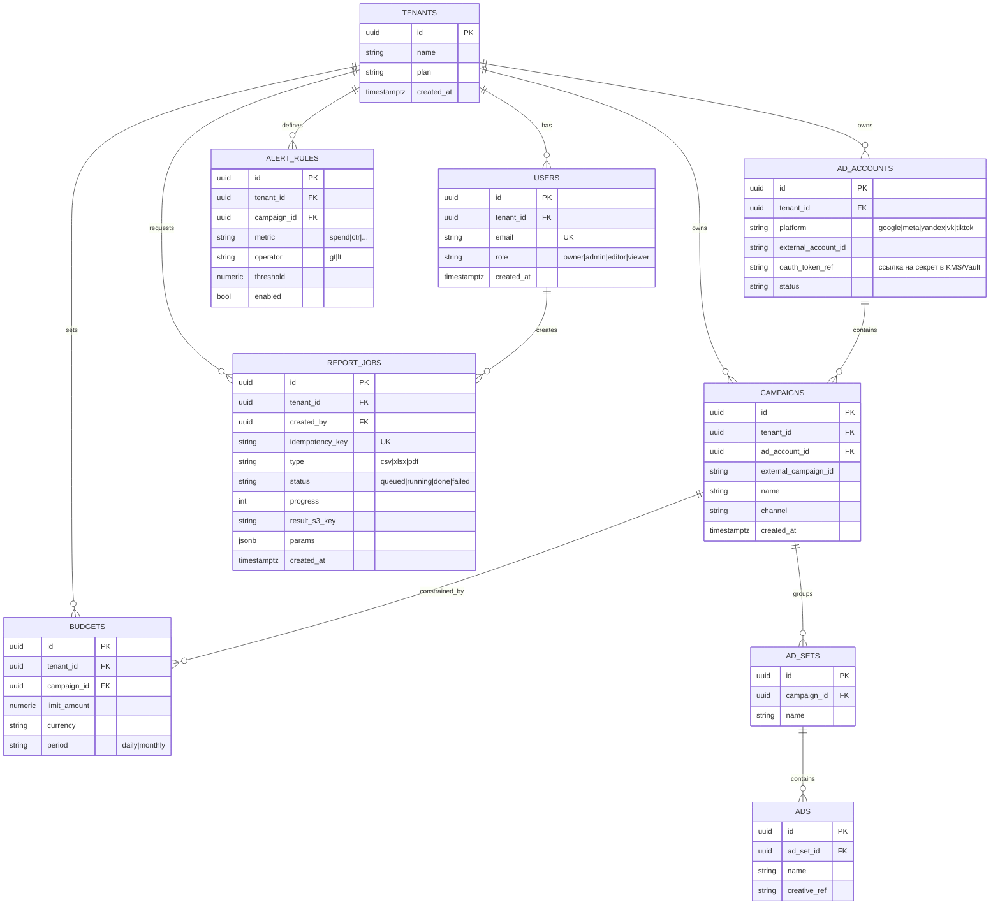

Связи: `tenants 1:many users / ad_accounts / campaigns / report_jobs / alert_rules / budgets`; `ad_accounts 1:many campaigns`; `campaigns 1:many ad_sets`; `ad_sets 1:many ads`. Бюджет может быть привязан к кампании (`campaigns 1:many budgets`). На физическом уровне: `email` — `UNIQUE` в пределах тенанта, `idempotency_key` в `report_jobs` — `UNIQUE` (защита от дублей запросов), индексы по `tenant_id` везде для изоляции и фильтрации.

#### 3.2.2 ClickHouse (OLAP) — детальные события и роллапы

Здесь живёт горячий поток (90 дней детальных событий, ~16–20 ТБ на диске со сжатием 8–10× из ~155 ТБ сырых) и предагрегаты. Структуру проектируем под характер запроса: фильтры по тенанту/кампании/каналу/гео/устройству и агрегаты по времени.

**Таблица детальных событий `events`:**

```sql
-- концептуально
CREATE TABLE events (
    tenant_id     UInt64,
    event_id      UUID,         -- идемпотентность/дедуп
    account_id    UInt64,
    campaign_id   UInt64,
    type          Enum8('impression'=1,'click'=2,'conversion'=3),
    ts            DateTime64(3),
    geo           LowCardinality(String),
    device        LowCardinality(String),
    channel       LowCardinality(String),
    cost          Decimal(18,6)
)
ENGINE = ReplacingMergeTree
PARTITION BY toYYYYMMDD(ts)               -- партиции по дню → дешёвый TTL-дроп старше 90 дней
ORDER BY (tenant_id, campaign_id, ts, event_id);    -- сортировка под типовой фильтр + диапазон по времени
```

- **PARTITION BY `toYYYYMMDD(ts)`** — партиционирование по дню: ретеншн реализуется как `TTL ts + INTERVAL 90 DAY` (или дроп старых партиций), а запросы за период читают только нужные дни.
- **ORDER BY `(tenant_id, campaign_id, ts, event_id)`** — первичный/сортировочный ключ под мульти-тенантность и самые частые срезы; `tenant_id` первым даёт изоляцию и отсечение чужих данных. `event_id` в конце ключа включает дедуп: `ReplacingMergeTree` схлопывает повторно доставленные события (Kafka гарантирует at-least-once) при фоновом merge.

**Роллап-таблицы (агрегаты) через Materialized Views:**

```sql
-- минутный роллап; аналогично hourly/daily
CREATE TABLE rollup_metrics_1m (
    tenant_id    UInt64,
    campaign_id  UInt64,
    channel      LowCardinality(String),
    geo          LowCardinality(String),
    device       LowCardinality(String),
    minute       DateTime,
    impressions  AggregateFunction(sum, UInt64),
    clicks       AggregateFunction(sum, UInt64),
    conversions  AggregateFunction(sum, UInt64),
    spend        AggregateFunction(sum, Decimal(18,6))
)
ENGINE = AggregatingMergeTree
PARTITION BY toYYYYMM(minute)
ORDER BY (tenant_id, campaign_id, channel, geo, device, minute);
```

Материализованные представления при инсерте в `events` инкрементально досчитывают роллапы минута → час → день. Метрики CTR, CPC, CPM, CR, ROAS **не храним** — это производные, считаются на лету из базовых сумм (clicks/impressions и т.д.) в момент запроса дашборда. Это убирает риск рассинхрона и экономит место.

⚖️ Trade-off: роллапы на Materialized Views (наш канон-выбор) против полноценного stream-процессора (Flink/Kafka Streams). MV проще в эксплуатации и не требуют отдельного кластера — для агрегатов фиксированной гранулярности их хватает. Flink/Kafka Streams упоминаем как альтернативу для сложных оконных вычислений и джойнов на лету, но для MarketingPulse это оверинжиниринг.

### 3.3 Таблица выбора хранилищ

Подбираем инструмент под тип задачи и профиль нагрузки — не «одна СУБД на всё».

| Тип задачи                                                                                                  | Технология                                    | Почему именно так (под MarketingPulse)                                                                                                                                                                                                                                                               |
| -------------------------------------------------------------------------------------------------------------------- | ------------------------------------------------------- | ---------------------------------------------------------------------------------------------------------------------------------------------------------------------------------------------------------------------------------------------------------------------------------------------------------------------- |
| Транзакционка: tenants, users, ad_accounts, campaigns, report_jobs, бюджеты/биллинг       | **PostgreSQL** (primary + 2 read-реплики)  | ACID и строгая схема для strong-consistency зон (бюджеты/квоты/биллинг), связи 1:many, понятные миграции. Read-реплики снимают чтение метаданных.                                                                             |
| Высоконагруженная аналитика: события, агрегаты, срезы дашборда | **ClickHouse** (2 шарда × 2 реплики) | Колоночная, сверхбыстрые агрегаты по миллиардам строк (3.46 млрд событий/сутки), сжатие 8–10×, MV для роллапов. Цель латентности API p95 ≤ 200 мс достигается за счёт предагрегатов. |
| Кеш предагрегатов, сессии, rate-limit, pub/sub                                                 | **Redis** (cluster 3–6 нод)                   | Доступ из памяти для hot-метрик дашборда (закрывает p95 ≤ 200 мс), хранение состояния real-time подписок и fan-out через pub/sub.                                                                                                            |
| Файлы/отчёты, сырые события (холодное)                                                | **S3 / MinIO**                                    | Дёшево и надёжно: готовые отчёты под signed URL, сырьё 2 года для backfill/пересчётов истории (элемент Lambda-архитектуры).                                                                                                               |
| Стрим/firehose событий                                                                                   | **Apache Kafka** (3–6 брокеров)          | Буфер и backpressure под пик 120 000 событий/с (≈ 60 МБ/с — комфортно), партиционирование, replay, ретеншн. Развязывает ingestion и обработку.                                                                                          |

🎯 Что сказать интервьюеру: «Я осознанно беру polyglot persistence: Postgres для транзакционки, ClickHouse для OLAP, Redis для скорости, S3 для холодного, Kafka как буфер. Каждый выбор привязан к конкретному числу из требований — это защита от обвинения в “модных технологиях ради технологий”».

### 3.4 Проектирование API

Базовый стиль — **REST/HTTPS** как универсальный и предсказуемый выбор для внешнего и большинства внутреннего взаимодействия. Где нужен постоянный сервер→клиент поток — WebSocket/SSE. Где операция длительная — async через очередь.

Сквозные соглашения для всех эндпоинтов:

- **Версионирование** в пути: префикс `/v1`. Ломающие изменения → `/v2`, старые клиенты продолжают жить на `/v1`.
- **Стандартные коды**: `200 OK`, `201 Created`, `202 Accepted` (принято в обработку), `400 Bad Request`, `401 Unauthorized`, `403 Forbidden`, `404 Not Found`, `409 Conflict` (конфликт идемпотентности), `429 Too Many Requests` (rate-limit), `500 Internal Server Error`.
- **Единый формат ошибки**:

```json
{ "error": { "code": "VALIDATION_ERROR", "message": "ts must be ISO-8601", "details": [{ "field": "events[0].ts", "issue": "invalid_format" }] } }
```

#### 3.4.1 Ingestion: `POST /v1/events`

Принимает **батч** событий (батчинг снижает overhead на пике 120 000/с). Идемпотентность — по `event_id` каждого события (дедуп в Redis/ClickHouse). Ответ — **202 Accepted**: сервис только кладёт в Kafka, не дожидаясь записи в ClickHouse (eventual consistency для аналитики допустима — расхождение в секунды).

🎯 Что сказать интервьюеру: «Возвращаю 202, а не 201, потому что это асинхронный приём — реальная запись произойдёт ниже по стриму. Клиенту важно лишь, что мы гарантированно приняли батч».

Запрос:

```json
POST /v1/events
Authorization: Bearer <ingestion_token>
Content-Type: application/json

{
  "events": [
    {
      "event_id": "7c9e6679-7425-40de-944b-e07fc1f90ae7",
      "tenant_id": "t_001",
      "account_id": "acc_42",
      "campaign_id": "cmp_915",
      "type": "click",
      "ts": "2026-06-03T10:15:02.500Z",
      "geo": "RU-MOW",
      "device": "mobile",
      "channel": "google",
      "cost": 0.12
    }
  ]
}
```

Ответ:

```json
202 Accepted
{ "accepted": 1, "rejected": 0, "batch_id": "b_20260603_101502_001" }
```

⚠️ Частая ошибка: делать ingestion синхронным с подтверждением записи в БД. На пике это создаёт огромную временну́ю связанность и кладёт систему. Правильно — принять в буфер (Kafka), вернуть 202, обработать асинхронно, а дедуп по `event_id` обеспечит «ровно один раз» на уровне аналитики даже при ретраях продьюсера.

#### 3.4.2 Dashboard query: `GET /v1/metrics`

Аналитический запрос с фильтрами. Цель латентности — p95 ≤ 200 мс (через предагрегаты ClickHouse + кеш Redis). Для списков (например, список кампаний с метриками) — **cursor-пагинация** (стабильна при больших и меняющихся наборах, в отличие от offset).

```
GET /v1/metrics?campaign=cmp_915&channel=google&geo=RU-MOW&device=mobile
              &from=2026-06-01T00:00:00Z&to=2026-06-03T00:00:00Z
              &granularity=hour&cursor=eyJvZmZzZXQiOjEwMH0&limit=100
```

Ответ:

```json
200 OK
{
  "data": [
    {
      "bucket": "2026-06-02T10:00:00Z",
      "impressions": 1250000,
      "clicks": 18750,
      "spend": 2250.00,
      "conversions": 940,
      "ctr": 0.015,
      "cpc": 0.12,
      "cpm": 1.80,
      "cr": 0.0501,
      "roas": 4.2
    }
  ],
  "next_cursor": "eyJvZmZzZXQiOjIwMH0",
  "meta": { "granularity": "hour", "cached": true }
}
```

Производные метрики (CTR, CPC, CPM, CR, ROAS) считаются на лету из базовых сумм. Поле `cached` подсказывает, что ответ пришёл из Redis-предагрегата.

#### 3.4.3 Realtime: контракт WebSocket / SSE

Дашборд обновляется ≤ 10 c (цель p95 ≤ 5 c). Основной канал — **WebSocket** (двунаправленный: клиент подписывается, сервер шлёт дельты); **SSE** — упрощённый односторонний вариант (сервер→клиент), достаточный для дашборда. Fan-out — через Redis pub/sub на ~10 000 одновременных сессий, держит Realtime-Gateway (4–8 нод).

Подписка (клиент → сервер):

```json
{ "action": "subscribe", "tenant_id": "t_001", "dashboard_id": "dash_main",
  "filters": { "campaign": "cmp_915", "channel": "google" } }
```

Апдейт-дельта (сервер → клиент) — шлём только изменения, не весь снапшот:

```json
{ "type": "metrics.delta", "dashboard_id": "dash_main", "ts": "2026-06-03T10:15:07Z",
  "delta": { "impressions": "+3200", "clicks": "+47", "spend": "+5.64" } }
```

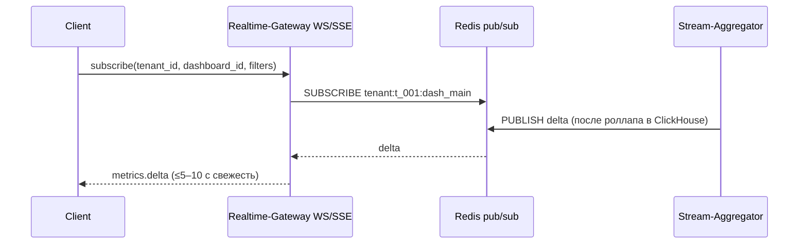

⚖️ Trade-off: WebSocket даёт двунаправленность и тоньше по трафику, но дороже в удержании соединений и состоянии. SSE проще (обычный HTTP, авто-reconnect), но только сервер→клиент. Для read-only дашборда SSE — валидный минимально достаточный выбор; WebSocket берём, если планируем интерактив (подписки/команды) с клиента.

#### 3.4.4 Reports (async): создание, статус, скачивание

Тяжёлый отчёт за период формируется асинхронно (цель ≤ 1–2 мин). Паттерн «создать job → опросить статус → скачать». Идемпотентность создания — через заголовок `Idempotency-Key` (повторный POST с тем же ключом не плодит дубли job).

1. **Создать job:**

```json
POST /v1/reports
Idempotency-Key: 3f2b...e91
{ "type": "xlsx", "params": { "from": "2026-05-01", "to": "2026-05-31",
                              "group_by": ["campaign","channel"] } }
```

```json
202 Accepted
{ "jobId": "rep_88f1", "status": "queued" }
```

2. **Статус/прогресс:**

```
GET /v1/reports/rep_88f1
```

```json
200 OK
{ "jobId": "rep_88f1", "status": "running", "progress": 65 }
```

3. **Скачать результат** (отдаём signed S3 URL, файл не проксируем через приложение):

```
GET /v1/reports/rep_88f1/download
```

```json
200 OK
{ "url": "https://s3.../reports/rep_88f1.xlsx?X-Amz-Signature=...", "expires_in": 600 }
```

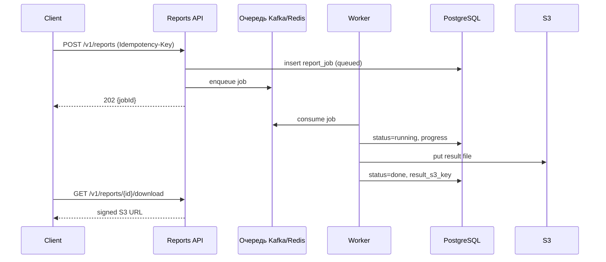

Статус job хранится в Postgres (`report_jobs`), результат — в S3. Это разрывает временну́ю связанность: клиент не висит на длинном HTTP, а опрашивает статус (или получает уведомление).

#### 3.4.5 Kafka event schema для топика `ad.events.v1`

Контракт сообщения — «паспорт» взаимодействия между Ingestion и Stream-Aggregator. Описываем через JSON Schema: поля, типы, форматы, обязательность. Версия зашита в имя топика (`ad.events.v1`) — при ломающем изменении заводим `ad.events.v2`.

```json
{
  "$schema": "https://json-schema.org/draft/2020-12/schema",
  "title": "AdEvent",
  "type": "object",
  "required": ["event_id", "tenant_id", "account_id", "campaign_id", "type", "ts"],
  "properties": {
    "event_id":    { "type": "string", "format": "uuid", "description": "идемпотентность/дедуп" },
    "tenant_id":   { "type": "string" },
    "account_id":  { "type": "string" },
    "campaign_id": { "type": "string" },
    "type":        { "type": "string", "enum": ["impression", "click", "conversion"] },
    "ts":          { "type": "string", "format": "date-time" },
    "geo":         { "type": "string", "description": "ISO-региона, напр. RU-MOW" },
    "device":      { "type": "string", "enum": ["mobile", "desktop", "tablet", "other"] },
    "channel":     { "type": "string", "enum": ["google", "meta", "yandex", "vk", "tiktok", "own"] },
    "cost":        { "type": "number", "minimum": 0 }
  },
  "additionalProperties": false
}
```

Партиционирование топика — по `tenant_id` (или `campaign_id`): сохраняет порядок событий в пределах тенанта и равномерно раскидывает нагрузку по партициям. Размер события ~0.5 КБ, что даёт расчётный пиковый поток ≈ 60 МБ/с.

🎯 Что сказать интервьюеру: «Схема события зафиксирована и версионирована вместе с топиком. `event_id` — основа идемпотентности на всём пути: продьюсер может ретраить при ошибке, а дедуп ниже по стриму гарантирует, что в аналитику событие попадёт ровно один раз. Это прямое следствие требования “операция учитывается один раз”».

### 3.5 Итог этапа

- Девять сервисов по бизнес-возможностям с зонами ответственности и владением данными; полноценную «свою СУБД» дробим только там, где это оправдано нагрузкой.
- Две модели данных: Postgres (строгая схема, связи, ACID для бюджетов/биллинга) и ClickHouse (события + роллапы, PARTITION BY дню, ORDER BY под мульти-тенантные срезы).
- Polyglot persistence обоснован числами: Kafka под 120k/с, ClickHouse под 3.46 млрд событий/сутки, Redis под p95 ≤ 200 мс, S3 под холодное и отчёты.
- API: REST как база, 202 для async-приёма и отчётов, WS/SSE для real-time, идемпотентность по `event_id` и `Idempotency-Key`, версионирование `/v1`, единый формат ошибки.

Дальше — детализация потоков обработки и отказоустойчивости (подробнее в разделе про data flow и надёжность).

---

## Этап 4. High Level Design — архитектура целиком

На этом этапе мы рисуем систему целиком и доказываем, что она работает. Требования собраны (Этап 1), расчёты сделаны (Этап 2), домены и API выписаны (Этап 3). Теперь задача — собрать из этого верхнеуровневую архитектуру: один экран, на котором видно, как событие рекламного клика долетает до метрики на дашборде маркетолога и как тяжёлый отчёт уезжает в S3.

Главное правило этапа: **рисуем верхнеуровнево, без деталей реализации внутри компонентов** (это будет на Этапе 5 — Low Level Design). Здесь мы расставляем «чёрные ящики» и подписываем стрелки между ними. Детализация запросов внутри ClickHouse, схемы партиционирования Kafka, конкретные индексы Postgres — всё это сознательно откладываем.

> 🎯 Что сказать интервьюеру: «Сейчас я нарисую верхнеуровневую схему всей системы, начну от пользователя и источников событий, подпишу тип каждой связи — синхронный REST, асинхронный Kafka или WebSocket/SSE. Детали внутри компонентов разберём на следующем шаге, чтобы сначала увидеть систему целиком».

### Три потока, которые надо удержать в голове

MarketingPulse распадается ровно на три оси задачи (держим их в фокусе весь дизайн):

1. **Высокая нагрузка** — firehose рекламных событий: средний поток 40 000 событий/с, пик 120 000 событий/с (peak factor ×3), размер события ~0.5 КБ. Это **write-path**.
2. **Real-time дашборд** — метрики со свежестью end-to-end ≤ 10 c (цель p95 ≤ 5 c), аналитические чтения ~150 QPS в среднем, пик ~800 QPS, латентность API p95 ≤ 200 мс. Это **read-path**.
3. **Формирование отчётов** — асинхронно, большой отчёт за период ≤ 1–2 мин. Это **отдельный async-path** поверх тех же данных.

Эти три потока почти не пересекаются по нагрузочному профилю, и именно поэтому архитектура строится вокруг их **физического разделения** (см. ниже раздел про write-path / read-path).

### Архитектура целиком: data flow

Опишу систему так, как буду проговаривать её у доски — от источников к пользователю.

#### Write-path (приём и агрегация событий)

1. **Источники.** Два типа: (а) собственный трекинг — пиксель на сайтах рекламодателей и постбэки рекламных площадок (impression / click / conversion); (б) периодический pull агрегатов расхода/показов из API площадок (Google Ads, Meta Ads, Yandex Direct, VK Ads, TikTok Ads) через OAuth. Поток (а) — это и есть высоконагруженный firehose; поток (б) — редкий батчевый pull по расписанию.
2. **Edge.** Трафик входит через внешний L7 LB (Nginx/Envoy), дальше API Gateway: аутентификация, rate-limit, маршрутизация. CDN обслуживает статику и готовые отчёты.
3. **Ingestion API** (Go, за HPA). Тонкий слой: валидация, проставление `tenant_id` и `event_id` (для идемпотентности), батчинг — и публикация в Kafka. Никакой бизнес-логики и записи в БД на горячем пути: задача — принять 120k событий/с и не упасть.
4. **Kafka, топик `ad.events.v1`.** Буфер-firehose: партиционирование (например, по `tenant_id`), ретеншн, возможность replay. Пиковый поток записи 120 000 × 0.5 КБ ≈ **60 МБ/с (≈ 0.5 Гбит/с)** — комфортно для кластера из 3–6 брокеров. Kafka даёт backpressure: если консьюмеры отстают, события копятся в топике, а не теряются.
5. **Stream-консьюмеры** (Go). Читают `ad.events.v1`, делают батчевые/async-инсерты в ClickHouse и параллельно складывают сырые события в S3 (холодное хранение).
6. **ClickHouse** (OLAP). Хранит raw-события (горячие, 90 дней) и роллапы через **Materialized Views** — минутные / часовые / дневные агрегаты (impressions, clicks, spend, conversions по разрезам кампания / площадка / гео / устройство). MV считают агрегаты на лету при инсерте, поэтому read-path читает уже готовые предагрегаты, а не сканирует миллиарды строк.
7. **S3/MinIO.** Сырые события 2 года (для backfill и пересчётов), готовые отчёты.

#### Read-path (дашборд)

1. **Query API** (Python/FastAPI, за HPA). Принимает аналитические запросы дашборда (срезы/фильтры: кампания, площадка, гео, устройство, период).
2. **Redis (cluster).** Кеш предагрегированных метрик дашборда. Большинство запросов дашборда — это «топ-метрики по тенанту за период», они отлично кешируются. Cache hit отдаём за единицы мс.
3. **ClickHouse.** Cache miss и более «глубокие» срезы идут в ClickHouse — он читает MV-роллапы, а не raw, поэтому укладывается в p95 ≤ 200 мс.
4. **OLTP — PostgreSQL** (primary + 2 read-реплики). Метаданные: tenants, users, ad_accounts, campaigns, бюджеты/квоты, `report_jobs`. Сюда же ходит авторизация и проверка мульти-тенантной изоляции. Тяжёлые чтения метаданных — на реплики.

#### Real-time push (живое обновление дашборда)

1. **Агрегатор** (часть stream-консьюмеров или отдельный сервис) при обновлении минутных агрегатов публикует **дельты метрик** в **Redis pub/sub** (канал на `tenant_id`).
2. **Realtime-Gateway** (4–8 нод) держит WebSocket/SSE-сессии клиентов (пик ~10 000 одновременных), подписан на Redis pub/sub и делает fan-out дельт нужным тенантам. Для дашборда (сервер→клиент) валиден и SSE как более простой односторонний вариант.
3. Клиент получает обновление метрик push-ом, без поллинга — это и обеспечивает свежесть ≤ 10 c.

#### Reports-path (асинхронные отчёты)

1. **Reports API** принимает запрос на отчёт, создаёт `report_job` в Postgres (статус `queued`) и кладёт задачу в **очередь отчётов** (отдельный Kafka-топик или RabbitMQ/Redis). Маленькие отчёты можно отдать почти мгновенно синхронно; большой период — всегда асинхронно.
2. **Пул воркеров отчётов** (Python) забирает задачу, гоняет тяжёлый запрос в ClickHouse, формирует CSV/XLSX/PDF, кладёт результат в S3.
3. Воркер обновляет `report_job` (статус `done` + ссылка), клиент получает **signed URL** на скачивание из S3 (через CDN). Отчёты по расписанию запускаются тем же путём по cron.

#### Алерты

Правила (расход > бюджет, падение CTR) проверяются на потоке агрегатов (тем же стрим-слоем) и шлют уведомления. На HLD достаточно одного блока «Alerting» — не углубляемся.

### Mermaid: вся система с подписанными стрелками

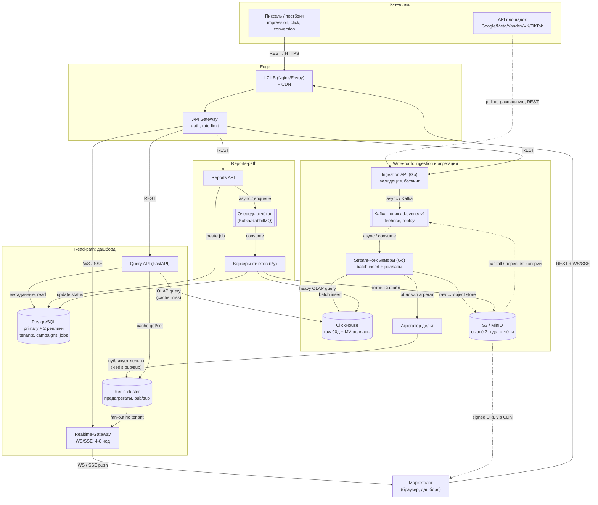

Обратите внимание: каждая стрелка подписана **типом связи** (REST / async-Kafka / WS-SSE) и кратко **назначением** — ровно как требует подход C4-контейнеров «зачем и как». Циклов в основном потоке нет: данные текут источники → Kafka → ClickHouse → дашборд в одну сторону. Единственная пунктирная «обратная» стрелка S3 → Kafka — это backfill, и она именно поэтому выделена пунктиром (внештатный путь, не основной цикл).

### Lambda vs Kappa: почему здесь Kappa + backfill из S3

Когда система одновременно про real-time и про исторические пересчёты, на интервью почти всегда всплывает выбор архитектурного стиля обработки данных.

| Критерий                            | Lambda                                                                                                                                                                                                                            | Kappa                                                                                                                                                     |
| ------------------------------------------- | --------------------------------------------------------------------------------------------------------------------------------------------------------------------------------------------------------------------------------- | --------------------------------------------------------------------------------------------------------------------------------------------------------- |
| Идея                                    | Два конвейера: batch-слой (точный, по историческим данным) + speed-слой (быстрый, приблизительный); результаты сливаются на чтении | Один конвейер — стрим. Историю получаем replay-ем того же стрима / повторной обработкой |
| Кодовая база                     | Две: batch-логика и stream-логика дублируют бизнес-правила                                                                                                                                  | Одна — логика агрегации описана один раз                                                                                |
| Риск рассинхрона             | Высокий: две реализации одной метрики легко расходятся                                                                                                                             | Низкий: один источник правды                                                                                                      |
| Сложность эксплуатации | Выше (две системы)                                                                                                                                                                                                  | Ниже                                                                                                                                                  |
| Когда оправдан                 | Когда batch и stream принципиально разные и тяжёлый пересчёт нужен постоянно                                                                                               | Когда поток и так первичен, а пересчёт — редкий                                                                     |

**Выбор для MarketingPulse — Kappa.** Поток событий у нас и так первичный артефакт: всё уже течёт через Kafka `ad.events.v1` → ClickHouse. Минутные/часовые/дневные роллапы считаются Materialized Views на том же стриме, одной описанной логикой. Заводить второй, batch-конвейер с дублирующей логикой агрегации означало бы плодить рассинхрон метрик (а аналитика и так eventual — расхождение в секунды приемлемо, нам не нужна вторая «точная» ветка).

**Элемент Lambda оставляем точечно — backfill из S3.** Сырые события лежат в S3 2 года. Если поменялась логика роллапа, нашли баг в агрегации или площадка прислала исправленные данные за прошлый период — мы перечитываем сырьё из S3, проигрываем его через тот же стрим-конвейер и пересчитываем историю. Это не отдельная постоянная batch-ветка, а **разовый replay по тому же коду**, поэтому стиль остаётся Kappa, а возможность пересчёта истории мы получаем «бесплатно».

> 🎯 Что сказать интервьюеру: «Беру Kappa: единый стрим Kafka → ClickHouse, агрегаты считаю Materialized Views — одна логика, один источник правды, никакого рассинхрона между batch и speed слоями. Полноценный Lambda здесь оверинжиниринг. Возможность backfill из S3 закрывает потребность в пересчёте истории, не вводя второй конвейер».

> ⚠️ Частая ошибка: тащить Lambda «потому что классика», а потом не суметь объяснить, как синхронизируются две ветки и почему метрики на дашборде расходятся с отчётом. Если данных eventual-consistency достаточно (наш случай) — Lambda не нужна.

### Разделение write-path и read-path

Это ключевое архитектурное решение HLD, и его важно проговорить явно. Профиль нагрузки у нас **write-heavy ingestion + тяжёлое аналитическое чтение** — два сценария с противоположными требованиями.

|                                | Write-path (ingestion + агрегация)                           | Read-path (дашборд + отчёты)                                              |
| ------------------------------ | --------------------------------------------------------------------- | -------------------------------------------------------------------------------------- |
| Нагрузка               | 40k–120k событий/с, мелкие записи                | ~150–800 QPS, тяжёлые агрегатные запросы                      |
| Главная метрика  | throughput, не уронить пик                                | латентность p95 ≤ 200 мс                                                 |
| Технологии           | Go, Kafka, ClickHouse insert, MV                                      | FastAPI, Redis, ClickHouse read, реплики Postgres                               |
| Масштабирование | по объёму потока (брокеры, консьюмеры) | по числу одновременных пользователей/запросов |
| Что страшно          | backpressure, потеря событий                             | долгий запрос, холодный кеш                                     |

По сути это **CQRS на уровне всей системы**: команды (запись событий) и запросы (чтение метрик) физически разнесены и масштабируются независимо.

Что это даёт:

1. **Независимое масштабирование.** Пик 120k событий/с накручивает консьюмеры и брокеры Kafka, никак не задевая дашборд. Наплыв пользователей в час пик добавляет ноды Query API и реплики, не трогая ingestion.
2. **Изоляция отказов (bulkhead).** Если упадёт пул воркеров отчётов или просядет дашборд — приём событий продолжается, данные не теряются (Kafka держит буфер). И наоборот: всплеск ingestion не «съест» ресурсы у чтения.
3. **Подходящий инструмент под задачу.** Запись оптимизируем под throughput (батч-инсерты в ClickHouse), чтение — под латентность (Redis + предагрегаты + MV). Один и тот же сторадж не обслуживал бы оба профиля одинаково хорошо.
4. **Буфер развязывает скорости.** Kafka между ingestion и агрегацией позволяет приёму работать быстрее, чем обработка успевает писать в ClickHouse, — пики сглаживаются, а не приводят к потере.

> ⚖️ Trade-off: разделение путей и наличие Kafka-буфера означают, что данные на дашборде **eventual-consistent** — между событием и его отражением в метрике есть лаг (наш бюджет ≤ 10 c). Для аналитики это допустимо по требованиям. А вот бюджеты/квоты/биллинг требуют strong consistency — поэтому они живут в Postgres (OLTP), а не в ClickHouse-конвейере. Это сознательная граница: считаем деньги строго, метрики — с допустимым лагом.

### Как рисовать это на доске

Чек-лист с Этапа интервью (глава про подготовку), чтобы схема читалась и вы не утонули:

1. **Начинайте от пользователя** (и от источников событий). Слева — маркетолог и пиксель/площадки, справа — хранилища. Глаз интервьюера идёт по потоку данных слева направо.
2. **Подписывайте каждую стрелку** — тип связи и назначение: «async / Kafka», «REST», «WS/SSE», «pull по расписанию». Подписанные стрелки резко упрощают восприятие и сразу показывают, где синхрон, а где асинхрон.
3. **Один дата-центр на HLD.** Не городите multi-region на этом шаге — сделайте допущение, что ДЦ один. Но проговорите вслух: «для отказоустойчивости и снижения latency по гео позже можно вынести в multi-region — Kafka MirrorMaker, гео-роутинг на edge, реплики ClickHouse/Postgres по регионам». Это показывает, что вы видите путь масштабирования, но не строите космолёт раньше времени.
4. **Избегайте циклических связей.** Поток в одну сторону: источники → Kafka → ClickHouse → дашборд. Единственная обратная связь (backfill S3 → Kafka) — пунктиром и явно помечена как внештатный путь.
5. **Группируйте в подсистемы** (Edge / Write-path / Read-path / Reports) — так на доске видно три оси задачи, и проще обсуждать каждую отдельно.
6. **Не уходите внутрь компонентов.** Партиции Kafka, движки таблиц ClickHouse, индексы Postgres — это Low Level Design (Этап 5). На HLD компонент — «чёрный ящик» с подписанными связями.

> ⚠️ Частая ошибка: нарисовать 30 квадратиков, 10 микросервисов и пять баз «чтобы выглядело солидно». На HLD цель обратная — минимально достаточная схема под требования, где вы можете объяснить роль каждого блока. Если не можете обосновать компонент — его быть не должно.

### Проверка: удовлетворяет ли архитектура требованиям

Завершаем этап доказательством, что нарисованное действительно вывозит канон-числа.

| Требование                                        | Как обеспечивается на этой схеме                                                                                                                                                                                                                                                                                                                    |
| ----------------------------------------------------------- | ------------------------------------------------------------------------------------------------------------------------------------------------------------------------------------------------------------------------------------------------------------------------------------------------------------------------------------------------------------------------------- |
| Пик 120k событий/с                               | Тонкий Ingestion API (Go) только валидирует и батчит → Kafka. Пиковый поток ≈ 60 МБ/с (≈ 0.5 Гбит/с) — комфортно для 3–6 брокеров. Backpressure не теряет события                                                                                                                      |
| Свежесть метрик ≤ 10 c (p95 ≤ 5 c)          | Стрим-консьюмеры пишут в ClickHouse батчами секундного порядка → MV обновляют минутные агрегаты → агрегатор шлёт дельту в Redis pub/sub → Realtime-Gateway push-ит по WS/SSE. Поллинга нет, лаг копится только на коротких звеньях |
| Чтение p95 ≤ 200 мс, p99 ≤ 500 мс               | Дашборд читает предагрегаты из Redis (hit — единицы мс); miss идёт в ClickHouse по MV-роллапам, а не по raw. По закону Литтла при 800 QPS и p95=200 мс это ≈ 160 запросов «в полёте» — пул Query API за HPA держит легко                                     |
| Отчёты ≤ 1–2 мин                                 | Асинхронно: Reports API → очередь → пул воркеров → тяжёлый запрос в ClickHouse → файл в S3 → signed URL. Дашборд при этом не блокируется                                                                                                                                                         |
| Доступность чтения 99.9%, ingestion 99.95% | Stateless-сервисы за HPA + LB с health-check/failover; Kafka и ClickHouse реплицированы; Redis cluster; Postgres primary + 2 реплики. Разделение путей изолирует отказы                                                                                                                                            |
| Мульти-тенантность                         | `tenant_id` проставляется на ingestion и протягивается до партиций Kafka, фильтров ClickHouse, каналов Redis pub/sub и проверок в Gateway/Postgres                                                                                                                                                            |

> 🎯 Что сказать интервьюеру: «Архитектура выдерживает пик 120k событий/с, потому что горячий путь — это тонкий Go-ingestion + Kafka-буфер на ~60 МБ/с с backpressure. Свежесть ≤ 10 c обеспечивает стрим Kafka → ClickHouse-MV → Redis pub/sub → WS/SSE push без поллинга. Чтение укладывается в p95 ≤ 200 мс за счёт Redis-предагрегатов и MV-роллапов в ClickHouse, а тяжёлые отчёты вынесены в асинхронный путь и не мешают дашборду. Write-path и read-path физически разделены и масштабируются независимо — это и есть главная идея схемы».

Детальные решения по каждому компоненту (движки и партиционирование ClickHouse, схема Postgres, ключи идемпотентности, политики кеша, ретраи и circuit breaker) — подробнее в разделе про Low Level Design (Этап 5).

---

## Этап 5A. Low Level Design: real-time обновление данных по рекламе

На предыдущих этапах мы зафиксировали общую архитектуру MarketingPulse и три ключевые оси задачи. Здесь мы спускаемся на уровень Low Level Design и до винтика разбираем самую «горячую» из них — **real-time обновление метрик по рекламе**: путь одного события от пикселя/постбэка до цифры, которая через ≤ 10 c (цель p95 ≤ 5 c) обновится в дашборде маркетолога.

Это write-heavy путь: средний поток **40 000 событий/с**, пик **120 000 событий/с** (peak factor ×3), событие ~0.5 КБ. В пике это ≈ 60 МБ/с (≈ 0.5 Гбит/с) — для Kafka комфортно. Подробнее про оценку нагрузки и общую схему — в разделе про High Level Design; здесь фокус на деталях стрима.

🎯 **Что сказать интервьюеру:** «Real-time путь у меня — это Kappa-конвейер: единый стрим событий через Kafka → стрим-консьюмеры на Go → ClickHouse (детальные данные + роллапы через Materialized Views) и параллельно Redis (горячие предагрегаты) → Realtime-Gateway → клиент по WebSocket/SSE. Backfill истории из S3 — отдельная ветка для пересчётов, это элемент Lambda поверх Kappa».

### Топология real-time пути (общая картина)

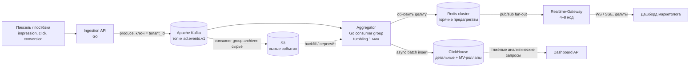

Дальше — каждый блок отдельно, с trade-off'ами и типовыми ошибками.

### Kafka: ключ партиционирования, число партиций, consumer groups, retention

Kafka — это наш firehose-буфер: он развязывает приём событий и их обработку, сглаживает пики (тот самый приём из главы про производительность — «поставить перед тяжёлым ресурсом очередь»), даёт replay и retention.

#### Выбор ключа партиционирования

Ключ партиционирования решает, в какую партицию попадёт событие, а значит — порядок внутри партиции и распределение нагрузки. Кандидаты:

| Ключ                                           | Плюсы                                                                                                                                                                                                                                 | Минусы / риски                                                                                                                                                                                                                        |
| -------------------------------------------------- | ------------------------------------------------------------------------------------------------------------------------------------------------------------------------------------------------------------------------------------------ | ------------------------------------------------------------------------------------------------------------------------------------------------------------------------------------------------------------------------------------------------ |
| `tenant_id`                                      | Все события тенанта в одной партиции → удобная агрегация и изоляция мульти-тенантности; порядок событий по тенанту сохраняется | **Hot partition**: крупное агентство или рекламодатель-гигант генерирует несоразмерный поток (тот самый hot key из главы про шардирование) |
| `account_id` (рекламный аккаунт) | Более мелкая гранулярность → нагрузка размазывается ровнее, чем по тенанту                                                                                                 | Один очень крупный аккаунт всё равно может стать hot; агрегаты по тенанту собираются из нескольких партиций                                              |
| `hash(tenant_id, account_id, campaign_id)`       | Максимально ровное распределение                                                                                                                                                                             | Теряем гарантию «все события тенанта по порядку в одной партиции» — но для аналитики это не критично (агрегаты коммутативны)             |

🎯 **Что сказать интервьюеру:** «По умолчанию беру `tenant_id` — он даёт изоляцию тенантов и локальность агрегации. Но честно проговариваю риск hot partition от крупного рекламодателя: один топовый аккаунт может перегрузить одну партицию и один consumer-инстанс. Решение — составной ключ `hash(tenant_id, account_id)` или даже добавить `campaign_id` для самых крупных тенантов. Так мы режем горячий ключ на под-ключи, ценой того, что агрегат по тенанту собирается из нескольких партиций — для eventual-аналитики это нормально».

⚠️ **Частая ошибка:** взять `tenant_id` и забыть про перекос. Tenants ~5 000, но трафик распределён неравномерно (закон Парето): несколько крупных агентств дадут львиную долю из 120k/с. Без защиты от hot key один шард/партиция станет bottleneck, как БД биллинга в примере с USL.

#### Число партиций под пик 120k/с

Логика расчёта (на интервью важен порядок величин, а не точное число):

1. Берём целевую пропускную способность одной партиции/консьюмер-инстанса. Один Go-консьюмер с батчингом комфортно тянет порядка нескольких тысяч–десятков тысяч событий/с (зависит от парсинга и сети), консервативно заложим ~5–10k событий/с на партицию с запасом.
2. Пик 120 000 / 10 000 ≈ 12 партиций при оптимистичных 10k/партицию; при консервативных 5k/партицию — ≈ 24. То есть минимум — порядка 12–24 партиций.
3. Закладываем headroom (не грузим выше 60–70%, как в главе про CPU) и запас под рост ×4 за 18 месяцев → берём с запасом, например **48–64 партиции** на топик `ad.events.v1`.

⚖️ **Trade-off:** партиций больше → выше параллелизм консьюмеров и проще горизонтально масштабироваться, но растут накладные расходы (метаданные, файловые дескрипторы, ребалансировки consumer group дольше). Слишком много партиций = деградация (привет, USL: координация растёт быстрее пользы). Число партиций задаём сразу с запасом — увеличивать его на лету для keyed-топика болезненно (меняется маппинг ключ→партиция).

#### Consumer groups и retention/replay

- **Consumer groups**: разные потребители читают один топик независимо. Группа `aggregator` (стрим-агрегация в ClickHouse + Redis) и, например, группа `archiver` (сырьё в S3) читают параллельно, не мешая друг другу. Внутри группы партиции распределяются по инстансам — это и есть горизонтальный скейл обработки под HPA.
- **Retention**: на топике `ad.events.v1` держим, например, retention в несколько дней (короткое окно — на replay и восстановление после сбоя консьюмера). Долгое холодное хранение — это S3 (2 года) и ClickHouse (90 дней горячих).
- **Replay**: если Aggregator выкатил баг и испортил роллапы — перематываем offset группы назад и переигрываем события. Для глубоких пересчётов истории читаем из S3 (backfill). Это и есть «элемент Lambda» поверх Kappa.

### Доставка событий: at-least-once + идемпотентность, а не exactly-once

#### Миф про exactly-once

Кандидаты любят сказать «сделаем exactly-once». На проде это либо очень дорого, либо самообман. Честный инженерный выбор для ingestion — **at-least-once доставка + идемпотентность на стороне обработки/хранилища**.

🎯 **Что сказать интервьюеру:** «Гоняться за сквозным exactly-once между Ingestion → Kafka → Aggregator → ClickHouse я не буду. Я строю at-least-once: продюсер ретраит, консьюмер коммитит offset после успешной записи. Дубли неизбежны (ретраи, ребалансировки), поэтому я делаю обработку идемпотентной по `event_id` и дедуплицирую в ClickHouse. Для аналитики, где консистентность eventual, это правильный размен: дёшево, без блокировок, без хвостов».

#### Почему не 2PC между сервисами

Распределённая транзакция (2PC) между Ingestion, Kafka и ClickHouse — плохая идея ровно по причинам из главы про распределённые транзакции:

- `PREPARE` держит блокировки, пока координатор думает → растут очереди и хвосты задержек;
- хвост определяется самой медленной нодой и состоянием сети — а у нас 120k/с, любой лок убьёт throughput;
- падение координатора → «подвисшие» транзакции в состоянии prepared.

Для firehose из 120k событий/с это неприемлемо. 2PC уместен внутри одной БД, но не между сервисами на горячем пути.

#### Дедуп по event_id

Каждое событие на стороне SDK/Ingestion получает `event_id` (UUID) и `ts`. Дедуп строим в два эшелона:

1. **Окно дедупа в Aggregator** (опционально): держим в памяти/Redis набор недавно виденных `event_id` за короткое окно (например, минуты) — отсекает «свежие» дубли от ретраев ещё до записи. Дёшево, но не ловит дубли вне окна.
2. **Дедуп в ClickHouse через `ReplacingMergeTree`**: таблица детальных событий с ключом сортировки, включающим `event_id`. Движок при фоновом merge схлопывает строки с одинаковым ключом. Это конечная гарантия идемпотентности.

⚠️ **Частая ошибка:** считать, что `ReplacingMergeTree` дедуплицирует мгновенно. Схлопывание происходит **асинхронно при merge**, до этого дубли видны. Поэтому в запросах поверх детальной таблицы используем `FINAL` (дорого) или, что правильнее на горячем пути, читаем не сырые события, а **агрегаты-роллапы**, где дубль закрыт идемпотентной семантикой движка/окна. Это полностью укладывается в eventual consistency.

### Оконная агрегация: tumbling-окна, late/out-of-order, watermarks

#### Tumbling 1 мин

Базовый роллап — **tumbling-окно 1 минута** (непересекающиеся, фиксированной длины): минутные агрегаты impressions, clicks, spend, conversions по разрезам (кампания, площадка, гео, устройство). Поверх минутных строятся часовые и дневные роллапы. Производные метрики (CTR, CPC, CPM, CR, ROAS) считаем из базовых счётчиков — их не храним сырыми, а вычисляем на чтении (CTR = clicks/impressions и т.д.), иначе они не складываются при агрегации.

#### Late / out-of-order события и watermarks

События приходят не строго по порядку: постбэки от площадок задерживаются, мобильные SDK буферят офлайн, сеть лагает. Значит, в окно «12:00–12:01» может прилететь событие с `ts = 11:59` уже после того, как мы это окно «закрыли».

**Watermark** — это оценка «до какого `ts` мы уже почти наверняка получили все события». Стратегия для MarketingPulse:

1. Агрегируем по `ts` — это **event time** (бизнес-время самого события), а не по времени приёма (**processing time**).
2. Допускаем окно опоздания (allowed lateness), например несколько минут.
3. Опоздавшее событие в пределах окна → **доагрегируем**: инкрементально обновляем уже записанный роллап минуты (отсюда выбор `SummingMergeTree`/`AggregatingMergeTree` — они складывают, а не перезаписывают).
4. Сильно опоздавшее событие (вне allowed lateness) → пишем в детальную таблицу для истории; роллап корректируем периодическим/ночным пересчётом из ClickHouse либо backfill из S3.

⚖️ **Trade-off:** короткое окно опоздания → быстрее «финализируем» цифру и меньше держим состояния, но рискуем недосчитать поздние конверсии. Длинное окно → точнее, но дольше держим окно «открытым» и больше доагрегаций. Для MarketingPulse выбираем «good enough»: быстро показать слегка приблизительную цифру, скорректировать через минуты. Это прямое применение паттерна Good Enough и eventual consistency.

⚠️ **Частая ошибка:** агрегировать по времени приёма (processing time) вместо `ts`. Тогда задержки сети «размазывают» конверсию не по той минуте, и метрики дёргаются. Привязка к `ts` + watermark — индустриальный стандарт.

### Запись в ClickHouse: батчинг, async inserts, движки, Materialized Views

ClickHouse чувствителен к частоте вставок: много мелких INSERT'ов плодят мелкие парты и душат фоновый merge. Поэтому пишем **батчами**.

#### Батчинг и async inserts

- **Батчинг в консьюмере**: Aggregator копит события и пишет пачками (например, по N тысяч строк или по таймауту 1–5 c — что наступит раньше). Это снижает число партов и нагрузку на merge.
- **Async inserts ClickHouse**: альтернатива/дополнение — ClickHouse сам буферизует мелкие вставки на своей стороне и флашит батчем. Снимает с консьюмера часть логики батчинга.

⚖️ **Trade-off:** больше батч → выше throughput записи и меньше партов, но выше задержка появления данных (event freshness). Наш бюджет — end-to-end ≤ 10 c, цель p95 ≤ 5 c, поэтому таймаут флаша держим в районе 1–5 c, а не десятков секунд.

#### Kafka engine vs внешний консьюмер

| Подход                                                              | Суть                                                                                                                                                | Когда брать                                                                                                                                                                                 |
| ------------------------------------------------------------------------- | ------------------------------------------------------------------------------------------------------------------------------------------------------- | ----------------------------------------------------------------------------------------------------------------------------------------------------------------------------------------------------- |
| **ClickHouse Kafka engine**                                         | ClickHouse сам читает топик движком Kafka + MV переливает в MergeTree                                                   | Просто, без отдельного сервиса; но логика обработки (дедуп, обогащение, watermark) ограничена и живёт «внутри БД» |
| **Внешний консьюмер (Go)** — *наш выбор* | Отдельный сервис читает Kafka, делает дедуп/обогащение/оконную логику, пишет батчами | Полный контроль над обработкой, backpressure, идемпотентностью; масштабируется под HPA независимо от ClickHouse               |

🎯 **Что сказать интервьюеру:** «Беру внешний Go-консьюмер как основной вариант: у нас нетривиальная логика — дедуп по `event_id`, обработка late-событий, обогащение метаданными кампаний. Kafka engine упомяну как более простую альтернативу для случаев, когда обработка тривиальна. Flink/Kafka Streams — мощнее по оконной семантике, но это плюс целый стек и операционная сложность; для наших объёмов Go-консьюмер + MV в ClickHouse достаточен. Не строим космолёт».

#### Движки ClickHouse: где какой

| Движок             | Что делает                                                                                                              | Где применяем в MarketingPulse                                                                                                                                |
| ------------------------ | -------------------------------------------------------------------------------------------------------------------------------- | -------------------------------------------------------------------------------------------------------------------------------------------------------------------------- |
| `ReplacingMergeTree`   | Схлопывает строки с одинаковым ключом (оставляет последнюю по версии) | **Детальная таблица событий** — дедуп по `event_id`                                                                                 |
| `SummingMergeTree`     | Суммирует числовые столбцы по ключу при merge                                                  | **Минутные/часовые роллапы** простых счётчиков (impressions, clicks, spend, conversions)                                       |
| `AggregatingMergeTree` | Хранит частичные состояния агрегатов (`*State`), доагрегирует при merge        | Роллапы, где нужны не только суммы (uniq для охвата, агрегаты, которые нельзя просто складывать) |

**Materialized Views** — механизм автоматических роллапов: MV висит на детальной таблице и при каждой вставке инкрементально пишет агрегаты в `SummingMergeTree`/`AggregatingMergeTree` (минута → час → день). Так мы держим **pre-aggregation** (предагрегаты из главы про хранение данных) и не считаем тяжёлые агрегаты на лету — дашборд читает готовые роллапы и укладывается в p95 ≤ 200 мс.

⚠️ **Частая ошибка:** строить дашбордные запросы поверх детальной `ReplacingMergeTree` с `FINAL`. На 90 днях горячих данных (~16–20 ТБ в ClickHouse со сжатием) это медленно. Читаем роллапы, а не сырьё.

### Real-time push клиентам: Realtime-Gateway, WS vs SSE, fan-out, backpressure

Запись данных — половина дела. Вторую половину — «доставить обновление в браузер за ≤ 10 c» — делает **Realtime-Gateway** (отдельный пул, 4–8 нод), держащий до **~10 000 одновременных сессий**.

#### WebSocket vs SSE

| Транспорт                 | Направление                                   | Когда                                                                                                                                                                                                                                                         |
| ---------------------------------- | -------------------------------------------------------- | ------------------------------------------------------------------------------------------------------------------------------------------------------------------------------------------------------------------------------------------------------------------ |
| **WebSocket**                | Двунаправленный                           | Основной вариант; если в будущем понадобится клиент→сервер (подписки на конкретные срезы на лету)                                                                                |
| **SSE** (Server-Sent Events) | Сервер → клиент, односторонний | Достаточен для дашборда: мы только пушим обновления метрик. Проще (поверх обычного HTTP), легче проходит прокси/балансеры, авто-reconnect из коробки |

🎯 **Что сказать интервьюеру:** «Дашборд — это поток обновлений сервер→клиент, обратный канал почти не нужен (фильтры можно слать обычным HTTP-запросом). Поэтому для дашборда SSE достаточно и проще; WebSocket беру как основной, если нужна двунаправленность. Это сознательный выбор минимально достаточного решения, а не "WebSocket, потому что модно"».

#### Fan-out через Redis pub/sub

После записи роллапа Aggregator публикует **дельту метрик** в Redis pub/sub-канал (например, на тенант/аккаунт). Все ноды Realtime-Gateway подписаны на нужные каналы и рассылают дельту своим подключённым клиентам. Redis тут — шина fan-out, развязывающая агрегацию и доставку (как Kafka можно использовать вместо Redis для fan-out — упоминаем как альтернативу).

#### Масштабирование ~10k сессий

- **Отдельный пул**: Realtime-Gateway — это stateful (держит соединения) пул, отдельный от stateless API-нод. Не смешиваем: у долгоживущих соединений другой профиль масштабирования.
- **Sticky sessions / consistent hashing**: соединение живёт долго → клиента закрепляем за нодой (sticky session на L7-балансере или consistent hashing). Это снижает переустановки соединений при ребалансе пула (тот самый Consistent Hashing из главы про балансировку).
- **Горизонтальный скейл**: 10k сессий / (несколько тысяч на ноду) → 4–8 нод. Канал состояния (кто к какой ноде подключён, какие каналы Redis слушать) держим так, чтобы любая нода могла подняться и переподписаться.

#### Backpressure

Если клиент медленный (слабая сеть, открыл много вкладок), нельзя позволить его очереди расти бесконечно — иначе память Gateway течёт, и страдают соседи (noisy neighbor):

- ограничиваем размер per-connection буфера; при переполнении — дропаем промежуточные дельты и шлём «свежий снапшот» (для метрик потеря промежуточного состояния не критична — важно текущее значение);
- coalescing: схлопываем несколько дельт по одному ключу в одну (зачем слать 5 обновлений spend за секунду, если можно одно последнее);
- rate-limit на частоту пушей одному клиенту.

#### Что именно слать: дельты, а не весь дашборд

⚠️ **Частая ошибка:** на каждое обновление пересылать весь стейт дашборда. При 10k сессий и обновлении раз в несколько секунд это лишний трафик и нагрузка. Шлём **дельты** — только изменившиеся метрики по конкретным срезам (`{campaign_id, metric, value, ts}`). Полный снапшот отдаём один раз при подключении (через обычный Dashboard API из Redis-предагрегатов), дальше — только дельты.

⚖️ **Trade-off:** дельты экономят трафик и CPU, но требуют, чтобы клиент корректно мёрджил их в свой стейт и переживал пропуск/реордеринг. Решаем версионированием/таймстампом дельты + периодическим снапшотом для самокоррекции.

### Консистентность: eventual + «good enough»

Аналитика MarketingPulse — **eventual consistency**: расхождение в секунды приемлемо (в отличие от бюджетов/квот/биллинга, где strong — это уже OLTP-часть в PostgreSQL, см. раздел про хранение метаданных).

Практически это значит:

1. Клиенту быстро показываем слегка приблизительную/чуть устаревшую цифру из Redis-предагрегата (дёшево, p95 ≤ 200 мс).
2. По мере доагрегации late-событий и фоновых merge'ей в ClickHouse цифра **самокорректируется** — это нормальное, ожидаемое поведение, а не баг.
3. Для «истины» (тяжёлые точные отчёты) идём в ClickHouse-роллапы; для real-time дашборда — в Redis.

🎯 **Что сказать интервьюеру:** «Я сознательно выбираю eventual + Good Enough: лучше за 2–3 секунды показать маркетологу цифру с погрешностью в доли процента и догнать её точным значением, чем ждать "идеальной" консистентности и сорвать бюджет свежести в 10 секунд. Strong consistency я держу только там, где это реально про деньги и лимиты — бюджеты кампаний, квоты — и это отдельный слой на PostgreSQL».

### End-to-end sequenceDiagram: событие → клиент

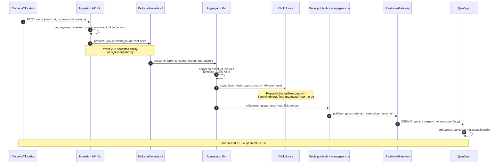

### Итоги раздела

⚖️ **Trade-off (сводно по разделу):**

- **Свежесть vs throughput/нагрузка**: батчинг и async inserts повышают пропускную способность записи, но добавляют задержку. Держим флаш в 1–5 c, чтобы влезть в бюджет свежести ≤ 10 c.
- **Точность vs скорость**: eventual + Good Enough — быстро показываем приблизительную цифру, корректируем позже. Платим тем, что в моменте данные «почти точные».
- **Ровность нагрузки vs локальность агрегации**: `tenant_id` даёт локальность и изоляцию, но риск hot partition; составной хэш-ключ даёт ровное распределение ценой cross-partition агрегации.
- **Простота vs контроль**: ClickHouse Kafka engine проще, внешний Go-консьюмер даёт контроль над дедупом/late/обогащением — берём его. Flink не берём — overkill для наших объёмов.
- **WS vs SSE**: для дашборда SSE достаточно и проще; WS — если нужна двунаправленность.

🎯 **Что сказать интервьюеру (резюме):** «Real-time путь MarketingPulse — это Kappa-конвейер на Kafka с at-least-once и идемпотентностью по `event_id` вместо иллюзорного exactly-once и дорогого 2PC. Партиционирование по `tenant_id` с осознанной защитой от hot partition крупного рекламодателя. Оконная агрегация tumbling 1 мин по `ts` с watermark и доагрегацией late-событий. Запись в ClickHouse батчами; роллапы — через Materialized Views на SummingMergeTree, дедуп детальных — на ReplacingMergeTree. Доставка — Realtime-Gateway (отдельный пул, sticky sessions) с fan-out через Redis pub/sub, шлём дельты, а не весь дашборд, с backpressure для медленных клиентов. Консистентность — eventual + Good Enough, и это сознательный инженерный выбор под бюджет свежести ≤ 10 c (p95 ≤ 5 c), а не компромисс от безысходности».

---

## Этап 5B. Low Level Design: формирование отчётов

На этом этапе мы детально проектируем вторую ключевую ось задачи MarketingPulse — **формирование тяжёлых отчётов**. Если real-time дашборд (см. раздел про LLD real-time доставки) отвечает на вопрос «что происходит прямо сейчас», то отчёты отвечают на вопрос «что было за период»: маркетолог хочет выгрузить расход, показы, клики, конверсии, CTR/CPC/CPM/CR/ROAS по 5 000 тенантам, всем площадкам (Google Ads, Meta Ads, Yandex Direct, VK Ads, TikTok Ads), с любыми срезами (кампания, канал, гео, устройство, период) в CSV/XLSX/PDF.

Канон по отчётам: **маленькие отчёты — почти мгновенно; большой отчёт за период — асинхронно, цель ≤ 1–2 мин**. Это ровно тот случай, который в главе 4 описан как «формирование годового отчёта» — классический пример, когда нужен асинхронный паттерн.

🎯 **Что сказать интервьюеру:** «Отчёты — это длительная операция с тяжёлым аналитическим чтением. Я не держу HTTP-соединение пользователя открытым на минуту, а перевожу процесс в асинхронный режим: создаю job, возвращаю 202 Accepted и id, а результат доставляю отдельно. Это прямо по методичке: разрываем жёсткую временну́ю связанность между клиентом и тяжёлым воркером.»

---

### 1. Почему async, а не синхронный запрос

Из главы 4 (выбор паттерна интеграции) есть чёткий критерий: **асинхронный паттерн выбираем, если операция длительная и мы не хотим заставлять пользователя ждать**, плюс хотим разорвать жёсткую связь между сервисами.

Разберём по пунктам применительно к MarketingPulse:

1. **Длительность.** Большой отчёт за квартал по всем площадкам и срезам — это агрегация по миллиардам строк (напомню канон: **40 000 событий/с → ≈ 3.46 млрд событий/сутки**, за 90 дней горячих ≈ 155 ТБ сырых). Даже из роллапов это секунды-десятки секунд, цель ≤ 1–2 мин. Синхронный HTTP столько висеть не должен.
2. **Временна́я связанность.** Синхронный вызов создаёт сильную связанность: пока воркер считает, поток приложения и соединение клиента заняты. При пике read-нагрузки (канон: **средняя ~150 QPS, пик ~800 QPS**) десятки таких «висящих» запросов забьют пул app-нод и убьют латентность лёгких запросов дашборда (цель **p95 ≤ 200 мс, p99 ≤ 500 мс**).
3. **Надёжность.** Если воркер или ClickHouse временно недоступны, сообщение просто подождёт в очереди — клиент уже получил id job и не зависит от мгновенной доступности исполнителя.

⚖️ **Trade-off:** асинхронность стоит сложности — нужны таблица job, очередь, воркеры, доставка результата и статусная модель. Но альтернатива (синхронный отчёт) не выдержит ни по латентности, ни по доступности дашборда. Маленькие отчёты (узкий срез, короткий период) при этом можно отдавать синхронно прямо из Redis/предагрегатов — не надо «строить космолёт» там, где запрос укладывается в сотни миллисекунд.

⚠️ **Частая ошибка:** делать ВСЕ отчёты асинхронными «для единообразия». Если отчёт за сегодня по одной кампании считается за 50 мс из роллапа — отдайте его синхронно. Async нужен именно для тяжёлых.

---

### 2. Модель job в PostgreSQL

Состояние отчёта — это OLTP-данные (канон: PostgreSQL хранит `report_jobs`). Source of truth по статусу job — Postgres, а не очередь и не Redis. Очередь только передаёт сигнал «есть работа», сам результат лежит в S3.

#### Таблица report_jobs

| Поле            | Тип              | Назначение                                                                 |
| ------------------- | ------------------- | ------------------------------------------------------------------------------------ |
| `id`              | uuid (PK)           | Идентификатор job, возвращается клиенту              |
| `tenant_id`       | uuid (FK, NOT NULL) | Мульти-тенантная изоляция; индекс для выборок |
| `created_by`      | uuid (FK)           | Пользователь (owner/admin/editor), кто заказал                 |
| `params`          | jsonb               | Срезы/период/формат:`{period, group_by[], filters{}, format}`     |
| `status`          | enum                | `pending` → `queued` → `running` → `done` / `failed` / `cancelled`    |
| `progress`        | smallint (0–100)   | Прогресс для UI                                                           |
| `result_url`      | text (nullable)     | Signed URL на готовый файл в S3                                        |
| `error`           | text (nullable)     | Текст/код ошибки при `failed`                                     |
| `idempotency_key` | text                | Ключ идемпотентности (UNIQUE с tenant_id)                        |
| `attempts`        | smallint            | Счётчик попыток обработки (для ретраев)             |
| `priority`        | enum                | `light` / `heavy` — для маршрутизации в пулы               |
| `created_at`      | timestamptz         | Время создания                                                          |
| `updated_at`      | timestamptz         | Последнее изменение статуса                                 |
| `expires_at`      | timestamptz         | Когда протухнет signed URL / можно чистить                 |

Ключевое ограничение в физической схеме (как учили в главе 4 — фиксировать бизнес-правила не только в коде, но и в БД):

```text
UNIQUE (tenant_id, idempotency_key)
```

Это и есть техническая защита от дублей (подробнее в п. 8).

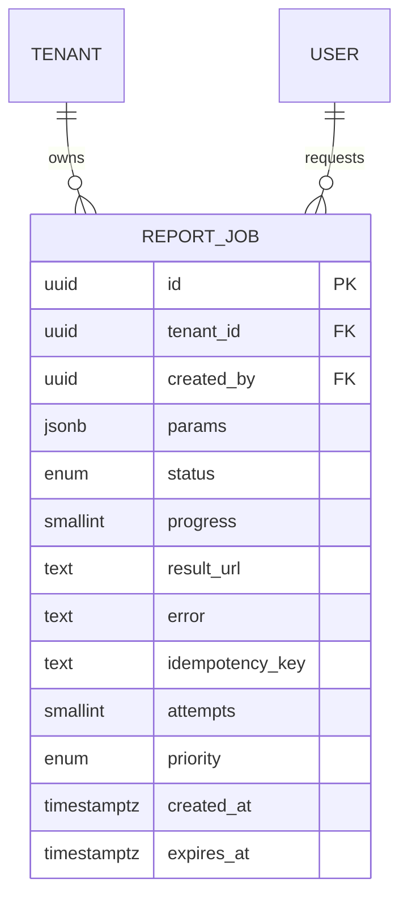

⚠️ **Частая ошибка:** хранить состояние job только в Redis или «в очереди». Очередь — транспорт, она не источник истины. Если воркер упал, мы должны по `report_jobs` понять, что job завис в `running`, и переставить его в очередь. Поэтому статус — в Postgres (strong consistency для управляющих данных), а аналитику считаем eventual.

---

### 3. Поток формирования отчёта (end-to-end)

Опишем алгоритм текстом (как рекомендует глава 4 — текстовый алгоритм + sequence-диаграмма):

1. **Триггер.** Клиент шлёт `POST /v1/reports` с телом (`params`: период, срезы, формат) и заголовком `Idempotency-Key`.
2. **API Gateway** проверяет auth (роль owner/admin/editor имеет право), rate-limit, прокидывает `trace_id`.
3. **Reports API (Python/FastAPI)** валидирует `params`, проверяет идемпотентность по `(tenant_id, idempotency_key)`:
   - если job с таким ключом уже есть — возвращает существующий `id` и его статус (никакой повторной работы);
   - иначе создаёт запись в `report_jobs` со статусом `pending`.
4. **Публикация в очередь.** Кладём сообщение `{job_id, tenant_id, priority}` в очередь отчётов (канон: **отдельный Kafka-топик или RabbitMQ/Redis**). Статус job → `queued`.
5. **Воркер** (пул, см. п. 5) забирает сообщение, ставит `running`, периодически обновляет `progress`.
6. **Тяжёлый запрос в ClickHouse.** Воркер строит агрегацию по срезам из `params`. **По умолчанию читаем из роллапов** (минутные/часовые/дневные Materialized Views), а не из сырых событий (см. п. 4).
7. **Форматирование.** Результат форматируется в CSV / XLSX / PDF.
8. **Выгрузка в S3/MinIO.** Готовый файл кладётся в объектное хранилище (канон: S3 хранит готовые отчёты).
9. **Обновление job.** Статус → `done`, `progress = 100`, `result_url` = signed URL (с TTL), `expires_at`.
10. **Уведомление клиента.** Через WebSocket/SSE (если пользователь онлайн на дашборде) и/или почту — «отчёт готов, ссылка на скачивание».
11. **Скачивание.** Клиент идёт по signed URL напрямую в S3/CDN (origin не нагружаем).

При ошибке (таймаут ClickHouse, нехватка памяти): статус → `failed`, `error` заполнен, либо ретрай по политике из п. 5.

🎯 **Что сказать интервьюеру:** «POST не возвращает сам отчёт. Он возвращает 202 Accepted + `job_id` и `status_url`. Дальше клиент либо поллит `GET /v1/reports/{id}`, либо ждёт push по WS/SSE. Файл скачивается не через наш бэкенд, а по signed URL прямо из S3 — это снимает с app-нод трафик гигабайтных выгрузок.»

#### Контракт API (кратко)

| Метод | Путь             | Назначение                             | Ответы                                                                                      |
| ---------- | -------------------- | ------------------------------------------------ | ------------------------------------------------------------------------------------------------- |
| `POST`   | `/v1/reports`      | Создать job (с `Idempotency-Key`)      | `202 Accepted` `{id, status}`, `409 Conflict` при гонке, `400` валидация |
| `GET`    | `/v1/reports/{id}` | Статус/прогресс/результат | `200` `{status, progress, result_url}`                                                        |
| `GET`    | `/v1/reports`      | Список job тенанта                  | `200` массив                                                                              |
| `DELETE` | `/v1/reports/{id}` | Отмена (если ещё не `done`)     | `200` / `409`                                                                                 |

---

### 4. Предагрегация и материализованные представления

Главная идея: **тяжёлые отчёты считаются из роллапов, а не из сырых событий.** Это прямо отражает канон-стек: ClickHouse + Materialized Views для роллапов (минутные/часовые/дневные агрегаты), а также совет из главы 5 — «Pre-aggregation: заранее посчитанные данные (материализованные представления)».

Почему это критично по числам:

- Сырых событий ≈ **3.46 млрд/сутки**, за 90 дней ≈ 155 ТБ. Считать ROAS за квартал по сырью — это сканировать триллионы строк.
- Дневной роллап по (tenant, campaign, channel, geo, device) сжимает это в тысячи-миллионы строк. Запрос за квартал по такому роллапу — секунды, что укладывается в цель **≤ 1–2 мин** с огромным запасом.

Стратегия: stream-консьюмеры (Go) пишут сырьё в ClickHouse, а Materialized Views поддерживают предрассчитанные агрегаты на лету. Отчёт читает нужный уровень гранулярности:

| Период отчёта                                                                              | Откуда читаем                                          |
| ------------------------------------------------------------------------------------------------------ | ------------------------------------------------------------------ |
| Сегодня, по часам                                                                        | Часовой/минутный роллап                       |
| Неделя/месяц/квартал, по дням                                                  | Дневной роллап                                        |
| Произвольная редкая гранулярность / нестандартный срез | Raw-события (90 дней горячих в ClickHouse)      |
| Старше 90 дней                                                                               | Backfill из S3 (холодное хранилище, 2 года) |

#### Когда всё же идём в raw

Роллап покрывает 90%+ запросов, но не все. В raw-события идём, когда:

- нужен срез по измерению, которого нет в предрассчитанном роллапе (редкая комбинация фильтров);
- нужна произвольная гранулярность тоньше минуты;
- нужен пересчёт истории — тогда backfill из S3 (элемент Lambda поверх Kappa-архитектуры: единый стрим Kafka → ClickHouse, с возможностью переиграть историю из S3).

⚖️ **Trade-off:** держать много вариантов роллапов = быстрые отчёты, но больше места и сложнее поддержка MV. Держать только raw = гибко, но медленно и дорого по CPU/диску ClickHouse. Баланс: roll-up под частые срезы дашборда, raw — как fallback под редкие.

⚠️ **Частая ошибка:** «давайте каждый отчёт считать из сырья — так точнее». При 3.46 млрд событий/сутки это гарантированно не уложится в 1–2 мин и будет конкурировать за ClickHouse с real-time дашбордом.

---

### 5. Масштабирование воркеров

Воркеры отчётов — это I/O- и CPU-bound нагрузка (тяжёлый запрос + форматирование XLSX/PDF). Масштабируем их горизонтально под HPA (канон: Kubernetes + HPA), отдельно от ingestion и app-нод.

#### Пул и приоритеты очередей

Используем **раздельные очереди по приоритету**: `reports.light` и `reports.heavy`. Лёгкие отчёты (узкий срез, короткий период) не должны стоять за квартальной выгрузкой по всем тенантам.

#### Bulkhead — раздельные пулы

Прямо по главе 5 (паттерн Bulkhead / Переборки: «выделить отдельные worker-пулы под разные типы задач»):

| Пул                  | Обрабатывает                      | Поведение                                                                                                                  |
| ----------------------- | --------------------------------------------- | ----------------------------------------------------------------------------------------------------------------------------------- |
| **Light workers** | Мелкие/быстрые отчёты      | Много воркеров, короткие таймауты, высокий приоритет                                   |
| **Heavy workers** | Большие отчёты за период | Меньше воркеров, ограниченная конкурентность к ClickHouse, длинные таймауты |

Так тяжёлый отчёт одного тенанта не «съест» все воркеры и не заблокирует лёгкие отчёты остальных (head-of-line blocking).

#### Таймауты, ретраи, идемпотентность повторной обработки

1. **Таймауты.** На запрос к ClickHouse и на job целиком (deadline propagation из главы 3). Превысили — `failed` с понятной ошибкой, не висим вечно.
2. **Ретраи.** При временной ошибке (таймаут, недоступность ClickHouse/S3) — повторная обработка с backoff, `attempts++`. После N попыток → `failed` + алерт (это деградация, а не «данных нет» — не путаем, как в главе 3 про кеш ошибок).
3. **Идемпотентность повторной обработки.** Это про *внутренний* ретрай воркера, не путать с `Idempotency-Key` клиента. Воркер может упасть после генерации файла, но до апдейта Postgres. Поэтому повторная обработка того же `job_id` должна быть безопасной: перезаписываем файл в S3 по детерминированному ключу (`{tenant_id}/{job_id}.xlsx`) и идемпотентно обновляем job. Дубля результата не возникает.
4. **Backpressure.** Если очередь heavy растёт быстрее, чем воркеры успевают (канон: контролируем конкурентность к ClickHouse), не плодим бесконечно воркеров — даём клиенту ETA и держим стабильную латентность для остальных.

🎯 **Что сказать интервьюеру:** «Я физически разделяю лёгкие и тяжёлые отчёты на разные очереди и пулы воркеров — bulkhead. Иначе один квартальный отчёт по всем площадкам заблокирует все мелкие выгрузки, и пользователи решат, что система зависла.»

---

### 6. Отчёты по расписанию

Канон ФТ: «отчёты по расписанию». Реализуется отдельным **cron-сервисом** (планировщик), который по расписанию тенанта **создаёт точно такие же job**, как и ручной запрос:

1. Cron-сервис (например, k8s CronJob или отдельный scheduler) по расписанию читает конфигурации расписаний из Postgres.
2. Для каждого срабатывания создаёт запись в `report_jobs` (как будто это `POST /v1/reports`) с `idempotency_key`, привязанным к (расписание + временное окно). Это защищает от двойного запуска при рестарте планировщика.
3. Дальше — тот же поток: очередь → воркер → S3 → уведомление (обычно почта, т.к. пользователь оффлайн).

⚖️ **Trade-off:** не делаем отдельный движок генерации под scheduled-отчёты. Переиспользуем ту же job-модель и тех же воркеров — меньше кода, меньше расхождений в логике. Cron только *порождает* job, а не считает сам.

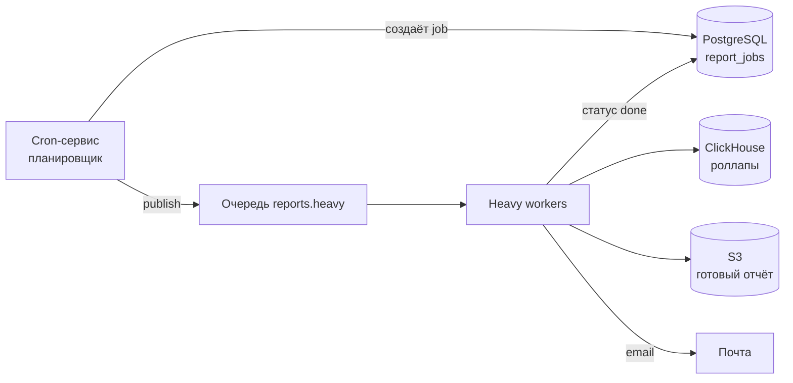

---

### 7. Деградация и good-enough при пиках

При пике read-нагрузки (**~800 QPS**) и наплыве отчётов нельзя дать ClickHouse и воркерам захлебнуться. Применяем graceful degradation и приём **Good Enough** из главы 3 («лучше быстро сделать хоть что-то, чем очень долго идеально»).

Уровни деградации для отчётов:

1. **Ограничить период / срез.** Если запрошен слишком широкий диапазон под пиком — предложить разбить или ограничить (например, максимум квартал на один job).
2. **Приблизительный результат из роллапов.** Вместо точного raw-расчёта отдать агрегат из дневного роллапа с пометкой «приблизительно, расхождение в пределах нормы». Аналитика и так eventual (канон: расхождение в секунды приемлемо), поэтому это допустимо для отчётов-обзоров.
3. **Очередь с ETA.** Если воркеры заняты — честно поставить job в очередь и показать ETA, а не отказывать. Клиент получит push, когда готово.
4. **Rate-limit на тенанта.** Ограничить число одновременных тяжёлых job на тенант (через Redis), чтобы один агентский аккаунт не выжал весь heavy-пул.

🎯 **Что сказать интервьюеру:** «Под пиком я скорее отдам приблизительный отчёт из дневного роллапа с честной пометкой и ETA, чем заставлю пользователя ждать точный raw-расчёт и положу при этом ClickHouse, от которого зависит real-time дашборд. Бюджеты/квоты — strong, а аналитические отчёты — eventual, тут good-enough уместен.»

⚠️ **Частая ошибка:** под нагрузкой просто возвращать 500/таймаут. Лучше деградировать управляемо (good-enough + ETA), чем падать.

---

### 8. Защита от дубликатов через Idempotency-Key

Это прямая аналогия с примером «дюпа» из главы 4: в банковском приложении быстрый двойной клик по «Перевести» создавал несколько одинаковых переводов, потому что **отсутствовал ключ идемпотентности**. Вывод из методички: «операция должна выполняться ровно один раз» — критическое требование, и решается оно на двух уровнях:

1. **Фронт** блокирует кнопку «Сформировать отчёт» после клика (UX-защита).
2. **Бэкенд обязан проверять идемпотентность** — это защита от повторных запросов (двойной клик, ретрай сети, повтор от мобильного клиента).

Для MarketingPulse сценарий тот же: маркетолог дважды нажал «Сформировать отчёт» — мы не должны запускать два одинаковых тяжёлых расчёта (это лишняя нагрузка на ClickHouse и два файла в S3).

Механика:

- Клиент генерирует `Idempotency-Key` (uuid) на одно нажатие и шлёт в заголовке.
- Сервер при создании job делает вставку с `UNIQUE (tenant_id, idempotency_key)`.
- Если ключ уже есть — **возвращаем существующий job** (его `id` и `status`), а не создаём новый. Повторный запрос идемпотентен: эффект ровно один.

```text
POST /v1/reports
Idempotency-Key: 7c9e6679-7425-40de-944b-e07fc1f90ae7
Body: { period: "2026-Q1", group_by: ["campaign","channel"], format: "xlsx" }

→ первый раз:  202 Accepted { id: "job-123", status: "pending" }
→ повтор:      202 Accepted { id: "job-123", status: "running" }   // тот же job
```

⚠️ **Частая ошибка:** полагаться только на блокировку кнопки на фронте. Фронт может сглючить, прийти ретрай от сети или второй вкладки — без серверной проверки идемпотентности получим дубль расчёта. Защита на бэкенде обязательна.

---

### 9. Полная sequence-диаграмма процесса

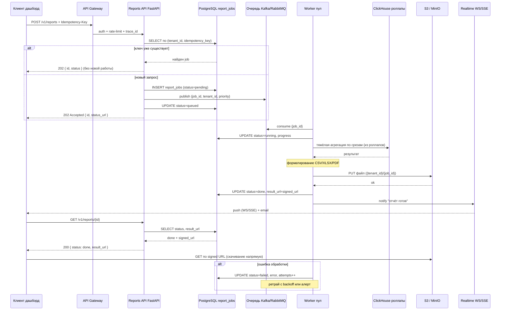

---

### 10. Связь с остальной системой и границы

- **Не дублируем** инфраструктуру real-time доставки — переиспользуем те же WS/SSE-каналы и Redis pub/sub для уведомления «отчёт готов» (подробнее в разделе про real-time дашборд).
- **Не дублируем** ingestion — отчёты только *читают* из ClickHouse, который наполняется стримом из Kafka (подробнее в разделе про ingestion-пайплайн).
- **Out of scope:** ML-атрибуция конверсий, антифрод — отчёт показывает уже посчитанные метрики, а не строит модели атрибуции.

---

### Итог раздела

🎯 **Что сказать интервьюеру:** «Формирование тяжёлых отчётов в MarketingPulse — это асинхронный процесс через job-модель в Postgres и очередь, потому что операция длительная и держать соединение пользователя нельзя — это разрыв жёсткой связанности из главы про интеграции. Job (id, tenant_id, params, status, progress, result_url, error, idempotency_key) — source of truth в Postgres; результат — файл в S3 со signed URL. Тяжёлые запросы идут в ClickHouse, и я считаю их из материализованных роллапов, а не из 3.46 млрд сырых событий в сутки — в raw спускаюсь только для редких срезов и backfill из S3. Воркеры масштабирую горизонтально под HPA, разделяю лёгкие и тяжёлые отчёты на разные очереди и пулы (bulkhead), ставлю таймауты, ретраи с идемпотентной повторной обработкой. Под пиком деградирую управляемо: ограничиваю период, отдаю приблизительный результат из роллапов, ставлю в очередь с ETA — аналитика eventual, это допустимо. От двойного клика защищаюсь Idempotency-Key с UNIQUE-ограничением в Postgres — ровно как в примере с дюпом перевода: один ключ → один отчёт. Цель — большой отчёт за 1–2 минуты, не ломая латентность дашборда (p95 ≤ 200 мс) и не конкурируя за ClickHouse с real-time метриками.»

---

## Этап 5C. Кеширование, шардирование и консистентность

Это последний из «low-level» этапов: к этому моменту у нас уже есть высокоуровневая архитектура MarketingPulse (Kafka → консьюмеры на Go → ClickHouse, Postgres под OLTP, Redis под кеш, S3 под холодные данные и отчёты). Теперь мы опускаемся на уровень данных и отвечаем на три приземлённых вопроса, которые любят на собесе:

1. **Где и что мы кешируем**, чтобы держать p95 ≤ 200 мс и p99 ≤ 500 мс на API дашборда при пике ~800 QPS, не убив при этом ClickHouse?
2. **Как мы режем данные в ClickHouse** (партиционирование/шардирование), чтобы 3.46 млрд событий/сутки и ~16–20 ТБ горячих данных на диске оставались управляемыми?
3. **Где нам нужна strong-консистентность, а где хватает eventual**, и почему смешивать эти модели — норма, а не грех.

> 🎯 Что сказать интервьюеру: «Кеш и шардирование в MarketingPulse — это не отдельные оптимизации, а способ закрыть три ключевые оси задачи: высокую запись (партиционирование ClickHouse), real-time чтение (многоуровневый кеш под p95 ≤ 200 мс) и тяжёлые отчёты (пред-агрегаты + cross-shard aggregation). Я буду явно разделять, где аналитика и можно жить с eventual, а где деньги/квоты и нужен strong».

---

### 5C.1. Многоуровневый кеш под MarketingPulse

Базовый принцип (подробнее в разделе про продвинутое кеширование): отдавать данные как можно ближе к пользователю и как можно раньше по пути запроса. Чем раньше попали в кеш — тем ниже задержка и тем меньше нагрузка на ClickHouse/Postgres.

У нас два сильно разных профиля чтения, и кеш под них разный:

- **Real-time push** (метрики на дашборде, обновление ≤ 5–10 c) — идёт через Realtime-Gateway и Redis pub/sub, это отдельная история (подробнее в разделе про real-time доставку).
- **Аналитические pull-запросы** (срезы, фильтры, открытие дашборда, подгрузка таблиц) — ~150 QPS в среднем, ~800 QPS на пике. Вот их и закрывает многоуровневый кеш ниже.

#### Уровни кеша и что на них лежит

| Уровень               | Где живёт         | Что храним в MarketingPulse                                                                                                                                                                              | TTL / инвалидация                                                       | Задержка              |
| ---------------------------- | ------------------------- | ------------------------------------------------------------------------------------------------------------------------------------------------------------------------------------------------------------------ | ---------------------------------------------------------------------------------- | ----------------------------- |
| **Браузер**     | клиент              | статика SPA (JS/CSS/шрифты), иконки площадок                                                                                                                                            | долгий TTL + версионирование по хэшу                    | ~0                            |
| **CDN**                | edge                      | статика,**готовые отчёты** (CSV/XLSX/PDF по signed URL)                                                                                                                                | отчёт иммутабелен → долгий TTL                              | единицы мс до edge |
| **L1 in-process**      | память app-ноды | фича-флаги, права/роли (owner/admin/editor/viewer), справочники (категории кампаний, список площадок), маппинг tenant→шард                 | секунды–минуты + event-based сброс                              | < 1 мс                      |
| **L2 Redis (cluster)** | общий кеш         | **пред-агрегаты дашборда**, топ-срезы тенанта, результаты тяжёлых аналитических запросов, сессии, rate-limit-счётчики | секунды–минуты (TTL), для метаданных — tag/event-based | 1–3 мс                     |
| **ClickHouse**         | OLAP source of truth      | минутные/часовые/дневные роллапы (Materialized Views), детальные события 90 дней                                                                                  | — (источник правды для аналитики)                       | 10–100+ мс                 |

Важно: **ClickHouse — это source of truth для аналитики, а не «ещё один кеш»**. Postgres — source of truth для OLTP (tenants, users, campaigns-метаданные, бюджеты, report_jobs). Redis и L1 — производные, их можно потерять и пересобрать.

> ⚖️ Trade-off: L1 даёт < 1 мс, но он локальный — у каждой из 4–8 Realtime-Gateway / app-нод свой набор. Значит, на L1 кладём только то, что либо редко меняется (справочники, фича-флаги), либо где локальный рассинхрон на секунды безболезнен (права — со сбросом по событию при смене роли). Горячие метрики на L1 не кладём: рассинхрон между нодами на дашборде заметен глазу.

#### Hit rate — ключевая метрика

Кеш без метрик — это не кеш, а лотерея. Главная метрика — **hit rate по слою** (доля запросов, обслуженных из кеша) плюс задержка по слоям (через Prometheus/Grafana).

- **L2 Redis под пред-агрегаты дашборда: цель hit rate ≥ 90–95%.** Логика: данные тенанта на дашборде смотрят многократно за короткий период, а сами агрегаты обновляются раз в секунды. При 800 QPS пика и hit rate 95% в ClickHouse дойдёт лишь ~40 QPS «холодных» запросов — это комфортно.
- Падение hit rate — это алерт: либо TTL слишком короткий, либо посыпались ключи (выселение по памяти), либо кто-то добавил высококардинальный срез в ключ кеша.

> ⚠️ Частая ошибка: «поставим Redis — и всё ускорится». На собесе от вас ждут не упоминание Redis, а ответ: какие слои, что на каждом, чем платим за согласованность между слоями, какой целевой hit rate. Без этого ответ «не зачтён».

---

### 5C.2. Четыре стратегии наполнения кеша — что где применяем

Напомню 4 канонические стратегии (подробный разбор — в разделе про продвинутое кеширование): **Cache-Aside, Read-Through, Write-Through, Write-Behind**. Здесь — как они ложатся на MarketingPulse.

| Что кешируем                                                                                                                                 | Стратегия                                         | Почему именно так                                                                                                                                                                                                                                                                                                                                                          |
| ------------------------------------------------------------------------------------------------------------------------------------------------------- | ---------------------------------------------------------- | ----------------------------------------------------------------------------------------------------------------------------------------------------------------------------------------------------------------------------------------------------------------------------------------------------------------------------------------------------------------------------------------- |
| Пред-агрегаты дашборда (метрики, топ-срезы)                                                                          | **Cache-Aside + короткий TTL (5–10 c)**     | Источник правды — ClickHouse. Промах → читаем агрегат → кладём в Redis с TTL под цель свежести real-time. Просто, прозрачно, легко выкинуть                                                                                                                                                        |
| Метаданные кампаний/аккаунтов (имена, статусы)                                                                   | **Cache-Aside + event-based инвалидация** | Меняются редко, но «руками» (правка в Postgres) → при изменении шлём событие и сбрасываем ключ, а не ждём TTL                                                                                                                                                                                                 |
| Справочники, фича-флаги, права                                                                                                 | **Read-Through (L1) + event-based сброс**       | Логику загрузки удобно спрятать; данные стабильные                                                                                                                                                                                                                                                                                            |
| Аналитические счётчики (служебная аналитика самой платформы: usage, эвенты продукта) | **допустим Write-Behind**                    | Здесь сознательно жертвуем строгой консистентностью ради пропускной способности: пишем в кеш, БД наполняем батчами фоном. Допустимо ровно потому, что это данные, которые не страшно слегка отстать/потерять |

**Почему для метрик дашборда — именно Cache-Aside с коротким TTL, а не Write-Through/Write-Behind?**
Потому что метрики мы **не пишем через кеш** — они рождаются в стриме (Kafka → ClickHouse Materialized Views). Кеш здесь — это «снимок результата тяжёлого SELECT-агрегата», а не путь записи. Write-Through/Write-Behind имеют смысл там, где запись идёт *через* кеш; у нас путь записи — это ingestion-пайплайн, а не дашбордный кеш.

> ⚠️ Частая ошибка: предложить **Write-Behind для бюджетов/квот** «чтобы было быстро». Это прямой путь к перерасходу бюджета: данные в кеше свежее, чем в БД, плюс риск потери при падении очереди. Деньги и квоты через Write-Behind не пишем — никогда (см. 5C.4 и 5C.6).

---

### 5C.3. Инвалидация и cache stampede

#### Инвалидация по типам данных

- **Метрики/агрегаты дашборда → TTL (секунды–минуты).** Цель свежести real-time ≤ 10 c, p95 ≤ 5 c → TTL пред-агрегатов держим в районе 5–10 c. Явная инвалидация тут избыточна: данные и так быстро устаревают и перечитываются. TTL-only здесь — это фича, а не лень.
- **Метаданные кампаний/аккаунтов → event-based + tag-based.** При правке кампании в Postgres шлём событие; подписчики сбрасывают связанные ключи. Tag-based нужен, чтобы одним движением выбить все производные срезы: помечаем все ключи дашборда тенанта/кампании тегом (например `tenant:42:campaign:777`) и при изменении выбиваем весь тег, а не перечисляем ключи руками.

#### Cache stampede / thundering herd на горячем тенанте

Сценарий: крупное агентство (большой тенант) с горячим дашбордом. TTL агрегата истёк → одновременно прилетает, скажем, сотни запросов на один и тот же тяжёлый срез → все мимо кеша → все ломятся в ClickHouse → шип нагрузки и рост p99 ровно в момент «выдоха» кеша.

Лечим стандартным набором (подробнее — в разделе про продвинутое кеширование):

1. **Per-key mutex / request coalescing.** Первый промахнувшийся берёт блокировку по ключу и идёт в ClickHouse; остальные ждут результат и переиспользуют его. В ClickHouse уходит **один** запрос вместо сотен.
2. **Раннее перевычисление (early recomputation / probabilistic early expiration).** Обновляем агрегат фоном *до* истечения TTL, чтобы горячий ключ не «обнулялся» под пиком. Для топовых тенантов — фоновый refresher, который держит их пред-агрегаты всегда тёплыми.
3. **Stale-while-revalidate.** На время пересчёта отдаём чуть устаревшее значение (это «Good Enough»: для аналитики расхождение в секунды по канону приемлемо), а свежее подкладываем асинхронно.

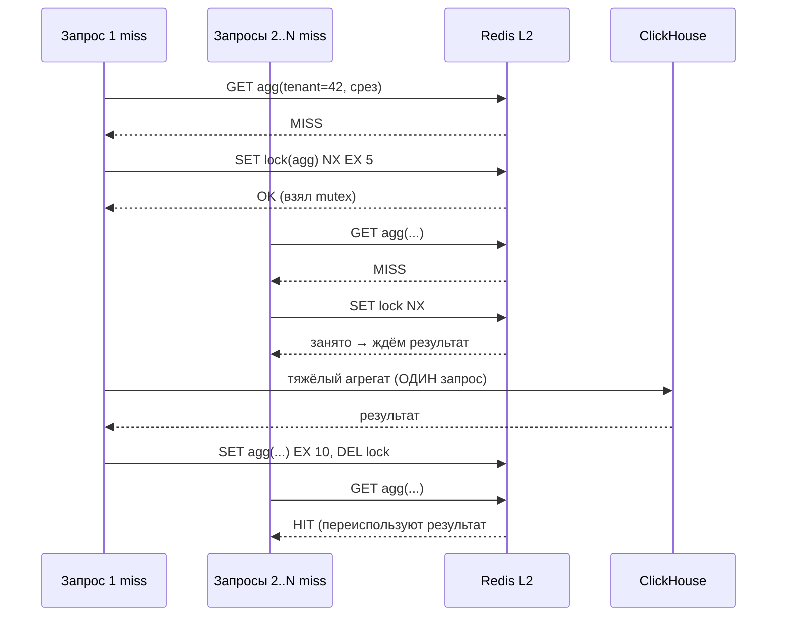

#### Что НЕ кешируем

| Не кешируем                                                    | Почему                                                                                                                                                                                                                                                                                                                                       |
| ------------------------------------------------------------------------ | -------------------------------------------------------------------------------------------------------------------------------------------------------------------------------------------------------------------------------------------------------------------------------------------------------------------------------------------------- |
| **Бюджеты, остатки бюджета, квоты**      | По канону — строго из Postgres-транзакций (strong). «Чуть устаревшее значение» здесь недопустимо: перерасход бюджета = деньги клиента и алерт «расход > бюджет», который мы обязаны не пропустить |
| **Биллинг**                                                 | То же — strong, источник правды Postgres                                                                                                                                                                                                                                                                                        |
| **Короткоживущее**                                   | Одноразовые токены, статусы job с TTL в пару секунд — кешировать нечего                                                                                                                                                                                                                       |
| **Сетевые сбои и 5xx внешних площадок** | Не кешируем как «данные»: это лечится ретраями/circuit breaker, иначе закрепим аварию площадки как «новую норму». (Кешировать «пусто/404» от API площадки на короткое время — можно)                              |

> ⚖️ Trade-off: чем агрессивнее кешируем, тем меньше нагрузка на ClickHouse/Postgres, но тем больше памяти Redis (3–6 нод) и сложности инвалидации, и тем выше риск показать клиенту устаревший бюджет. Поэтому бюджеты/квоты сознательно оставляем «дорогими» — читаем из БД, а не строим вокруг них монстра из кеша и инвалидации.

---

### 5C.4. Шардирование и партиционирование ClickHouse

Здесь работает ровно та же иерархия решений, что в базовом ликбезе по шардированию: сначала индексы/денормализация, потом вертикаль, и только потом — резать данные. В ClickHouse при нашем потоке (3.46 млрд событий/сутки, ~1.73 ТБ сырых/сутки) резать приходится сразу — это write-heavy профиль по определению.

#### Как режем: PARTITION BY дате + распределение по tenant_id

Для таблицы событий (упрощённо):

```sql
-- локальная таблица на каждом шарде (ReplicatedReplacingMergeTree)
CREATE TABLE events_local
(
    tenant_id    UInt32,
    campaign_id  UInt64,
    platform     LowCardinality(String),  -- google/meta/yandex/vk/tiktok
    event_type   LowCardinality(String),  -- impression/click/conversion
    geo          LowCardinality(String),
    device       LowCardinality(String),
    ts           DateTime,
    event_id     UInt64,
    ...
)
ENGINE = ReplicatedReplacingMergeTree
PARTITION BY toYYYYMMDD(ts)          -- партиция = сутки
ORDER BY (tenant_id, campaign_id, ts, event_id) -- event_id в ключе → дедуп при merge
```

Два разных механизма, не путать:

- **PARTITION BY `toYYYYMMDD(ts)` — партиционирование по дате (внутри шарда).** Партиция = сутки.
- **Шардирование (распределение между нодами) — по `tenant_id`** (через Distributed-таблицу, ключ шардирования по `cityHash64(tenant_id)`). Это размазывает 5 000 тенантов по 2 шардам.

#### Почему партиционируем именно по дате

1. **Retention.** Канон: горячие детальные события — 90 дней. С суточными партициями ретеншн = `DROP PARTITION` старше 90 дней. Это мгновенная операция (просто удаление кусков), а не тяжёлый `DELETE ... WHERE` по миллиардам строк.
2. **Горячее/холодное.** Свежие партиции (последние дни) — горячие, под real-time дашборд; старые — на медленный storage / выгрузка сырья в S3 (2 года, холодное). TTL-перемещение партиций между дисками настраивается нативно.
3. **Запросы дашборда почти всегда с фильтром по периоду** (день/неделя/месяц) → ClickHouse читает только нужные суточные партиции (partition pruning), не сканируя 90 дней.
4. **Бэкап/слияния** работают покусочно, а не по всей таблице.

> 🎯 Что сказать интервьюеру: «PARTITION BY дате — потому что три из наших требований завязаны на дату: retention 90 дней через DROP PARTITION, разделение горячее/холодное, и фильтр по периоду в каждом дашбордном запросе. А распределение по tenant_id — потому что мульти-тенантность: типичный запрос идёт в рамках одного тенанта и должен попадать в один шард, без cross-shard fan-out».

#### Почему сортировка по `(tenant_id, campaign_id, ts, event_id)`

- **Мульти-тенантная изоляция запросов**: фильтр по `tenant_id` сразу обрезает чтение до данных одного тенанта (разреженный индекс ClickHouse).
- Это же делает типовой запрос «метрики тенанта за период» однотенантным и быстрым — попадаем в цель p95 ≤ 200 мс через пред-агрегаты.
- **`event_id` последним в ключе** — чтобы `ReplicatedReplacingMergeTree` схлопывал повторно доставленные события (Kafka at-least-once) при фоновом merge; механика дедупа разобрана в разделе 5A.

---

### 5C.5. Hot key, cross-shard aggregation и роллапы

#### Hot key: огромный рекламодатель

Канонический риск шардирования — **hot key** (см. базовый ликбез): один тенант-гигант (крупное агентство с сотнями кампаний) даёт несоразмерную долю событий и запросов → перекос распределения → его шард становится bottleneck, хотя ключ `tenant_id` в среднем выбран нормально.

Как лечим (по нарастающей, без «космолёта»):

1. **Агрессивная пред-агрегация через Materialized Views.** Это первая и главная линия обороны: горячий тенант почти никогда не читает сырые события, он читает минутные/часовые/дневные роллапы. Тяжесть уходит со чтения сырья.
2. **Суб-партиционирование/субключ по `campaign_id`** внутри горячего тенанта — сортировка уже включает `campaign_id`, поэтому его запросы по конкретным кампаниям не сканируют весь объём тенанта.
3. **Изоляция ресурсов.** Если один тенант реально «шумный сосед» (noisy neighbor) — выделяем ему отдельные ресурсы/квоты на запросы (ClickHouse quotas, отдельный пул), чтобы он не ел latency остальных. В крайнем случае — отдельное размещение, но это уже усложнение под конкретный, доказанный метриками кейс.

> ⚠️ Частая ошибка: с ходу предлагать «отдельный кластер на каждого крупного клиента». Это преждевременный «космолёт». Сначала — пред-агрегация и квоты; выделение ресурсов под конкретного гиганта вводим, только когда метрики показали реальный перекос.

#### Роллапы (Materialized Views)

Поток из Kafka, который консьюмеры на Go вставляют батчами в `events_local`, триггерит каскад MV: минутные → часовые → дневные агрегаты по ключам `(tenant_id, campaign_id, platform, geo, device)`. Метрики impressions/clicks/spend считаются суммами, а производные (CTR, CPC, CPM, CR, ROAS) — на лету из этих сумм. Дашборд читает агрегаты, а не сырьё → это и есть основа p95 ≤ 200 мс.

#### Cross-shard aggregation: «отчёт по всем кампаниям тенанта»

Поскольку данные тенанта обычно живут на одном шарде, базовый запрос «всё по тенанту» — НЕ cross-shard, и это намеренно. Cross-shard возникает в двух случаях:

- большой тенант, чьи данные пришлось размазать суб-ключом по нескольким шардам;
- кросс-тенантные/платформенные отчёты (наша внутренняя аналитика).

Здесь работает **Distributed-таблица ClickHouse**:

```sql
CREATE TABLE events AS events_local
ENGINE = Distributed(cluster_mp, currentDatabase(), events_local, cityHash64(tenant_id));
```

Клиент шлёт один запрос в Distributed-таблицу; ClickHouse сам делает fan-out по шардам, считает частичные агрегаты на каждом и сливает результат (это и есть cross-shard aggregation из ликбеза — «оборот по продавцам», только у нас «spend/ROAS по кампаниям»). Распределённый план строит сам ClickHouse — нам не надо городить координатор руками.

Для тяжёлых отчётов за большой период (цель ≤ 1–2 мин) это всё равно делается **асинхронно**: воркер отчётов гоняет cross-shard агрегат, складывает результат в S3, отдаёт signed URL, статус job пишет в Postgres (подробнее — в разделе про асинхронные отчёты).

> ⚖️ Trade-off: распределение по `tenant_id` оптимизирует частый кейс (запрос в рамках тенанта = один шард, без fan-out), ценой того, что кросс-тенантные и гигант-тенантные отчёты становятся cross-shard и тяжелее. Это правильный размен: однотенантных real-time запросов на порядки больше, чем кросс-тенантных отчётов, а отчёты у нас и так асинхронные.

---

### 5C.6. Консистентность: где eventual, где strong

Связь с CAP — коротко: при сетевом разделе нельзя одновременно держать и доступность, и строгую согласованность. Поэтому мы **не делаем всю систему одинаковой**, а режем по данным (ровно как в разделе про распределённые транзакции).

| Данные                                                      | Модель                                               | Где живёт                                   | Обоснование                                                                                                                                                                                                                                                                 |
| ----------------------------------------------------------------- | ---------------------------------------------------------- | --------------------------------------------------- | -------------------------------------------------------------------------------------------------------------------------------------------------------------------------------------------------------------------------------------------------------------------------------------- |
| Метрики дашборда, агрегаты, real-time push | **eventual**                                         | ClickHouse + Redis                                  | Канон: расхождение в секунды приемлемо. Поток Kafka→ClickHouse и кеш с TTL по определению дают задержку в секунды — и это ок при цели свежести ≤ 10 c                              |
| Бюджеты, остатки, квоты, биллинг        | **strong**                                           | Postgres (ACID-транзакции)                | Перерасход бюджета и неверная квота — это деньги и доверие клиента. Здесь нужна гарантия: успешная запись → любое следующее чтение видит новое значение |
| Метаданные (campaigns, ad_accounts, roles)              | strong на запись (Postgres) / eventual в кеше | Postgres + кеш с event-инвалидацией | Пишем строго в БД, читаем из кеша с быстрой инвалидацией по событию                                                                                                                                                             |

**Где линеаризуемость НЕ нужна:** практически везде в аналитике. Нам всё равно, в каком именно порядке два маркетолога увидели обновление CTR — лишь бы значения сошлись за секунды. Тратить деньги, доступность и сложность (минусы strong-моделей) на линеаризуемость аналитики — это переусложнение.

**Где strong действительно нужна:** узкий слой «деньги/квоты». Реализуем его как небольшой strong-островок на Postgres-транзакциях (проверка инварианта «расход ≤ бюджет» в одной транзакции), а вся остальная система живёт на eventual. Это та самая практика «маленький strong-сервис, а вокруг eventual», что и в основном курсе.

> ⚠️ Частая ошибка: тянуть strong-консистентность на весь дашборд «чтобы цифры всегда были точные». Это убивает доступность (SLA дашборда 99.9%) и масштабирование записи (ingestion 99.95%, write-heavy), а пользы ноль — аналитике eventual достаточно по требованиям.

---

### Итог раздела

> ⚖️ Trade-off (память / сложность / риск хвостов):
>
> - **Кеш**: больше слоёв и агрессивнее кеширование → ниже p95/p99 и меньше нагрузка на ClickHouse, но → больше памяти Redis (3–6 нод), сложнее инвалидация, и выше риск **stampede на горячем тенанте** (всплеск p99 в момент истечения TTL). Лечим per-key mutex + ранним перевычислением, а не «просто увеличим Redis».
> - **Шардирование**: распределение по `tenant_id` + PARTITION BY дате даёт быстрый retention (DROP PARTITION), горячее/холодное и однотенантные запросы без fan-out — ценой того, что hot-key (тенант-гигант) и кросс-тенантные отчёты становятся cross-shard. Размен сознательный.
> - **Консистентность**: eventual для аналитики покупает доступность и дешёвую запись ценой расхождения в секунды (приемлемо по канону); strong для денег/квот покупает корректность ценой того, что эти данные нельзя кешировать и они «дороже» в чтении.

> 🎯 Что сказать интервьюеру: «Я строю кеш и шардирование вокруг трёх осей MarketingPulse. Под чтение — многоуровневый кеш (браузер → CDN → L1 in-process → L2 Redis → ClickHouse как source of truth), цель hit rate на Redis ≥ 90–95%, метрики через Cache-Aside с TTL 5–10 c под свежесть real-time, метаданные через event/tag-based инвалидацию, stampede лечу per-key mutex и ранним перевычислением. Под запись — ClickHouse с PARTITION BY дате (retention 90 дней через DROP PARTITION, горячее/холодное) и распределением по tenant_id (мульти-тенантная изоляция, однотенантные запросы без fan-out); hot-key гасим пред-агрегацией и квотами, не отдельным кластером на клиента. По консистентности — eventual для всей аналитики (расхождение в секунды по требованиям ок) и узкий strong-островок на Postgres-транзакциях для бюджетов и квот, которые я принципиально не кеширую. То есть не строю космолёт: усложнение ввожу точечно и только там, где его требуют конкретные числа и SLA».

---

## Качества под нагрузкой: задержки, масштабирование, отказоустойчивость

Этот раздел — про то, как защищать MarketingPulse, когда система уже спроектирована и начинает работать под реальной нагрузкой: поток в 40 000 событий/с со всплесками до 120 000, ~10 000 одновременных real-time сессий и тяжёлые аналитические запросы дашборда. Здесь нет новых компонентов — мы берём канон-стек (Kafka → ClickHouse, PostgreSQL, Redis, Realtime-Gateway, K8s+HPA) и обсуждаем его *поведение под нагрузкой*: задержки и их хвосты, пределы масштабирования, отказоустойчивость, балансировку и автоскейл.

> 🎯 Что сказать интервьюеру: «Я разделяю два уровня разговора. Первый — функциональная схема: кто куда пишет и читает (про это в разделах про ingestion и аналитику). Второй — качества под нагрузкой: латентность с хвостами, throughput по закону Литтла и USL, отказоустойчивость через rate limiting / backpressure / circuit breaker / bulkhead, балансировка и автоскейл. Senior отличается тем, что говорит про второй уровень в числах, а не лозунгами „добавим серверов“».

### 1. Задержки и хвост задержек

#### 1.1. Цели по латентности и почему среднее обманывает

Канон-цели MarketingPulse для API дашборда (предагрегаты/кеш):

| Метрика                                       | Цель                              | Комментарий                                                    |
| ---------------------------------------------------- | ------------------------------------- | ------------------------------------------------------------------------- |
| p50                                                  | ~50–80 мс                          | типичный запрос из Redis/ClickHouse-роллапа        |
| p95                                                  | ≤ 200 мс                           | основной SLO латентности чтения                  |
| p99                                                  | ≤ 500 мс                           | хвост, который мы держим под контролем    |
| Свежесть real-time метрик (end-to-end) | ≤ 10 c, цель p95 ≤ 5 c          | от события до обновления на дашборде       |
| Большой отчёт за период          | ≤ 1–2 мин (асинхронно) | отдельный SLO, не путаем с латентностью API |

Среднее (average) — обманчивая метрика. Классический пример из теории: 90 запросов по 100 мс и 10 запросов по 5 с дают «среднее» 590 мс, которое выглядит терпимо, но по факту 10% маркетологов сидят по 5 секунд и пишут, что «дашборд не работает». Маркетологу безразлично среднее по тенантам — ему важно, уложился ли *его* запрос в комфортные сотни миллисекунд.

Поэтому везде мерим **перцентили**, а не среднее:

- p50 — медиана, «как у типичного пользователя»;
- p95 — 95% запросов быстрее этого времени;
- p99 — последний 1% самых медленных, тот самый **хвост задержек (tail latency)**.

> ⚠️ Частая ошибка: называть «среднее время ответа 80 мс» как доказательство, что всё хорошо. Интервьюер сразу спросит про p99 — и если у вас нет ответа, разговор окончен. Всегда оперируйте p95/p99.

#### 1.2. Откуда берутся хвосты в нашем стеке

Хвост — не баг, а естественное свойство сложной распределённой системы. Для хвоста не нужно, чтобы что-то было сломано: достаточно небольшой вероятности «плохого сценария», которая при потоке 40 000+ событий/с и сотнях QPS проявляется постоянно. Под наш стек источники такие:

| Источник хвоста              | Где у нас проявляется                                                                                                                                                         |
| ------------------------------------------ | ----------------------------------------------------------------------------------------------------------------------------------------------------------------------------------------------- |
| GC-паузы                              | Go-консьюмеры ingestion и Realtime-Gateway (stop-the-world паузы рантайма)                                                                                              |
| Сеть / noisy neighbor                  | соседний под на той же K8s-ноде выедает CPU/сеть; долгие DNS; перегрузка межзонного трафика                                   |
| ClickHouse merges                          | фоновое слияние партов в MergeTree — внезапный рост IO/CPU, пока идёт merge, ловит хвост по аналитическим запросам  |
| Длинные агрегаты            | тяжёлый срез (кампания × площадка × гео × устройство за большой период) на холодных данных, мимо роллапов |
| Конкуренция за ресурсы | блокировки в PostgreSQL на горячих строках (бюджеты, report_jobs); contention в Redis на горячих ключах                                       |
| Cache miss на горячем ключе  | промах по предагрегату дашборда → синхронный поход тысяч запросов в ClickHouse                                                        |

Ключевая мысль: даже если каждое звено по отдельности «нормальное» (p99 ≈ 200 мс), end-to-end p99 нашего запроса легко станет секундами, если мы поймаем хвост на *каждом* звене цепочки gateway → ClickHouse → Redis.

#### 1.3. Приёмы борьбы с хвостами

Все приёмы делятся на две группы: **уменьшить хвост** (сделать медленных запросов реально меньше) и **спрятать/обойти хвост** (не дать редким медленным запросам ломать общий опыт). В проде нужны обе.

1. **Hedged requests (только на идемпотентных ЧТЕНИЯХ).** Если запрос аналитики к одной реплике ClickHouse подозрительно затянулся (превысил, скажем, p95 ≈ 200 мс), не ждём бесконечно — отправляем дубль на другую реплику и берём первый ответ. Платим небольшим приростом нагрузки за стабильный p95/p99.
   - ⚠️ Применять **только** к идемпотентным операциям — чтениям дашборда и аналитики. К записи событий, к списанию бюджета, к запуску report_job hedge применять нельзя: получим двойной эффект.
2. **Deadline propagation.** На уровне API Gateway вычисляем приемлемый дедлайн запроса (например, 500 мс под p99) и пробрасываем его в заголовке/контексте по всей цепочке (gateway → app → ClickHouse). Хвостовые запросы не висят бесконечно — система не тратит ресурсы на заведомо проигрышные попытки и быстрее освобождает соединения.
3. **Good enough degradation.** Лучше быстро отдать «хоть что-то», чем долго — «идеально»:
   - не успели посчитать свежий тяжёлый срез на лету — отдаём последний кешированный роллап из Redis с пометкой «данные на HH:MM»;
   - не уложились в свежесть real-time — показываем минутный агрегат вместо посекундного, оставаясь в пределах ≤ 10 c;
   - тяжёлый кросс-площадочный отчёт уводим в асинхронную очередь (signed URL придёт позже), а не блокируем UI.
4. **Очередь перед тяжёлым ресурсом.** Перед ClickHouse и перед пулом воркеров отчётов держим ограниченную очередь — она сглаживает пики и контролирует конкурентность. Платим дополнительной задержкой и риском head-of-line blocking, поэтому аккуратно подбираем размеры очередей и таймауты.

> 🎯 Что сказать интервьюеру: «Хвост я не пытаюсь обнулить — это невозможно. Я держу его под контролем: hedged reads на идемпотентных аналитических запросах к репликам ClickHouse, deadline propagation через gateway, good-enough деградация (старый роллап вместо свежего тяжёлого среза) и очередь перед ClickHouse/воркерами отчётов. Всё это опирается на метрики — без distributed tracing с trace_id (OpenTelemetry + Jaeger) я не смогу понять, какое именно звено даёт хвост».

### 2. Масштабирование пропускной способности

#### 2.1. Закон Литтла как рабочий инструмент

Закон Литтла связывает три величины: **задержка = конкурентность / пропускная способность**.

Для нашего API дашборда (канон): при p95 = 200 мс = 0.2 c и пике 800 QPS конкурентность «в полёте»:

```text
конкурентность = 800 QPS × 0.2 c = 160 запросов одновременно
```

Это сразу даёт инженерные выводы: пул соединений к ClickHouse/PostgreSQL и число обработчиков на app-нодах должны держать ~160 одновременных запросов с запасом — иначе очередь начнёт расти, и по тому же закону Литтла поедет вверх задержка, даже если каждый отдельный обработчик быстрый. На собесе это и есть правильный ход мысли: не «добавим серверов», а «при таком потоке и такой пропускной способности очередь растёт → задержка закономерно увеличивается, пока мы не изменим баланс конкурентности и throughput».

#### 2.2. Амдаль / Густафсон / USL применительно к нам

«Добавим серверов» помогает не линейно. Три закона объясняют почему.

- **Закон Амдаля** (`S_max = 1 / (1 − p)`): ускорение ограничено непараллелящейся частью. В ingestion-конвейере последовательная часть — это координация и запись/коммит в конкретный шард ClickHouse и упорядочивание внутри партиции Kafka. Если ~10–20% работы упирается в эту последовательную координацию, то сколько Go-консьюмеров ни добавь, потолок ускорения ≈ ×5–10, а не «бесконечно».
- **Закон Густафсона** (`S(N) = N − α·(N−1)`): часто бизнесу нужно не «то же быстрее», а «больше работы за тот же бюджет времени». Для нас это backfill/пересчёт истории из S3 за ночное окно: добавляя ноды ClickHouse, мы не уменьшаем латентность одного запроса, а увеличиваем объём пересчитанных агрегатов в тот же временной бюджет. При α = 0.1 и N = 8 получаем S(8) = 8 − 0.1·7 = 7.3 — почти ×8, потому что задача хорошо параллелится по партициям.
- **Universal Scalability Law** (`S(N) = N / (1 + σ·(N−1) + κ·N·(N−1))`): в реальности при росте числа узлов мы платим за конкуренцию за общие ресурсы (σ) и за согласованность между репликами (κ). После некоторого N кривая *разворачивается вниз* — «добавили ещё нод, стало хуже».

Где у нас σ и κ растут быстрее пользы:

- **PostgreSQL (бюджеты/квоты, strong consistency).** Все записи по деньгам/бюджетам упираются в один primary; row-lock'и и проверки инвариантов не параллелятся. Добавление read-реплик снимает чтение, но запись и contention по горячим строкам бюджетов — нет. Это классический USL-потолок: реплик всё больше, а throughput критичных операций почти не растёт, зато растёт стоимость репликации.
- **ClickHouse.** До разумного предела добавление шардов/реплик линейно повышает пропускную способность записи и чтения. Но distributed-запросы требуют координации между шардами (σ), а репликация партов между репликами — согласования (κ). Бесконтрольное наращивание реплик ускоряет чтение, но утяжеляет запись и merges.

Когда «добавить серверов» перестаёт помогать — три практики:

1. **Изоляция hot-ресурсов** — горячий тенант/кампанию выносим отдельно, чтобы не превращать шард в bottleneck (подробнее про шардинг и hot key — в разделе про хранение данных).
2. **Шардинг** — Kafka партиционируем по `tenant_id`/`campaign_id`; ClickHouse — 2 шарда × 2 реплики с прицелом на дальнейший рост под прогноз ×4.
3. **Разделение нагрузок** — write-heavy ingestion, тяжёлое аналитическое чтение и батч-отчёты не должны конкурировать за одни и те же ресурсы (см. bulkhead ниже).

> ⚖️ Trade-off: ингест MarketingPulse — write-heavy и хорошо шардируется по тенанту, поэтому близок к Густафсону (масштабируется почти линейно по партициям). А вот strong-consistency-операции по бюджетам в PostgreSQL быстро упираются в USL: их не «размазать» добавлением реплик. Вывод — масштабируем по-разному: ingestion/ClickHouse горизонтально, а критичные деньги держим компактно на primary и не пытаемся «распараллелить инварианты».

### 3. Отказоустойчивость и устойчивость под нагрузкой

Под нагрузкой система должна деградировать предсказуемо, а не падать целиком. Пять механизмов.

#### 3.1. Rate limiting и throttling (per-tenant)

Мульти-тенантность означает: один тенант не должен «съесть» систему у остальных 5 000 организаций.

- **На ingestion API:** per-tenant лимит на events/s (токен-бакет в Redis). Сверх лимита — `429` с `Retry-After`; событие либо буферизуется клиентом, либо отбрасывается по политике. Это защита от взбесившегося пикселя/постбэка одного тенанта.
- **На API дашборда:** per-tenant лимит QPS аналитических запросов, чтобы один агрегат «на весь год по всем кампаниям» не выел пул соединений к ClickHouse у соседей.
- Реализация — на уровне API Gateway / Nginx / Envoy, состояние лимитов — в Redis.

#### 3.2. Backpressure

Когда нижестоящий компонент не успевает — он должен *сообщить* об этом вверх, а не молча копить очередь до OOM.

- **Kafka** — естественный буфер: при пике 120 000 событий/с (≈ 60 МБ/с) события копятся в топике, consumer lag растёт, но ingestion не падает; consumers (Go) разгребают в своём темпе. Lag — ключевая метрика backpressure.
- **gRPC streaming / WebSocket** — flow control: если клиент Realtime-Gateway не успевает читать поток обновлений, сервер притормаживает отправку, а не раздувает буфер на сессию (а их ~10 000).
- При устойчивом переполнении — включается throttling/деградация (минутные агрегаты вместо посекундных).

#### 3.3. Circuit breaker (внешние API площадок)

Pull агрегатов из Google Ads / Meta / Yandex Direct / VK / TikTok — внешние зависимости, которые тормозят, падают и банят за частые запросы. На каждый коннектор площадки — circuit breaker:

- при серии ошибок/таймаутов «размыкаем цепь» и временно перестаём бить в площадку, отдавая последние известные агрегаты (good enough);
- ⚠️ временные сбои (timeout, `5xx`) **не кешируем как данные** — лечим ретраями с backoff, circuit breaker'ом и алертами, иначе закрепим аварию площадки как «новую норму».

#### 3.4. Bulkhead (раздельные пулы)

Переборки: сбой/перегрузка одного класса нагрузки не топит остальные. У нас три явных «отсека» с отдельными пулами и квотами ресурсов:

| Bulkhead  | Нагрузка                                                               | Профиль                 |
| --------- | ------------------------------------------------------------------------------ | ------------------------------ |
| Ingestion | приём событий, Go-консьюмеры, запись в ClickHouse | write-heavy, SLA 99.95%        |
| Dashboard | real-time push + аналитические запросы                     | latency-sensitive, SLA 99.9%   |
| Reports   | пул воркеров тяжёлых отчётов                          | batch, цель ≤ 1–2 мин |

Тяжёлый отчёт за год не должен забрать CPU и соединения к ClickHouse у real-time дашборда — поэтому это разные пулы (и часто разные K8s-деплойменты / даже отдельные read-эндпоинты ClickHouse).

#### 3.5. Graceful degradation

При перегрузке гасим тяжёлое, оставляя ядро живым:

1. отключаем самые тяжёлые произвольные срезы (гео × устройство × кампания за большой период), оставляя готовые роллапы;
2. приостанавливаем вычисление неблокирующих алертов (падение CTR), сохраняя критичные (расход > бюджет);
3. увеличиваем интервал real-time push (раз в 10 c вместо 5 c — в пределах SLO свежести);
4. дашборд **продолжает работать** на предагрегатах из Redis.

> 🎯 Что сказать интервьюеру: «Под перегрузкой MarketingPulse деградирует послойно: per-tenant rate limiting защищает соседей по мульти-тенанту; Kafka и WS-flow control дают backpressure вместо OOM; circuit breaker изолирует тормозящие площадки; bulkhead разводит ingestion / dashboard / reports по отдельным пулам; graceful degradation гасит тяжёлые срезы и неприоритетные алерты, но real-time-ядро на Redis-предагрегатах остаётся живым».

### 4. Балансировка нагрузки

#### 4.1. L4 vs L7 и типы балансировщиков

- **L4 (транспорт, IP/порт)** — быстро, дёшево, не смотрит внутрь запроса. Подходит для «сырого» TCP, в т.ч. для долгоживущих WebSocket-соединений Realtime-Gateway, где не нужна маршрутизация по содержимому.
- **L7 (приложение, HTTP/URL/заголовки)** — гибкая маршрутизация: `/api/ingest` → ingestion-пул, `/api/dashboard` → dashboard-пул, `/api/reports` → reports-пул. Здесь живут auth, per-tenant rate-limit, terminate TLS. Это наш внешний Nginx/Envoy + API Gateway.

Балансировщики у нас на трёх уровнях:

- **внешние** — принимают пользовательский трафик, терминируют TLS, гасят DDoS, интегрированы с CDN (статика, готовые отчёты);
- **внутренние** — распределяют трафик между микросервисами/пулами (gRPC/REST) с минимальной задержкой;
- **БД-балансировка** — read/write split: записи в PostgreSQL primary, чтения на 2 read-реплики; connection pooling; failover реплики в primary.

#### 4.2. Алгоритмы и session affinity

| Алгоритм   | Где применяем в MarketingPulse                                                                                                                                                  |
| ------------------ | -------------------------------------------------------------------------------------------------------------------------------------------------------------------------------------------- |
| Round Robin        | stateless app-ноды API дашборда                                                                                                                                                  |
| Least Connections  | аналитические запросы с непредсказуемой длительностью (тяжёлый срез vs лёгкий)                                             |
| Consistent Hashing | шардинг Redis-кеша и распределение WS-сессий по нодам Realtime-Gateway без массового переезда при добавлении ноды |

**Session affinity для WebSocket.** Real-time сессии (~10 000) — долгоживущие и stateful по соединению. Варианты:

- липкая сессия по соединению на L4 + consistent hashing по нодам Gateway;
- но **состояние не держим в памяти ноды** — fan-out обновлений идёт через Redis pub/sub (или Kafka), поэтому при падении ноды клиент переподключается к любой другой и сразу получает поток. Это и есть правильный stateless-подход: соединение «липкое», а данные — централизованы.

#### 4.3. Health-check, failover, выкатка

- **Health-check:** active (балансировщик сам пингует) + passive (анализ реальных ответов). Не отвечает — нода выводится из пула, трафик плавно перераспределяется, на упавший сервис включается circuit breaker.
- **Service discovery** в Kubernetes — поды регистрируются/снимаются автоматически; маршрутизация только на здоровые (health-aware).
- **Canary + feature flags:** новую версию ingestion/Gateway катим на 1% → 10% → 100% трафика; тяжёлые новые срезы прячем за feature flag, чтобы быстро выключить без релиза.
- **Geo-routing:** latency-based routing в ближайший дата-центр; disaster recovery — переключение трафика на другой регион (опираясь на RPO/RTO; подробнее про мультирегион и его trade-off — в разделе про надёжность/хранение).

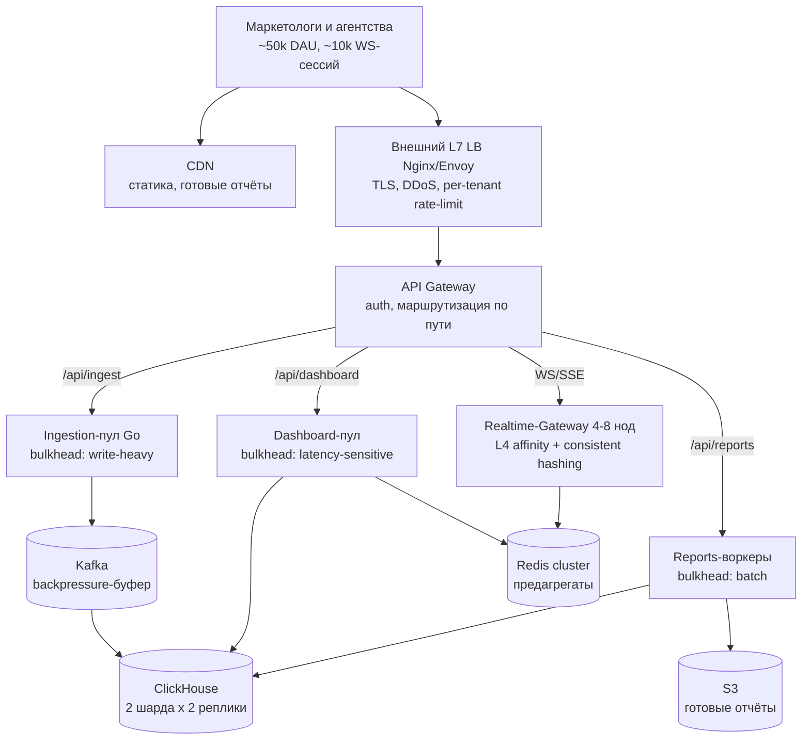

### 5. Автоскейл (K8s HPA), cold start и headroom CPU

Эластичность через **Kubernetes + HPA**: пулы app/ingestion/realtime/reports скейлятся по метрикам (CPU, а лучше — по «полезной» метрике: consumer lag Kafka для ingestion, число активных WS-сессий для Gateway, длина очереди для reports).

**Cold start.** Масштабирование не мгновенное: новая нода/под поднимается с задержкой (pull образа, прогрев пулов соединений, JIT/GC-прогрев). Под пик ×3 по ingestion (40 000 → 120 000 событий/с) нельзя рассчитывать «HPA добавит ноды ровно в момент всплеска». Спасает то, что **Kafka гасит всплеск буфером** (backpressure) — у consumers есть минуты на доскейл, а не секунды. Для предсказуемых пиков (конец месяца, запуски кампаний) держим минимальный pre-warm запас реплик.

**Headroom CPU — разный для разных нагрузок** (одна и та же кривая теории очередей, два разных архитектурных решения):

| Класс нагрузки          | Целевая утилизация CPU        | Почему                                                                                                                                                                          |
| ------------------------------------ | ---------------------------------------------- | ------------------------------------------------------------------------------------------------------------------------------------------------------------------------------------- |
| Dashboard (latency-sensitive)        | **60–70%**, оставляем headroom | гонимся за предсказуемым p95 ≤ 200 мс / p99 ≤ 500 мс; при 80–90% по теории очередей хвосты взрываются на пиках |
| Realtime-Gateway                     | ~60–70%                                       | держим запас под всплеск переподключений ~10k сессий                                                                                        |
| Reports / агрегация (batch) | **80–90%**                              | хвосты почти не важны, важно уложиться в ≤ 1–2 мин / в ночное окно; железо не должно простаивать            |

> ⚖️ Trade-off: headroom 60–70% на dashboard — это сознательная плата за «недоиспользованное железо» в обмен на предсказуемые хвосты и запас на пики. На батч-отчётах мы себе этого не позволяем — там жмём CPU до 80–90%, потому что важен не p99, а факт завершения джобы вовремя.

> 🎯 Что сказать интервьюеру: «HPA скейлю по осмысленной метрике, а не только по CPU: ingestion — по consumer lag Kafka, Realtime-Gateway — по числу сессий, reports — по длине очереди. Про cold start помню: пик ингеста гасит буфер Kafka, что даёт минуты на доскейл; под предсказуемые пики держу pre-warm. Headroom разный: 60–70% CPU для latency-sensitive дашборда против 80–90% для батч-отчётов».

### Итог: что сказать на интервью и чего не говорить

> 🎯 Что сказать интервьюеру (резюме раздела):
>
> 1. **Задержки** меряю перцентилями (p95 ≤ 200 мс, p99 ≤ 500 мс), а не средним; хвосты лечу hedged reads (только идемпотентные чтения), deadline propagation, good-enough деградацией и очередью перед ClickHouse.
> 2. **Throughput** считаю по закону Литтла (160 запросов в полёте при 800 QPS и p95=200 мс); пределы масштабирования объясняю через USL — ingestion/ClickHouse шардируются почти линейно, а strong-consistency-бюджеты в PostgreSQL упираются в σ/κ и не «размазываются» репликами.
> 3. **Устойчивость** — per-tenant rate limiting, backpressure (Kafka + WS flow control), circuit breaker на площадках, bulkhead (ingestion/dashboard/reports), graceful degradation с живым real-time-ядром.
> 4. **Балансировка** — L7 по путям + L4 affinity для WS; consistent hashing для Redis и Gateway; health-check + failover + canary/feature flags.
> 5. **Автоскейл** — HPA по осмысленным метрикам, учёт cold start (буфер Kafka), разный headroom CPU.

> ⚠️ Частые ошибки (которые ловят на секции):
>
> - доказывать здоровье системы средним временем ответа вместо p99;
> - на любой рост нагрузки отвечать «добавим серверов», не вспомнив USL (после некоторого N добавление реплик ухудшает картину из-за σ/κ);
> - применять hedged requests / ретраи к НЕидемпотентным операциям (двойная запись события, двойное списание бюджета, дубль report_job);
> - грузить latency-sensitive дашборд до 80–90% CPU «чтобы железо не простаивало» — хвосты на пиках взорвут p99;
> - забыть про cold start и считать, что HPA добавит мощности ровно в секунду всплеска ×3;
> - не развести нагрузки по bulkhead — тогда один тяжёлый годовой отчёт выедает ресурсы у real-time дашборда;
> - строить «умный космолёт» из десяти контроллеров автоскейла и приоритетных очередей там, где хватает простого horizontal scale с небольшим запасом по железу.

---

## Observability, безопасность, мульти-тенантность и trade-offs

Это финальный, «взрослый» раздел пайплайна. Если предыдущие части отвечали на вопрос «как система работает в идеальном мире», то здесь мы отвечаем на три вопроса, по которым реально отличают senior от middle на секции System Design:

1. **Как мы поймём, что система сломалась, раньше пользователей** (observability);
2. **Как мы не дадим украсть/сломать чужие данные** в мульти-тенантном SaaS (security + изоляция тенантов);
3. **Чем именно мы готовы платить** за SLO и что упростим, если бизнес скажет «сделайте вдвое дешевле» (trade-offs).

🎯 Что сказать интервьюеру: «Я не считаю систему спроектированной, пока не проговорил, как её мониторить, как изолировать тенантов и какими SLO/деньгами я плачу за выбранные решения. Архитектурная схема без этого — это только половина ответа».

Везде ниже держим в фокусе три ключевые оси MarketingPulse: высокая нагрузка (firehose до 120k событий/с), асинхронные тяжёлые отчёты и real-time свежесть метрик ≤ 10 c.

---

### 1. Observability: видеть проблему раньше пользователя

В распределённой системе MarketingPulse запрос проходит цепочку `ingestion API (Go) → Kafka → stream-консьюмеры → ClickHouse` для записи и `API дашборда (FastAPI) → Redis / ClickHouse → Realtime-Gateway → клиент` для чтения. Хвост задержки (подробнее про хвосты — в разделе про производительность) может родиться на любом звене, поэтому нам нужны три столпа наблюдаемости: **метрики, трассировки, логи**.

#### 1.1. Две модели метрик: RED и USE

Чтобы не утонуть в сотнях графиков, используем два дополняющих друг друга подхода.

**RED — про сервисы (взгляд со стороны запроса):**

| Буква         | Что измеряем                                             | Пример в MarketingPulse                                                                             |
| ------------------ | ------------------------------------------------------------------- | ---------------------------------------------------------------------------------------------------------- |
| **R**ate     | запросов/событий в секунду                   | ingestion: 40k средний / 120k пик событий/с; read-API: 150 → 800 QPS                    |
| **E**rrors   | доля ошибок                                               | % 5xx на ingestion API, % упавших отчётных job, ошибки вставки в ClickHouse |
| **D**uration | распределение задержки (перцентили!) | p95/p99 API дашборда (цель p95 ≤ 200 мс, p99 ≤ 500 мс)                                   |

**USE — про ресурсы (взгляд со стороны железа):**

| Буква            | Что измеряем                                                         | Пример в MarketingPulse                                                                    |
| --------------------- | ------------------------------------------------------------------------------- | ------------------------------------------------------------------------------------------------- |
| **U**tilization | загрузка ресурса                                                 | CPU app/ingestion-нод, диск ClickHouse-нод                                              |
| **S**aturation  | насколько близко к пределу / длина очередей | глубина очередей, lag консьюмеров Kafka, число merge в ClickHouse |
| **E**rrors      | аппаратные/системные ошибки                            | диск read/write errors, OOM-killed поды, рестарты                                 |

⚠️ Частая ошибка: показывать только **среднее** время ответа. На интервью говори перцентилями: «среднее 200 мс ничего не значит, если p99 — 2 секунды; меня волнует доля пользователей в плохом опыте». Это прямая отсылка к хвостам задержек.

#### 1.2. Ключевые метрики именно MarketingPulse (golden signals)

Это тот набор, который выводим на главный дашборд эксплуатации (NOC-экран) и по которому строим алерты:

| Метрика                                                                                        | Почему критична                                            | Порог/цель                                 | Сигнал о чём                                                                        |
| ----------------------------------------------------------------------------------------------------- | ------------------------------------------------------------------------ | --------------------------------------------------- | --------------------------------------------------------------------------------------------- |
| **Kafka consumer lag**                                                                          | растёт → консьюмеры не успевают за firehose | lag не должен устойчиво расти | деградация ingestion-пайплайна, риск нарушить свежесть |
| **End-to-end свежесть данных** (событие → видно в дашборде) | прямая бизнес-метрика                                 | p95 ≤ 5 c, потолок ≤ 10 c                  | система «отстаёт» от реальности                                   |
| **p99 латентность API дашборда**                                             | UX аналитики и фильтров                                | p95 ≤ 200 мс, p99 ≤ 500 мс                    | хвосты, перегрузка Redis/ClickHouse                                           |
| **Error rate** (ingestion + read-API)                                                           | потеря событий / битый UX                              | низкий и стабильный                | сбой релиза, перегрузка                                                   |
| **ClickHouse: insert rate / merge / диск**                                                  | сердце записи и хранения                            | диск < ~80%, merges не копятся         | замедление вставок, риск «заполнить диск»                 |
| **Число активных WS/SSE-сессий**                                             | конкурентность real-time                                   | ~10 000 одновременных                  | приближение к пределу Realtime-Gateway                                     |
| **Latency / длина очереди отчётных job**                                    | SLA отчётов                                                       | большой отчёт ≤ 1–2 мин            | воркеры не справляются, нужен скейл пула                    |

🎯 Что сказать интервьюеру: «Главная бизнес-метрика тут не CPU, а **end-to-end свежесть данных** и **consumer lag**. Если lag пополз вверх, значит мы скоро нарушим обещанные ≤ 10 c — и это надо ловить алертом до того, как маркетолог увидит устаревшие цифры».

#### 1.3. Сквозная трассировка: trace_id через весь путь

Метрики говорят «что-то медленно», но не говорят «где». Для этого — распределённая трассировка через **OpenTelemetry + Jaeger**: на входе в ingestion API (или на L7 LB / API Gateway) генерируем `trace_id` и прокидываем его дальше — в заголовки события, в метаданные Kafka-сообщения, в логи консьюмера и в запрос к ClickHouse.

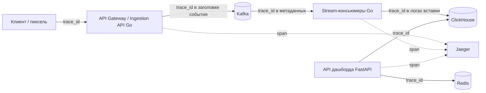

Это позволяет на одном экране увидеть: пришёл хвост из-за медленного merge в ClickHouse, или из-за переполненной очереди консьюмера, или из-за сети. Без trace_id в распределённой системе отладка превращается в гадание.

#### 1.4. Алерты: на что будит дежурного

Алерты должны быть про **симптом для пользователя или его предвестник**, а не про «CPU 70%». Минимально достаточный набор для MarketingPulse:

1. **Рост Kafka consumer lag** (устойчиво растёт N минут) → предвестник нарушения свежести.
2. **p99 API дашборда выше порога** (> 500 мс) → хвосты, страдает UX.
3. **Error rate выше базовой линии** (ingestion 5xx, доля упавших отчётов) → сбой релиза/перегрузка.
4. **Заполнение диска ClickHouse** (> 80%) → через X дней встанет запись; время на расширение/retention.
5. **Всплеск ретраев / падение числа здоровых нод** Realtime-Gateway → деградация real-time fan-out.

⚖️ Trade-off: слишком чувствительные алерты → alert fatigue, дежурный перестаёт реагировать; слишком грубые → узнаём о проблеме от клиентов. Калибруем пороги по SLO, а не «на глаз».

#### 1.5. Инструменты и дашборды эксплуатации

| Слой                                  | Инструмент             | Что закрывает                                                                                                |
| ----------------------------------------- | -------------------------------- | ------------------------------------------------------------------------------------------------------------------------ |
| Метрики + визуализация | **Prometheus + Grafana**   | RED/USE, golden signals, дашборды эксплуатации                                                       |
| Трассировка                    | **OpenTelemetry + Jaeger** | `trace_id` сквозь ingestion → stream → query                                                                   |
| Ошибки приложения         | **Sentry**                 | стектрейсы, регрессии после релиза                                                         |
| Логи                                  | **ELK**                    | централизованные логи, медленные запросы, аудит-события (см. ниже) |

Дашборды разделяем по аудитории: (1) **бизнес-свежесть** (end-to-end задержка, lag) — для on-call; (2) **read-path** (p95/p99, QPS, hit rate Redis); (3) **storage** (ClickHouse insert/merge/диск, retention); (4) **отчёты** (длина очереди, latency job). Это ровно те Prometheus/Grafana/OTel/Jaeger/ELK, что заложены в канон-стеке.

---

### 2. Безопасность и мульти-тенантность

MarketingPulse — мульти-тенантный B2B SaaS на ~5 000 организаций. Здесь главная угроза не абстрактный «хакер», а **утечка данных одного тенанта другому** (агентство A увидело расходы кампаний агентства B). Поэтому изоляция тенантов — требование №1.

#### 2.1. Аутентификация и сессии

- **OAuth2 / SSO** для входа пользователей; для аккаунтов с ролью **owner/admin — обязательный MFA** (компрометация админа = доступ ко всему тенанту).
- **JWT с парой access/refresh**: короткоживущий access-токен (минуты) + refresh-токен (хранится надёжно, отзывается). В access-токен кладём `tenant_id`, `user_id`, `role` — это даёт stateless-проверку прав на каждом запросе.
- Отдельно — **OAuth2 для подключения рекламных площадок** (Google Ads, Meta, Yandex Direct, VK, TikTok): получаемые refresh-токены площадок — это секреты, хранятся зашифрованно (см. KMS ниже), а не в коде/конфиге.

#### 2.2. Авторизация: RBAC

Три роли из канона, проверяются на API Gateway и в сервисах:

| Роль                                | Может                                                                                                                                                |
| --------------------------------------- | --------------------------------------------------------------------------------------------------------------------------------------------------------- |
| **owner / admin**                 | всё в рамках тенанта: пользователи, биллинг, подключение аккаунтов, правила алертов |
| **editor** (маркетолог) | смотреть дашборды, строить отчёты, настраивать срезы/фильтры                                          |
| **viewer**                        | только чтение дашбордов и готовых отчётов                                                                             |

#### 2.3. Мульти-тенантная изоляция — центральная тема раздела

Принцип: **`tenant_id` присутствует во всём пути запроса и НЕ берётся из тела запроса от клиента — только из проверенного токена.** Иначе злоумышленник подставит чужой `tenant_id` и прочитает чужие данные.

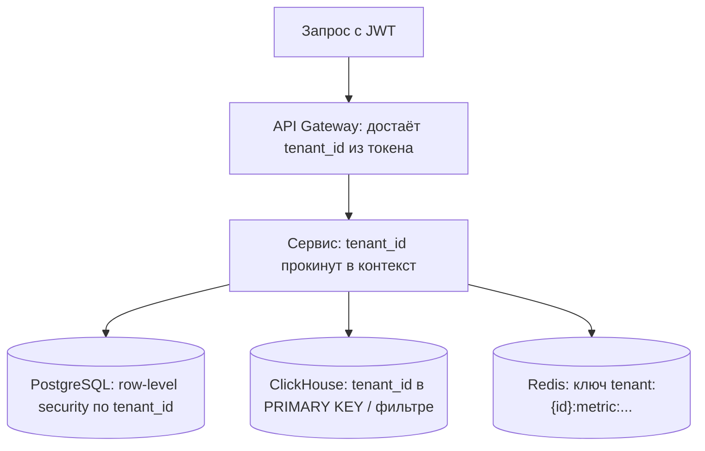

Изоляция реализуется на каждом слое хранения:

| Слой                                          | Механизм изоляции                                                                                                                                                                                                                                                                                                                                                                 |
| ------------------------------------------------- | ------------------------------------------------------------------------------------------------------------------------------------------------------------------------------------------------------------------------------------------------------------------------------------------------------------------------------------------------------------------------------------------------- |
| **PostgreSQL** (OLTP)                       | **Row-Level Security**: политики, фильтрующие строки по `tenant_id`; даже забытый `WHERE` в коде не отдаст чужие данные                                                                                                                                                                                                   |
| **ClickHouse** (OLAP)                       | `tenant_id` — обязательная часть ключа сортировки/первичного ключа и **обязательный фильтр в каждом запросе**; на старте — общий кластер с фильтрацией, крупным тенантам — отдельные таблицы/базы при необходимости |
| **Redis** (кеш/предагрегаты) | `tenant_id` в **префиксе ключа** (`tenant:{id}:...`) — иначе предагрегат одного тенанта «протечёт» в дашборд другого                                                                                                                                                                                               |
| **S3** (сырьё, отчёты)           | префиксы/бакеты по тенанту; готовые отчёты выдаём только через**signed URL** с ограниченным TTL                                                                                                                                                                                                                           |

⚠️ Частая ошибка: изолировать только в Postgres и забыть про **ключи кеша Redis** и **фильтр в ClickHouse**. Самые обидные утечки в мульти-тенантных дашбордах — именно через общий кеш предагрегатов.

🎯 Что сказать интервьюеру: «`tenant_id` я тащу из подписанного JWT, а не из запроса, и он обязателен в каждом обращении к каждому хранилищу: RLS в Postgres, часть ключа в ClickHouse, префикс ключа в Redis. Утечка между тенантами для B2B SaaS — это репутационная смерть, поэтому изоляцию закладываю с первого дня, а не "потом допилим"».

#### 2.4. Шифрование и секреты

- **In-transit**: TLS везде — на внешнем L7 LB, между сервисами, до Kafka, до БД. Никакого внутреннего «доверенного» plaintext-трафика.
- **At-rest**: шифрование дисков БД/ClickHouse и бакетов S3.
- **Секреты** (refresh-токены площадок, ключи БД, подписи пикселя) — в **KMS** (или Vault/HSM), а не в env-файлах и не в репозитории. Ротация ключей.

#### 2.5. Rate-limit и anti-abuse на ingestion

Ingestion API смотрит наружу и принимает события от пикселя/постбэков — лакомая цель для подделки и флуда.

1. **Rate-limit** (через Redis/API Gateway) — лимиты на тенанта/источник, защита от флуда.
2. **Подпись/токен пикселя**: каждое событие подписано тенант-специфичным токеном/HMAC. Событие без валидной подписи отбрасывается на входе — это защита от подделки конверсий и «накрутки».
3. **Backpressure**: при перегрузке ingestion сообщает producer'у замедлиться (подробнее про backpressure — в разделе про нагрузку); Kafka сглаживает пики (60 МБ/с на пике — комфортно).

⚠️ Частая ошибка: путать anti-abuse на ingestion с антифродом по конверсиям. **Антифрод — out of scope** (упоминаем как отдельную систему). Наша задача здесь — не пускать заведомо поддельные/неаутентифицированные события, а не строить ML-детектор фрода.

#### 2.6. Аудит и приватность

- **Аудит критичных действий** (смена прав, подключение/отключение рекламного аккаунта, изменение бюджетов, экспорт данных) — пишем в неизменяемый аудит-лог (ELK / отдельное хранилище), **храним 5 лет**.
- **Приватность / retention**: соблюдаем заявленные сроки хранения (детальные события 90 дней в ClickHouse, агрегаты 13–25 мес, сырьё в S3 — 2 года) и поддерживаем **удаление данных тенанта по запросу** (right to be forgotten) — включая чистку из ClickHouse, S3 и кеша.

---

### 3. Trade-offs — главная senior-тема

Тут проверяют не «знаешь ли ты технологии», а умеешь ли ты **думать в категориях компромиссов**, а не «хочу одновременно быстро, надёжно и дёшево». Всё упирается в один вопрос: **какие SLO мы берём и какими счетами (в деньгах и в сложности) за них платим.**

Напомним обещания MarketingPulse: дашборд (чтение) **SLA 99.9%** (≈ 8.8 ч/год downtime), ingestion **99.95%**; свежесть p95 ≤ 5 c; p95 API ≤ 200 мс. Аналитика — **eventual**, бюджеты/квоты — **strong**.

#### 3.1. SLO/SLA и их цена

Каждая «девятка» доступности стоит дорого нелинейно: резервирование, multi-region, более сложные деплои. 99.9% на чтении — это сознательный выбор: дашборд может пережить редкий короткий простой, маркетолог не потеряет деньги от 10 минут недоступности отчёта. А вот ingestion 99.95% выше — потерянные на входе события не вернуть, поэтому тут платим за надёжность приёма (Kafka с репликацией, ретеншн, replay).

#### 3.2. Сводная таблица ключевых trade-offs

| Решение                                                                                                         | Платим                                                                                                               | Получаем                                                        | Когда НЕ нужно усложнять                                                                                                                                                                         |
| ---------------------------------------------------------------------------------------------------------------------- | -------------------------------------------------------------------------------------------------------------------------- | ----------------------------------------------------------------------- | --------------------------------------------------------------------------------------------------------------------------------------------------------------------------------------------------------------------- |
| **CPU headroom** (60–70%) на latency-критичных нодах (read-API, Realtime-Gateway)               | «недогруженным» железом                                                                              | предсказуемые хвосты, запас на пик 800 QPS | batch/отчётные воркеры можно гонять на 80–90% — там важно «закончить к сроку», а не p99                                                                     |
| **Кеш предагрегатов в Redis**                                                                   | память, сложность инвалидации, риск штормов при промахе на hot-ключе | разгрузка ClickHouse, p95 ≤ 200 мс                          | часто меняющиеся / строго консистентные данные (бюджеты) дешевле читать из БД, чем строить вокруг них монстра из кеша |
| **Индексы / денормализация / Materialized Views** для роллапов                   | падение пропускной способности записи, сложность пересчёта             | быстрые агрегаты на чтении                       | при write-heavy ingestion не плодим лишние индексы на горячем пути; роллапы считаем в MV асинхронно                                                     |
| **Multi-region** (RPO≈0, RTO<10 мин)                                                                         | задержка, сложность топологии, кратный счёт от облака                         | переживаем падение целого ЦОДа               | если 99.9% устраивает бизнес — multi-region избыточен, это «строительство космолёта»                                                                         |
| **«Умная» автоматика** (хитрый автоскейл, динамический backpressure) | непрозрачность, человекочасы, плавающие баги                                        | теоретически макс. утилизация                 | проще горизонтальный скейл по CPU/lag + небольшой запас машин: экономим на людях и авариях                                                        |

#### 3.3. Типовой вопрос: «Что упростите, чтобы вдвое удешевить инфраструктуру?»

Это любимый вопрос. Отвечаем **конкретно и по приоритетам**, явно называя, какой SLO мы при этом ослабляем:

1. **Ослабить свежесть с p95 5 c до 30–60 c.** Real-time — самая дорогая часть: батчим вставки в ClickHouse крупнее, реже триггерим fan-out. Бизнес часто спокойно живёт с минутной свежестью дашборда.
2. **Реже считать роллапы.** Минутные агрегаты → каждые 5–10 минут. Materialized Views и консьюмеры жрут меньше CPU.
3. **Ужать retention.** Горячие детальные события в ClickHouse 90 → 30 дней (меньше дисков, а это самая дорогая статья при ~16–20 ТБ на диске), остальное живёт холодным в S3 — оттуда дешёвый backfill при необходимости.
4. **Убрать multi-region** (если он был) — оставить один регион + бэкапы. RTO растёт, зато счёт падает кратно.
5. **Поднять утилизацию batch/отчётных нод** до 80–90% и агрессивнее их down-scale'ить вне пиков отчётности.

🎯 Что сказать интервьюеру: «Дешевле всего отказаться не от ingestion (события не вернуть), а от **дорогой свежести и плотности роллапов**: увеличиваю end-to-end задержку с 5 c до 30–60 c, реже считаю агрегаты, режу горячий retention и убираю multi-region. Это режет основную часть железа — ClickHouse-диски и real-time-путь — почти не трогая функциональность».

#### 3.4. Типовой вопрос: «Что важнее — латентность дашборда или консистентность отчётов?»

Ловушка вопроса в том, что это **две разные подсистемы с разными требованиями** — и хороший ответ их разделяет:

- **Дашборд (real-time чтение)** живёт на **eventual consistency**. Здесь приоритет — **латентность и свежесть**: пользователю важнее увидеть «почти точные» метрики за ≤ 5 c, чем идеально согласованные за минуту. Расхождение в секунды — приемлемо по канону. Применяем приём *Good Enough*: лучше быстро показать чуть приблизительные impressions/CTR, чем ждать.
- **Отчёты** — асинхронные (≤ 1–2 мин), и вот тут важнее **корректность и воспроизводимость**: экспортированный CSV/XLSX/PDF идёт в презентацию клиенту/руководству. Лучше посчитать на 30 секунд дольше, но получить консистентный за период срез (при необходимости — backfill из S3, элемент Lambda поверх Kappa).
- **Бюджеты/квоты/биллинг** — это вообще отдельный strong-consistency островок в PostgreSQL: расход > бюджета нельзя считать «примерно».

🎯 Что сказать интервьюеру: «Это не "или-или". Для **дашборда** выбираю латентность и свежесть (eventual — норма, секундные расхождения ок). Для **отчётов** — консистентность и воспроизводимость, поэтому делаю их асинхронно и не гонюсь за миллисекундами. А **бюджеты** держу на strong-consistency в Postgres отдельно. Senior-ответ — развести требования по подсистемам, а не выбирать одно глобально».

---

### Резюме раздела

- **Observability** строим на RED (сервисы) + USE (ресурсы); главные golden signals MarketingPulse — **consumer lag** и **end-to-end свежесть**, плюс p99 read-API, error rate, диск/merge ClickHouse, число WS-сессий, latency отчётов. Связываем всё через `trace_id` (OTel + Jaeger), визуализируем в Grafana, ошибки — в Sentry, логи и аудит — в ELK.
- **Security**: OAuth2/SSO + MFA для админов, access/refresh JWT, RBAC (owner/editor/viewer). Центр тяжести — **мульти-тенантная изоляция**: `tenant_id` из токена обязателен на каждом слое (RLS в Postgres, ключ в ClickHouse, префикс в Redis, signed URL в S3). TLS везде, секреты в KMS, аудит 5 лет, удаление по запросу. Anti-abuse на ingestion (подпись пикселя + rate-limit), но антифрод — out of scope.
- **Trade-offs** — это про SLO и счета. Удешевляем через ослабление свежести (5 c → 30–60 c), реже роллапы, меньше горячего retention, без multi-region, выше утилизация batch-нод. Латентность vs консистентность — разводим по подсистемам: дашборд = eventual + скорость, отчёты = корректность, бюджеты = strong.

🎯 Что сказать интервьюеру в финале: «Хорошая архитектура — это не та, где всё идеально, а та, где я **осознанно выбрал, чем плачу**: какие SLO беру на ingestion и чтение, как изолирую тенантов, как увижу деградацию раньше пользователя и что именно отрежу первым, если бизнесу нужно вдвое дешевле. Если я могу это проговорить числами MarketingPulse — значит, я спроектировал систему, а не нарисовал красивую схему».

---

## Шпаргалка, типичные ошибки и банк вопросов интервьюера

Этот раздел — то, что стоит держать перед глазами за день до интервью и проговаривать вслух на самом интервью. Сначала — компактный чек-лист всего пайплайна (5 этапов), затем разбор типичных ошибок из главы 8, спроецированных на MarketingPulse, потом банк из 14 доменных вопросов с модельными ответами и, в конце, «скелет ответа на доске» — порядок блоков слева направо.

Везде ниже за единый источник правды берём канон MarketingPulse: 40k событий/с в среднем и 120k в пик, ингест 99.95% / чтение 99.9%, свежесть real-time ≤10 c (p95 ≤5 c), API дашборда p95 ≤200 мс / p99 ≤500 мс, рост ×4 за 18 месяцев. Стек: Kafka → консьюмеры на Go → ClickHouse (+ Materialized Views для роллапов), PostgreSQL (+read-реплики) для OLTP, Redis cluster для кеша/pub-sub, S3 для сырья и отчётов, WebSocket/SSE для real-time доставки.

---

### One-page чек-лист пайплайна

Это «галочки», которые должны быть закрыты к концу каждого этапа. Если этап не дал своего артефакта — ты не имеешь права идти дальше: интервьюер это заметит.

#### Этап 1. Требования (что на выходе)

- [ ] Зафиксированы функциональные требования: подключение рекламных аккаунтов (OAuth + pull агрегатов), ingestion real-time потока (impression/click/conversion), real-time дашборд с метриками (impressions, clicks, spend, CTR, CPC, CPM, conversions, CR, ROAS), срезы/фильтры (кампания, площадка, гео, устройство, период), отчёты (CSV/XLSX/PDF + по расписанию), алерты, роли owner/admin/editor/viewer, мульти-тенантная изоляция.
- [ ] Явно вычеркнут out of scope: биддинг/закупка, ML-атрибуция, биллинг площадок, антифрод — «это отдельные системы».
- [ ] Зафиксированы НФТ и канон-числа: DAU 50k / MAU 200k, ×4 за 18 мес, ~5 000 тенантов, ~10k одновременных real-time сессий, ингест 40k/120k событий/с по 0.5 КБ, чтение 150/800 QPS, свежесть ≤10 c, API p95 ≤200 мс, SLA 99.9%/99.95%.
- [ ] Проговорены три ключевые оси: высокая нагрузка (ingestion), асинхронные отчёты, real-time обновление.
- [ ] Зафиксирована модель консистентности: аналитика — eventual; бюджеты/квоты — strong.

#### Этап 2. Расчёты (что на выходе)

- [ ] 40k × 86 400 ≈ **3.46 млрд событий/сутки**.
- [ ] Сырой объём: 3.46e9 × 0.5 КБ ≈ **1.73 ТБ/сутки**; за 90 дней ≈ **155 ТБ сырых**, в ClickHouse со сжатием 8–10× → **~16–20 ТБ на диске**.
- [ ] Пиковый трафик записи: 120k × 0.5 КБ ≈ **60 МБ/с (≈0.5 Гбит/с)** — комфортно для Kafka.
- [ ] Закон Литтла на чтении: 800 QPS × 0.2 c ≈ **160 запросов «в полёте»**.
- [ ] Порядок инфраструктуры назван: Kafka 3–6 брокеров, ClickHouse 2 шарда × 2 реплики, Postgres primary + 2 реплики, Redis 3–6 нод, Realtime-Gateway 4–8 нод; стоимость — единицы–десятки тысяч $/мес.

#### Этап 3. Домены и API (что на выходе)

- [ ] Выписаны сущности и связи: Tenant, User, AdAccount, Campaign, Event, Metric (rollup), ReportJob, AlertRule, Budget.
- [ ] Разделены хранилища по сущностям: метаданные/бюджеты → Postgres, события/агрегаты → ClickHouse, готовые отчёты/сырьё → S3.
- [ ] Описан выбор протоколов: REST/gRPC для управления, отдельный ingestion API (HTTP/gRPC) для потока событий, WebSocket/SSE для push-метрик.
- [ ] Идемпотентность ingestion заложена в контракт (event_id / ключ дедупликации).

#### Этап 4. High Level Design (что на выходе)

- [ ] Нарисована схема от пользователя: клиенты → Edge (LB/CDN) → API Gateway → разветвление на ingestion-путь и read/realtime-путь.
- [ ] Виден firehose-путь: Ingestion API → Kafka → Go-консьюмеры → ClickHouse (+ MV-роллапы) → Redis (горячие предагрегаты) → Realtime-Gateway → клиент.
- [ ] Виден отчётный путь: ReportJob → очередь → пул воркеров → ClickHouse/S3 → signed URL, статус в Postgres.
- [ ] Стрелки подписаны, циклических связей нет, один дата-центр как базовое допущение (multi-region — как опция масштаба).

#### Этап 5. Low Level Design (что на выходе)

- [ ] Партиционирование Kafka (по tenant_id/campaign_id), стратегия consumer-групп, политика ретеншена и replay.
- [ ] Схема ClickHouse: движок (ReplacingMergeTree — дедуп по event_id), ключ партиционирования (по дате) и сортировки (tenant_id, campaign_id, ts, event_id), TTL 90 дней → S3, шардирование 2×2.
- [ ] Стратегии кеша Redis (предагрегаты дашборда, TTL, инвалидация), backpressure и rate-limit на ingest, HPA на app/ingestion-нодах.
- [ ] Ответы на вопросы об отказоустойчивости (падение брокера/ноды CH), масштабировании (10k сессий, hot key), эволюции схемы.

🎯 **Что сказать интервьюеру:** «Я иду по пяти этапам и на каждом фиксирую артефакт письменно. Если вы хотите углубиться в конкретный компонент — скажите, я перейду в low level именно по нему, но сначала закрою верхнеуровневую картину, чтобы доказать, что система целиком работает».

---

### Частые ошибки на интервью (из главы 8) на примере MarketingPulse

#### 1. Незнакомые технологии в архитектуре

Назвал Kafka и ClickHouse — будь готов объяснить, почему не RabbitMQ и не Druid/Pinot, причём в терминах этой задачи, а не «потому что модно».

⚠️ **Частая ошибка:** упомянуть Flink/Kafka Streams «для солидности» и поплыть на вопросе «а как там чекпойнтинг и exactly-once?». В каноне Flink — это **trade-off-альтернатива**, а не основной выбор: «Беру обычные Go-консьюмеры + батч-инсерты + Materialized Views в ClickHouse, потому что роллапы простые (суммы/счётчики по минутам/часам/дням). Flink дал бы оконные join'ы и сложный stateful-стриминг, но это лишняя операционная сложность под наши агрегаты».

🎯 **Что сказать интервьюеру:** бери знакомый стек и обоснуй — это сознательная защита от ошибки «незнакомая технология». Если в команде экспертиза в Python, скажи это прямо: высоконагруженный ingestion на Go, прикладные API/отчёты на Python/FastAPI.

#### 2. Требования ради требований

Спросил про рост ×4 за 18 месяцев — обязан объяснить, **зачем**. Иначе число останется мёртвым в графе «НФТ».

🎯 **Что сказать интервьюеру:** «Рост ×4 мне нужен для ёмкости и шардирования: 40k→160k событий/с в среднем, ингест-путь и Kafka-партиции я закладываю с запасом; ClickHouse сразу проектирую шардируемым (2×2 → расширяемо), Postgres — с read-репликами под рост read-нагрузки 150→600 QPS. Я не строю под ×4 сразу всё, но проверяю, что архитектура расширяется без переписывания».

⚠️ **Частая ошибка:** спросить DAU/MAU и не использовать их в расчётах. DAU 50k и ~10k одновременных real-time сессий напрямую дают размер Realtime-Gateway (4–8 нод) и нагрузку на Redis pub/sub.

#### 3. Строительство космолёта

Самый частый способ слить high-load задачу — потащить в scope то, что мы явно отрезали.

⚠️ **Частая ошибка:** начать проектировать ML-атрибуцию конверсий или антифрод-движок на ingestion. Это **out of scope**. Базовую валидацию/дедупликацию событий делаем (это часть ingestion-контракта), но «умный» антифрод — отдельная система.

⚖️ **Trade-off:** не тащим Lambda-архитектуру с двумя параллельными пайплайнами «на всякий случай». Берём Kappa (единый стрим Kafka → ClickHouse) и оставляем backfill из S3 как элемент Lambda только для пересчётов истории. Это минимально достаточное решение — усложнение до полноценной Lambda здесь **не нужно**.

#### 4. Отказ от продуктовых метрик

От middle+/senior ждут мышления в терминах бизнеса, а не только «свой кусок кода».

🎯 **Что сказать интервьюеру:** «Продукт меряется в DAU 50k / MAU 200k и в продуктовых метриках самого дашборда — ROAS, CTR, CR. Свежесть ≤10 c — это не каприз, а продуктовое требование: маркетолог принимает решения по бюджету в реальном времени, задержка прямо бьёт по ROAS клиента». Связывай технические решения (кеш предагрегатов, MV-роллапы) с тем, как они держат эти метрики.

#### 5. Уход в детали до архитектуры

⚠️ **Частая ошибка:** на 10-й минуте начать рисовать схему таблиц ClickHouse и спорить про `ReplacingMergeTree` vs `AggregatingMergeTree`, когда high level ещё не нарисован. Сначала — картинка целиком (от пользователя до S3), потом — углубление по запросу. Идём от общего к частному.

#### 6. Игнор НФТ

⚠️ **Частая ошибка:** спроектировать «красивый» дашборд и забыть, что профиль нагрузки **write-heavy** (3.46 млрд событий/сутки на запись), а чтение — тяжёлое аналитическое. Именно из НФТ вытекает разделение OLTP (Postgres) и OLAP (ClickHouse), отдельный ingestion-путь и eventual-consistency для метрик. НФТ — это не приложение к решению, это его фундамент.

---

### Банк вопросов интервьюера с модельными ответами

#### 1. Kafka vs RabbitMQ здесь?

Kafka — потому что это **firehose**: 40k–120k событий/с, нужен высокий throughput, партиционирование по tenant/campaign, **replay** (перечитать топик при ошибке в консьюмере или для backfill) и ретеншн как буфер. RabbitMQ — брокер задач с роутингом и подтверждениями на сообщение, отлично для отчётных job'ов, но не для миллиардов событий/сутки: per-message ack и очереди в памяти не та модель. Канон: Kafka для потока событий; для отчётов допустим отдельный Kafka-топик **или** RabbitMQ/Redis.

#### 2. ClickHouse vs PostgreSQL vs Druid/Pinot?

PostgreSQL — это OLTP: tenants, users, ad_accounts, метаданные кампаний, report_jobs, бюджеты; строки, транзакции, strong-инварианты. Аналитику на нём не делаем — агрегаты по миллиардам строк его убьют. ClickHouse — колоночная OLAP: быстрые `GROUP BY` по spend/clicks/CTR, сжатие 8–10×, Materialized Views для роллапов. Druid/Pinot решают похожую задачу (real-time OLAP), но ClickHouse в каноне выбран как основной: проще операционно, мощный SQL, нам не нужны специфичные фишки Pinot (например, сверхнизкая latency на point-lookup'ах для рекламных серверов).

⚖️ **Trade-off:** Druid силён в нативной real-time ingestion и сегментном TTL, но за это платим более сложной топологией (coordinator/historical/broker/middle-manager) — для наших роллапов это избыточно.

#### 3. Почему eventual для метрик и где strong?

Метрики дашборда — eventual: расхождение в секунды приемлемо (свежесть ≤10 c), и это покупает нам высокую доступность чтения (SLA 99.9%) и дешёвое масштабирование без глобальных транзакций. Strong нужен там, где ошибка стоит денег: **бюджеты/квоты/биллинг** — их держим в Postgres под ACID. То есть маленький strong-слой (бюджеты) внутри общей eventual-системы (аналитика), как и советует канон: не делать всю систему жёсткой.

#### 4. Как гарантировать, что событие не посчитается дважды?

Идемпотентность по `event_id` (генерит клиент-пиксель/постбэк). Kafka даёт at-least-once, поэтому дубли возможны на ретраях и replay. Дедуп делаем на стороне ClickHouse: либо `ReplacingMergeTree` по ключу (event_id + ts) со схлопыванием при merge, либо дедуп-окно по event_id в консьюмере (Redis set с TTL) перед инсертом.

⚠️ **Частая ошибка:** обещать exactly-once «из коробки». Честный ответ: at-least-once + идемпотентный приёмник = эффективно ровно один раз в агрегатах. Для денег (бюджеты) — strong и отдельный путь.

#### 5. WebSocket vs SSE vs polling для дашборда?

Дашборд — это поток сервер→клиент (push метрик), двусторонность почти не нужна. Поэтому **SSE — валидный и более простой** вариант (однонаправленный, поверх обычного HTTP, авто-reconnect). WebSocket берём, если нужен полноценный дуплекс (интерактив, подписки на лету) — это основной вариант в каноне. Polling отбрасываем: при ~10k сессий и свежести ≤10 c это лишняя нагрузка и худшая задержка. Fan-out обновлений — через Redis pub/sub (или Kafka) на Realtime-Gateway.

#### 6. Lambda vs Kappa?

Берём **Kappa**: единый стрим Kafka → ClickHouse, одна кодовая база обработки, нет дублирования логики batch/speed-слоёв. Lambda держала бы отдельный batch-путь для «правильных» исторических агрегатов — это две системы и риск расхождения. Элемент Lambda оставляем точечно: **backfill из S3** (сырьё, retention 2 года) для пересчёта истории при смене схемы роллапа или баге в консьюмере. Это и есть минимально достаточное решение.

#### 7. Что делать с «горячим» рекламодателем (hot partition / hot key)?

Крупное агентство или вирусная кампания дают перекос: один tenant/campaign генерит непропорционально много событий и забивает одну Kafka-партицию и один шард ClickHouse.

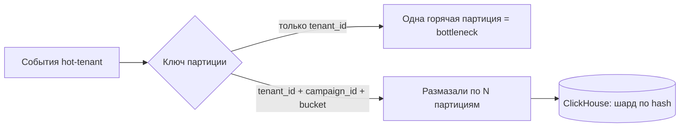

Решения: составной ключ партиционирования (tenant_id + campaign_id, при необходимости + случайный bucket/sub-key для самых крупных), чтобы размазать hot-tenant по нескольким партициям; на чтении — отдельный кеш-слой в Redis под горячие предагрегаты этого тенанта; при необходимости — ребалансировка шардов ClickHouse.

⚖️ **Trade-off:** добавочный bucket в ключе усложняет агрегацию (нужен merge по бакетам), зато снимает bottleneck — платим небольшой сложностью чтения за пропускную способность записи.

#### 8. Что если падает нода ClickHouse / брокер Kafka?

Kafka: брокеры с репликацией (replication factor ≥3 на 3–6 брокерах), падение одного — лидерство партиций уезжает на реплики, продьюсеры с `acks=all` не теряют данные; consumer-группы перебалансируются. ClickHouse: схема 2 шарда × 2 реплики — падение реплики не теряет данные (вторая реплика обслуживает чтение/запись), падение целого шарда деградирует только его долю данных. Поскольку source of truth сырья — S3, потерянный кусок можно перелить backfill'ом. SLA ингеста 99.95% держим именно репликацией Kafka + буфером (Kafka сглаживает, пока CH-нода поднимается).

#### 9. Как масштабировать 10k+ real-time сессий?

~10k одновременных WebSocket/SSE сессий — это не про CPU, а про память на открытые соединения и fan-out. Realtime-Gateway — 4–8 stateless-нод за L7 LB (sticky по необходимости), HPA по числу соединений/CPU. Обновления не тянем по соединению из БД на каждый чих: консьюмеры пишут свежие предагрегаты в Redis, публикуют в Redis pub/sub, Gateway раздаёт подписчикам нужного tenant'а. Так 10k сессий обслуживаются без 10k запросов в ClickHouse.

⚖️ **Trade-off:** sticky-сессии упрощают состояние подписки, но усложняют ребаланс при деплое; альтернатива — хранить подписки в Redis и делать ноды полностью stateless.

#### 10. Как посчитать отчёт за год, не убив базу?

Большой отчёт за период — **асинхронно**, цель ≤1–2 мин. Маленькие отдаём почти мгновенно из предагрегатов. Годовой отчёт не считаем по сырым событиям: используем **роллапы** (дневные/часовые агрегаты из Materialized Views) — это на порядки меньше строк. Поток: создаём ReportJob (статус в Postgres) → задача в очередь → воркер из пула считает из ClickHouse-роллапов (и при необходимости из S3 для очень старых данных) → кладёт CSV/XLSX/PDF в S3 → отдаёт signed URL. Тяжёлые отчёты изолированы от онлайн-трафика отдельным пулом воркеров (bulkhead) и, при желании, отдельными read-репликами/шардами.

#### 11. Как защититься от поддельных/спам-событий на ingestion?

Базовый уровень (в scope): аутентификация источника (ключ/токен пикселя на tenant), валидация схемы события, rate-limit на ingestion (Redis token bucket по tenant/IP) и дедуп по event_id. Полноценный **антифрод — out of scope**, отдельная система; на интервью прямо это проговариваем, чтобы не строить космолёт.

⚠️ **Частая ошибка:** начать проектировать ML-детектор ботов на ingestion-пути — это и вне scope, и убивает latency горячего пути.

#### 12. Как держать свежесть ≤10 c и при этом p95 ≤200 мс на чтении?

Это два разных пути, и их не надо путать. **Свежесть** даёт стрим: событие → Kafka → консьюмер батчует и инсертит в ClickHouse (батч-окно секунды, не минуты) → обновляет предагрегаты в Redis → push через pub/sub. End-to-end укладываемся в ≤10 c (цель p95 ≤5 c). **p95 ≤200 мс на чтении** даёт кеш: API дашборда читает **предагрегаты из Redis**, а не считает агрегаты на лету в ClickHouse. По закону Литтла при 800 QPS и 200 мс — ~160 запросов в полёте, это держит небольшой пул app-нод. Тяжёлые «холодные» срезы идут в ClickHouse напрямую, но это не горячий путь дашборда.

#### 13. Как менять схему / решардить ClickHouse без простоя?

Аддитивные изменения (новая колонка, новый MV) — онлайн, старые данные дочитываем со значением по умолчанию. Несовместимые изменения и решардинг — по трёхэтапной схеме ребалансинга из главы про шардирование: (1) массовая переливка/пересчёт в новую таблицу/распределение из S3-сырья (backfill, элемент Lambda), (2) синхронизация дельты через тот же Kafka-стрим (Kappa позволяет перечитать), (3) переключение маршрутизации чтения на новую схему, минимизируя окно гонок. Поскольку Kafka хранит поток, а S3 — сырьё за 2 года, пересчёт истории безопасен.

#### 14. Как работает backpressure при пике 120k событий/с?

Пик ×3 (60 МБ/с) Kafka проглатывает как буфер — это её прямая работа: продьюсеры пишут, консьюмеры разгребают в своём темпе, лаг временно растёт, но данные не теряются (ретеншн + S3). Если консьюмеры/ClickHouse не успевают — масштабируем консьюмеров (HPA по consumer lag) и увеличиваем батч-инсерты. На самом краю (ingestion API) — rate-limit и `429` для аномальных источников, чтобы защитить firehose.

⚖️ **Trade-off:** при backpressure свежесть деградирует (растёт лаг, метрики «отстают»), но мы **не теряем данные** и не роняем ингест — сознательно жертвуем задержкой ради сохранности и доступности 99.95%. Это применение Graceful Degradation: лучше показать метрики на пару секунд позже, чем потерять события.

---

### Скелет ответа на доске (порядок блоков слева направо)

Это «мышечная память» для интервью: рисуешь строго слева направо, от пользователя к данным, подписываешь стрелки, избегаешь циклов.

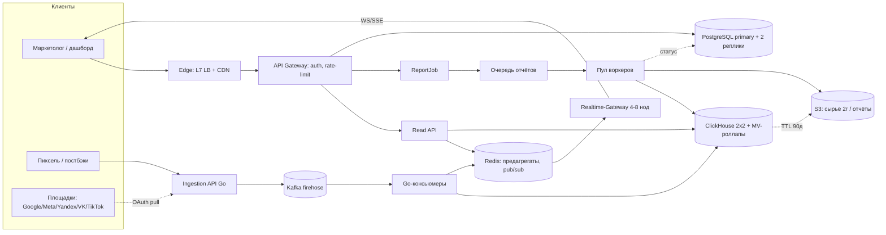

Порядок, в котором ты это проговариваешь и рисуешь:

1. **Клиенты слева:** маркетолог (дашборд), источники событий (пиксель/постбэки), внешние площадки (OAuth pull агрегатов).
2. **Edge:** внешний L7 LB (Nginx/Envoy) + CDN (статика и готовые отчёты).
3. **API Gateway:** auth, rate-limit, маршрутизация — здесь же защита ingestion.
4. **Firehose-путь (главная ось «высокая нагрузка»):** Ingestion API (Go) → Kafka → Go-консьюмеры → ClickHouse (+ Materialized Views) и параллельно предагрегаты в Redis; сырьё уезжает в S3 по TTL.
5. **Read / Realtime-путь (ось «real-time»):** Read API читает горячее из Redis (p95 ≤200 мс), тяжёлое — из ClickHouse; Realtime-Gateway раздаёт push через WebSocket/SSE с fan-out из Redis pub/sub.
6. **Отчётный путь (ось «асинхронные отчёты»):** ReportJob → очередь → пул воркеров → ClickHouse-роллапы / S3 → signed URL, статус job в Postgres.
7. **OLTP справа/снизу:** PostgreSQL (primary + 2 реплики) — tenants, users, ad_accounts, метаданные, бюджеты (strong), report_jobs.
8. **Сквозное:** наблюдаемость (Prometheus + Grafana, OpenTelemetry/Jaeger c trace_id, Sentry, ELK) и оркестрация (Kubernetes + HPA) — упоминаешь как обёртку вокруг всей схемы.

🎯 **Что сказать интервьюеру в конце:** «Слева — нагрузка, которую мы принимаем; в центре — Kafka как буфер и ClickHouse как OLAP; справа — strong-данные в Postgres. Три оси задачи закрыты: ingestion масштабируется через Kafka + HPA-консьюмеры, real-time держится на Redis + Realtime-Gateway со свежестью ≤10 c, отчёты вынесены в асинхронный пул воркеров. Готов углубиться в любой блок — например, в схему ClickHouse или в стратегию дедупликации». Детали отдельных подсистем — подробнее в соответствующих разделах методички.
