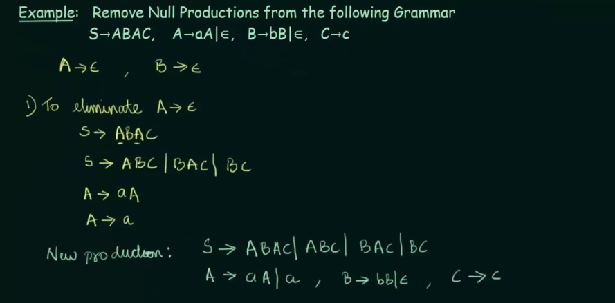

# Simplification of Context Free Grammar

## Reduction of CFG

g' and g'' are our grammars where first is our states, second if termination 
symbols, third is production rule P, and last is starting symbol S.

## Removal Unit Productions

## Removal of Null Productions

