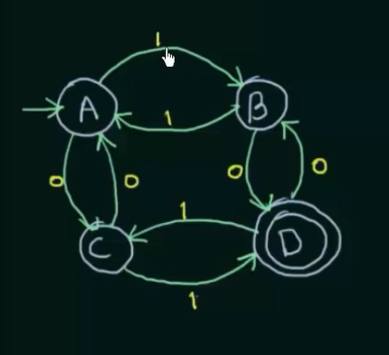
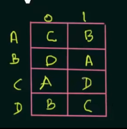
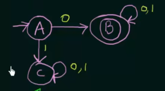
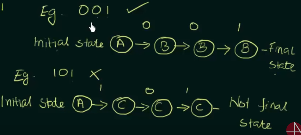

Simple Illustration to Deterministic Finite Automata

If we in state A and we get input 1 we go to B
If we in state A and we get input 0 we go to C

State D have two circles it means this is final state.

Formal definition: Q, Sigma, q0, F, Delta.

Q - set of all states
Sigma - inputs
q0 - initial state
F - set of final states
Delta - transition function that maps from Q x Sigma -> Q

From image above we have 

Q = {A, B, C, D}
Sigma = {0, 1}
q0 = {A}
F = {D}
Delta

Example of DFA.

Create DFA that accepts only strings which start with 0.

L1 = Set of all strings that start with '0'
= {0, 00, 01, 000, 010, 011, .....}

If A get 0 on input we go to B and B accepts 0 or 1 

If A get 1 on input we go to C accepts 0 or 1, C is dead state because it is not final state but we can not 
go from this state to another state.

Example 2 

Construct a DFA that accepts ant strings over {a, b} that does not contain
the string aabb in it

Q = {a, b}
Sigma = {0, 1}
q0 = {A}
F = {D}
Delta
