# Turing machine

All types of machines

FSM accept input string but can move only forward during processing of this string

PDA have stack to store data

Turing machine have tape head which we can move in any direction to process
different symbols

## Turing Machine Symbols

Transition function can be described in such way. If we in some state we take some
symbol, write something in a particular symbol and move to left or right and then
go to next state.

The production rules of Turing machine can be described as:
    
    Some state -> Write something, Move Left/Right

Languages acceptable by Turing machine

## Examples

E.g. 1

In this machine we accept all strings which starts from 0, followed by any number
of 1 and ends with 0. And rejects all other cases.

E.g. 2

States B and C in this machine it is loop states, they just move left or right
and does not change the symbol itself.

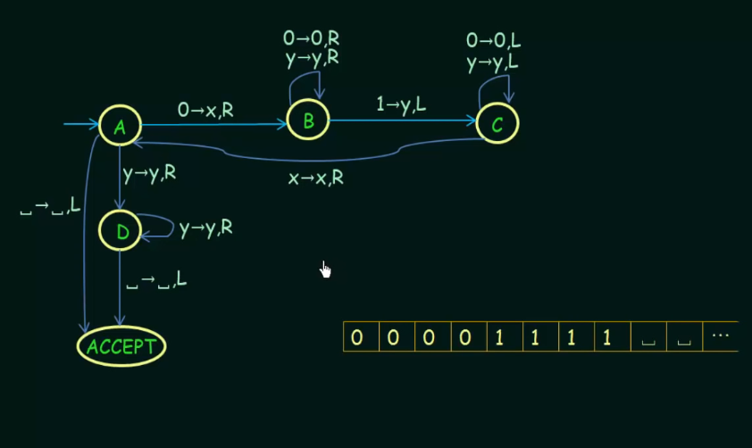

## Church - Turing Thesis

## Turing Machine for Even Palindromes

Palindrome - string which remains same when reading from left or from right. 

## Examples 

E.g. 1

E.g. 2

## Multitape Turing Machines 

Here we separate tapes by # symbol

## Nondeterminism in Turing Machine

P{} means we have not one particular state, but some power of states

### Differences in configuration 

Theorems

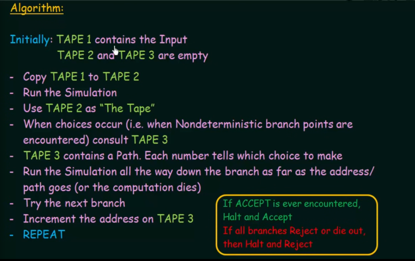

## Turing Machines as Problem Solvers

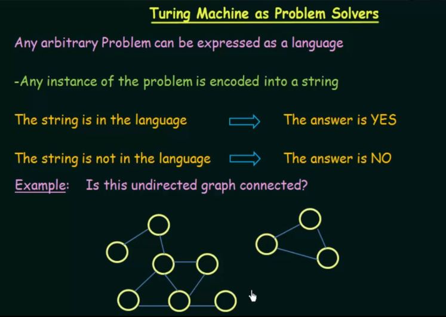
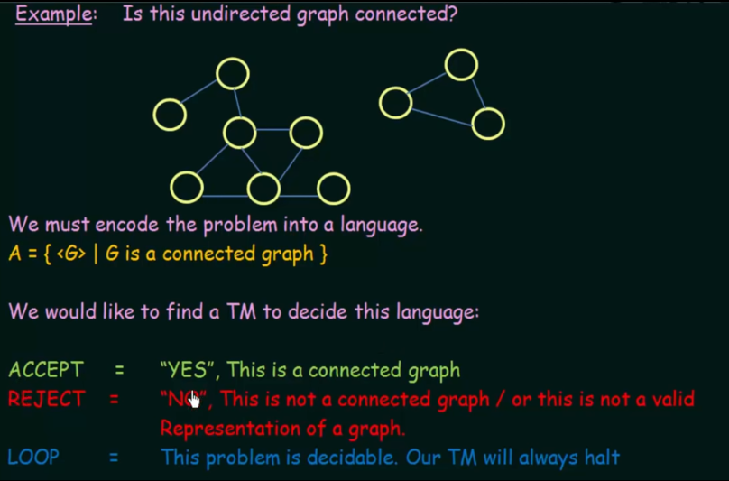
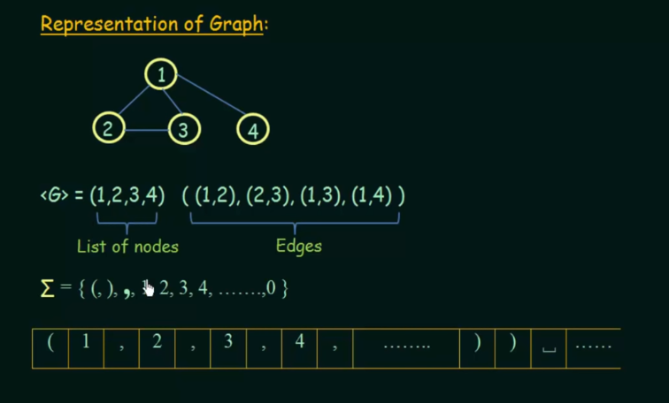
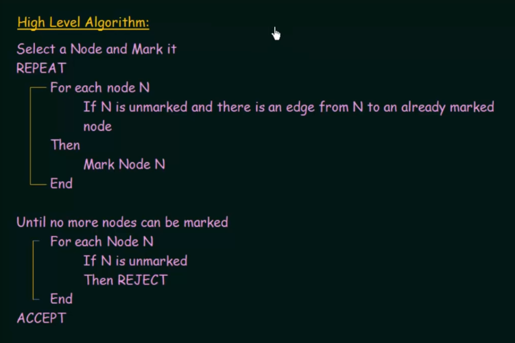
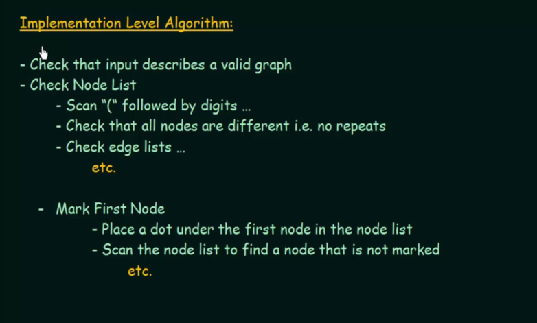

## Decidability and Undecidability

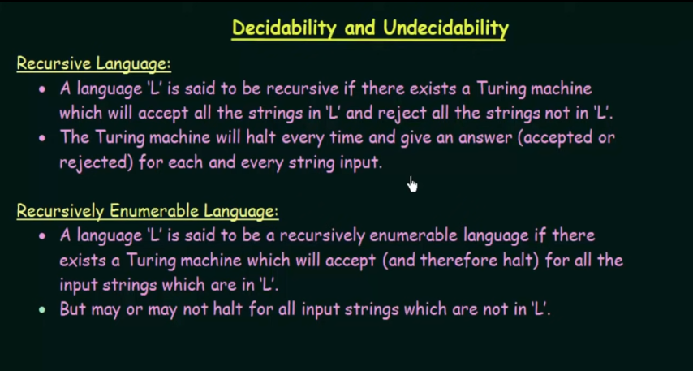
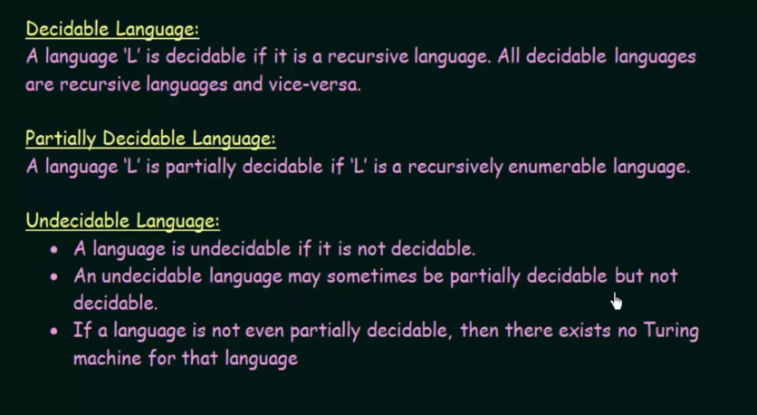

### Universal Turing Machine

It's about existing of algorithm which can say us are turing machine for 
specific language exists.

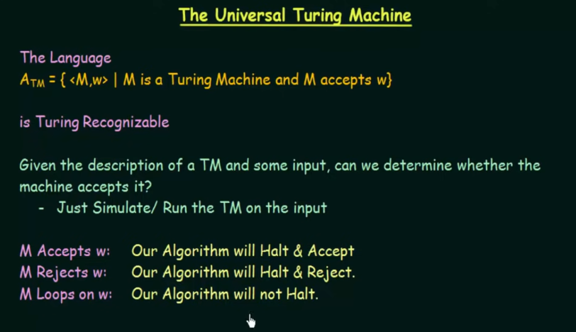
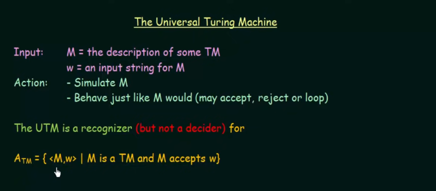

### Halting Problem

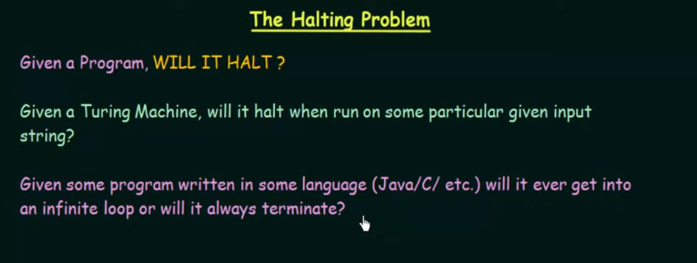

The Halting problem is an undecidable problem because we do not have algorithm
which can says us will program always halt or not.

### The Post Correspondence Problem

Here we solve this problem but in general it is undecidsable

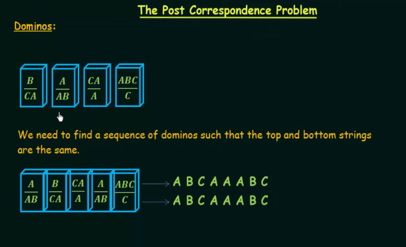

Another example

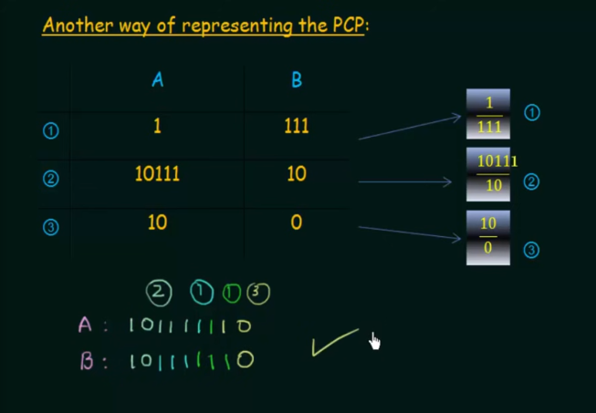

And sequence without solution

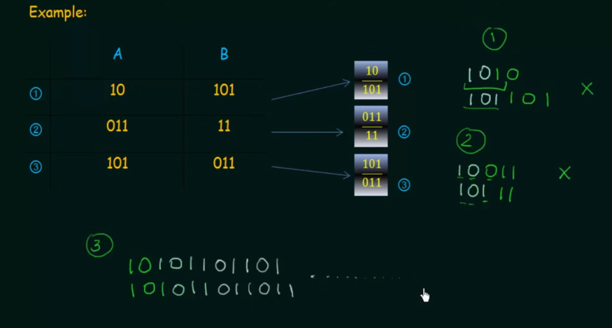

### Undecidability of the Post Correspondence Problem
(https://www.geeksforgeeks.org/post-correspondence-problem/)

(https://www.tutorialspoint.com/automata_theory/post_correspondence_problem.htm)

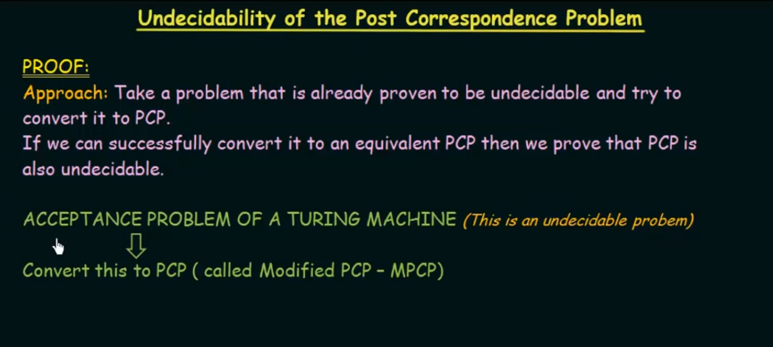

Capital B denote the blank symbol

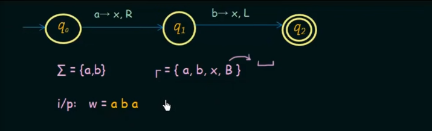

Lets try to solve PCP

We are converting turing machine to dominos

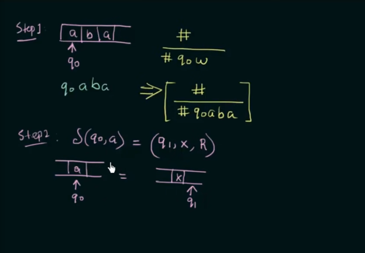
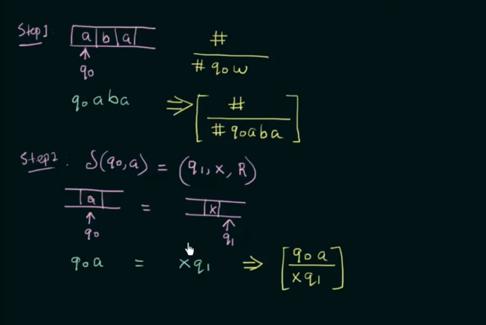

y - can be any symbol from tape 

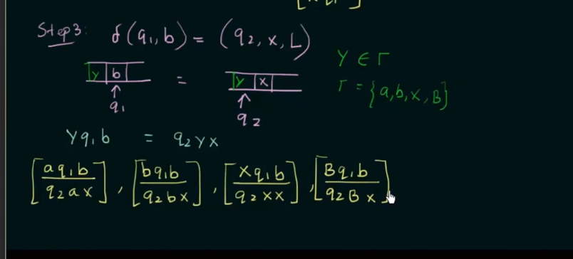

Create dominos for each symbol of machine alphabet

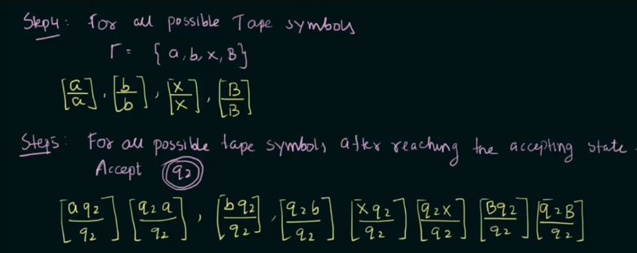
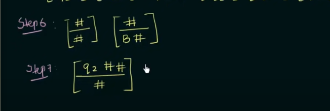

Now, try to solve PCP using our dominos

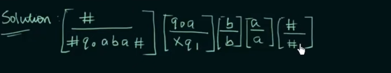
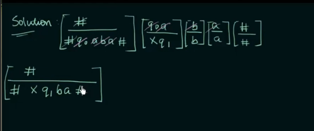
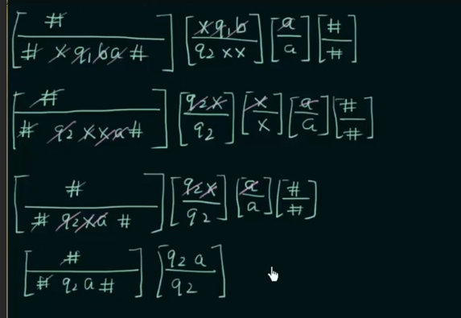
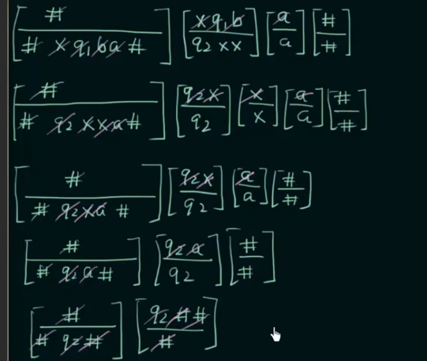
