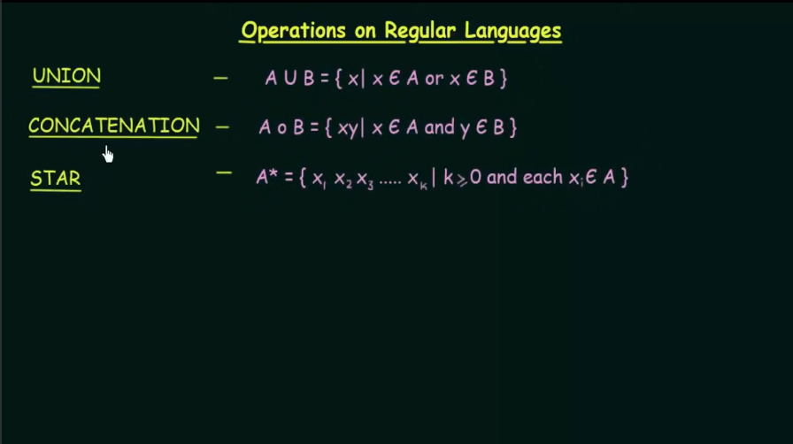

# Regular Languages

- A language is said to be a Regular Language if and only if some Finite State Machine recognizes it

NOT REGULAR The languages
>> Which are not recognized by any FSM
>> Which require memory -- Memory of FSM is very limited -- It cannot store or count strings

E.g. Language of this form: ababbababb Not regular because we can not store such long strings

## Operations on Regular Languages

1. Union - X belongs to A and X belongs to B, x can belongs to A or B
2. Concatenation - X belongs to A and Y belongs to B and we join them to XY
3. Star - we join K number of X which belongs to A in string

E.g. A = {pq, v}, B = {t, uv}

A U B = {pq,v,t,uv} A o B = {pqt, pquv, vt, vuv} A* = {empty_string, pg, v, pqv, vpq, pqpq, vv, pqpqpq, vvv, ...}

Theorem 1: The class of Regular Languages os closed under UNION. The UNION of two regular languages will be regular
language.

Theorem 2: The class of Regular Languages is closed under CONCATENATION The CONCATENATION of two regular languages will
be regular language.
