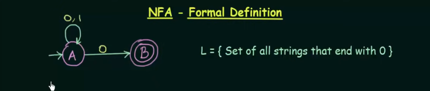
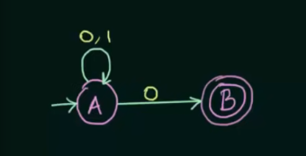
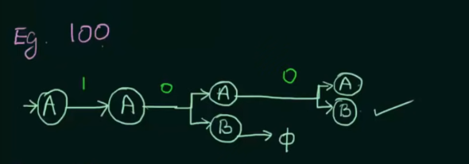
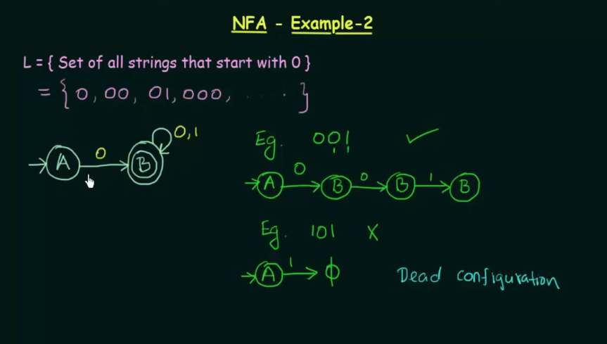
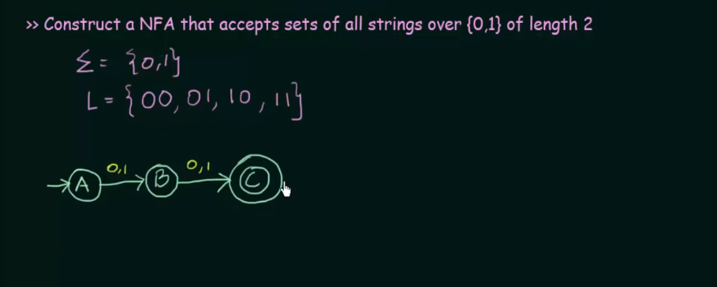
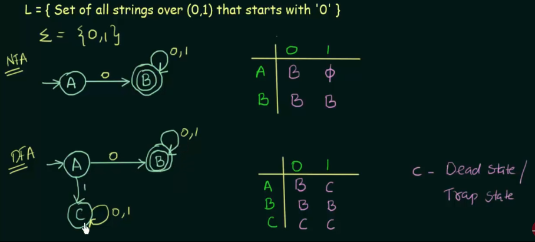

#NFA - Non-deterministic Finite Automata

DETERMINISM
    
    >> In DFA in current state we know what the next state will be

    >> It has only one unique next state

    >> It has not choices or randomness

    >> It is simple and easy to design

NON-DETERMINISM

    >> In NFA given the current state there could be multiple next states

    >> The next state may be chosen at random

    >> All the next states may be chosen in parallel

## Formal Definitons

A - could stay in A or go to B

L = { Set of all strings that and with 0 }

Q - Set of all states {A, B},

Sigma - Inputs {0, 1}, 

q0 - Initial state { A }, 

F - Set of final states { B }, 

Delta - transition functions that maps Q x Sigma -> ___ How to calc this??

Answer: 
    A x 0 -> A
    A x 0 -> B
    A x 1 -> A
    B x 0 -> final
    B x 1 -> final

From A we can go to A, B, AB, final

3 states - A, B, C

A -> A, B, C, AB, AC, BC, ABC, final (8 in total)

or 2^3 = 8, so Delta = 2 ^ Q

Example 1.

NFA that accepts all strings that and with 0
e.g. 100

Example 2

NFA does not bother about not predicted cases, if you want to convert NFA to DFA
just predict all cases.

Every DFA is NFA but not vice versa, but there is and equivalent DFA for every NFA

