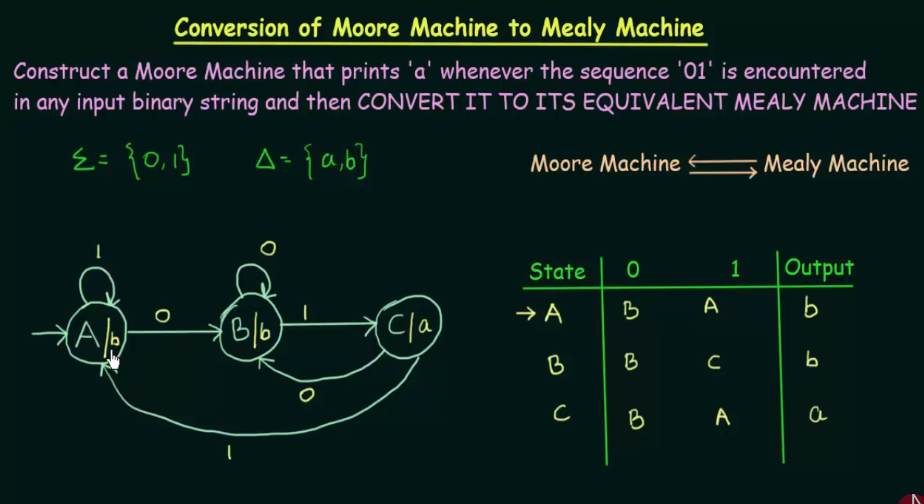

# Finite Automata With Outputs

Main difference is that in Mealy Machine output depends on input value and state

But in Moore machine output depends on only state

And Mealy machine does not produce value from start but Moore machine produces

E.g.

## Construction of Mealy Machine

E.g. 2

E.g. 3

## Construction of Moore Machine

E.g. 1

E.g. 2

## Conversion of Moore Machine to Mealy Machine

E.g. 2

E.g. 3

Yellow - input

Pink - output

## Conversion of Mealy Machine to Moore Machine

## Conversion of Mealy machine to Moore machine using Transition Table

