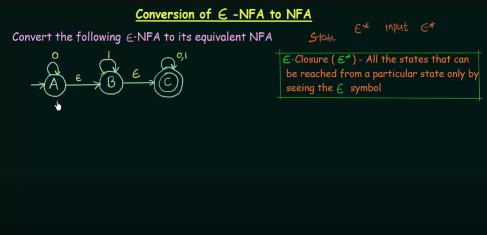
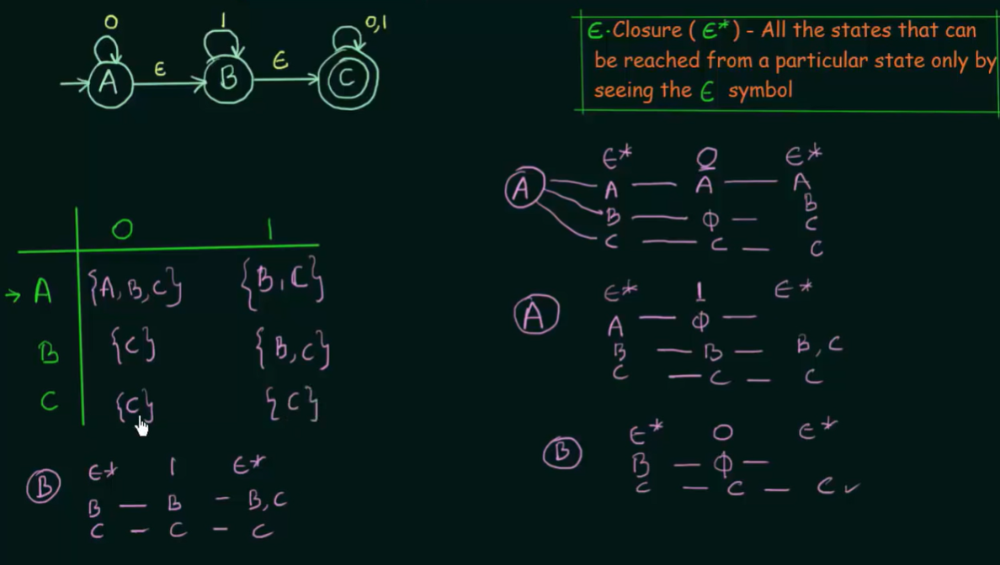

# Epsilon - NFA

E (epsilon) - means empty symbols

## Conversion of Epsilon NFA to NFA

Then mark the final states, final state in Epsilon NFA is a state who can reach final state
only be Epsilon symbols, so in our case it is A, B and C is already final.

