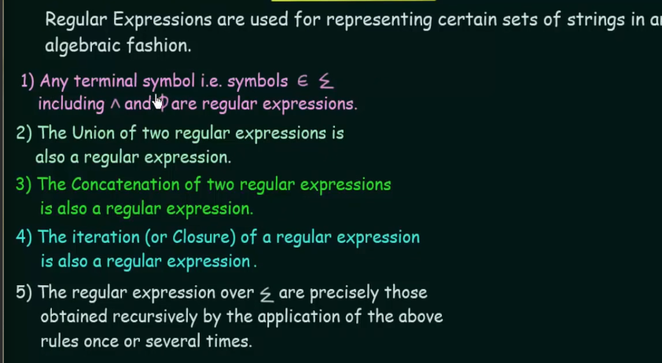
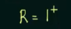
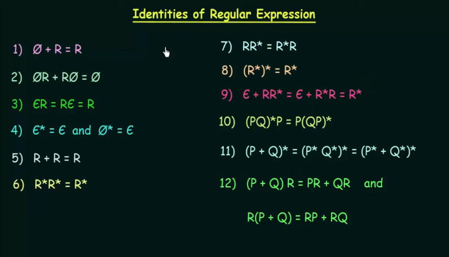
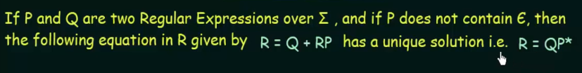
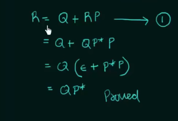
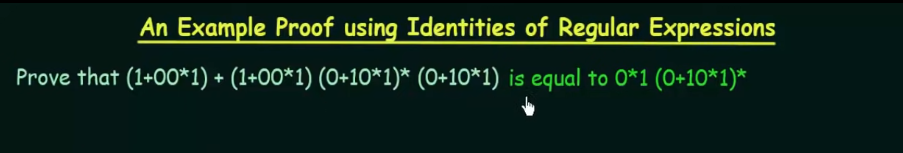
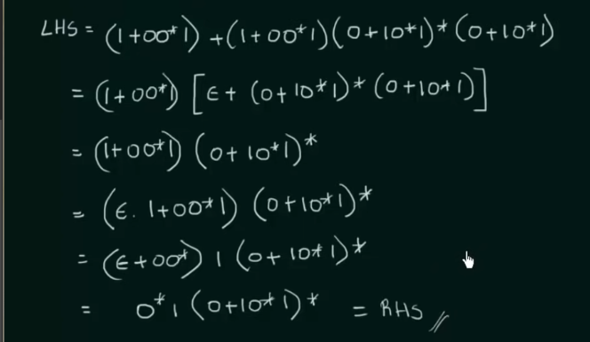

# Regular Expression

E.g. of RE

Describe the following sets as RE

1) {0, 1, 2}: R = 0 + 1 + 2

^, or Epsylon (Є) - means empty symbol.

R+ - means R with Epsylon symbol

2) {^, ab}: R = ^ab

3) {abb, a, b, bba}: R = abb + a + b + bba

4) {^, 0, 00, 000, .... }: R = 0*

5) {1, 11, 111, 1111, ....}: 

## Identities of Regular Expressions

1) First is empty set + Regular = Regular 

2) Empty concatenation R + R concatenation Empy = Empty

3) Epsylon Regular = Regular Epsylon = Regular

4) Epsylon Closure = Epslon and Epmty Closure = Epsylon

5) R + R = R

6) R*R* = R*

7) R concatenation R* = Closure of R concatenation R

8) (R*)* = R* 

## Arden`s theorem 

It means if we have R = Q + RP we can always replace it with R = QP*

Proves

Examples

