# Design Regular Expressions

## NFA to Regular Expression

1. Write all inputs for each state

2. Simplify states as common regular expression

-- 1 

-- 2

-- 3

-- Final State

## DFA to Regular Expression

1. Write all inputs for each state

-- 

## Design Regular Expression With Multiple Final States

1. 
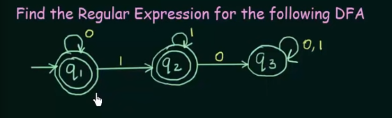

-- Write all inputs for each state

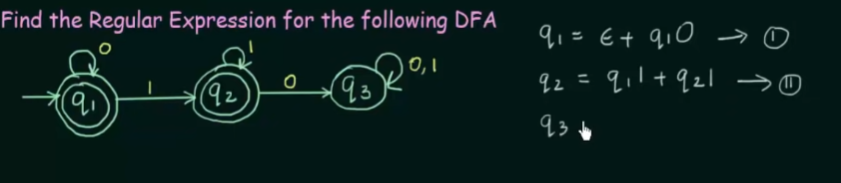

-- Simplify Final states

    Q1

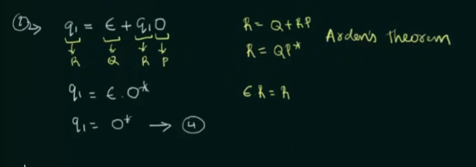

    Q2

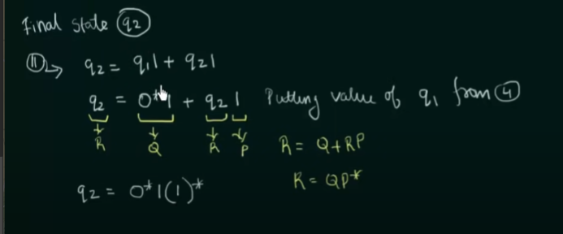

-- Result will be the union of both Final States

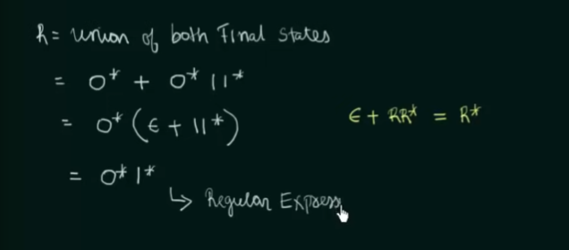

## Conversion of Regular Expression to Finite Automata

    For example we have such regular expression (a + b) the finite automata 
    for such expression will be 
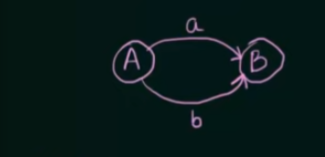

    Or we have such expression (a * b) so the finite automata will be 

    For A*
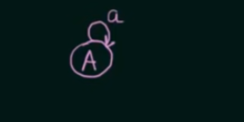

--------

    
    1) Means that we have string which have "b" followed by 0 or any number of "a"
        and ands with "b": bb, bab, baaab, ....
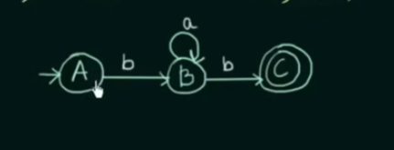

    2) Means that we have string which starts from "a" or "b" and ends with "c"
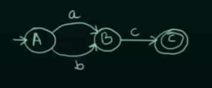

    3) Means that we have string which starts from "a" followed by any number of 
       "bc": a, abc, abcbcbc, ....
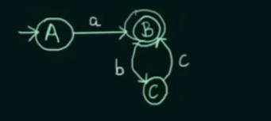

----------

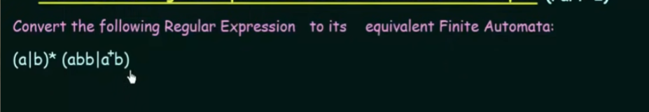

    "+" and "|" means the same "or" operation, a+ means 1 or more "a"
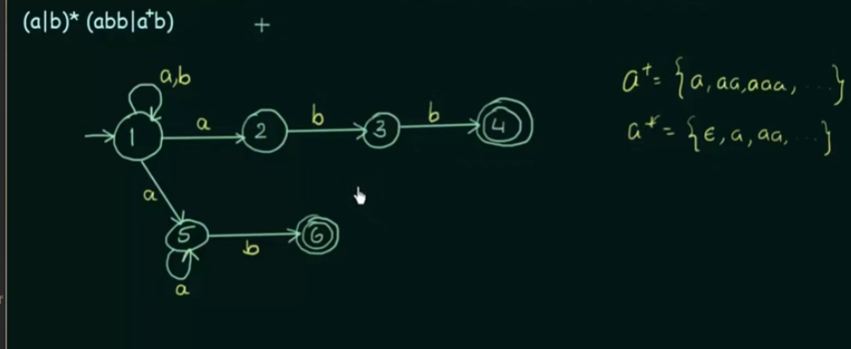
]

