# Design Regular Expressions

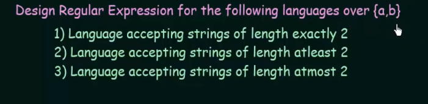

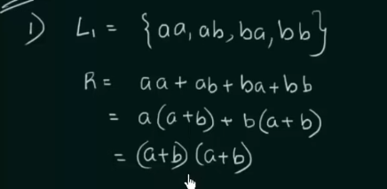

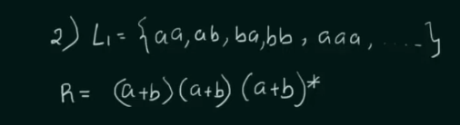

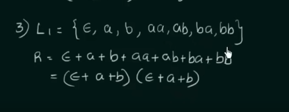

## NFA to Regular Expression

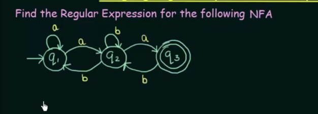

1. Write all inputs for each state

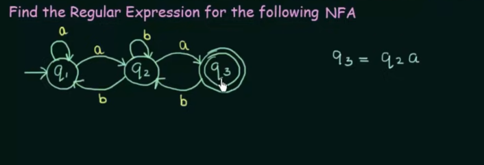

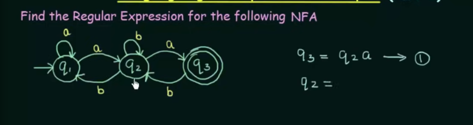

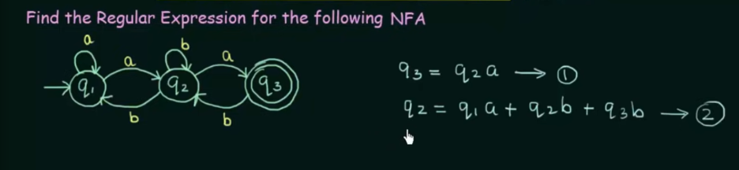

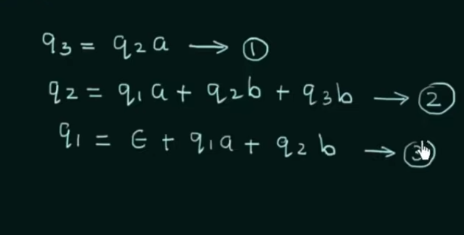

2. Simplify states as common regular expression

-- 1 
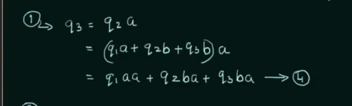

-- 2
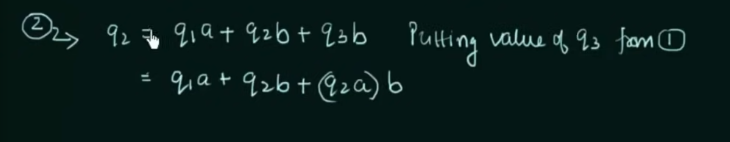

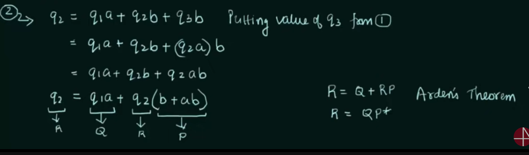

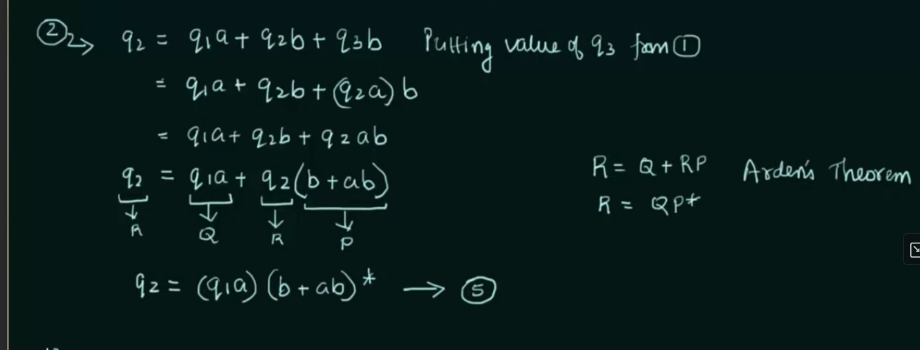

-- 3
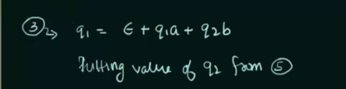

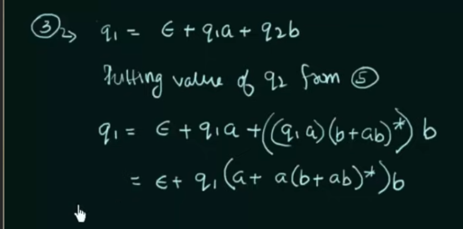

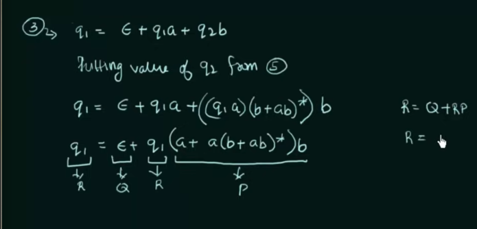

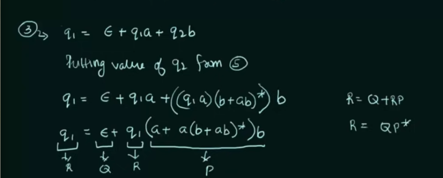

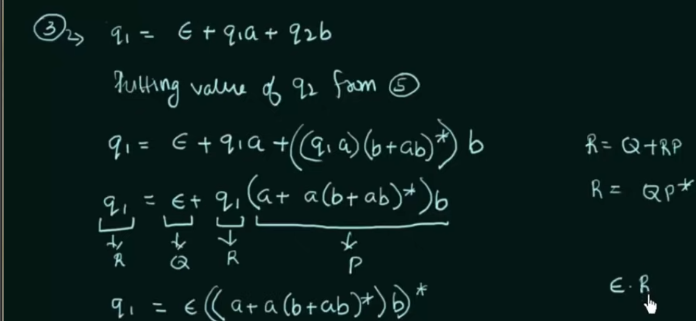

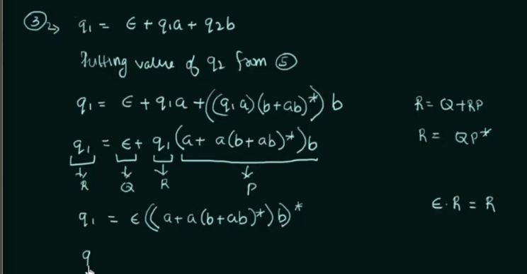

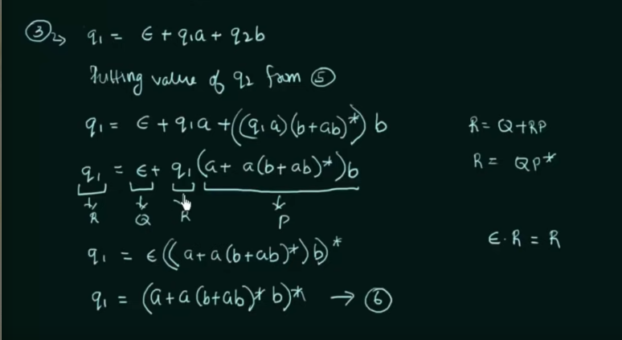

-- Final State

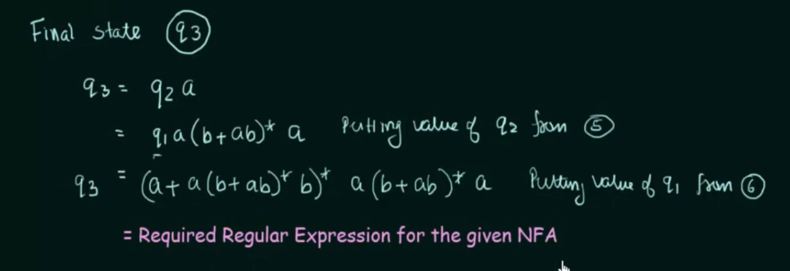

## DFA to Regular Expression

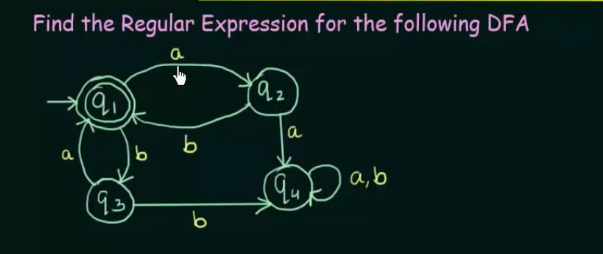

1. Write all inputs for each state

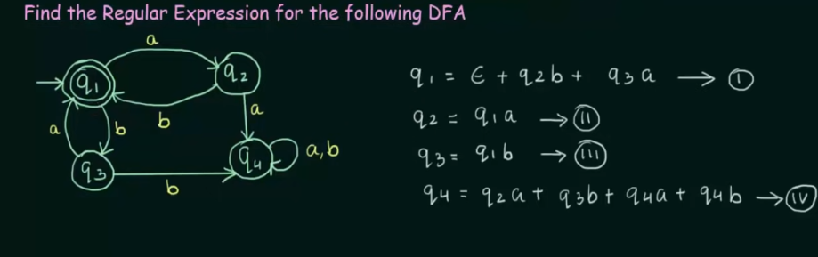

-- 

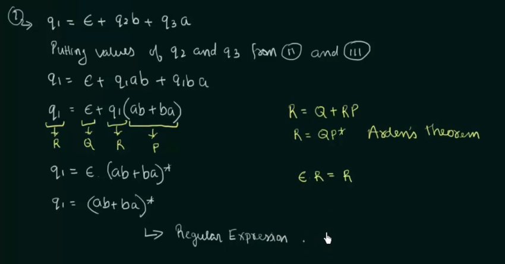

