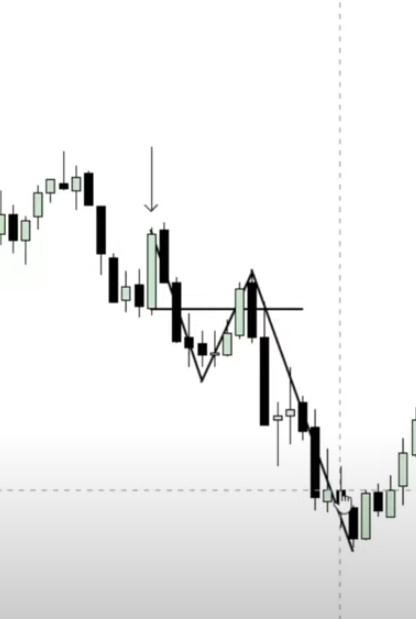
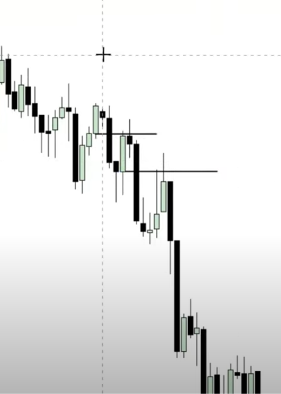
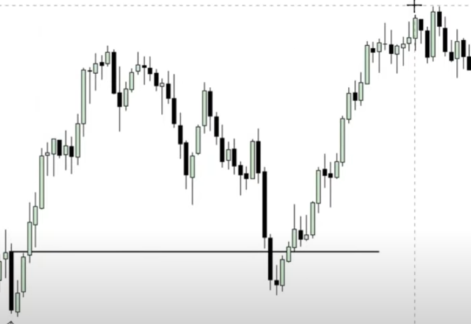

# General trading terms

Надо понимать что на рынке цены идут либо за ликвидностью, либо перекрывают имбаланс. Если есть два эти фактора и цена
потенциально может двигаться в нужном одном из направлений и по ходу мы замечаем ордер блок, то это и есть место где нам
стоит рассмотреть входить в торговлю, или нет.

## Order blocks

Ордер блок это один из способов найти качественную точку входа в рынок.

Для того чтобы выявить качественный ордер блок надо искать не просто пару свечей, а скорее конкретный формат, когда у
нас есть одна свеча затем ее перебивает другая затем, идет откат и продолжение движения вниз, или вверх.

Вот еще пример ордер блоков которые можно использовать мы ещем мясистые свечи которые можно использовать и после которых
идет откат.

А вот пример ордер блока вверх, у нас есть свеча вниз после которой цена поднимается затем, падает до ее уровня и затем
опять идет вверх

#### Теперь рассмотрим как же его применить

1. Определить ликвидность

    