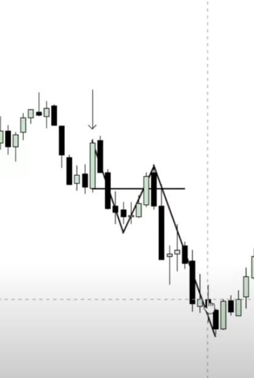
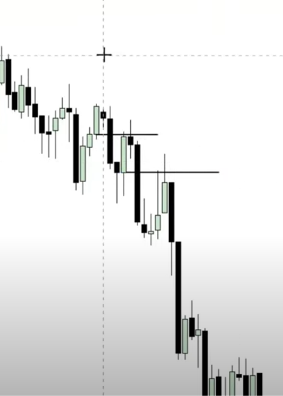
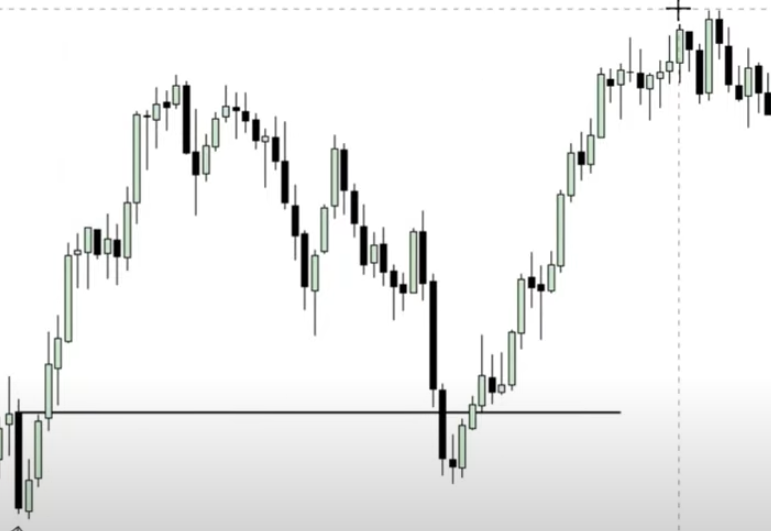
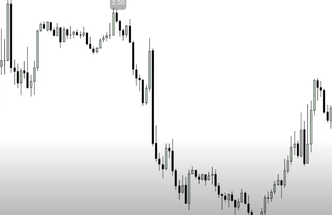
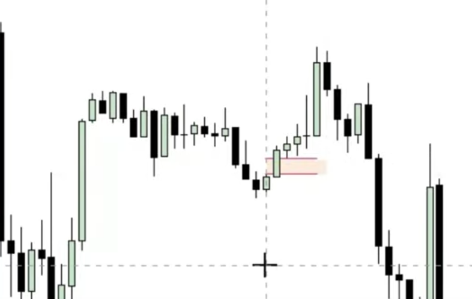
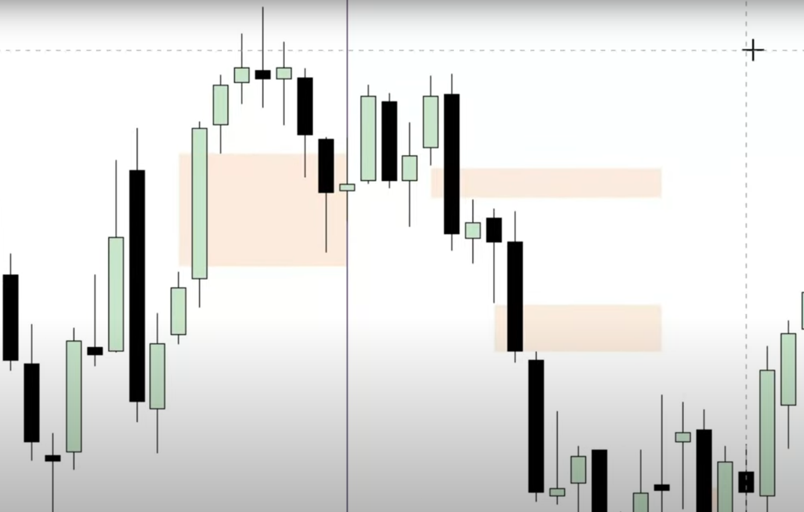
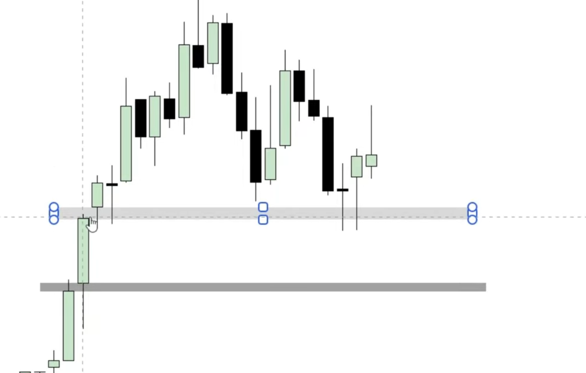
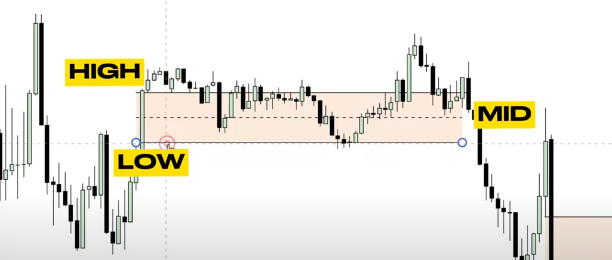

# Content

[General trading terms](#general-trading-terms)

[Order blocks](#order-blocks)

[Imbalance](#imbalance)

# General trading terms

Надо понимать что на рынке цены идут либо за ликвидностью, либо перекрывают имбаланс. Если есть два эти фактора и цена
потенциально может двигаться в нужном одном из направлений и по ходу мы замечаем ордер блок, то это и есть место где нам
стоит рассмотреть входить в торговлю, или нет.

## Order blocks

Ордер блок это один из способов найти качественную точку входа в рынок.

Для того чтобы выявить качественный ордер блок надо искать не просто пару свечей, а скорее конкретный формат, когда у
нас есть одна свеча затем ее перебивает другая затем, идет откат и продолжение движения вниз, или вверх.

Вот еще пример ордер блоков которые можно использовать мы ещем мясистые свечи которые можно использовать и после которых
идет откат.

А вот пример ордер блока вверх, у нас есть свеча вниз после которой цена поднимается затем, падает до ее уровня и затем
опять идет вверх

## Imbalance

Имбаланс это момент на рынке когда цена резко двигалась в одном направлении, например на скриншоте ниже это длинная
черная полоса

это говорит о том что в этот момент либо много покупали и продавцы не успели создать сделки, либо наоборот.

Неразрывно с имбалансом идет такое понятие как gap это когда мы берем три свечи подряд и тень первой и третей не
пересекаются
например как на сриншоте ниже, красным выделен gap как видим третья свеча своей тенью не достает до первой свечи, гэпы
как раз
и появляются в результате имбаланса

Вот еще пример гэпов

Надо понимать что цена обычно двигается в сторону этих самых гэпов и чем старше таймфрейм тем больший вес имеет гэп.
Отследив их например на недельном и дневном таймфреймах можно построить гипотезу о том куда будет двигаться цена.

Так же стоит обращать внимание на так называемые "Volume Imbalance" - это когда между двумя свечами нету ничего и при
этом они не соприкасаются телами.

Обычно гэп делять на такие составные части 

 
